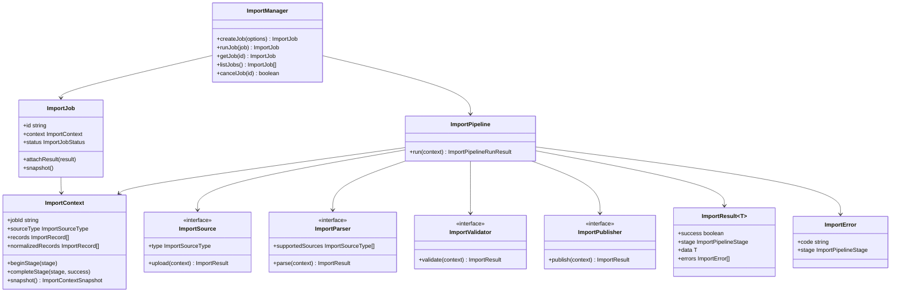
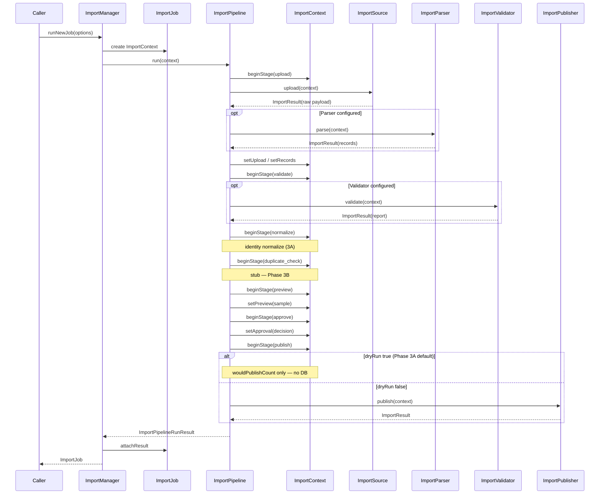

# Catalog Import Platform (Phase 3A)

Internal backend foundation only. **No UI, no API, no database writes.**

## Purpose

Establish the catalog import architecture — job management, pipeline orchestration, and pluggable interfaces for future CSV/Excel/JSON/API/scraper/OEM sources.

## Location

```
backend/src/lib/catalog/import/
├── import-types.ts          ImportResult, ImportError, shared types
├── import-interfaces.ts     ImportSource, ImportParser, ImportValidator, ImportPublisher
├── import-context.ts        ImportContext
├── import-job.ts            ImportJob
├── import-pipeline.ts       ImportPipeline
├── import-manager.ts        ImportManager
├── import-platform.test.ts
└── index.ts
```

## Pipeline stages

```
Upload → Validate → Normalize → Duplicate Check → Preview → Approve → Publish
```

| Stage | Phase 3A behavior |
|-------|-------------------|
| Upload | `ImportSource.upload()`; optional `ImportParser.parse()` |
| Validate | `ImportValidator` if configured; else skip with warning |
| Normalize | Identity pass-through (catalog normalization in 3B+) |
| Duplicate Check | Stub — deferred to 3B |
| Preview | In-memory sample + summary |
| Approve | Dry-run auto-approve when record count meets threshold |
| Publish | **Always dry-run in 3A** — no DB writes |

## Class diagram



## Sequence diagram



## Usage (internal)

```typescript
import { createImportManager } from "@/lib/catalog/import";

const manager = createImportManager({
  source: myCsvSource,
  // parser, validator, publisher — Phase 3B+
});

const job = await manager.runNewJob({
  sourceType: "csv",
  fileName: "variants.csv",
  dryRun: true,
});

console.log(job.context.preview);
console.log(job.context.publish); // dryRun: true, published: false
```

## Future source types

| Type | Interface entry |
|------|-----------------|
| CSV | `ImportSource` + `ImportParser` |
| Excel | `ImportSource` + `ImportParser` |
| JSON | `ImportSource` + `ImportParser` |
| API | `ImportSource` |
| Scraper | `ImportSource` |
| OEM Feed | `ImportSource` |

## Tests

```bash
cd backend
npm run test:catalog-import
# or full catalog suite:
npm run test:catalog
```

## Safety

| Rule | Enforced |
|------|----------|
| No DB writes | Publish stage dry-run by default |
| No API / UI | Not registered in routes |
| No schema changes | Pure TypeScript module |
| Backward compatible | Additive `import/` package only |

## Phase boundaries

| Phase | Scope |
|-------|--------|
| **3A** | Architecture + pipeline skeleton (this document) |
| 3B | Parsers, validators, duplicate detection |
| 3C+ | Publishing + admin integration (future) |
