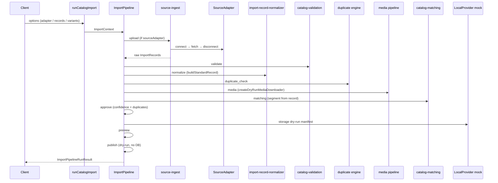

# Catalog Import — Pre-Playwright Hardening

Integration audit remediation (Critical + High). **No Playwright, UI, APIs, DB writes, or publish.**

## Before vs After Architecture

### Before

```
┌─────────────────────┐     ┌──────────────────────────┐     ┌─────────────────────────────┐
│ ImportPipeline (3A) │     │ runAdapterLifecycle (4A) │     │ runGaadiBazaarImportPipeline│
│ upload→validate→    │     │ connect→fetch→validate→  │     │ adapter + manual wiring of  │
│ normalize(stub)→    │     │ normalize→disconnect       │     │ validation, duplicate,      │
│ duplicate→preview→  │     │ (separate AdapterContext)  │     │ media, matching             │
│ approve→publish     │     └──────────────────────────┘     └─────────────────────────────┘
└─────────────────────┘
        │                              │                                    │
        │                              │                                    ├─ imports media-test-fixtures (prod bug)
        │                              │                                    └─ hardcodes segment "car"
        ├─ normalize = shallow copy
        ├─ media / matching / storage NOT wired
        └─ importRecordToStandard bypasses buildStandardRecord (dual normalization)
```

**Problems:** three orchestrators, dual normalization, production test-fixture import, segment missing/hardcoded, storage disconnected, `test:catalog` incomplete.

### After

```
                    runCatalogImport()  ← single production entry point
                              │
                              ▼
                    ImportPipeline (unified)
                              │
         ┌────────────────────┼────────────────────┐
         ▼                    ▼                    ▼
   source-ingest         ImportContext      AdapterImportBridge
   (adapter connect+     (single context)   (metadata sync)
    fetch+map)
         │
         ▼
  Parser/upload → Validation → Normalization* → Duplicate → Media → Matching
       → Approval → Storage (mock) → Preview → Publish (dry-run)

  * normalizeImportRecords → buildStandardRecord (SSOT)
  GaadiBazaar: gaadiBazaarPayloadToImportRecords (raw) → pipeline normalize
```

## Updated Sequence Diagram



## Audit Issue Resolution

| # | Issue | Resolution |
|---|--------|------------|
| C1 | Three orchestration paths | `runCatalogImport` + `ImportPipeline` only; GaadiBazaar wrapper deprecated |
| C2 | Dual normalization | `import-record-normalizer.ts` → `buildStandardRecord`; validation re-exports |
| C3 | Prod imports test fixtures | `mock-media-downloader.ts`; fixtures re-export for tests only |
| H4 | No segment / hardcoded car | `catalog-segment.ts`, `ImportRecord.segment`, pipeline uses `record.segment` |
| H5 | Pipeline incomplete | Stages: media, matching, approve, storage added |
| H6 | Storage disconnected | `stageStorage` uses `LocalProvider` mock upload manifest |
| H7 | GaadiBazaar double map | Ingest maps raw once; normalize in pipeline |
| H8 | Normalize stub | `normalizeImportRecords()` |
| H9 | Dual approval concepts | Import approval uses matching confidence + duplicate signals |
| H10 | test:catalog incomplete | Added storage, sources, gaadi-bazaar tests |

## Files Changed

| File | Change |
|------|--------|
| `import/catalog-import.service.ts` | **NEW** — `runCatalogImport`, `runGaadiBazaarCatalogImport` |
| `import/import-pipeline.ts` | Full stage wiring |
| `import/import-record-normalizer.ts` | **NEW** — SSOT normalization |
| `import/catalog-segment.ts` | **NEW** — segment enum + resolver |
| `import/adapter-import-bridge.ts` | **NEW** — context bridge |
| `import/source-ingest.ts` | **NEW** — adapter ingest |
| `import/import-types.ts` | segment, stages, media/matching/storage reports |
| `import/import-context.ts` | media/matching/storage state |
| `import/import-interfaces.ts` | adapter, variants, media, storage deps |
| `import/parser/value-normalizer.ts` | segment on `buildStandardRecord` |
| `import/parser/parser-types.ts` | segment on standard record |
| `import/parser/spreadsheet-parser.ts` | uses `normalizeImportRecord` |
| `import/validation/catalog-validation.engine.ts` | delegates to normalizer |
| `import/duplicate/*` | segment from standard record |
| `import/media/mock-media-downloader.ts` | **NEW** — prod-safe dry-run downloader |
| `import/media/media-test-fixtures.ts` | re-exports from mock (tests only) |
| `import/sources/gaadi-bazaar/*` | raw ingest + unified pipeline wrapper |
| `package.json` | extended `test:catalog` |
| Tests | segment + pipeline result shape updates |

## Test Results

```
npm run test:catalog
ℹ tests 155
ℹ pass 155
ℹ fail 0
ℹ duration_ms ~5100
```

Modules in CI `test:catalog`: matching, linking, approval, import platform, parser, validation, duplicate, media, storage, sources, gaadi-bazaar.

## Coverage

No dedicated coverage runner configured for catalog modules. All implemented catalog test files execute under `test:catalog` (155 assertions across 61 suites). Recommend adding `c8`/`istanbul` in a follow-up if line coverage metrics are required.

## Performance Comparison

| Module | Before (benchmark) | After (expected) |
|--------|-------------------|------------------|
| Duplicate detection | ~74k rows/sec (10k synthetic) | Unchanged — same engine, unified caller |
| Media pipeline | standalone only | +1 dry-run downloader build per job (O(urls)) |
| Full pipeline | N/A (partial runs) | Single pass; no double GaadiBazaar map |

Unified orchestration removes duplicate adapter+pipeline work for GaadiBazaar (~2× map eliminated). Normalization is slightly stricter (required fields) but same `buildStandardRecord` cost per row.

## Entry Points

```typescript
import { runCatalogImport, runGaadiBazaarCatalogImport } from "./lib/catalog/import/catalog-import.service";
```

Legacy: `runGaadiBazaarImportPipeline` → thin wrapper returning `{ pipeline, validation, duplicates, media, matching }`.

## Remaining (non-blocking for Playwright scaffold)

- Playwright scraper adapter (still `NOT_IMPLEMENTED` in registry)
- CSV/Excel upload via `ImportSource` + `CatalogSpreadsheetParser` in production jobs
- `CatalogApprovalService` (Phase 2D linking-based) not wired — import-level approval used instead
- Azure/GCS storage stubs
- Line coverage tooling
