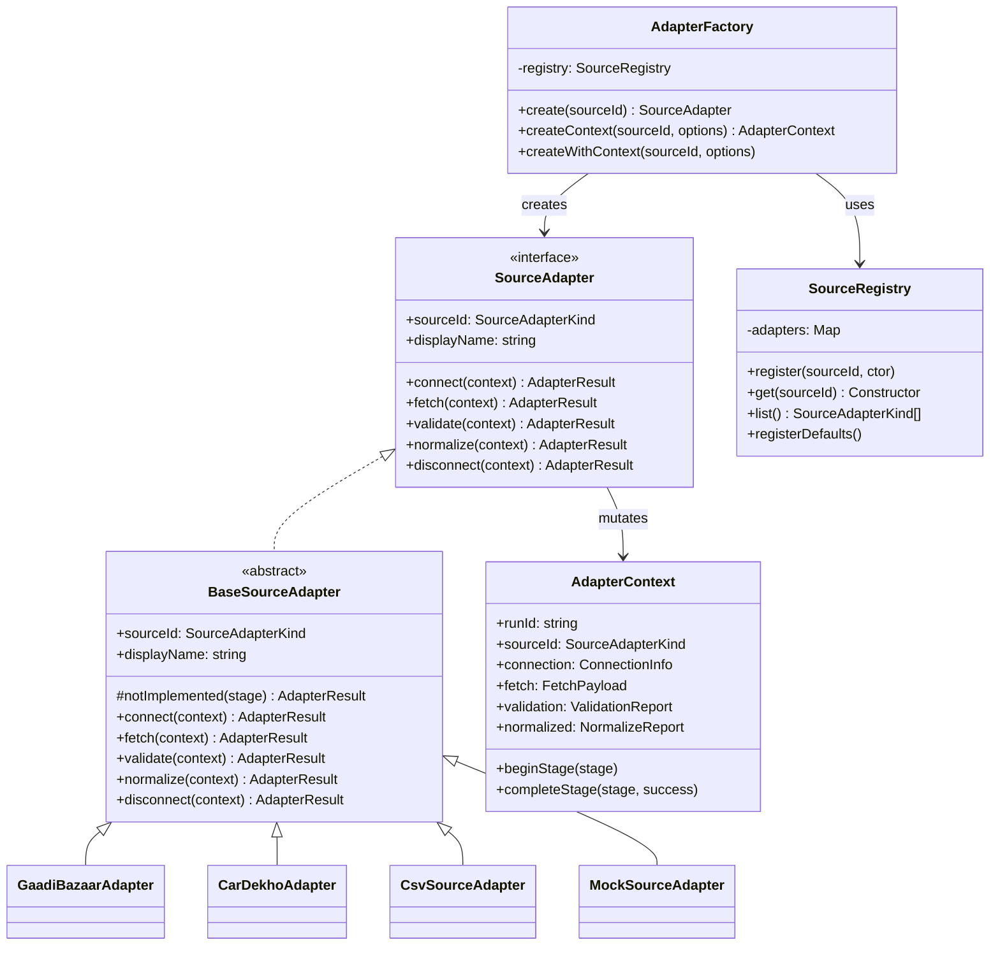
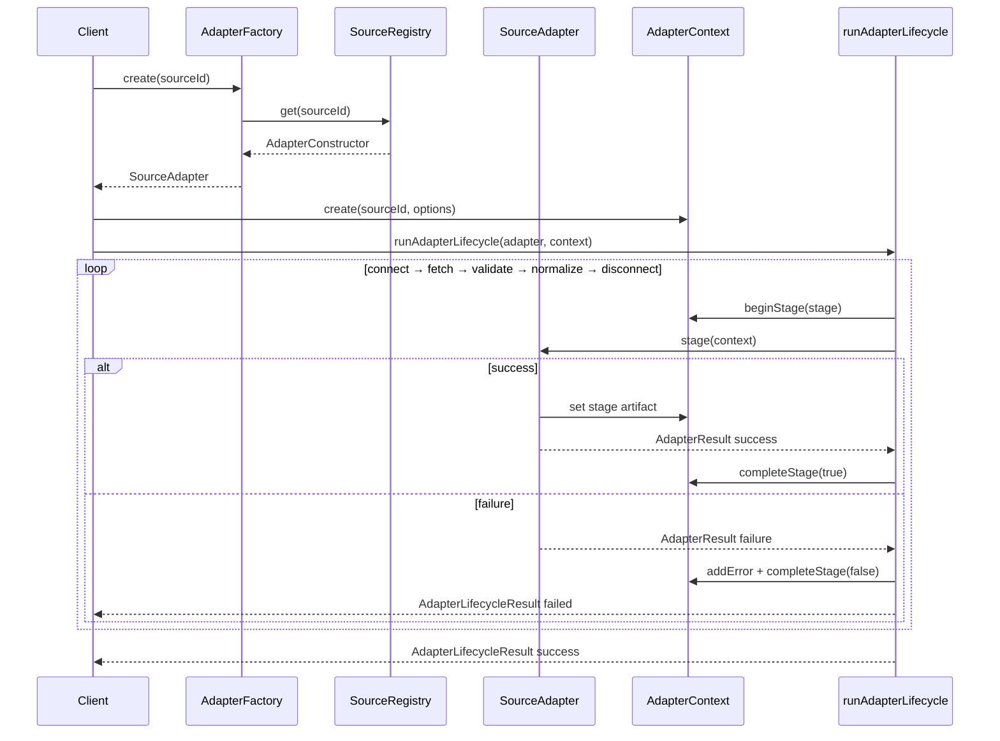

# Source Adapter Framework (Phase 4A)

Pluggable catalog import source adapter framework. **Framework only** — no GaadiBazaar (or other source) implementations yet. No API, no UI, no database writes.

## Location

```
backend/src/lib/catalog/import/sources/
├── adapter-types.ts
├── adapter-context.ts
├── source-adapter.ts
├── placeholder-adapters.ts
├── source-registry.ts
├── adapter-factory.ts
├── adapter-runner.ts
├── mock-source.adapter.ts
├── source-adapter.test.ts
└── index.ts
```

## Supported sources (registered placeholders)

| Source ID | Display name | Status |
|-----------|--------------|--------|
| `gaadi_bazaar` | GaadiBazaar | Placeholder — **not implemented** |
| `cardekho` | CarDekho | Placeholder |
| `oem_feed` | OEM Feed | Placeholder |
| `csv` | CSV | Placeholder |
| `excel` | Excel | Placeholder |
| `dealer_upload` | Dealer Upload | Placeholder |
| `json_api` | JSON API | **Implemented** — catalog master HTTPS feed (`CATALOG_MASTER_SOURCE_URL`); dry-run only until credentials exist |

Each placeholder extends `BaseSourceAdapter` and returns `NOT_IMPLEMENTED` for all lifecycle methods.

## Core types

| Type | Purpose |
|------|---------|
| `SourceAdapter` | Interface: `connect`, `fetch`, `validate`, `normalize`, `disconnect` |
| `AdapterContext` | Mutable run context (connection, fetch payload, validation, records) |
| `AdapterResult<T>` | Per-stage success/failure envelope |
| `SourceRegistry` | Register and resolve adapter constructors |
| `AdapterFactory` | Create adapters and contexts by source ID |

## Lifecycle

```
connect → fetch → validate → normalize → disconnect
```

Use `runAdapterLifecycle(adapter, context)` to execute all stages in order. Stops on first failure.

## Usage

```typescript
import {
  createAdapterFactory,
  runAdapterLifecycle,
  AdapterContext,
} from "@/lib/catalog/import/sources";

const factory = createAdapterFactory();
const adapter = factory.create("csv");
const context = AdapterContext.create("csv", { dryRun: true });

const result = await runAdapterLifecycle(adapter, context);
// Placeholder adapters fail at connect with NOT_IMPLEMENTED
```

### Custom registration

```typescript
import { SourceRegistry, AdapterFactory, MockSourceAdapter } from "@/lib/catalog/import/sources";

const registry = new SourceRegistry(false);
registry.register("csv", MockSourceAdapter);
const factory = new AdapterFactory(registry);
```

## Class diagram



## Sequence diagram



## Commands

```bash
cd backend
npm run test:catalog-import-sources
```

## Constraints (Phase 4A)

- Framework and placeholder stubs only
- **GaadiBazaar not implemented** (returns `NOT_IMPLEMENTED`)
- No homepage, routing, login, CRM, portals, admin UI changes
- No existing API or upload flow changes
- No database schema or writes
- `MockSourceAdapter` exists for unit tests only

## Future integration

Phase 3 import pipeline (`ImportSource`, `ImportParser`) remains unchanged. Future phases can implement real `SourceAdapter` subclasses and bridge normalized `ImportRecord[]` into `ImportContext`.
