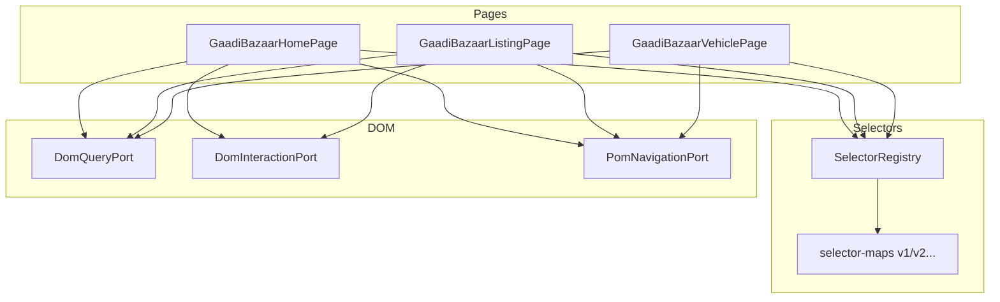

# GaadiBazaar Page Object Model (Phase 4D)

Page Object Model for future GaadiBazaar scraping. **POM only** — no live scraping, no import engine, no database writes.

## Location

```
backend/src/lib/scraper/gaadi-bazaar/pom/
├── pom-types.ts
├── selectors/
│   ├── selector-maps.ts       Versioned selector maps (v1)
│   └── selector-registry.ts   SelectorRegistry accessor
├── dom/
│   ├── dom-ports.ts           DomQueryPort, DomInteractionPort, PomNavigationPort
│   └── html-dom-query.ts      Fixture HTML query adapter
├── pages/
│   ├── gaadi-bazaar-home-page.ts
│   ├── gaadi-bazaar-listing-page.ts
│   └── gaadi-bazaar-vehicle-page.ts
├── fixtures/html/
│   ├── home.html
│   ├── listing.html
│   └── vehicle.html
├── gaadi-bazaar-pom.test.ts
└── index.ts
```

## Architecture



## Selector versioning

Selectors live in `selector-maps.ts` — **never in page classes**.

| Version | Status |
|---------|--------|
| `v1` | Active default (`data-gb` attributes) |

Add `v2` by extending `GAADI_BAZAAR_SELECTOR_MAPS` and `SUPPORTED_SELECTOR_VERSIONS`.

```typescript
const registry = SelectorRegistry.create("v1");
const searchSelector = registry.home.searchInput; // [data-gb="home-search-input"]
```

Template selectors support `{city}` substitution via `resolveSelectorTemplate`.

## Page objects

### GaadiBazaarHomePage

| Method | Description |
|--------|-------------|
| `open()` | Navigate to mock home URL |
| `search(query)` | Fill search + submit |
| `selectCity(city)` | Select city option |
| `getHeroBannerText()` | Read hero banner |
| `isSearchReady()` | Search controls present |

### GaadiBazaarListingPage

| Method | Description |
|--------|-------------|
| `open(query?)` | Open listing (optional query param) |
| `goToNextPage()` | Click next pagination |
| `getVehicleCards()` | Parse card summaries from DOM |
| `openVehicle(index)` | Navigate to vehicle detail URL |
| `getCurrentPageNumber()` | Current page label |
| `hasResults()` / `isEmpty()` | Result state |

### GaadiBazaarVehiclePage

| Method | Description |
|--------|-------------|
| `open(vehicleId)` | Open mock vehicle URL |
| `openByUrl(url)` | Navigate by URL |
| `getTitle()` | Vehicle title |
| `getPrice()` | Price text |
| `getLocation()` | Location text |
| `getImages()` | Image URLs |
| `getSpecifications()` | Spec label/value pairs |
| `getDetailView()` | Aggregated read model |

## Usage (fixtures — Phase 4D)

```typescript
import fs from "node:fs";
import {
  HtmlDomQueryPort,
  MockPomNavigation,
  InMemoryDomInteraction,
  createGaadiBazaarListingPage,
  SelectorRegistry,
} from "@/lib/scraper/gaadi-bazaar/pom";

const dom = HtmlDomQueryPort.fromHtml(fs.readFileSync("fixtures/html/listing.html", "utf8"));
const page = createGaadiBazaarListingPage({
  dom,
  selectors: SelectorRegistry.create("v1"),
  navigation: new MockPomNavigation(),
  interaction: new InMemoryDomInteraction(),
});

const cards = page.getVehicleCards();
```

## Mock URLs

| Page | URL |
|------|-----|
| Home | `mock://gaadi-bazaar/home` |
| Listing | `mock://gaadi-bazaar/listing` |
| Vehicle | `mock://gaadi-bazaar/vehicle/{id}` |

## Tests

```bash
npm run test:gaadi-bazaar-pom
```

## Out of scope (Phase 4D)

- Live GaadiBazaar HTTP/Playwright navigation
- Data scraping pipelines
- Import engine / adapter wiring
- Database persistence
- CSS/XPath selectors hardcoded in page classes

## Next phase

Wire POM to `PlaywrightWorker` + real browser driver with external URL allow-list and scraper orchestration.
