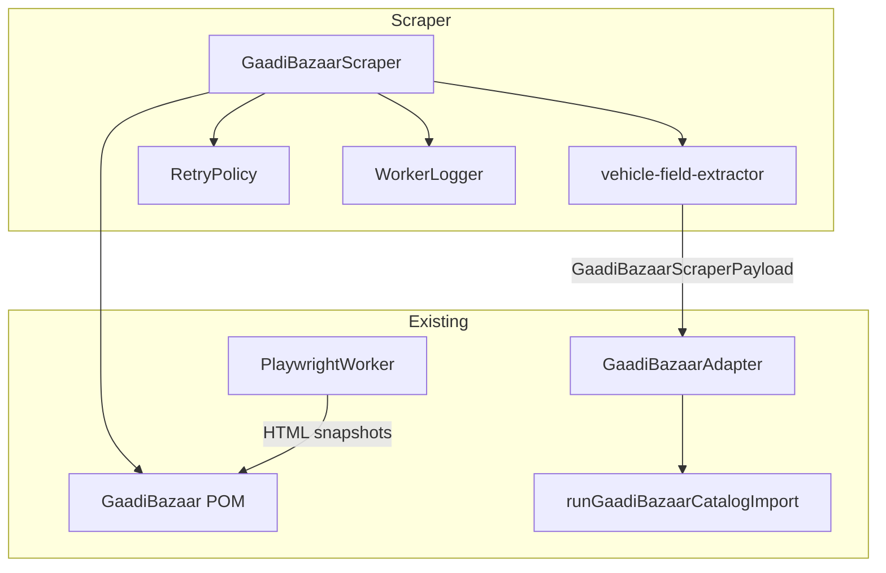
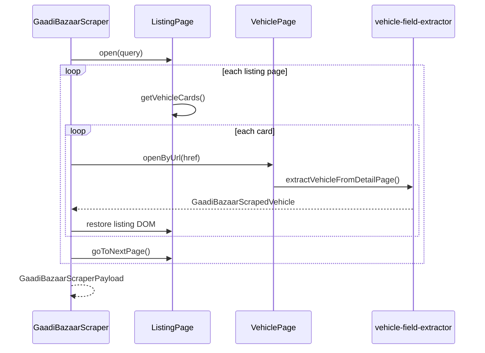

# GaadiBazaar Read-Only Scraper (Phase 4E)

First GaadiBazaar scraper module. **Read-only output** — produces `GaadiBazaarScraperPayload` only. No database writes, publish, catalog updates, or image uploads.

## Location

```
backend/src/lib/scraper/gaadi-bazaar/
├── pom/                          Phase 4D Page Object Model
├── scraper/
│   ├── gaadi-bazaar-scraper.ts   Main orchestrator
│   ├── vehicle-field-extractor.ts Payload field mapping
│   ├── fixture-navigation.ts     Mock HTML navigation (tests)
│   ├── worker-navigation.ts      PlaywrightWorker navigation
│   ├── scraper-session.ts        MutableDomQueryPort
│   ├── scraper-config.ts
│   ├── scraper-types.ts
│   └── gaadi-bazaar-scraper.test.ts
└── index.ts
```

## Architecture



## Sequence



## Extracted fields

| Field | Source |
|-------|--------|
| Title | Vehicle page title |
| Brand / Model / Variant | `data-brand` / `data-model` / `data-variant` on title |
| Fuel / Transmission | Specification rows |
| Price | Vehicle page price |
| City / State | Location text |
| Image URLs | Gallery + image items |
| Brochure URL | Brochure link (if present) |
| Vehicle URL | Breadcrumb `data-vehicle-url` or navigation URL |

## Usage

```typescript
import {
  createFixtureScraperSession,
  scrapeGaadiBazaarPayload,
} from "@/lib/scraper/gaadi-bazaar/scraper";

const session = createFixtureScraperSession();
const { payload, errors, stats } = await scrapeGaadiBazaarPayload(
  { session, config: { maxListingPages: 5 } },
  { query: "creta", city: "Delhi" },
);

// payload is compatible with GaadiBazaarAdapter (Phase 4B)
```

### With Playwright Worker (mock pages in tests)

```typescript
import { PlaywrightWorker, MockBrowserDriverFactory, registerMockPage } from "@/lib/playwright-worker";

registerMockPage("gaadi-bazaar/listing", listingHtml);
const worker = new PlaywrightWorker({ driverFactory: new MockBrowserDriverFactory() });
// WorkerScraperNavigation loads HTML snapshots into POM DOM
```

## Features

| Feature | Implementation |
|---------|----------------|
| Retry | Reuses `RetryPolicy` from Playwright Worker |
| Pagination | `goToNextPage()` + listing page fixtures |
| Error handling | Per-vehicle errors collected in `GaadiBazaarScrapeResult.errors` |
| Logging | `WorkerLogger` (`InMemoryWorkerLogger`) |
| No duplication | POM for DOM, Worker for browser, adapter types for payload |

## Adapter compatibility

Output matches `GaadiBazaarScraperPayload` in:

`backend/src/lib/catalog/import/sources/gaadi-bazaar/gaadi-bazaar-types.ts`

Verified by tests calling `mapGaadiBazaarPayload()` and `runGaadiBazaarCatalogImport()` without modifying the import engine.

## Tests

```bash
npm run test:gaadi-bazaar-scraper
npm run test:gaadi-bazaar-pom      # POM still passes
```

Mock HTML fixtures under `pom/fixtures/html/` — **no external URLs**.

## Out of scope (Phase 4E)

- Live GaadiBazaar HTTPS scraping
- Database persistence
- Publish / auto-approve
- Image upload
- Import engine modifications

## Next phase

Replace `FixtureScraperNavigation` with production URL allow-list + PlaywrightWorker against staging/production GaadiBazaar endpoints.
