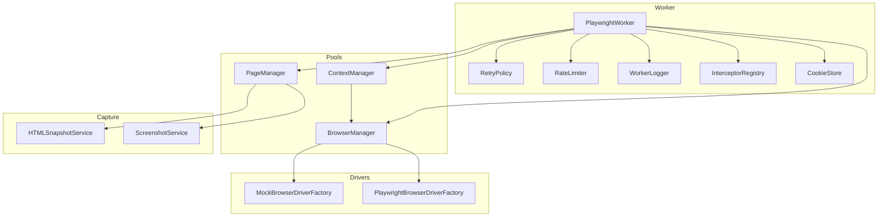
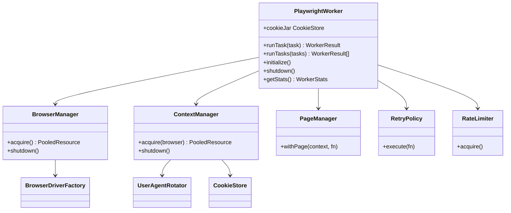
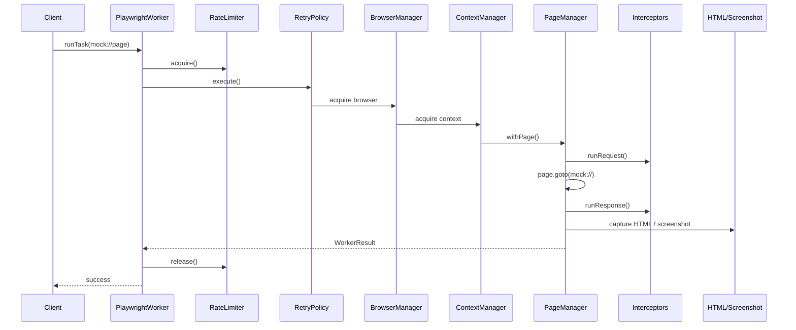

# Playwright Worker Framework (Phase 4C)

Production-grade browser worker framework for future catalog scraping. **Framework only** — no selectors, no site scraping, no GaadiBazaar calls, no external URLs in tests.

## Location

```
backend/src/lib/playwright-worker/
├── worker-types.ts          WorkerConfig, WorkerResult, WorkerTaskInput
├── worker-config.ts         Defaults + mergeWorkerConfig
├── worker-logger.ts         WorkerLogger, InMemoryWorkerLogger
├── retry-policy.ts          RetryPolicy
├── rate-limiter.ts          RateLimiter
├── cookie-store.ts          CookieStore
├── proxy-interface.ts       ProxyProvider, StaticProxyProvider, RotatingProxyProvider
├── user-agent-rotation.ts   UserAgentRotator, randomDelayMs
├── interceptors.ts          Request/response interceptors
├── browser-types.ts         Driver interfaces (Browser, Context, Page)
├── browser-manager.ts       Browser pool
├── context-manager.ts       Context pool + UA rotation
├── page-manager.ts          Page lifecycle
├── screenshot-service.ts    ScreenshotService
├── html-snapshot-service.ts HTMLSnapshotService
├── playwright-worker.ts     PlaywrightWorker orchestrator
├── drivers/
│   ├── mock-browser-driver.ts       In-memory (mock://, about:blank)
│   └── playwright-browser-driver.ts   Real Playwright hook (URL allow-list)
├── playwright-worker.test.ts
└── index.ts
```

## Architecture



## Class diagram



## Sequence diagram (task execution)



## Features

| Feature | Component |
|---------|-----------|
| Browser pool | `BrowserManager` |
| Context pool | `ContextManager` |
| Retry + backoff | `RetryPolicy` |
| Timeout | `WorkerConfig.defaultTimeoutMs` + page `goto` |
| Random delay | `applyRandomDelay` |
| User-agent rotation | `UserAgentRotator` |
| Proxy interface | `ProxyProvider` |
| Cookie store | `CookieStore` |
| Request interceptor | `InterceptorRegistry` |
| Response interceptor | `InterceptorRegistry` |
| HTML capture | `HTMLSnapshotService` |
| Screenshot capture | `ScreenshotService` |
| Structured logging | `WorkerLogger` |

## Usage (mock driver — Phase 4C)

```typescript
import {
  createPlaywrightWorker,
  MockBrowserDriverFactory,
  registerMockPage,
} from "@/lib/playwright-worker";

registerMockPage("catalog/list", "<html><body>List</body></html>");

const worker = createPlaywrightWorker({
  driverFactory: new MockBrowserDriverFactory(),
  config: { randomDelay: { minMs: 0, maxMs: 0 } },
});

const result = await worker.runTask({
  taskId: "demo-1",
  url: "mock://catalog/list",
  captureHtml: true,
  captureScreenshot: true,
});

await worker.shutdown();
```

## URL policy

Phase 4C allows **`mock://`** and **`about:blank`** only (configurable via `WorkerConfig.allowedUrlSchemes`). External URLs are rejected before navigation.

## Scripts

```bash
npm run test:playwright-worker
npm run benchmark:playwright-worker
```

## Out of scope (Phase 4C)

- CSS/XPath selectors
- GaadiBazaar or any live site scraping
- Source adapter wiring
- Import pipeline integration
- Database writes

## Next phase

Implement site-specific scraper modules that produce in-memory payloads and call existing import adapters — **not** part of Phase 4C.
