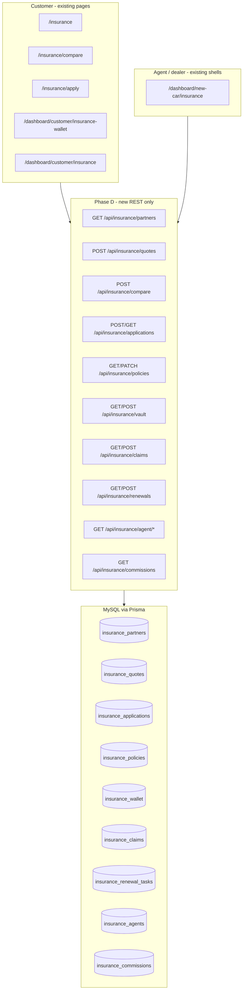

# Phase D — Insurance Marketplace Architecture (approval before code)

**Constraints:** Additive only · preserve all existing functionality · **no existing route changes** · **no UI redesign** · feature flags · database changes in [PHASE-D-DATABASE.md](./PHASE-D-DATABASE.md) before `db push`.

**Current state:** Public insurance hub (`/insurance`, quote, compare, apply), customer insurance pages, and customer ecosystem wallet/claims panels **already exist**. Premium math is **client-side** (`insurance-premium.ts`). Data uses Supabase tables/RPC with **mock fallbacks**. Prisma models are **minimal** vs Postgres reference migration `00025_insurance_enterprise.sql` and frontend `InsuranceApplication` types.

---

## Why

| Driver | Explanation |
|--------|-------------|
| **Product** | Motor insurance is a core hub (car/bike, compare ACKO/HDFC ERGO/etc.). Customers need comparable quotes, renewal nudges, vault storage, and claim visibility—dealers/agents need policy pipeline and commissions. |
| **Data integrity** | Next RPC `submit_insurance_application` writes only `provider` + `metadata` JSON into Prisma; UI expects **20+ columns** on `insurance_applications`. Wallet rows lack `idv_amount`, `claim_count` in Prisma though UI reads them from `metadata`. |
| **Claims & renewal** | Claims are **mock-only** in `customer-ecosystem` (`insuranceClaims` from mock snapshot). Renewals appear in campaigns/timeline copy but there is **no renewal job table** or server engine. |
| **Agent ops** | No `insurance_agent` role or CRM tables; new-car “insurance” page is a **placeholder**—APIs can feed it without new routes. |
| **Compatibility** | Same pattern as Phase B/C: REST under `/api/insurance/*`, flags off = today’s Supabase + mock behavior unchanged. |

---

## Architecture overview



**Integration rule:** `insurance.service.ts` and `customer-ecosystem.service.ts` try REST when `FEATURE_INSURANCE_MARKETPLACE=true`, else current Supabase/RPC/mock.

---

## Feature map (8 requirements → architecture)

| # | Requirement | Existing UI (unchanged) | Phase D deliverable |
|---|-------------|-------------------------|---------------------|
| 1 | **Policy comparison** | `InsuranceComparePage`, `InsuranceCompareTable`, `useInsuranceQuote` | `POST /api/insurance/compare` → ranked offers + `comparison_session_id`; persist rows in `insurance_quote_offers` |
| 2 | **Renewal engine** | Wallet countdown, `engagement_campaigns`, `scheduled_reminders` (customer automation) | `insurance_renewal_tasks` + `POST /api/insurance/renewals/run` (batch) + `GET /api/insurance/renewals/due`; cron-ready job metadata |
| 3 | **Claims tracking** | `CustomerInsuranceClaimsPanel` (mock data) | `insurance_claims` table + `GET/POST /api/insurance/claims`; ecosystem service reads real rows |
| 4 | **Insurance vault** | `CustomerInsuranceWalletPanel`, `insurance_wallet` query | Extend wallet schema + `GET/POST /api/insurance/vault`; sync from **issued** `insurance_policies` |
| 5 | **Agent CRM** | `NewCarInsurancePage` placeholder, dealer insurance interest flags | `insurance_agents`, `insurance_agent_leads`, `insurance_crm_tasks` + `GET /api/insurance/agent/overview|leads|applications` |
| 6 | **Policy management** | `CustomerInsurancePage`, application status fields | `insurance_policies` (issued lifecycle) + `PATCH /api/insurance/policies/:id`; link `application_id` → policy |
| 7 | **Commission tracking** | New-car insurance copy mentions commission (no ledger UI yet) | `insurance_commissions` + `GET /api/insurance/commissions` (agent/admin scoped) |
| 8 | **Customer insurance dashboard** | `CustomerInsurancePage`, wallet page, ecosystem widgets | `GET /api/insurance/dashboard` aggregates vault + apps + claims + renewal alerts; wire services only |

---

## Impact

### Positive

- One insurance domain API for customer, agent, and ecosystem modules.
- Issued policies decoupled from in-flight applications (clean renewal + claims FK).
- Renewal and claims become auditable; wallet stops relying on mock `insuranceClaims`.
- Agent commissions calculable on `issued` / `renewed` events.

### Scope by layer

| Layer | Impact |
|-------|--------|
| **Database** | Align `insurance_applications`, `insurance_quotes`, `insurance_partners`, `insurance_wallet`; add policies, claims, renewals, agents, commissions, compare offers |
| **Backend** | New `services/insurance-*.ts`, `app/api/insurance/**`, extend `rpc-handlers` `submitInsuranceApplication` |
| **Frontend** | **`insurance.service.ts`**, **`customer-ecosystem.service.ts`** (insurance slices only)—same exports/signatures |
| **Routes** | **No edits** to `router/index.tsx` paths |
| **UI** | **No layout/CSS/component structure changes** |

### Backward compatibility

| When flags off | Behavior |
|----------------|----------|
| Quote/compare | Client `buildInsuranceQuotes` + optional Supabase `insurance_quotes` insert |
| Apply | `supabase.rpc('submit_insurance_application')` or direct insert + mock |
| Wallet / claims | Mock snapshot + `insurance_wallet` generic query as today |
| Agent CRM | Placeholder/mock copy unchanged |

---

## Risk

| Risk | Severity | Mitigation |
|------|----------|------------|
| Prisma ↔ SQL drift on applications | High | D0 column alignment; dual-write `metadata` during transition |
| Renewal job spam | Med | Idempotent `(policy_id, renewal_window)` unique; rate-limit run endpoint |
| PII in claims | Med | Store claim reference + amount + status; documents via `/api/upload` URLs only |
| Agent commission disputes | Med | Commission row created once per `policy_id` + `event_type` |
| Role `insurance_agent` not in auth | Med | Additive enum value; map existing dealer staff via `insurance_agents.user_id` |
| Breaking compare UX | Low | API returns same shape as `InsuranceQuoteOffer[]`; client mapper unchanged |
| Ecosystem mock fallback | Low | If API empty, keep `buildMockCustomerSnapshot()` path |

---

## Files (expected touch list)

### Documentation

| File | Action |
|------|--------|
| `PHASE-D-PLAN.md` | This document |
| `PHASE-D-DATABASE.md` | DDL / Prisma (approve before push) |

### Backend — schema & config

| File | Action |
|------|--------|
| `backend/prisma/schema.prisma` | Insurance models aligned + new tables |
| `backend/src/config/feature-flags.ts` | Insurance flag group |
| `backend/src/lib/db/table-map.ts` | New table delegates |
| `backend/.env.example` | `FEATURE_INSURANCE_*` |

### Backend — services (new)

| File | Purpose |
|------|---------|
| `backend/src/services/insurance-marketplace.service.ts` | Partners, quote, compare, applications |
| `backend/src/services/insurance-policy.service.ts` | Issued policies, status transitions |
| `backend/src/services/insurance-vault.service.ts` | Wallet CRUD + sync from policies |
| `backend/src/services/insurance-claims.service.ts` | Claims CRUD + timeline |
| `backend/src/services/insurance-renewal.service.ts` | Due scan, task creation, run batch |
| `backend/src/services/insurance-agent.service.ts` | Agent CRM, leads, assignments |
| `backend/src/services/insurance-commission.service.ts` | Commission ledger |

### Backend — API routes (all new under `api/insurance/`)

```
GET    /api/insurance/partners
POST   /api/insurance/quotes
POST   /api/insurance/compare
POST   /api/insurance/applications
GET    /api/insurance/applications
GET    /api/insurance/applications/:id
GET    /api/insurance/dashboard                    # customer aggregate

GET    /api/insurance/policies
GET    /api/insurance/policies/:id
PATCH  /api/insurance/policies/:id

GET    /api/insurance/vault
POST   /api/insurance/vault
PATCH  /api/insurance/vault/:id

GET    /api/insurance/claims
POST   /api/insurance/claims
GET    /api/insurance/claims/:id

GET    /api/insurance/renewals/due
POST   /api/insurance/renewals/tasks
POST   /api/insurance/renewals/run                 # admin/cron

GET    /api/insurance/agent/overview
GET    /api/insurance/agent/leads
GET    /api/insurance/agent/applications
PATCH  /api/insurance/agent/applications/:id

GET    /api/insurance/commissions
```

**Unchanged:** `/api/upload`, `/api/db/query`, `/api/db/rpc/*`, existing insurance paths in router.

### Backend — RPC

| File | Action |
|------|--------|
| `backend/src/lib/db/rpc-handlers.ts` | `submitInsuranceApplication` writes aligned columns + optional agent assign |

### Frontend — service layer only

| File | Action |
|------|--------|
| `frontend/src/config/feature-flags.ts` | Insurance flags |
| `frontend/.env.production.example` | `VITE_FEATURE_INSURANCE_*` |
| `frontend/src/features/insurance/services/insurance.service.ts` | REST-first; keep all function signatures |
| `frontend/src/features/insurance/services/insurance-api.service.ts` | **New** optional HTTP client |
| `frontend/src/features/customer-ecosystem/services/customer-ecosystem.service.ts` | Vault + claims from API when flagged |

### Explicitly out of scope (Phase D)

- `frontend/src/router/index.tsx` — no path changes
- Insurance page components (shell, table, cards) — no redesign
- Removing Supabase RPC or mock insurers

---

## Feature flags

| Backend | Frontend | Gates |
|---------|----------|-------|
| `FEATURE_INSURANCE_MARKETPLACE` | `VITE_FEATURE_INSURANCE_MARKETPLACE` | Master REST switch |
| `FEATURE_INSURANCE_COMPARE_API` | `VITE_FEATURE_INSURANCE_COMPARE_API` | Persisted compare session |
| `FEATURE_INSURANCE_RENEWAL_ENGINE` | `VITE_FEATURE_INSURANCE_RENEWAL_ENGINE` | Renewal tasks + run endpoint |
| `FEATURE_INSURANCE_CLAIMS` | `VITE_FEATURE_INSURANCE_CLAIMS` | Real claims table |
| `FEATURE_INSURANCE_VAULT` | `VITE_FEATURE_INSURANCE_VAULT` | Vault API + policy sync |
| `FEATURE_INSURANCE_AGENT_CRM` | `VITE_FEATURE_INSURANCE_AGENT_CRM` | Agent endpoints |
| `FEATURE_INSURANCE_COMMISSIONS` | `VITE_FEATURE_INSURANCE_COMMISSIONS` | Commission ledger |

**Default when unset:** `true` in dev (consistent with Phase B/C); production can disable per module.

---

## Implementation packages (approve incrementally)

| Package | Contents |
|---------|----------|
| **D0** | `PHASE-D-DATABASE.md` + Prisma + `db push` + table-map + flags |
| **D1** | Partners, quote, compare APIs + align applications |
| **D2** | Policy management (`insurance_policies`) + application → issued flow |
| **D3** | Insurance vault sync + customer dashboard API |
| **D4** | Claims tracking |
| **D5** | Renewal engine (tasks + due scan + optional cron hook) |
| **D6** | Agent CRM + lead assignment |
| **D7** | Commission tracking |
| **D8** | Frontend service wiring + smoke checklist |

---

## Rollback plan

| Step | Action |
|------|--------|
| 1 | Set all `FEATURE_INSURANCE_*` and `VITE_FEATURE_INSURANCE_*` to `false` → instant revert to Supabase/mock/client premium |
| 2 | Redeploy previous backend build |
| 3 | **DB:** Leave new tables/columns idle (safe) or restore dev MySQL backup taken before D0 |
| 4 | Git revert Phase D merge |

**Safe point:** Flags off = identical user-visible behavior to pre–Phase D.

---

## Verification checklist (post-implementation)

- [ ] `/insurance/compare` shows offers with flag on/off
- [ ] `/insurance/apply` creates application; status visible on `/dashboard/customer/insurance`
- [ ] Wallet page shows policies from API when vault flag on
- [ ] Claims panel shows DB claims (not only mock) when claims flag on
- [ ] Renewal due creates `insurance_renewal_tasks` within 30-day window
- [ ] Agent overview returns only assigned leads/apps
- [ ] Commission row on policy `issued` / `renewed`
- [ ] `npm run build` (frontend) passes
- [ ] No diff in `router/index.tsx` except accidental

---

## Relation to Phase C

Independent. Finance and insurance share **customer dashboard** real estate but different API namespaces (`/api/finance/*` vs `/api/insurance/*`). No cross-phase route changes.

---

## Approval requested

Reply with:

- **Approve D0** — database doc + schema only  
- **Approve D0 + D1** — schema + compare/applications APIs  
- **Approve all packages** — full Phase D sequence  

**No code until you approve at least D0.**
