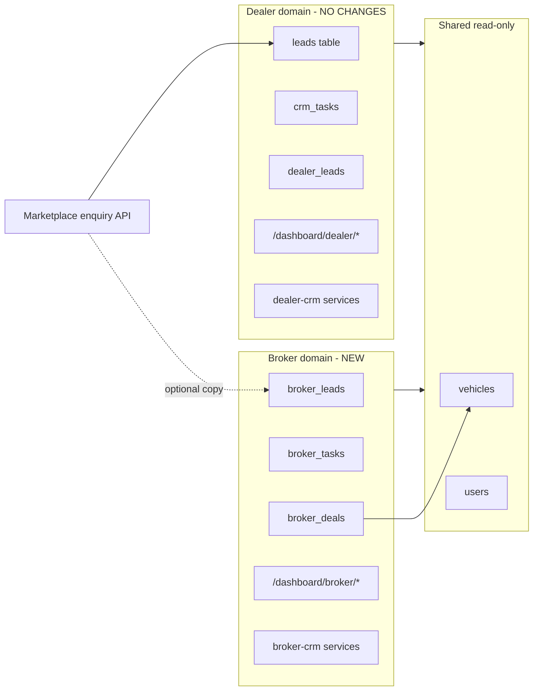
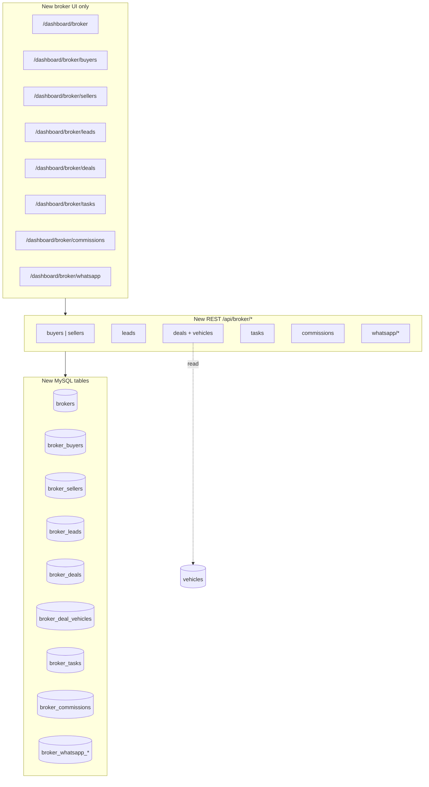

# Phase E — Broker CRM Rollout Plan (approval before code)

**Constraints:** Additive only · **do not modify existing dealer workflows** · preserve all dealer/new-car CRM behavior · feature flags · database in [PHASE-E-DATABASE.md](./PHASE-E-DATABASE.md) before `db push`.

**Current state:** No `broker` role, no broker routes, no broker tables. **Dealer CRM** (`/dashboard/dealer/*`, `leads`, `crm_tasks`, `dealer_leads`) is live. **Phase B** added `vehicles.sale_mode = broker_assisted` as a listing type only. Enterprise audit flagged **Broker CRM as missing** ([PROJECT-AUDIT-ENTERPRISE.md](./PROJECT-AUDIT-ENTERPRISE.md)).

---

## Why

| Driver | Explanation |
|--------|-------------|
| **Product** | Used-car and broker-assisted listings need an intermediary workspace: buyers, sellers, deal closure, commission—not a dealer showroom OS. |
| **Isolation** | Reusing `leads` / `crm_tasks` would **change dealer semantics** (dealer_id FK, RLS, enquiry routing). Broker CRM must be a **parallel domain**. |
| **Revenue** | Commission tracking and pipeline visibility are core broker operations; today they exist only as dealer analytics mock fields. |
| **WhatsApp** | Dealers already have a **wa.me desk** (`DealerWhatsAppPage`); brokers need the same **architecture** (templates, message log, webhooks) without touching dealer pages. |
| **Go-to-market** | Roll out behind flags: brokers onboard without affecting production dealer flows. |

---

## Isolation principle (dealer workflows untouched)



**Hard rules:**

| Rule | Detail |
|------|--------|
| No dealer file edits | `frontend/src/features/dealer-crm/**`, `DealerLeadsPage`, `useDealerCRM`, `crm.service.ts`, `dealer-enterprise.service.ts` — **no changes** |
| No dealer table writes from broker API | Broker services never `INSERT/UPDATE` on `leads`, `dealer_leads`, `crm_tasks` |
| No dealer route changes | `/dashboard/dealer/*`, `/dashboard/new-car/*` paths unchanged |
| Vehicle assignment | `broker_deal_vehicles` links vehicles; **does not** reassign `vehicles.dealer_id` or `seller_id` |
| Optional inbound bridge | Feature-flagged **copy** of public enquiries into `broker_leads` only when listing `sale_mode = broker_assisted` and broker is assigned in metadata |

---

## Feature map (8 requirements → architecture)

| # | Feature | Deliverable | Existing UI |
|---|---------|-------------|-------------|
| 1 | **Buyer management** | `broker_buyers` + CRUD API + buyer list on new broker dashboard | **New** broker pages only (shell reuses dealer CRM layout patterns, separate folder) |
| 2 | **Seller management** | `broker_sellers` + CRUD API | Same |
| 3 | **Deal pipeline** | `broker_deals` + stages (inquiry → negotiation → token → closed → lost) + kanban API | New `BrokerPipelineBoard` (copy pattern, not edit `LeadPipelineBoard`) |
| 4 | **Commission tracking** | `broker_commissions` on deal close + ledger API | New broker commissions view |
| 5 | **Vehicle assignment** | `broker_deal_vehicles` (many vehicles per deal, primary flag) | Assign from vehicle slug/UUID; read-only vehicle fetch |
| 6 | **Lead management** | `broker_leads` + status pipeline + notes | Separate from dealer `Lead` model |
| 7 | **Follow-up tasks** | `broker_tasks` (due date, assignee, linked lead/deal) | Separate from `crm_tasks` |
| 8 | **WhatsApp integration architecture** | `broker_whatsapp_configs`, `broker_whatsapp_templates`, `broker_whatsapp_messages`, webhook route | Architecture + template store; **wa.me links** work day one; BSP webhook optional |

---

## Rollout phases

Roll out in order. Each phase is shippable with flags; later phases depend on earlier schema.

| Phase | Name | Scope | Flag | Dealer impact |
|-------|------|-------|------|---------------|
| **E0** | Foundation | `PHASE-E-DATABASE.md`, Prisma, `broker` role enum, feature flags, table-map | `FEATURE_BROKER_CRM` | None |
| **E1** | Broker identity | `brokers` profile table, signup metadata mapping, auth guard | E0 flag | None |
| **E2** | Buyers & sellers | CRUD APIs + broker service layer | `FEATURE_BROKER_CONTACTS` | None |
| **E3** | Leads | `broker_leads` ingest (manual + optional marketplace bridge) | `FEATURE_BROKER_LEADS` | None (bridge is copy-only, flag off = disabled) |
| **E4** | Deal pipeline | `broker_deals` + stage transitions + timeline | `FEATURE_BROKER_DEALS` | None |
| **E5** | Vehicle assignment | Link vehicles to deals; validate UUID/slug | `FEATURE_BROKER_VEHICLE_ASSIGN` | None (no vehicle ownership mutation) |
| **E6** | Follow-up tasks | `broker_tasks` + reminders | `FEATURE_BROKER_TASKS` | None |
| **E7** | Commissions | Auto row on `closed` deal; manual adjust API | `FEATURE_BROKER_COMMISSIONS` | None |
| **E8** | WhatsApp architecture | Templates, message log, webhook stub, deep links | `FEATURE_BROKER_WHATSAPP` | None |
| **E9** | Broker dashboard shell | **New routes only** `/dashboard/broker/*`, sidebar, service wiring | Master flag | None |

**Estimated calendar (indicative):**

| Weeks | Milestone |
|-------|-----------|
| 1 | E0–E1 approved + schema pushed |
| 2 | E2–E3 buyers/sellers/leads |
| 3 | E4–E5 deals + vehicles |
| 4 | E6–E8 tasks, commissions, WhatsApp |
| 5 | E9 dashboard + QA + pilot brokers |

**Pilot:** 2–3 broker accounts, `broker_assisted` listings only, flags on in staging.

**GA:** Enable master flag in production; dealer flags unchanged.

---

## Architecture overview



---

## Impact

### Positive

- Brokers get a dedicated OS without dealer CRM coupling.
- Deal + commission audit trail for broker-assisted sale mode.
- WhatsApp ready for Meta BSP / Gupshup / Twilio via webhook table design.
- Marketplace can route broker-assisted enquiries to broker leads (optional, flagged).

### Scope by layer

| Layer | Impact |
|-------|--------|
| **Database** | New `broker_*` tables only; optional additive `AppRole.broker` |
| **Backend** | New `services/broker-*.ts`, `app/api/broker/**` |
| **Frontend** | **New** `features/broker-crm/**` + **new** router entries under `/dashboard/broker/*` only |
| **Dealer** | **Zero** changes to dealer CRM code paths |

### Backward compatibility

| Flag off | Behavior |
|----------|----------|
| `FEATURE_BROKER_CRM` | No broker routes registered (or 404 shell); dealer unchanged |
| Marketplace bridge off | Enquiries continue to `leads` only (today’s flow) |
| WhatsApp | wa.me deep links in broker UI; no webhook processing |

---

## Risk

| Risk | Severity | Mitigation |
|------|----------|------------|
| Accidental dealer CRM edits | High | PR checklist: no diffs under `dealer-crm/`; code review gate |
| Lead duplication (dealer + broker) | Med | Bridge creates **broker_leads** only; never updates `leads`; dedupe by phone+vehicle |
| Vehicle assignment changes ownership | High | FK link only; explicit ban on `vehicles.dealer_id` updates in broker service |
| Commission disputes | Med | Unique `(deal_id)` commission; status workflow pending→paid |
| WhatsApp webhook security | Med | Verify token header; idempotent `provider_message_id` |
| Role sprawl | Low | Single `broker` role; staff via `broker_members` later (optional E10) |
| Router bloat | Low | Lazy-loaded broker pages like dealer CRM |

---

## Files (expected touch list)

### Documentation

| File | Action |
|------|--------|
| `PHASE-E-PLAN.md` | This rollout plan |
| `PHASE-E-DATABASE.md` | DDL before push |

### Backend — schema & config

| File | Action |
|------|--------|
| `backend/prisma/schema.prisma` | `broker` role + broker models |
| `backend/src/config/feature-flags.ts` | Broker flag group |
| `backend/src/lib/db/table-map.ts` | Broker table delegates |
| `backend/.env.example` | `FEATURE_BROKER_*` |

### Backend — services (new)

| File | Purpose |
|------|---------|
| `backend/src/services/broker-profile.service.ts` | Broker org profile |
| `backend/src/services/broker-contacts.service.ts` | Buyers & sellers |
| `backend/src/services/broker-leads.service.ts` | Lead CRUD + optional bridge |
| `backend/src/services/broker-deals.service.ts` | Pipeline + vehicle assign |
| `backend/src/services/broker-tasks.service.ts` | Follow-ups |
| `backend/src/services/broker-commission.service.ts` | Commission ledger |
| `backend/src/services/broker-whatsapp.service.ts` | Templates, messages, webhook |

### Backend — API (new under `api/broker/`)

```
GET/POST        /api/broker/profile
GET/POST/PATCH  /api/broker/buyers
GET/POST/PATCH  /api/broker/sellers
GET/POST/PATCH  /api/broker/leads
GET/POST/PATCH  /api/broker/deals
POST/DELETE     /api/broker/deals/:id/vehicles
GET/POST/PATCH  /api/broker/tasks
GET             /api/broker/commissions
POST            /api/broker/commissions/:id/mark-paid
GET/POST        /api/broker/whatsapp/templates
GET             /api/broker/whatsapp/messages
POST            /api/broker/whatsapp/webhook          # provider inbound
POST            /api/broker/whatsapp/send             # stub / queue
GET             /api/broker/overview                  # dashboard stats
```

**Unchanged:** `/api/leads`, dealer CRM queries, `marketplace-lead.service` default behavior (bridge is opt-in module).

### Frontend — new module only

| Path | Action |
|------|--------|
| `frontend/src/features/broker-crm/**` | **New** pages, hooks, services (mirror dealer-crm structure) |
| `frontend/src/router/index.tsx` | **Additive only:** `/dashboard/broker/*` block |
| `frontend/src/auth/workspace-role.ts` | Map `broker` → `/dashboard/broker` |
| `frontend/src/config/feature-flags.ts` | Broker flags |

### Explicitly forbidden (Phase E)

| Path | Rule |
|------|------|
| `frontend/src/features/dealer-crm/**` | No edits |
| `backend/src/services/marketplace-lead.service.ts` | No edits unless **separate** opt-in bridge file imported behind flag |
| `leads`, `crm_tasks`, `dealer_leads` Prisma models | No schema changes required for broker |

---

## Feature flags

| Backend | Frontend | Gates |
|---------|----------|-------|
| `FEATURE_BROKER_CRM` | `VITE_FEATURE_BROKER_CRM` | Master + dashboard routes |
| `FEATURE_BROKER_LEADS` | `VITE_FEATURE_BROKER_LEADS` | Lead module |
| `FEATURE_BROKER_DEALS` | `VITE_FEATURE_BROKER_DEALS` | Pipeline |
| `FEATURE_BROKER_COMMISSIONS` | `VITE_FEATURE_BROKER_COMMISSIONS` | Ledger |
| `FEATURE_BROKER_WHATSAPP` | `VITE_FEATURE_BROKER_WHATSAPP` | Templates + webhook |
| `FEATURE_BROKER_MARKETPLACE_BRIDGE` | `VITE_FEATURE_BROKER_MARKETPLACE_BRIDGE` | Copy broker_assisted enquiries |

**Default when unset:** `false` for broker (safer than finance/insurance)—explicit opt-in until pilot.

---

## Rollback plan

| Step | Action |
|------|--------|
| 1 | Set all `FEATURE_BROKER_*` / `VITE_FEATURE_BROKER_*` to `false` |
| 2 | Remove or hide `/dashboard/broker` route registration (lazy import guard) |
| 3 | Redeploy backend without broker routes (or routes return 404) |
| 4 | **DB:** Leave `broker_*` tables empty; no dealer data affected |
| 5 | Git revert Phase E branch |

**Safe point:** Flags off = identical to pre–Phase E; dealer CRM byte-for-byte behavior preserved.

---

## Verification checklist (post-rollout)

- [ ] Dealer: submit enquiry → appears in **dealer** CRM only (bridge off)
- [ ] Dealer: leads pipeline, tasks, WhatsApp page unchanged (smoke test)
- [ ] Broker: create buyer/seller/deal without dealer login
- [ ] Broker: assign vehicle to deal; vehicle `dealer_id` unchanged in DB
- [ ] Broker: close deal → commission row created once
- [ ] Broker: task due date + completion
- [ ] WhatsApp: template CRUD + message log; webhook stores payload (no send required)
- [ ] Bridge on: `broker_assisted` enquiry copies to `broker_leads` only
- [ ] `npm run build` passes
- [ ] Git diff excludes `dealer-crm/`

---

## Relation to other phases

| Phase | Relationship |
|-------|--------------|
| **B** | `sale_mode = broker_assisted` feeds optional lead bridge |
| **C / D** | Independent (finance / insurance) |
| **Dealer CRM** | Parallel, not merged |

---

## Approval requested

Reply with:

- **Approve E0** — database doc + schema + flags only  
- **Approve E0–E3** — foundation + contacts + leads  
- **Approve full rollout** — E0–E9 sequence  

**No code until you approve at least E0.**
