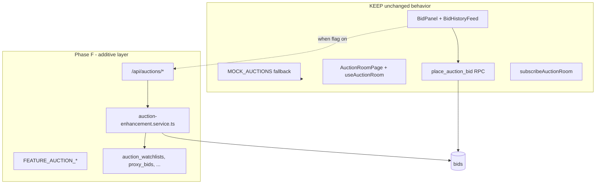
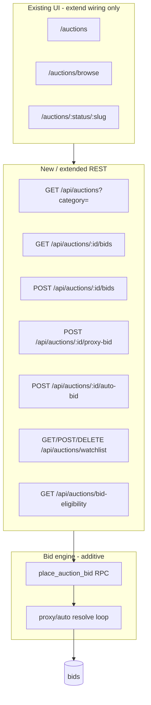

# Phase F — Auction Module Enhancement Rollout Plan (approval before code)

**Constraints:** **Do not rewrite** the current auction system · additive only · feature-flag rollout · **no breaking changes** · database in [PHASE-F-DATABASE.md](./PHASE-F-DATABASE.md) before `db push`.

**Current state:** Live auction hub (`/auctions`, room, listing), **BidPanel** (manual + auto max), **BidHistoryFeed**, realtime channel, `place_auction_bid` RPC, mock catalog fallback. Prisma `Auction` is **minimal** vs SQL/frontend (`auction_type`, `reserve_price`, `organizer_id`, etc.). Types today: `dealer | bank_repo | government` — **insurance** and **fleet** categories missing. **No watchlist table**; **proxy bidding** not implemented (auto-bid table exists in SQL reference only); **KYC** on `users.kyc_status` but **not enforced** in bid flow.

---

## Why

| Driver | Explanation |
|--------|-------------|
| **Product** | Enterprise auction vision includes bank repo, insurance salvage, fleet disposal, dealer inventory, and govt auctions—each with filters and organizer metadata. |
| **Bidding depth** | Power bidders expect **proxy** (max bid) and **auto** increment engines without replacing the existing manual bid UX. |
| **Engagement** | Watchlist drives return visits; persisted bid history supports trust and admin audit. |
| **Compliance** | KYC gate before high-value bids reduces fraud (bid attempts table already logs risk). |
| **Safety** | Extend RPC + REST behind flags; mock auctions and current room flow stay default when flags off. |

---

## Non-rewrite principle

**Hard rules:**

| Rule | Detail |
|------|--------|
| No room rewrite | `useAuctionRoom`, `BidPanel`, realtime channel — **extend hooks only** |
| RPC preserved | `place_auction_bid`, `set_auction_auto_bid`, `finalize_auction` remain; enhanced logic **calls** them or mirrors in service when flag on |
| Mock first | Empty DB → mock auctions unchanged |
| Type compat | `bank_repo` maps to `bank`; old rows keep working |
| List API | Existing `GET /api/auctions` unchanged; new query params optional |

---

## Feature map (10 requirements → architecture)

| # | Feature | Current | Phase F deliverable |
|---|---------|---------|---------------------|
| 1 | **Bank auctions** | `bank_repo` type + mock | `auction_category = bank` + organizer metadata + filter API |
| 2 | **Insurance auctions** | Hub link only | `auction_category = insurance` + salvage fields in metadata |
| 3 | **Fleet auctions** | Not typed | `auction_category = fleet` + lot/batch fields |
| 4 | **Dealer auctions** | `dealer` type + `DealerAuctionsPage` | Align organizer_id; dealer filter unchanged |
| 5 | **Government auctions** | `government` type | `auction_category = government` + tender ref in metadata |
| 6 | **Proxy bidding** | Not implemented | `auction_proxy_bids` (secret max) + engine on outbid |
| 7 | **Auto bidding** | UI + SQL `auction_auto_bids`; Prisma missing | Align table + `POST /api/auctions/:id/auto-bid` + post-bid auto-resolve |
| 8 | **Watchlist** | None | `auction_watchlists` + user scoped API (separate from vehicle wishlist) |
| 9 | **Bid history** | `fetchAuctionBids` + `BidHistoryFeed` | Paginated `GET /api/auctions/:id/bids` + optional export |
| 10 | **KYC verification** | Admin KYC API; no bid gate | `requireKycForBid` flag + check `users.kyc_status` + `auction_bidder_eligibility` audit |

**Unified category enum (app):** `bank | insurance | fleet | dealer | government`  
**Legacy alias:** `bank_repo` → `bank` in mappers.

---

## Rollout phases

| Phase | Name | Scope | Flag | Breaking risk |
|-------|------|-------|------|---------------|
| **F0** | Foundation | Schema align + flags + table-map | `FEATURE_AUCTION_V2` | None |
| **F1** | Categories | `auction_category` column + seed/filter + hub tabs data | `FEATURE_AUCTION_CATEGORIES` | None (default `dealer`) |
| **F2** | Bid history API | Paginated bids endpoint; service prefers API when flagged | `FEATURE_AUCTION_BID_HISTORY` | None |
| **F3** | Watchlist | CRUD watchlist + heart on existing cards (wire only) | `FEATURE_AUCTION_WATCHLIST` | None |
| **F4** | Auto bidding | Prisma `auction_auto_bids` + enhance RPC handler auto-resolve | `FEATURE_AUCTION_AUTO_BID` | None (off = manual only) |
| **F5** | Proxy bidding | Proxy max + increment engine after each bid | `FEATURE_AUCTION_PROXY_BID` | None |
| **F6** | KYC gate | Pre-bid check + eligibility record | `FEATURE_AUCTION_KYC_GATE` | None (off = today’s open bid) |
| **F7** | Category organizers | Bank/insurance/fleet/gov metadata templates + admin seed | F1 flag | None |
| **F8** | Frontend service wiring | `auction.service.ts` REST-first fallbacks | Master + per-feature | None |
| **F9** | QA + pilot | Staging load test on proxy/auto | — | None |

**Suggested calendar:** ~4 weeks (F0–F2 week 1, F3–F5 week 2, F6–F8 week 3, F9 week 4).

**Pilot:** Enable flags on staging; one live bank + one dealer auction.

---

## Architecture overview

**Proxy vs auto (design):**

| Mode | User sets | System behavior |
|------|-----------|-----------------|
| **Manual** | Single bid amount | Current flow |
| **Auto** | Max ceiling | After each competing bid, increment up to max (existing SQL intent) |
| **Proxy** | Max bid (hidden) | Store max; visible bid = min(second_highest + increment, max) |

Both can coexist per auction via flags; UI uses existing **Auto** section in `BidPanel`; proxy adds **max bid** field when flag on (minimal UI wire, no redesign).

---

## Impact

### Positive

- Five auction lanes without new routes.
- Watchlist + full bid tape for trust.
- KYC-ready for regulated bank/gov auctions.
- Proxy/auto attract serious bidders.

### Scope by layer

| Layer | Impact |
|-------|--------|
| **Database** | Additive columns on `auctions`; new tables: watchlists, proxy_bids, auto_bids (align), bid_eligibility, optional category organizers |
| **Backend** | Extend `rpc-handlers` + new `auction-enhancement.service.ts` + routes under `/api/auctions/` |
| **Frontend** | `auction.service.ts`, types (`AuctionType` extend), optional watchlist toggle on `AuctionCard` |
| **Unchanged** | Route paths, room layout, mock data path, dealer auction page |

### Backward compatibility

| Flag off | Behavior |
|----------|----------|
| All `FEATURE_AUCTION_*` false | Supabase RPC + mock; no KYC block; no watchlist API |
| Category flag off | Filter ignores new categories; `bank_repo` still works |
| Proxy off | Only manual + existing auto UI path |

---

## Risk

| Risk | Severity | Mitigation |
|------|----------|------------|
| Bid engine regression | High | Flag off = legacy RPC only; integration tests on place_bid |
| Proxy bidding wars / loops | Med | Max iterations cap per resolve; transaction locks |
| KYC blocks legitimate users | Med | Flag off default; soft message + link to profile KYC |
| Category migration | Low | Default `dealer`; map `bank_repo` → `bank` in read layer |
| Watchlist vs vehicle wishlist confusion | Low | Separate table `auction_watchlists` + API namespace |
| Prisma drift | Med | F0 aligns columns with SQL reference |

---

## Files (expected touch list)

### Documentation

| File | Action |
|------|--------|
| `PHASE-F-PLAN.md` | This plan |
| `PHASE-F-DATABASE.md` | DDL |

### Backend

| File | Action |
|------|--------|
| `backend/prisma/schema.prisma` | Auction columns + new models |
| `backend/src/config/feature-flags.ts` | Auction flags |
| `backend/src/lib/db/table-map.ts` | New delegates |
| `backend/src/services/auction-enhancement.service.ts` | **New** — proxy/auto resolve, watchlist, KYC |
| `backend/src/lib/db/rpc-handlers.ts` | Extend `placeAuctionBid`, `set_auction_auto_bid` (not replace) |
| `backend/src/app/api/auctions/route.ts` | Optional `category` query param only |
| `backend/src/app/api/auctions/[id]/bids/route.ts` | **New** |
| `backend/src/app/api/auctions/[id]/proxy-bid/route.ts` | **New** |
| `backend/src/app/api/auctions/[id]/auto-bid/route.ts` | **New** |
| `backend/src/app/api/auctions/watchlist/route.ts` | **New** |
| `backend/src/app/api/auctions/bid-eligibility/route.ts` | **New** |

### Frontend (service + types only — no room redesign)

| File | Action |
|------|--------|
| `frontend/src/config/feature-flags.ts` | Auction flags |
| `frontend/src/features/auctions/types.ts` | Extend `AuctionType` + legacy map |
| `frontend/src/features/auctions/services/auction.service.ts` | REST fallbacks |
| `frontend/src/features/auctions/lib/auction-utils.ts` | Category mapper |
| `frontend/src/features/auctions/hooks/useAuctionRoom.ts` | Optional KYC check before bid (flag) |
| `frontend/src/features/auctions/components/AuctionCard.tsx` | Watchlist icon wire (flag) |

### Explicitly minimal / unchanged

| File | Rule |
|------|------|
| `AuctionRoomPage.tsx` layout | No redesign |
| `BidHistoryFeed.tsx` | Keep; feed from same bid shape |
| `MOCK_AUCTIONS` | Keep; add sample categories optional |
| `router/index.tsx` | No path changes |

---

## Feature flags

| Backend | Frontend | Gates |
|---------|----------|-------|
| `FEATURE_AUCTION_V2` | `VITE_FEATURE_AUCTION_V2` | Master enhanced API |
| `FEATURE_AUCTION_CATEGORIES` | `VITE_FEATURE_AUCTION_CATEGORIES` | 5 category lanes |
| `FEATURE_AUCTION_PROXY_BID` | `VITE_FEATURE_AUCTION_PROXY_BID` | Proxy engine |
| `FEATURE_AUCTION_AUTO_BID` | `VITE_FEATURE_AUCTION_AUTO_BID` | Auto-bid table + resolve |
| `FEATURE_AUCTION_WATCHLIST` | `VITE_FEATURE_AUCTION_WATCHLIST` | Watchlist API |
| `FEATURE_AUCTION_BID_HISTORY` | `VITE_FEATURE_AUCTION_BID_HISTORY` | Paginated history |
| `FEATURE_AUCTION_KYC_GATE` | `VITE_FEATURE_AUCTION_KYC_GATE` | Bid eligibility |

**Default when unset:** `false` for auction enhancements (explicit opt-in); dev `.env` can enable all.

---

## Rollback plan

| Step | Action |
|------|--------|
| 1 | Set all `FEATURE_AUCTION_*` / `VITE_FEATURE_*` to `false` |
| 2 | Redeploy backend; enhanced routes return 404 or fall through |
| 3 | Frontend uses RPC + mock only |
| 4 | DB: leave new columns/tables idle |
| 5 | Git revert Phase F branch |

**Safe point:** Identical to pre–Phase F auction experience.

**Schema approval:** See [PHASE-F-SCHEMA-DIFF.md](./PHASE-F-SCHEMA-DIFF.md) — **no duplicate price fields**; `startPrice`/`currentBid` canonical with alias mapping only.

---

## Verification checklist

- [ ] Flag off: place bid via room works (mock + DB auction)
- [ ] Flag off: dealer auctions page unchanged
- [ ] Category filter: bank / insurance / fleet / dealer / government
- [ ] Proxy: max bid held secret; visible current bid correct
- [ ] Auto: outbid triggers increment up to max
- [ ] Watchlist: per-user; not shared across accounts
- [ ] Bid history: pagination matches `BidHistoryFeed` order
- [ ] KYC gate on: unverified user blocked with message; verified bids
- [ ] Realtime channel still updates room
- [ ] `npm run build` passes

---

## Relation to other phases

| Phase | Relationship |
|-------|--------------|
| **B** | `auction_sale` vehicle mode independent |
| **E** | Broker deals separate from auction bids |
| **Dealer CRM** | `DealerAuctionsPage` unchanged; may read new category field |

---

## Approval requested

Reply with:

- **Approve F0** — database + flags only  
- **Approve F0–F3** — foundation + categories + history + watchlist  
- **Approve full rollout** — F0–F9  

**No code until you approve at least F0.**
