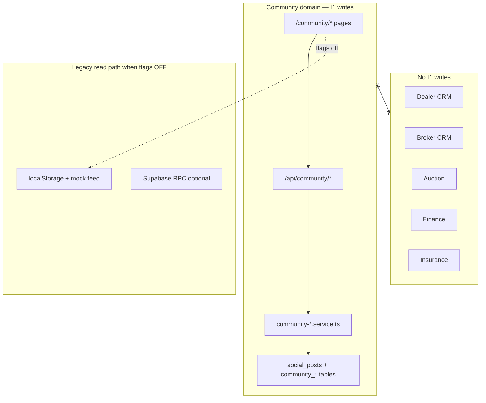

# Phase I1 — Community Profiles + Feed Foundation (architecture review)

**Status:** ⏸ **Review only** — no implementation, no `db push`, flags remain **off**.

Reply **Approve I1** to implement code; reply **Approve I1 db push** only if optional schema deltas are included.

---

## 1. Architecture

### 1.1 Domain boundary (unchanged from I0)



**I1 principle:** Wire existing community UI to **REST** behind flags. When all `FEATURE_COMMUNITY_*` are off, current behavior (mock / localStorage / Supabase) **unchanged**.

### 1.2 Layering

| Layer | Responsibility |
|-------|----------------|
| `lib/community/guard.ts` | Auth + per-flag gate (404 when off) |
| `lib/community/map-post.ts` | `SocialPost` → API JSON (`starting_bid` N/A; media, poll, embed) |
| `services/community-profile.service.ts` | User + business profile CRUD, handle resolution |
| `services/community-feed.service.ts` | Feed queries (global, following, by handle) |
| `services/community-post.service.ts` | Create post (text/image/video/poll), moderation default `approved` dev |
| `services/community-engagement.service.ts` | Like, comment, share, follow + counter updates |
| `app/api/community/**` | Thin route handlers |

### 1.3 Persona & business mapping (8 types)

| Persona | `CommunityPersona` | Business `entity_type` |
|---------|-------------------|------------------------|
| Customer | `customer` | — |
| Dealer | `dealer` | `dealer` |
| Broker | `broker` | `broker` |
| DSA | `dsa` | `dsa` |
| Insurance Agent | `insurance_agent` | `insurance_agent` |
| Workshop | `workshop` | `workshop` |
| Parts Seller | `parts_seller` | `parts_seller` |
| Influencer | `influencer` | `influencer` |

Auto-provision `community_user_profiles` on first `GET /api/community/profile/me` (lazy create). Business profile optional via `POST /api/community/business`.

### 1.4 Post types (feed foundation)

| Type | `post_kind` | Storage |
|------|-------------|---------|
| **Text** | `discussion` | `content` + empty `media` |
| **Image** | `discussion` | `media` JSON array of image URLs |
| **Video** | `embed` or `discussion` | `embed_url` + provider, or `media` with `{ type: "video", url }` in metadata |
| **Poll** | `poll` | `poll_options` JSON + optional `poll_ends_at` |

Canonical table: **`social_posts`** only (never `community_posts` for new writes).

### 1.5 Feed types (query-based, I1)

| `type` query param | Query |
|------------------|-------|
| `global` | Approved posts, `created_at` DESC, cursor |
| `following` | Posts by authors the viewer follows (`community_follows` + legacy `user_follows` dual-read optional) |
| `user` | Posts by `author_id` from profile handle |
| `business` | Posts where `metadata.business_slug` or author = business owner (I1 simple: by owner `author_id`) |

### 1.6 Frontend integration (additive, no route breaks)

| Existing route | I1 behavior |
|--------------|-------------|
| `/community` | Feed: try `GET /api/community/feed` when `VITE_FEATURE_COMMUNITY_FEED` |
| `/community/u/:userId` | Profile: keep; add **optional** `/community/profile/:handle` alias (new route only) |
| `/community/post/:id` | Unchanged path; detail may call `GET /api/community/posts/:id` when flag on |
| `/community/dealers/:slug` | Unchanged; business page may call `GET /api/community/business/:slug` when flag on |

**New additive routes (optional I1):**

- `/community/profile/:handle` → reuse `CommunityProfilePage` with handle param resolver
- `/community/business/:slug` → new thin page or extend `CommunityDealerPage` pattern for all entity types

Existing paths **not removed or renamed**.

---

## 2. Prisma impact

### 2.1 I0 already in DB (no I1 push required for core I1)

| Module | Tables / models | Status |
|--------|-----------------|--------|
| User profiles | `community_user_profiles`, `users.community_*` | ✅ Pushed (I0) |
| Business profiles | `community_business_profiles` | ✅ Pushed |
| Posts / feed | `social_posts` | ✅ Extended (I0) |
| Engagement | `post_likes`, `post_comments`, `post_shares`, `community_follows` | ✅ Pushed |
| Legacy | `community_posts` | Frozen |

### 2.2 Optional I1 schema delta (requires separate **Approve I1 db push**)

| Change | Required for I1? | Recommendation |
|--------|------------------|----------------|
| `CommunityBusinessProfile.description` TEXT | Nice-to-have | Use `tagline` as API `description` **or** add column |
| `social_links` on business | Nice-to-have | Store in `metadata.social_links` JSON — **no migration** |
| `verification_status` enum | Nice-to-have | Use `is_verified` + `metadata.verification_status` |
| `media_type` on posts | Nice-to-have | Infer from `media` / `post_kind` in service layer |

**Default I1 implementation:** **zero** Prisma file changes — use existing I0 schema + JSON metadata.

### 2.3 Counter denormalization (application layer)

| Counter | Updated on |
|---------|------------|
| `follower_count` / `following_count` | follow / unfollow |
| `post_count` | post create / soft delete |
| `like_count` / `comment_count` / `share_count` | like / comment / share |

Use transactions in `community-engagement.service.ts` (no new tables).

---

## 3. API list

All routes return **404** when the relevant flag is off. Master: `FEATURE_COMMUNITY_V2`.

### A. User profiles

| Method | Path | Flag |
|--------|------|------|
| GET | `/api/community/profile/me` | `FEATURE_COMMUNITY_PROFILES` + master |
| PATCH | `/api/community/profile/me` | same |
| GET | `/api/community/profile/:handle` | same |

**Response fields:** `handle`, `display_name`, `bio`, `cover_url`, `avatar_url`, `persona`, `follower_count`, `following_count`, `post_count`, `is_verified`.

### B. Business profiles

| Method | Path | Flag |
|--------|------|------|
| GET | `/api/community/business/me` | `FEATURE_COMMUNITY_BUSINESS_PROFILES` |
| POST | `/api/community/business` | same |
| PATCH | `/api/community/business/:slug` | same |
| GET | `/api/community/business/:slug` | same |

**Response fields:** `name`, `logo_url`, `cover_url`, `description` (from `tagline`), `city`, `state`, `website`, `social_links` (metadata), `is_verified`, `entity_type`, `slug`.

### C. Feed & posts

| Method | Path | Flag |
|--------|------|------|
| GET | `/api/community/feed?type=global\|following\|user&cursor=&limit=` | `FEATURE_COMMUNITY_FEED` |
| POST | `/api/community/posts` | `FEATURE_COMMUNITY_POSTS` |
| GET | `/api/community/posts/:id` | `FEATURE_COMMUNITY_POSTS` |

**POST body (posts):**

```json
{
  "content": "string",
  "media": [{ "type": "image|video", "url": "..." }],
  "post_kind": "discussion|poll|embed",
  "poll_options": ["A", "B"],
  "poll_ends_at": "ISO8601",
  "embed_url": "...",
  "group_id": "optional"
}
```

### D. Engagement

| Method | Path | Flag |
|--------|------|------|
| POST | `/api/community/posts/:id/like` | `FEATURE_COMMUNITY_POSTS` |
| DELETE | `/api/community/posts/:id/like` | same |
| GET | `/api/community/posts/:id/comments` | same |
| POST | `/api/community/posts/:id/comments` | same |
| POST | `/api/community/posts/:id/share` | same |
| POST | `/api/community/follow` | `FEATURE_COMMUNITY_FOLLOW` |
| DELETE | `/api/community/follow` | same |

**Follow body:** `{ "target_type": "user|business", "target_user_id"?, "target_business_id"? }`

### Not in I1 (deferred I2+)

- Groups CRUD, moderation queue UI, poll vote endpoint, notifications bridge, media upload service (use existing `/api/upload` with `metadata` path prefix `community/`)

---

## 4. Feature flags

Add to `backend/src/config/feature-flags.ts` and `frontend/src/config/feature-flags.ts` (if not present):

| Backend | Frontend | Default |
|---------|----------|---------|
| `FEATURE_COMMUNITY_V2` | `VITE_FEATURE_COMMUNITY_V2` | **false** |
| `FEATURE_COMMUNITY_PROFILES` | `VITE_FEATURE_COMMUNITY_PROFILES` | **false** |
| `FEATURE_COMMUNITY_BUSINESS_PROFILES` | `VITE_FEATURE_COMMUNITY_BUSINESS_PROFILES` | **false** |
| `FEATURE_COMMUNITY_FEED` | `VITE_FEATURE_COMMUNITY_FEED` | **false** |
| `FEATURE_COMMUNITY_POSTS` | `VITE_FEATURE_COMMUNITY_POSTS` | **false** |
| `FEATURE_COMMUNITY_FOLLOW` | `VITE_FEATURE_COMMUNITY_FOLLOW` | **false** |

**Note:** I0 doc listed flags but they may not be in code yet — I1 implementation adds them, still default **off**.

`.env.example` — commented only.

---

## 5. Files affected (on implementation)

### Backend — new

| File |
|------|
| `backend/src/lib/community/guard.ts` |
| `backend/src/lib/community/map-post.ts` |
| `backend/src/lib/community/map-profile.ts` |
| `backend/src/services/community-profile.service.ts` |
| `backend/src/services/community-feed.service.ts` |
| `backend/src/services/community-post.service.ts` |
| `backend/src/services/community-engagement.service.ts` |
| `backend/src/app/api/community/profile/me/route.ts` |
| `backend/src/app/api/community/profile/[handle]/route.ts` |
| `backend/src/app/api/community/business/route.ts` |
| `backend/src/app/api/community/business/[slug]/route.ts` |
| `backend/src/app/api/community/feed/route.ts` |
| `backend/src/app/api/community/posts/route.ts` |
| `backend/src/app/api/community/posts/[id]/route.ts` |
| `backend/src/app/api/community/posts/[id]/like/route.ts` |
| `backend/src/app/api/community/posts/[id]/comments/route.ts` |
| `backend/src/app/api/community/posts/[id]/share/route.ts` |
| `backend/src/app/api/community/follow/route.ts` |

### Backend — config

| File | Change |
|------|--------|
| `backend/src/config/feature-flags.ts` | Community flag group |
| `backend/src/lib/db/table-map.ts` | I0 delegates: `community_user_profiles`, `social_posts`, etc. |
| `backend/.env.example` | Commented flags |

### Frontend — extend only (no dealer/broker/auction/finance/insurance)

| File | Change |
|------|--------|
| `frontend/src/config/feature-flags.ts` | VITE community flags |
| `frontend/src/features/community/services/community-api.service.ts` | **NEW** REST client |
| `frontend/src/features/community/services/community.service.ts` | Flag-gated fallback to API |
| `frontend/src/features/community/services/community-profile.service.ts` | REST for profiles |
| `frontend/src/features/community/hooks/useCommunityFeed.ts` | Optional API feed |
| `frontend/src/features/community/pages/CommunityProfilePage.tsx` | Handle + counts from API |
| `frontend/src/features/community/pages/CommunityFeedPage.tsx` | Feed from API when flagged |
| `frontend/src/router/index.tsx` | **Additive** `profile/:handle`, `business/:slug` children only |

### Not modified

| Area |
|------|
| `frontend/src/features/dealer-crm/**` |
| `frontend/src/features/broker-crm/**` |
| `frontend/src/features/auctions/**` |
| `frontend/src/features/finance/**` |
| `frontend/src/features/insurance/**` |
| `backend/src/app/api/leads/**` |
| `backend/src/services/marketplace-lead.service.ts` |

---

## 6. Rollback plan

| Level | Action |
|-------|--------|
| **App** | Set all `FEATURE_COMMUNITY_*` / `VITE_*` to false → UI reverts to mock/localStorage |
| **API** | Remove or leave routes; 404 when flags off |
| **DB** | I1 uses I0 tables only — no I1 migration if metadata-only approach |
| **Code** | Revert I1 branch; I0 schema/tables remain (empty or test data only) |

Restore backup from I0 push if needed: `motorcart-pre-i0-push-20260604-122652.sql`.

---

## 7. Risk analysis

| Risk | Severity | Mitigation |
|------|----------|------------|
| Breaking community UX when flags off | **High** | Strict `if (featureFlags.communityFeed)` fallback to existing mock path |
| Dual feed sources (mock vs API) | **Med** | Single hook abstraction; API only when flag on |
| `community_posts` vs `social_posts` confusion | **High** | Service layer writes **only** `socialPost` delegate |
| Counter drift (likes/follows) | **Med** | Transactional increment/decrement; periodic reconcile job (I3+) |
| Handle collision | **Low** | Unique index on `community_user_profiles.handle` |
| Business profile duplicates per entity | **Med** | Unique `(entity_type, entity_id)` optional unique index I2 |
| Spam / moderation | **Med** | `moderation_status`, `spam_score`, `needs_review` on create |
| Video upload size | **Med** | Reuse upload route; size limits in upload config |
| Route break on `/community/u/:id` | **High** | Keep existing routes; new routes are **additions only** |
| CRM accidental coupling | **High** | No imports from dealer/broker services; optional `dealer_id` on post is display-only |
| Insurance agent without AppRole | **Low** | `CommunityPersona.insurance_agent` only |

---

## 8. Implementation phases (after approval)

| Step | Deliverable |
|------|-------------|
| **I1a** | Backend guard + flags + table-map + profile APIs |
| **I1b** | Feed + post create + engagement APIs |
| **I1c** | Frontend REST wiring behind flags + additive routes |
| **I1d** | Smoke tests (flags off = unchanged; flags on in staging only) |

**No `db push`** unless optional schema in §2.2 is approved separately.

---

## Approval

| Gate | Action |
|------|--------|
| **Approve I1** | Implement backend + frontend per this plan |
| **Approve I1 db push** | Only if §2.2 schema deltas are included |

**Wait for approval before any `db push`.**
