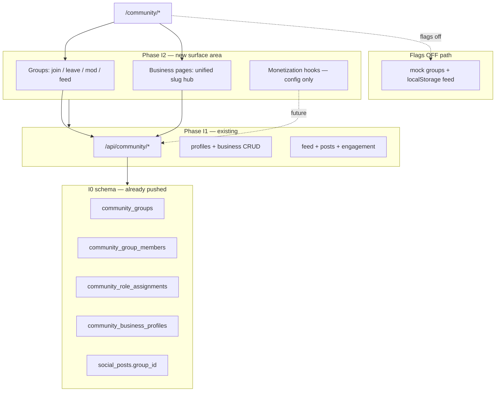
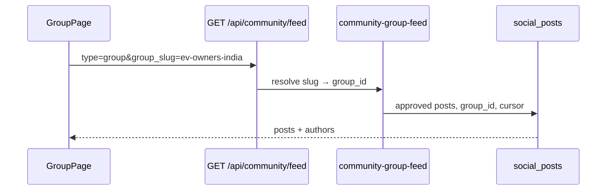
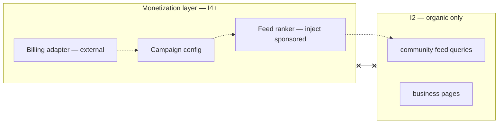

# Phase I2 — Community Groups + Business Pages (architecture review)

**Status:** ⏸ **Review only** — no implementation, no `db push`, no Prisma edits unless separately approved.

**Builds on:** [PHASE-I0-FOUNDATION.md](./PHASE-I0-FOUNDATION.md) · [PHASE-I1-APPLIED-RESULTS.md](./PHASE-I1-APPLIED-RESULTS.md) · [PHASE-I1-PLAN.md](./PHASE-I1-PLAN.md)

**Constraints (unchanged):** Additive only · no dealer/broker/auction/finance/insurance module edits · `social_posts` canonical · `community_posts` legacy/frozen.

Reply **Approve I2** to implement APIs + UI wiring. Reply **Approve I2 db push** only if optional schema deltas in §2 are included.

---

## 1. Architecture

### 1.1 Domain boundary

I2 extends the **community bounded context** only. Groups and business pages are **presentation + membership + scoped feeds** on top of I0 tables and I1 REST APIs. No writes to CRM, broker OS, auctions, finance, or insurance tables.



### 1.2 Group taxonomy (9 categories)

I2 treats **group category** as a first-class discriminator on `community_groups`, separate from **visibility** (public vs private).

| User-facing category | Recommended `group_type` | `rule_key` / `rule_value` (optional) | Notes |
|---------------------|--------------------------|--------------------------------------|-------|
| **Public Groups** | `open` | — | Anyone can read feed; join may still require login |
| **Private Groups** | `private` | `visibility` / `private` | Join via invite or approval (I2b) |
| **Dealer Groups** | `dealer` | `entity_type` / `dealer` | Optional `dealer_id` or `metadata.business_slug` — display only |
| **Broker Groups** | `broker` | `entity_type` / `broker` | Same pattern; no broker CRM writes |
| **DSA Groups** | `dsa` | `entity_type` / `dsa` | Finance persona groups; no finance app writes |
| **Insurance Groups** | `insurance` | `entity_type` / `insurance_agent` | No insurance module writes |
| **EV Groups** | `vehicle_topic` | `topic` / `ev` | Topic hub (existing I0 pattern) |
| **Auto Parts Groups** | `parts` | `entity_type` / `parts_seller` | Parts community, not parts ERP |
| **Service & Workshop Groups** | `workshop` | `entity_type` / `workshop` | Service partner community |

**Existing I0 values** (`city`, `trending`, `influencer`) remain valid for discovery rails; I2 does not remove them.

**Visibility model (logical):**

| Mode | Read feed | Join | Post |
|------|-----------|------|------|
| Public | Anonymous or auth | Auth + `POST …/join` | Member or open-post policy |
| Private | Members only | Invite / request / owner approve | Members only |

Default I2 implementation: store `visibility: "public" | "private"` in `community_groups.metadata` (no migration). Optional column in §2.2 if product wants DB-level enforcement.

### 1.3 Group features → data mapping

| Feature | I2 behavior | Primary storage (I0/I1) |
|---------|-------------|-------------------------|
| **Join group** | Idempotent membership create | `community_group_members` |
| **Leave group** | Delete membership row | `community_group_members` |
| **Group feed** | `GET feed?type=group&group_slug=` or `group_id=` | `social_posts` where `group_id` set |
| **Group moderators** | `role = group_moderator` on member | `community_group_members.role` |
| **Group admins** | `role = admin` or `group_owner` | `community_group_members.role` + optional `community_role_assignments` |
| **Group rules** | Markdown/text rules shown on group page | `metadata.rules` (+ legacy `rule_key` / `rule_value` for auto-groups) |
| **Group cover image** | Header hero | `community_groups.cover_url` (exists) |

**Role hierarchy (enforced in service layer):**

```
group_owner > admin > group_moderator > member
```

Platform super-admins use existing `admin` / `super_admin` JWT roles for override only — not stored in group membership.

### 1.4 Business pages architecture

I1 already exposes **business profiles** (`community_business_profiles`) with follow via `community_follows`. I2 is the **unified product surface** for all seven entity types on one route and one page template.

| Entity | `entity_type` | I2 page | CRM link |
|--------|---------------|---------|----------|
| Dealer | `dealer` | `/community/business/:slug` | `entity_id` optional UUID — read-only |
| Broker | `broker` | same | same |
| DSA | `dsa` | same | same |
| Insurance Agent | `insurance_agent` | same | same |
| Workshop | `workshop` | same | same |
| Parts Seller | `parts_seller` | same | same |
| Influencer | `influencer` | same | same |

| Feature | I2 delivery |
|---------|-------------|
| **Business profile** | `GET /api/community/business/:slug` (I1) + richer UI |
| **Follow business** | `POST/DELETE /api/community/follow` (I1) |
| **Business feed** | `GET /api/community/feed?type=business&business_slug=` (I1) |
| **Contact details** | `phone`, `city`, `state` on profile; optional `metadata.contact_email`, `metadata.hours` |
| **Website** | `website` column |
| **Social links** | `metadata.social_links` JSON |
| **Verification badge** | `is_verified` + optional `metadata.verification_tier` (`standard` / `premium`) |

**Route consolidation (additive):**

| Existing route | I2 action |
|----------------|-----------|
| `/community/dealers/:slug` | **Keep** — redirect or thin wrapper → `/community/business/:slug` |
| `/community/u/:userId` | **Keep** — user/influencer profile |
| **New** `/community/business/:slug` | Canonical business hub (all entity types) |

No changes to `/dashboard/dealer`, broker CRM, etc.

### 1.5 Service layering (implementation phase — not in this review)

| Layer | New / extended in I2 |
|-------|----------------------|
| `lib/community/guard.ts` | Flags: `groups`, `groupModeration`, `businessPages` |
| `services/community-group.service.ts` | **NEW** — CRUD (admin), join/leave, member roles, rules |
| `services/community-group-feed.service.ts` | **NEW** — wraps feed query by `group_id` |
| `services/community-business-page.service.ts` | **NEW** — aggregates profile + feed + follow state (read model) |
| `services/community-profile.service.ts` | Extend — link business page to optional `entity_id` |
| `app/api/community/groups/**` | **NEW** route tree |
| `features/community/pages/CommunityBusinessPage.tsx` | **NEW** unified template |
| `features/community/pages/CommunityGroupPage.tsx` | Wire to APIs when flagged |

### 1.6 Feed composition



Posting to a group: `POST /api/community/posts` with `group_id` (I1 body already supports `group_id`). I2 adds **membership gate** for private groups before accept.

---

## 2. Prisma impact

### 2.1 Already in DB (I0 push) — sufficient for core I2

| Model / table | I2 use |
|---------------|--------|
| `community_groups` | Categories, cover, rules metadata, dealer tag |
| `community_group_members` | Join/leave, roles |
| `community_role_assignments` | Extra mod grants, audit |
| `social_posts.group_id` | Group feed |
| `community_business_profiles` | Business pages |
| `community_follows` | Follow business |

**Default I2 stance:** **zero Prisma changes** — use `metadata` JSON for visibility, rules text, join policy, monetization placeholders.

### 2.2 Optional schema deltas (require **Approve I2 db push**)

| Change | Required for I2? | Recommendation |
|--------|------------------|----------------|
| `CommunityGroup.visibility` ENUM (`public`, `private`) | Nice-to-have | Use `metadata.visibility` first |
| `CommunityGroup.ownerUserId` | Nice-to-have | `metadata.owner_user_id` until formal owner column |
| `CommunityGroup.businessProfileId` | Optional | Link official business page to official group |
| `CommunityGroup.rules` TEXT | Nice-to-have | `metadata.rules` |
| `CommunityGroupJoinRequest` table | For private approve-flow | Defer to **I2b** if metadata queue is enough |
| `CommunityBusinessProfile.description` TEXT | Nice-to-have | Keep `tagline` as API description (I1) |
| `CommunityBusinessProfile.verificationTier` | For badge tiers | `metadata.verification_tier` |
| `CommunityBusinessProfile.featuredUntil` | Monetization | `metadata.featured_until` until billing phase |
| Monetization tables (§6) | **No** for I2 | I4+ only |

### 2.3 Counter / denormalization (application layer — unchanged)

| Counter | Updated on |
|---------|------------|
| `community_groups.member_count` | join / leave (transaction) |
| `community_business_profiles.follower_count` | follow / unfollow (I1) |
| Post counts | create post in group (author `post_count`) |

### 2.4 What I2 does **not** touch

- `dealers`, `brokers`, `finance_*`, `insurance_*`, `auctions`, `leads`, `crm_tasks`
- `community_posts` (legacy)
- Prisma models outside community domain

---

## 3. API design

All routes return **404** when the relevant flag is off. Master flag **`FEATURE_COMMUNITY_V2`** still required (same as I1).

### 3.1 Groups

| Method | Path | Flag | Description |
|--------|------|------|-------------|
| GET | `/api/community/groups` | `FEATURE_COMMUNITY_GROUPS` | List/discover: `?category=dealer\|broker\|…&visibility=public&cursor=` |
| GET | `/api/community/groups/:slug` | same | Group detail + rules + cover + member_count |
| POST | `/api/community/groups` | same + `FEATURE_COMMUNITY_GROUP_CREATE` (optional) | Create group (owner becomes `group_owner`) — admin/platform or verified business |
| PATCH | `/api/community/groups/:slug` | same | Update name, description, cover, rules (owner/admin) |
| POST | `/api/community/groups/:slug/join` | same | Join (or create join request if private) |
| DELETE | `/api/community/groups/:slug/join` | same | Leave |
| GET | `/api/community/groups/:slug/members` | same | Paginated members; `?role=moderator` filter |
| GET | `/api/community/groups/:slug/feed` | `FEATURE_COMMUNITY_GROUP_FEED` | Alias of feed with `group_id` resolved |
| POST | `/api/community/groups/:slug/members/:userId/role` | `FEATURE_COMMUNITY_GROUP_MODERATION` | Promote/demote mod/admin (owner only) |

**List query params:**

```
category=open|private|dealer|broker|dsa|insurance|ev|parts|workshop
visibility=public|private
q=search
limit=20
cursor=
```

**Join response (private with approval):**

```json
{ "status": "pending", "request_id": "uuid" }
```

### 3.2 Group feed (reuse I1)

Prefer **one feed endpoint** to avoid duplication:

| Method | Path | Notes |
|--------|------|-------|
| GET | `/api/community/feed?type=group&group_slug=:slug` | Extend I1 `community-feed.service` |

Optional convenience alias: `GET /api/community/groups/:slug/feed` → internal redirect to above.

### 3.3 Business pages (extend I1)

| Method | Path | Flag | Description |
|--------|------|------|-------------|
| GET | `/api/community/business/:slug` | `FEATURE_COMMUNITY_BUSINESS_PROFILES` | Full page DTO: profile + `is_following` + stats |
| GET | `/api/community/business/:slug/feed` | `FEATURE_COMMUNITY_BUSINESS_PAGES` | Alias: `feed?type=business&business_slug=` |
| GET | `/api/community/business/by-entity?entity_type=&entity_id=` | `FEATURE_COMMUNITY_BUSINESS_PAGES` | Resolve slug from CRM entity id (read-only lookup) |

**Business page DTO (I2 aggregate):**

```json
{
  "profile": {
    "slug": "acme-motors",
    "name": "Acme Motors",
    "entity_type": "dealer",
    "description": "from tagline",
    "logo_url": "...",
    "cover_url": "...",
    "website": "...",
    "phone": "...",
    "city": "...",
    "state": "...",
    "social_links": {},
    "is_verified": true,
    "verification_tier": "standard",
    "follower_count": 1200
  },
  "viewer": {
    "is_following": false,
    "can_post": false
  }
}
```

### 3.4 Posts in groups (I1 + I2 gate)

| Method | Path | I2 addition |
|--------|------|-------------|
| POST | `/api/community/posts` | Reject if `group_id` set and user not member (private/public rules) |

### 3.5 Not in I2 (deferred)

- Poll vote API, full moderation queue UI, group invite links, email notifications
- Paid featured placement execution (see §6)
- Auto-provision CRM org → business profile (manual or admin script only)

---

## 4. Route structure

### 4.1 Backend (`backend/src/app/api/community/`)

```
community/
├── profile/          # I1 — unchanged
├── business/         # I1 — extend aggregate GET
├── feed/             # I1 — extend type=group
├── posts/            # I1 — add group membership guard
├── follow/           # I1 — unchanged
└── groups/           # I2 — NEW
    ├── route.ts                    GET list, POST create
    └── [slug]/
        ├── route.ts                GET, PATCH
        ├── join/route.ts           POST, DELETE
        ├── feed/route.ts           GET (optional alias)
        └── members/
            ├── route.ts            GET list
            └── [userId]/
                └── role/route.ts   POST (moderation)
```

### 4.2 Frontend (`frontend/src/router/index.tsx`)

**Additive only** — existing paths preserved.

| Path | Component | Notes |
|------|-----------|-------|
| `/community` | `CommunityFeedPage` | Unchanged |
| `/community/groups` | `CommunityGroupsPage` | Category filters (I2) |
| `/community/groups/:slug` | `CommunityGroupPage` | Join/leave, rules, cover, group feed |
| `/community/business/:slug` | `CommunityBusinessPage` | **NEW** — all entity types |
| `/community/dealers/:slug` | `CommunityDealerPage` | **Keep** → redirect to business page |
| `/community/u/:userId` | `CommunityInfluencerPage` | Unchanged |
| `/community/post/:id` | `CommunityPostPage` | Unchanged |

### 4.3 Navigation / discovery UX (logical)

- **Groups hub:** tabs — All · Dealer · Broker · DSA · Insurance · EV · Parts · Workshop · My groups
- **Business directory (optional I2c):** `/community/business` index by `entity_type` — mock until flag on

---

## 5. Feature flags

Add to `backend/src/config/feature-flags.ts` and `frontend/src/config/feature-flags.ts` (all **default false**). Do not enable until staging sign-off.

| Backend | Frontend | Scope |
|---------|----------|-------|
| `FEATURE_COMMUNITY_V2` | `VITE_FEATURE_COMMUNITY_V2` | Master (I1) |
| `FEATURE_COMMUNITY_GROUPS` | `VITE_FEATURE_COMMUNITY_GROUPS` | List/detail/join/leave |
| `FEATURE_COMMUNITY_GROUP_FEED` | `VITE_FEATURE_COMMUNITY_GROUP_FEED` | Group-scoped feed |
| `FEATURE_COMMUNITY_GROUP_MODERATION` | `VITE_FEATURE_COMMUNITY_GROUP_MODERATION` | Role promote/demote, hide post in group |
| `FEATURE_COMMUNITY_GROUP_CREATE` | `VITE_FEATURE_COMMUNITY_GROUP_CREATE` | User-created groups (optional gate) |
| `FEATURE_COMMUNITY_BUSINESS_PAGES` | `VITE_FEATURE_COMMUNITY_BUSINESS_PAGES` | Unified business UI + aggregate API |
| `FEATURE_COMMUNITY_BUSINESS_DIRECTORY` | `VITE_FEATURE_COMMUNITY_BUSINESS_DIRECTORY` | Optional browse-by-type index |

**I1 flags remain** (`PROFILES`, `BUSINESS_PROFILES`, `FEED`, `POSTS`, `FOLLOW`) — business pages need `BUSINESS_PROFILES` + `BUSINESS_PAGES` for full UX.

**Flag-off behavior:** `CommunityGroupPage` / `CommunityGroupsPage` / `CommunityDealerPage` continue using `community.service.ts` mock + localStorage (unchanged).

---

## 6. Monetization design (architecture only — no I2 implementation)

I2 **prepares hooks** in metadata and service interfaces; **no billing, no ad serving, no payment tables** in I2.

### 6.1 Capability map

| Product | Purpose | Data hook (metadata / future table) | Flag (future) |
|---------|---------|-------------------------------------|---------------|
| **Featured Business Pages** | Boost business profile in directory & search | `community_business_profiles.metadata.featured_until`, `featured_rank` | `FEATURE_COMMUNITY_MONETIZATION_FEATURED` |
| **Sponsored Posts** | Promote post in global/group feed | `social_posts.metadata.sponsored`, `campaign_id`, `boost_weight` | `FEATURE_COMMUNITY_MONETIZATION_SPONSORED_POST` |
| **Community Ads** | Banner/native slots in feed sidebar | `community_ad_slots` table (I4) — creative URL, targeting | `FEATURE_COMMUNITY_MONETIZATION_ADS` |
| **Lead Generation Ads** | CTA → Motorcart lead form (not CRM inject) | `metadata.lead_form_id`, impression/click events | `FEATURE_COMMUNITY_MONETIZATION_LEAD_ADS` |
| **Verified Business Subscription** | Recurring verified badge + analytics | `metadata.subscription_status`, `verification_tier=premium` | `FEATURE_COMMUNITY_MONETIZATION_VERIFIED_SUB` |

### 6.2 Logical architecture (future phases)



**Hard rules:**

- Sponsored content **must** be labeled in API (`is_sponsored: true`) and UI.
- Lead ads create **`leads`** only via existing public lead API when explicitly enabled — never auto-write dealer CRM pipelines from community.
- Ad targeting uses **community personas** and `entity_type`, not finance/insurance underwriting data.

### 6.3 Future tables (I4+ — not I2)

| Table | Role |
|-------|------|
| `community_ad_campaigns` | Budget, dates, status |
| `community_ad_creatives` | Image/copy/CTA |
| `community_ad_impressions` | Analytics |
| `community_business_subscriptions` | Verified tier, renewal |

### 6.4 Feed ranking (design note)

Organic I2 feed: `created_at DESC`.  
Future monetized feed: `score = organic_weight + sponsored_boost`, with cap (e.g. max 1 sponsored per 10 items).

---

## 7. Rollback plan

| Level | Action |
|-------|--------|
| **Runtime** | All `FEATURE_COMMUNITY_*` / `VITE_*` false → groups/business pages revert to mock/localStorage; I1 APIs stay 404 |
| **Partial I2** | Disable only `FEATURE_COMMUNITY_GROUPS` → group APIs 404; business pages still mock unless `BUSINESS_PAGES` on |
| **Code** | Revert I2 branch; I0/I1 schema and routes remain |
| **DB** | If optional §2.2 applied, restore pre-I2 backup; if metadata-only I2, no DB rollback needed |
| **Routes** | `/community/dealers/:slug` kept — removing I2 redirect does not break bookmarks |

Backup reference (I0): `backend/backups/motorcart-pre-i0-push-20260604-122652.sql`

---

## 8. Risk analysis

| Risk | Severity | Mitigation |
|------|----------|------------|
| Breaking group UX when flags off | **High** | Strict flag checks; mock path unchanged in `community.service.ts` |
| Private group data leak | **High** | Server-side membership check on feed + post; never rely on UI alone |
| `group_type` string drift | **Med** | Document canonical list; validate in service layer; optional enum later |
| Member count drift | **Med** | Transactional join/leave; reconcile job in I3 |
| Dealer group confused with dealer CRM | **High** | `dealer_id` on group is tag only; no FK enforcement to `dealers` |
| Broker/finance cross-write | **High** | No imports from broker/finance services in community-group.service |
| Duplicate business profile per entity | **Med** | Unique `(entity_type, entity_id)` when non-null — optional I2 db push |
| Moderation abuse | **Med** | Only `group_owner` assigns mods; audit via `community_role_assignments` |
| Monetization scope creep in I2 | **Med** | This review explicitly defers billing/ads to I4; metadata hooks only |
| Route churn | **Med** | Add `/community/business/:slug`; keep dealer alias |
| Sponsored content trust | **High** (future) | Label + admin approval + frequency cap |
| Lead ads → CRM pollution | **High** (future) | Separate lead source `community_ad`; dealer CRM unchanged until product approves bridge |

---

## 9. Implementation phases (after approval — not started)

| Step | Deliverable |
|------|-------------|
| **I2a** | Group APIs: list, detail, join, leave, member list |
| **I2b** | Private groups: join requests (metadata or table) |
| **I2c** | Group feed extension + post membership guard |
| **I2d** | Unified `CommunityBusinessPage` + aggregate API |
| **I2e** | Frontend wiring behind flags; dealer route alias |
| **I2f** | Smoke tests (flags off unchanged) |

**No `db push`** unless §2.2 approved as **Approve I2 db push**.

---

## Approval gates

| Gate | Action |
|------|--------|
| **Approve I2** | Implement §3 APIs + §4 routes + UI wiring (metadata-first schema) |
| **Approve I2 db push** | Apply §2.2 optional columns/tables only |
| **Approve I4** (future) | Monetization tables + billing integration |

**Wait for approval before any implementation or `db push`.**
