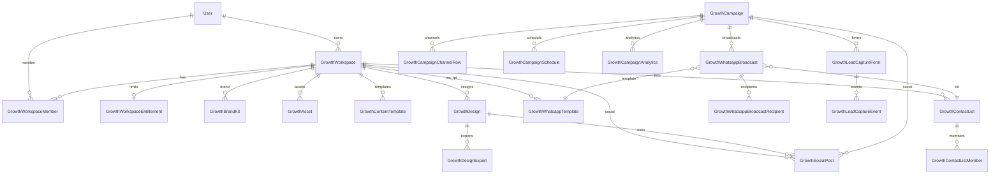

# Phase J — Schema diff & pre-`db push` review (approval gate)

**Date:** 2026-06-04  
**Status:** ✅ **J0 schema design approved** · ⏸ not applied to `backend/prisma/schema.prisma` · no `db push` · see [PHASE-J0-MVP-OPTIMIZATION.md](./PHASE-J0-MVP-OPTIMIZATION.md) for MVP subset (14 tables)

**Parent:** [PHASE-J0-PLAN.md](./PHASE-J0-PLAN.md) (architecture approved)

**Scope:** Proposed `growth_*` MySQL tables + Prisma models for Growth CRM foundation. Does **not** modify dealer/broker/auction/finance/insurance/community models or `broker_whatsapp_*`.

Reply **Approve J0 MVP db push** (14 tables) or **Approve J0 full db push** (26 tables) to apply to Prisma + MySQL.

---

## Summary

| Metric | Count |
|--------|------:|
| New enums | 14 |
| New models (`growth_*`) | 26 |
| `User` relation lines (additive) | 1 block |
| Tables touched outside Growth | **0** |
| Estimated new rows at push | 0 (empty tables) |

---

## 1. Proposed Prisma models (full reference)

> Copy-paste block for reviewers — **do not merge** until **Approve J0 db push**.

### 1.1 Enums (14)

See §3 for enum rationale. Full definitions:

```prisma
// --- Phase J0: Growth CRM (isolated domain) ---

enum GrowthBusinessType {
  dealer
  broker
  dsa
  insurance_agent
  workshop
  parts_seller
  influencer
}

enum GrowthWorkspaceRole {
  owner
  admin
  editor
  viewer
}

enum GrowthWorkspaceStatus {
  active
  suspended
  archived
}

enum GrowthAssetKind {
  image
  video
  logo
  document
}

enum GrowthContentCategory {
  vehicle
  finance
  insurance
  service
  parts
  general
}

enum GrowthDesignFormat {
  facebook_post
  instagram_post
  instagram_story
  linkedin_post
  banner
  poster
}

enum GrowthDesignStatus {
  draft
  ready
  archived
}

enum GrowthSocialPostStatus {
  draft
  scheduled
  published
  failed
  cancelled
}

enum GrowthWhatsappTemplateStatus {
  draft
  pending_approval
  approved
  rejected
}

enum GrowthBroadcastStatus {
  draft
  scheduled
  sending
  completed
  failed
  cancelled
}

enum GrowthDeliveryStatus {
  queued
  sent
  delivered
  read
  failed
  opted_out
}

enum GrowthCampaignStatus {
  draft
  scheduled
  active
  paused
  completed
  cancelled
}

enum GrowthCampaignChannel {
  whatsapp
  facebook
  instagram
  linkedin
  offline
}

enum GrowthLeadCaptureStatus {
  new
  qualified
  bridged
  spam
  archived
}
```

---

### 1.2 A — Growth workspaces (multi-business)

```prisma
model GrowthWorkspace {
  id                   String                @id @default(uuid())
  ownerUserId          String                @map("owner_user_id")
  businessType         GrowthBusinessType    @map("business_type")
  name                 String                @db.VarChar(128)
  slug                 String                @unique @db.VarChar(64)
  entityId             String?               @map("entity_id")
  subscriptionPlanSlug String?               @map("subscription_plan_slug") @db.VarChar(64)
  subscriptionTier     String                @default("growth_lite") @map("subscription_tier") @db.VarChar(32)
  status               GrowthWorkspaceStatus @default(active)
  metadata             Json                  @default("{}")
  createdAt            DateTime              @default(now()) @map("created_at")
  updatedAt            DateTime              @updatedAt @map("updated_at")

  owner                User                  @relation("GrowthWorkspaceOwner", fields: [ownerUserId], references: [id], onDelete: Cascade)
  members              GrowthWorkspaceMember[]
  brandKits            GrowthBrandKit[]
  entitlements         GrowthWorkspaceEntitlement?
  assets               GrowthAsset[]
  assetFolders         GrowthAssetFolder[]
  contentTemplates     GrowthContentTemplate[]
  designs              GrowthDesign[]
  socialPosts          GrowthSocialPost[]
  whatsappTemplates    GrowthWhatsappTemplate[]
  contactLists         GrowthContactList[]
  whatsappBroadcasts   GrowthWhatsappBroadcast[]
  campaigns            GrowthCampaign[]
  leadForms            GrowthLeadCaptureForm[]
  messageLogs          GrowthMessageLog[]
  providerConnections  GrowthProviderConnection[]

  @@index([ownerUserId])
  @@index([businessType])
  @@index([entityId])
  @@map("growth_workspaces")
}

model GrowthWorkspaceMember {
  id          String              @id @default(uuid())
  workspaceId String              @map("workspace_id")
  userId      String              @map("user_id")
  role        GrowthWorkspaceRole @default(editor)
  invitedBy   String?             @map("invited_by")
  joinedAt    DateTime            @default(now()) @map("joined_at")

  workspace   GrowthWorkspace     @relation(fields: [workspaceId], references: [id], onDelete: Cascade)
  user        User                @relation(fields: [userId], references: [id], onDelete: Cascade)

  @@unique([workspaceId, userId])
  @@index([userId])
  @@map("growth_workspace_members")
}

model GrowthWorkspaceEntitlement {
  id                 String   @id @default(uuid())
  workspaceId        String   @unique @map("workspace_id")
  planSlug           String?  @map("plan_slug") @db.VarChar(64)
  limits             Json     @default("{}")
  usage              Json     @default("{}")
  refreshedAt        DateTime @default(now()) @map("refreshed_at")
  trialEndsAt        DateTime? @map("trial_ends_at")

  workspace          GrowthWorkspace @relation(fields: [workspaceId], references: [id], onDelete: Cascade)

  @@map("growth_workspace_entitlements")
}
```

**Workspace type mapping (application, not DB):**

| UI label | `GrowthBusinessType` |
|----------|----------------------|
| Dealer Workspace | `dealer` |
| Broker Workspace | `broker` |
| DSA Workspace | `dsa` |
| Insurance Workspace | `insurance_agent` |
| Workshop Workspace | `workshop` |
| Parts Workspace | `parts_seller` |
| Influencer Workspace | `influencer` |

`entityId` is optional UUID/string — **no FK** to `dealers`, `brokers`, etc.

---

### 1.3 B — Asset management

```prisma
model GrowthBrandKit {
  id          String   @id @default(uuid())
  workspaceId String   @map("workspace_id")
  name        String   @db.VarChar(128)
  primaryColor String? @map("primary_color") @db.VarChar(16)
  secondaryColor String? @map("secondary_color") @db.VarChar(16)
  fontPrimary String?  @map("font_primary") @db.VarChar(64)
  fontSecondary String? @map("font_secondary") @db.VarChar(64)
  logoAssetId String?  @map("logo_asset_id")
  guidelines  Json     @default("{}")
  metadata    Json     @default("{}")
  createdAt   DateTime @default(now()) @map("created_at")
  updatedAt   DateTime @updatedAt @map("updated_at")

  workspace   GrowthWorkspace @relation(fields: [workspaceId], references: [id], onDelete: Cascade)

  @@index([workspaceId])
  @@map("growth_brand_kits")
}

model GrowthAssetFolder {
  id          String   @id @default(uuid())
  workspaceId String   @map("workspace_id")
  parentId    String?  @map("parent_id")
  name        String   @db.VarChar(128)
  createdAt   DateTime @default(now()) @map("created_at")

  workspace   GrowthWorkspace @relation(fields: [workspaceId], references: [id], onDelete: Cascade)
  parent      GrowthAssetFolder? @relation("FolderTree", fields: [parentId], references: [id], onDelete: Cascade)
  children    GrowthAssetFolder[] @relation("FolderTree")
  assets      GrowthAsset[]

  @@index([workspaceId, parentId])
  @@map("growth_asset_folders")
}

model GrowthAsset {
  id          String          @id @default(uuid())
  workspaceId String          @map("workspace_id")
  folderId    String?         @map("folder_id")
  kind        GrowthAssetKind
  name        String          @db.VarChar(255)
  storagePath String          @map("storage_path") @db.VarChar(512)
  publicUrl   String          @map("public_url") @db.VarChar(512)
  mimeType    String?         @map("mime_type") @db.VarChar(128)
  sizeBytes   Int?            @map("size_bytes")
  width       Int?
  height      Int?
  durationSec Int?            @map("duration_sec")
  tags        Json            @default("[]")
  metadata    Json            @default("{}")
  deletedAt   DateTime?       @map("deleted_at")
  createdAt   DateTime        @default(now()) @map("created_at")
  updatedAt   DateTime        @updatedAt @map("updated_at")

  workspace   GrowthWorkspace @relation(fields: [workspaceId], references: [id], onDelete: Cascade)
  folder      GrowthAssetFolder? @relation(fields: [folderId], references: [id], onDelete: SetNull)

  @@index([workspaceId, kind])
  @@index([workspaceId, createdAt])
  @@index([folderId])
  @@map("growth_assets")
}
```

Default brand kit: `growth_brand_kits.metadata.is_default = true` (one per workspace).

---

### 1.4 C — Content library

```prisma
model GrowthContentTemplate {
  id               String                @id @default(uuid())
  workspaceId      String?               @map("workspace_id")
  sourceTemplateId String?               @map("source_template_id")
  category         GrowthContentCategory
  name             String                @db.VarChar(128)
  description      String?               @db.Text
  thumbnailUrl     String?               @map("thumbnail_url") @db.VarChar(512)
  isPlatform       Boolean               @default(false) @map("is_platform")
  isPublished      Boolean               @default(true) @map("is_published")
  metadata         Json                  @default("{}")
  createdAt        DateTime              @default(now()) @map("created_at")
  updatedAt        DateTime              @updatedAt @map("updated_at")

  workspace        GrowthWorkspace?      @relation(fields: [workspaceId], references: [id], onDelete: Cascade)
  sourceTemplate   GrowthContentTemplate? @relation("TemplateClone", fields: [sourceTemplateId], references: [id], onDelete: SetNull)
  clones           GrowthContentTemplate[] @relation("TemplateClone")
  versions         GrowthContentTemplateVersion[]

  @@index([category, isPlatform])
  @@index([workspaceId])
  @@map("growth_content_templates")
}

model GrowthContentTemplateVersion {
  id              String   @id @default(uuid())
  templateId      String   @map("template_id")
  version         Int      @default(1)
  canvasJson      Json     @map("canvas_json")
  variablesSchema Json     @default("[]") @map("variables_schema")
  createdAt       DateTime @default(now()) @map("created_at")

  template        GrowthContentTemplate @relation(fields: [templateId], references: [id], onDelete: Cascade)

  @@unique([templateId, version])
  @@map("growth_content_template_versions")
}
```

| Category enum | Template pack |
|---------------|---------------|
| `vehicle` | Vehicle Templates |
| `finance` | Finance Templates |
| `insurance` | Insurance Templates |
| `service` | Service Templates |
| `parts` | Parts Templates |
| `general` | Cross-vertical |

---

### 1.5 D — Social builder (post / banner / poster drafts)

```prisma
model GrowthDesign {
  id              String             @id @default(uuid())
  workspaceId     String             @map("workspace_id")
  templateId      String?            @map("template_id")
  name            String             @db.VarChar(128)
  format          GrowthDesignFormat
  status          GrowthDesignStatus @default(draft)
  canvasJson      Json               @map("canvas_json")
  width           Int                @default(1080)
  height          Int                @default(1080)
  metadata        Json               @default("{}")
  createdAt       DateTime           @default(now()) @map("created_at")
  updatedAt       DateTime           @updatedAt @map("updated_at")

  workspace       GrowthWorkspace    @relation(fields: [workspaceId], references: [id], onDelete: Cascade)
  exports         GrowthDesignExport[]
  socialPosts     GrowthSocialPost[]

  @@index([workspaceId, format])
  @@index([workspaceId, status])
  @@map("growth_designs")
}

model GrowthDesignExport {
  id         String   @id @default(uuid())
  designId   String   @map("design_id")
  format     String   @default("png") @db.VarChar(8)
  publicUrl  String   @map("public_url") @db.VarChar(512)
  width      Int
  height     Int
  sizeBytes  Int?     @map("size_bytes")
  createdAt  DateTime @default(now()) @map("created_at")

  design     GrowthDesign @relation(fields: [designId], references: [id], onDelete: Cascade)

  @@index([designId])
  @@map("growth_design_exports")
}

model GrowthSocialPost {
  id          String                 @id @default(uuid())
  workspaceId String                 @map("workspace_id")
  designId    String?                @map("design_id")
  campaignId  String?                @map("campaign_id")
  channel     GrowthCampaignChannel
  caption     String?                @db.Text
  status      GrowthSocialPostStatus @default(draft)
  scheduleAt  DateTime?              @map("schedule_at")
  publishedAt DateTime?              @map("published_at")
  metadata    Json                   @default("{}")
  createdAt   DateTime               @default(now()) @map("created_at")
  updatedAt   DateTime               @updatedAt @map("updated_at")

  workspace   GrowthWorkspace        @relation(fields: [workspaceId], references: [id], onDelete: Cascade)
  design      GrowthDesign?          @relation(fields: [designId], references: [id], onDelete: SetNull)
  campaign    GrowthCampaign?        @relation(fields: [campaignId], references: [id], onDelete: SetNull)
  targets     GrowthSocialPostTarget[]

  @@index([workspaceId, status])
  @@index([scheduleAt])
  @@map("growth_social_posts")
}

model GrowthSocialPostTarget {
  id            String   @id @default(uuid())
  socialPostId  String   @map("social_post_id")
  externalId    String?  @map("external_id") @db.VarChar(128)
  provider      String?  @db.VarChar(32)
  status        String   @default("pending") @db.VarChar(24)
  metadata      Json     @default("{}")
  createdAt     DateTime @default(now()) @map("created_at")

  socialPost    GrowthSocialPost @relation(fields: [socialPostId], references: [id], onDelete: Cascade)

  @@index([socialPostId])
  @@map("growth_social_post_targets")
}
```

**Format → draft type:**

| Product | `GrowthDesignFormat` |
|---------|----------------------|
| Post drafts (FB/IG/LinkedIn) | `facebook_post`, `instagram_post`, `linkedin_post`, `instagram_story` |
| Banner drafts | `banner` |
| Poster drafts | `poster` |

---

### 1.6 E — WhatsApp marketing

```prisma
model GrowthWhatsappTemplate {
  id                 String                       @id @default(uuid())
  workspaceId        String                       @map("workspace_id")
  templateKey        String                       @map("template_key") @db.VarChar(64)
  name               String                       @db.VarChar(128)
  category           String                       @default("marketing") @db.VarChar(32)
  body               String                       @db.Text
  language           String                       @default("en") @db.VarChar(8)
  variablesSchema    Json                         @default("[]") @map("variables_schema")
  providerTemplateId String?                      @map("provider_template_id") @db.VarChar(64)
  status             GrowthWhatsappTemplateStatus @default(draft)
  metadata           Json                         @default("{}")
  createdAt          DateTime                     @default(now()) @map("created_at")
  updatedAt          DateTime                     @updatedAt @map("updated_at")

  workspace          GrowthWorkspace              @relation(fields: [workspaceId], references: [id], onDelete: Cascade)
  broadcasts         GrowthWhatsappBroadcast[]

  @@unique([workspaceId, templateKey])
  @@index([workspaceId, status])
  @@map("growth_whatsapp_templates")
}

model GrowthContactList {
  id          String   @id @default(uuid())
  workspaceId String   @map("workspace_id")
  name        String   @db.VarChar(128)
  description String?  @db.Text
  isDynamic   Boolean  @default(false) @map("is_dynamic")
  metadata    Json     @default("{}")
  createdAt   DateTime @default(now()) @map("created_at")
  updatedAt   DateTime @updatedAt @map("updated_at")

  workspace   GrowthWorkspace @relation(fields: [workspaceId], references: [id], onDelete: Cascade)
  members     GrowthContactListMember[]
  broadcasts  GrowthWhatsappBroadcast[]

  @@index([workspaceId])
  @@map("growth_contact_lists")
}

model GrowthContactListMember {
  id        String    @id @default(uuid())
  listId    String    @map("list_id")
  phone     String    @db.VarChar(20)
  fullName  String?   @map("full_name") @db.VarChar(128)
  optInAt   DateTime? @map("opt_in_at")
  optOutAt  DateTime? @map("opt_out_at")
  metadata  Json      @default("{}")
  createdAt DateTime  @default(now()) @map("created_at")

  list      GrowthContactList @relation(fields: [listId], references: [id], onDelete: Cascade)

  @@unique([listId, phone])
  @@index([phone])
  @@map("growth_contact_list_members")
}

model GrowthWhatsappBroadcast {
  id           String                @id @default(uuid())
  workspaceId  String                @map("workspace_id")
  campaignId   String?               @map("campaign_id")
  templateId   String                @map("template_id")
  listId       String                @map("list_id")
  name         String                @db.VarChar(128)
  status       GrowthBroadcastStatus @default(draft)
  scheduleAt   DateTime?             @map("schedule_at")
  startedAt    DateTime?             @map("started_at")
  completedAt  DateTime?             @map("completed_at")
  metadata     Json                  @default("{}")
  createdAt    DateTime              @default(now()) @map("created_at")
  updatedAt    DateTime              @updatedAt @map("updated_at")

  workspace    GrowthWorkspace       @relation(fields: [workspaceId], references: [id], onDelete: Cascade)
  campaign     GrowthCampaign?       @relation(fields: [campaignId], references: [id], onDelete: SetNull)
  template     GrowthWhatsappTemplate @relation(fields: [templateId], references: [id], onDelete: Restrict)
  list         GrowthContactList     @relation(fields: [listId], references: [id], onDelete: Restrict)
  recipients   GrowthWhatsappBroadcastRecipient[]
  messageLogs  GrowthMessageLog[]

  @@index([workspaceId, status])
  @@index([scheduleAt])
  @@map("growth_whatsapp_broadcasts")
}

model GrowthWhatsappBroadcastRecipient {
  id           String               @id @default(uuid())
  broadcastId  String               @map("broadcast_id")
  phone        String               @db.VarChar(20)
  status       GrowthDeliveryStatus @default(queued)
  lastEventAt  DateTime?            @map("last_event_at")
  metadata     Json                 @default("{}")
  createdAt    DateTime             @default(now()) @map("created_at")

  broadcast    GrowthWhatsappBroadcast @relation(fields: [broadcastId], references: [id], onDelete: Cascade)
  deliveryEvents GrowthDeliveryEvent[]

  @@unique([broadcastId, phone])
  @@index([broadcastId, status])
  @@map("growth_whatsapp_broadcast_recipients")
}

model GrowthMessageLog {
  id           String   @id @default(uuid())
  workspaceId  String   @map("workspace_id")
  broadcastId  String?  @map("broadcast_id")
  channel      String   @default("whatsapp") @db.VarChar(16)
  direction    String   @db.VarChar(8)
  phone        String?  @db.VarChar(20)
  body         String   @db.Text
  status       GrowthDeliveryStatus @default(queued)
  providerId   String?  @map("provider_id") @db.VarChar(128)
  metadata     Json     @default("{}")
  createdAt    DateTime @default(now()) @map("created_at")

  workspace    GrowthWorkspace @relation(fields: [workspaceId], references: [id], onDelete: Cascade)
  broadcast    GrowthWhatsappBroadcast? @relation(fields: [broadcastId], references: [id], onDelete: SetNull)
  deliveryEvents GrowthDeliveryEvent[]

  @@index([workspaceId, createdAt])
  @@index([broadcastId])
  @@map("growth_message_logs")
}

model GrowthDeliveryEvent {
  id            String               @id @default(uuid())
  messageLogId  String?              @map("message_log_id")
  recipientId   String?              @map("recipient_id")
  status        GrowthDeliveryStatus
  providerPayload Json               @default("{}") @map("provider_payload")
  createdAt     DateTime             @default(now()) @map("created_at")

  messageLog    GrowthMessageLog?    @relation(fields: [messageLogId], references: [id], onDelete: Cascade)
  recipient     GrowthWhatsappBroadcastRecipient? @relation(fields: [recipientId], references: [id], onDelete: Cascade)

  @@index([messageLogId])
  @@index([recipientId, createdAt])
  @@map("growth_delivery_events")
}

model GrowthProviderConnection {
  id          String   @id @default(uuid())
  workspaceId String   @map("workspace_id")
  provider    String   @db.VarChar(32)
  isActive    Boolean  @default(false) @map("is_active")
  config      Json     @default("{}")
  createdAt   DateTime @default(now()) @map("created_at")
  updatedAt   DateTime @updatedAt @map("updated_at")

  workspace   GrowthWorkspace @relation(fields: [workspaceId], references: [id], onDelete: Cascade)

  @@unique([workspaceId, provider])
  @@map("growth_provider_connections")
}
```

**Naming:** WhatsApp **campaigns** at send layer = `growth_whatsapp_broadcasts`; parent marketing campaign = `growth_campaigns` (optional FK `campaignId`).

---

### 1.7 F — Campaign manager

```prisma
model GrowthCampaign {
  id          String               @id @default(uuid())
  workspaceId String               @map("workspace_id")
  name        String               @db.VarChar(128)
  goal        String?              @db.VarChar(64)
  status      GrowthCampaignStatus @default(draft)
  startsAt    DateTime?            @map("starts_at")
  endsAt      DateTime?            @map("ends_at")
  metadata    Json                 @default("{}")
  createdAt   DateTime             @default(now()) @map("created_at")
  updatedAt   DateTime             @updatedAt @map("updated_at")

  workspace   GrowthWorkspace      @relation(fields: [workspaceId], references: [id], onDelete: Cascade)
  channels    GrowthCampaignChannelRow[]
  schedules   GrowthCampaignSchedule[]
  analytics   GrowthCampaignAnalytics[]
  socialPosts GrowthSocialPost[]
  broadcasts  GrowthWhatsappBroadcast[]
  leadForms   GrowthLeadCaptureForm[]

  @@index([workspaceId, status])
  @@index([startsAt])
  @@map("growth_campaigns")
}

model GrowthCampaignChannelRow {
  id         String                @id @default(uuid())
  campaignId String                @map("campaign_id")
  channel    GrowthCampaignChannel
  isEnabled  Boolean               @default(true) @map("is_enabled")
  config     Json                  @default("{}")
  createdAt  DateTime              @default(now()) @map("created_at")

  campaign   GrowthCampaign @relation(fields: [campaignId], references: [id], onDelete: Cascade)

  @@unique([campaignId, channel])
  @@map("growth_campaign_channels")
}

model GrowthCampaignSchedule {
  id          String   @id @default(uuid())
  campaignId  String   @map("campaign_id")
  runAt       DateTime @map("run_at")
  timezone    String   @default("Asia/Kolkata") @db.VarChar(64)
  kind        String   @db.VarChar(32)
  payload     Json     @default("{}")
  executedAt  DateTime? @map("executed_at")
  createdAt   DateTime @default(now()) @map("created_at")

  campaign    GrowthCampaign @relation(fields: [campaignId], references: [id], onDelete: Cascade)

  @@index([campaignId, runAt])
  @@index([runAt])
  @@map("growth_campaign_schedules")
}

model GrowthCampaignAnalytics {
  id          String   @id @default(uuid())
  campaignId  String   @map("campaign_id")
  date        DateTime @db.Date
  impressions Int      @default(0)
  clicks      Int      @default(0)
  leads       Int      @default(0)
  spend       Decimal  @default(0) @db.Decimal(12, 2)
  metadata    Json     @default("{}")
  createdAt   DateTime @default(now()) @map("created_at")

  campaign    GrowthCampaign @relation(fields: [campaignId], references: [id], onDelete: Cascade)

  @@unique([campaignId, date])
  @@map("growth_campaign_analytics")
}

model GrowthLeadCaptureForm {
  id          String   @id @default(uuid())
  workspaceId String   @map("workspace_id")
  campaignId  String?  @map("campaign_id")
  name        String   @db.VarChar(128)
  slug        String   @db.VarChar(64)
  fieldsSchema Json    @default("[]") @map("fields_schema")
  thankYouUrl String?  @map("thank_you_url") @db.VarChar(512)
  isActive    Boolean  @default(true) @map("is_active")
  metadata    Json     @default("{}")
  createdAt   DateTime @default(now()) @map("created_at")
  updatedAt   DateTime @updatedAt @map("updated_at")

  workspace   GrowthWorkspace @relation(fields: [workspaceId], references: [id], onDelete: Cascade)
  campaign    GrowthCampaign? @relation(fields: [campaignId], references: [id], onDelete: SetNull)
  events      GrowthLeadCaptureEvent[]

  @@unique([workspaceId, slug])
  @@map("growth_lead_capture_forms")
}

model GrowthLeadCaptureEvent {
  id         String                @id @default(uuid())
  formId     String                @map("form_id")
  status     GrowthLeadCaptureStatus @default(new)
  payload    Json                  @default("{}")
  ipHash     String?               @map("ip_hash") @db.VarChar(64)
  userAgent  String?               @map("user_agent") @db.VarChar(255)
  bridgedLeadId String?            @map("bridged_lead_id")
  createdAt  DateTime              @default(now()) @map("created_at")

  form       GrowthLeadCaptureForm @relation(fields: [formId], references: [id], onDelete: Cascade)

  @@index([formId, createdAt])
  @@index([status])
  @@map("growth_lead_capture_events")
}
```

---

### 1.8 `User` — additive relations only

```diff
 model User {
   ...
+  growthWorkspacesOwned GrowthWorkspace[]       @relation("GrowthWorkspaceOwner")
+  growthWorkspaceMembers GrowthWorkspaceMember[]
 }
```

On `GrowthWorkspace.owner`:

```prisma
  owner User @relation("GrowthWorkspaceOwner", fields: [ownerUserId], references: [id], onDelete: Cascade)
```

**No changes** to `Dealer`, `Broker`, `Lead`, `SocialPost`, `Community*`, `BrokerWhatsApp*`.

---

## 2. Proposed `growth_*` tables (inventory)

| # | MySQL table | Prisma model | Module |
|---|-------------|--------------|--------|
| 1 | `growth_workspaces` | `GrowthWorkspace` | A |
| 2 | `growth_workspace_members` | `GrowthWorkspaceMember` | A |
| 3 | `growth_workspace_entitlements` | `GrowthWorkspaceEntitlement` | A / subscription |
| 4 | `growth_brand_kits` | `GrowthBrandKit` | B |
| 5 | `growth_asset_folders` | `GrowthAssetFolder` | B |
| 6 | `growth_assets` | `GrowthAsset` | B |
| 7 | `growth_content_templates` | `GrowthContentTemplate` | C |
| 8 | `growth_content_template_versions` | `GrowthContentTemplateVersion` | C |
| 9 | `growth_designs` | `GrowthDesign` | D |
| 10 | `growth_design_exports` | `GrowthDesignExport` | D |
| 11 | `growth_social_posts` | `GrowthSocialPost` | D |
| 12 | `growth_social_post_targets` | `GrowthSocialPostTarget` | D |
| 13 | `growth_whatsapp_templates` | `GrowthWhatsappTemplate` | E |
| 14 | `growth_contact_lists` | `GrowthContactList` | E |
| 15 | `growth_contact_list_members` | `GrowthContactListMember` | E |
| 16 | `growth_whatsapp_broadcasts` | `GrowthWhatsappBroadcast` | E |
| 17 | `growth_whatsapp_broadcast_recipients` | `GrowthWhatsappBroadcastRecipient` | E |
| 18 | `growth_message_logs` | `GrowthMessageLog` | E |
| 19 | `growth_delivery_events` | `GrowthDeliveryEvent` | E |
| 20 | `growth_provider_connections` | `GrowthProviderConnection` | E (Meta J4) |
| 21 | `growth_campaigns` | `GrowthCampaign` | F |
| 22 | `growth_campaign_channels` | `GrowthCampaignChannelRow` | F |
| 23 | `growth_campaign_schedules` | `GrowthCampaignSchedule` | F |
| 24 | `growth_campaign_analytics` | `GrowthCampaignAnalytics` | F |
| 25 | `growth_lead_capture_forms` | `GrowthLeadCaptureForm` | F |
| 26 | `growth_lead_capture_events` | `GrowthLeadCaptureEvent` | F |

**Total: 26 tables** (24 domain models + 2 join/child tables counted in channels/recipients).

---

## 3. Enum list (14)

| Enum | Values count | Used by |
|------|-------------:|---------|
| `GrowthBusinessType` | 7 | Workspaces |
| `GrowthWorkspaceRole` | 4 | Members |
| `GrowthWorkspaceStatus` | 3 | Workspaces |
| `GrowthAssetKind` | 4 | Assets |
| `GrowthContentCategory` | 6 | Templates |
| `GrowthDesignFormat` | 6 | Designs / social |
| `GrowthDesignStatus` | 3 | Designs |
| `GrowthSocialPostStatus` | 5 | Social posts |
| `GrowthWhatsappTemplateStatus` | 4 | WA templates |
| `GrowthBroadcastStatus` | 6 | Broadcasts |
| `GrowthDeliveryStatus` | 6 | Recipients / logs |
| `GrowthCampaignStatus` | 6 | Campaigns |
| `GrowthCampaignChannel` | 5 | Channels / social |
| `GrowthLeadCaptureStatus` | 5 | Lead events |

---

## 4. Relationships



**External references (no FK):**

| Field | Points to | Rule |
|-------|-----------|------|
| `growth_workspaces.entity_id` | dealer/broker/etc. UUID | Display + merge fields only |
| `growth_lead_capture_events.bridged_lead_id` | `leads.id` | Set only when `FEATURE_GROWTH_LEAD_BRIDGE` on |

---

## 5. Index strategy

| Pattern | Tables | Purpose |
|---------|--------|---------|
| `(workspace_id, created_at DESC)` | assets, designs, logs, templates | Workspace hub lists |
| `(workspace_id, status)` | campaigns, broadcasts, designs, social_posts | Filtered dashboards |
| `(workspace_id, business_type)` | workspaces | Admin reporting |
| `(schedule_at)` / `(run_at)` | broadcasts, schedules, social_posts | Job runner |
| `(broadcast_id, status)` | recipients | Delivery pipeline |
| `(campaign_id, date)` UNIQUE | analytics | Upsert daily rollup |
| `(list_id, phone)` UNIQUE | contact members | Dedup |
| `(workspace_id, template_key)` UNIQUE | whatsapp templates | Stable keys |
| `(workspace_id, slug)` UNIQUE | workspaces, lead forms | URL routing |
| `(form_id, created_at)` | lead events | Submission inbox |

**Soft delete:** `growth_assets.deleted_at` only (DAM). Other entities use `status` / `archived`.

---

## 6. Storage strategy

### 6.1 Object layout (local / S3-compatible)

```
uploads/
  growth/
    {workspace_id}/
      assets/
        images/{asset_id}.{ext}
        videos/{asset_id}.{ext}
        logos/{asset_id}.{ext}
      exports/
        designs/{design_id}/{export_id}.png
      templates/
        thumbnails/{template_id}.webp
```

### 6.2 DB vs blob

| Data | Store |
|------|--------|
| Canvas / layout | `canvas_json` (MySQL JSON) |
| Rendered creative | `growth_design_exports.public_url` |
| Binary media | Filesystem / object store via `growth_assets.storage_path` |
| Provider secrets | `growth_provider_connections.config` (encrypt at app layer J1) |

### 6.3 Relation to `uploaded_files`

- **J0/J1:** Growth uploads create **`growth_assets`** rows; optional mirror row in `uploaded_files` is **not required**.
- Upload API: `POST /api/upload` with `metadata.scope = "growth"` and `metadata.workspace_id` — registration step in Growth asset service (implementation J1).

### 6.4 Quotas (enforced in app, stored in entitlements)

| Resource | Meter key in `limits` JSON |
|----------|----------------------------|
| Storage | `storage_mb` |
| Assets count | `max_assets` |
| Design exports / mo | `design_exports_monthly` |

---

## 7. Subscription mapping

### 7.1 Sources of truth

| Source | Field | Use |
|--------|-------|-----|
| `subscription_plans` | `features` JSON → `growth` block | Plan limits |
| `growth_workspaces` | `subscription_plan_slug`, `subscription_tier` | Workspace binding |
| `growth_workspace_entitlements` | `limits`, `usage` | Cached enforcement |

### 7.2 Proposed `subscription_plans.features` fragment

```json
{
  "growth": {
    "enabled": true,
    "max_workspaces": 3,
    "max_team_seats": 10,
    "whatsapp_broadcasts_monthly": 5000,
    "design_exports_monthly": 200,
    "storage_mb": 5120,
    "channels": ["whatsapp", "facebook", "instagram", "linkedin"],
    "meta_api": false,
    "lead_bridge": false,
    "premium_templates": true
  }
}
```

### 7.3 Vertical tier mapping (illustrative)

| Existing vertical tier | Default Growth plan slug |
|------------------------|--------------------------|
| `dealers.subscription_tier` = `basic` | `growth_lite` |
| `professional` | `growth_pro` |
| `enterprise` | `growth_enterprise` |

Mapping lives in **application config** (not DB) until billing service exists.

### 7.4 `growth_workspace_entitlements.limits` example

```json
{
  "max_workspaces": 1,
  "max_team_seats": 3,
  "whatsapp_broadcasts_monthly": 500,
  "design_exports_monthly": 50,
  "storage_mb": 1024,
  "channels": ["whatsapp"],
  "meta_api": false,
  "lead_bridge": false
}
```

Refresh triggers: plan change, monthly cron, admin override.

---

## 8. Rollback plan

| Stage | Action |
|-------|--------|
| **Before push** | No Growth tables — nothing to roll back |
| **After push, flags off** | Empty tables; no runtime impact |
| **After push + data** | Export `growth_*` if needed; drop tables in reverse FK order (children first) |
| **Prisma revert** | Remove Growth block from `schema.prisma`; `prisma db push` with team review |
| **Backup** | Take `motorcart-pre-j0-push-YYYYMMDD.sql` immediately before **Approve J0 db push** |
| **Code** | No Growth code in J0 schema phase — N/A |

**Drop order (if ever required):**

1. `growth_lead_capture_events` → forms  
2. `growth_campaign_analytics` → schedules → channels → campaigns  
3. `growth_delivery_events` → message_logs → recipients → broadcasts  
4. contact members → lists → whatsapp templates  
5. social targets → social posts → exports → designs  
6. template versions → content templates  
7. assets → folders → brand kits  
8. members → entitlements → workspaces  

---

## 9. Risk analysis

| Risk | Severity | Mitigation |
|------|----------|------------|
| Schema collision with `broker_whatsapp_*` | **High** | Distinct table prefix; code review bans cross-imports |
| 26 tables operational overhead | **Med** | Phased push acceptable; empty until J1 APIs |
| `GrowthBrandKit` / workspace FK confusion | **Med** | Use workspace-scoped kits only; no dual FK (see §1.3 correction) |
| PII in `growth_contact_list_members` | **High** | opt-in/opt-out columns; retention policy |
| Encrypted tokens in `growth_provider_connections` | **High** | App-layer encryption J4; never log config |
| Lead bridge polluting `leads` | **High** | `bridged_lead_id` nullable; bridge flag off |
| JSON canvas size | **Med** | Limit column size in API; store large assets externally |
| MySQL JSON query perf | **Low** | Index relational columns; don't filter on canvas JSON |
| Duplicate marketing with `engagement_campaigns` | **Med** | Document B2B vs B2C naming in runbooks |
| Subscription drift vs dealer tier | **Med** | Explicit mapping table in config |
| Prisma relation name clash `GrowthCampaignChannel` enum vs model | **Med** | Model named `GrowthCampaignChannelRow` in this diff |

---

## 10. Pre-push checklist (for **Approve J0 db push**)

- [ ] Reviewer confirms **no** edits to forbidden domains  
- [ ] Backup script run on XAMPP MySQL  
- [ ] Stop backend before `prisma generate` if Windows EPERM  
- [ ] `npx prisma validate` after merge  
- [ ] `prisma db push` (no seed required)  
- [ ] `table-map.ts` delegates added in **J1 implementation** (not this doc)  
- [ ] All `FEATURE_GROWTH_*` remain **false**  

---

## Approval

| Gate | Action |
|------|--------|
| **Approve J0 schema** | Accept this diff as the Prisma target |
| **Approve J0 db push** | Merge models into `schema.prisma` + push MySQL |
| **Approve J1** | APIs + `growth-crm` UI (separate gate) |

**No Prisma modifications until **Approve J0 db push**.**
