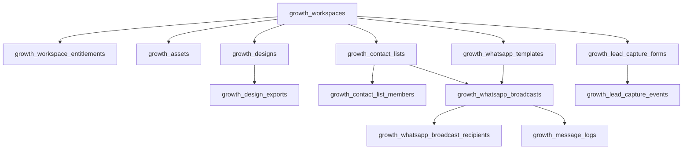

# Phase J0 — MVP schema optimization (architecture review)

**Date:** 2026-06-04  
**Status:** ✅ **J0 schema design approved** · ⏸ no Prisma merge · no `db push` · no implementation

**Inputs:** [PHASE-J0-PLAN.md](./PHASE-J0-PLAN.md) · [PHASE-J-SCHEMA-DIFF.md](./PHASE-J-SCHEMA-DIFF.md) (26 tables)

**Purpose:** Smallest paid-launch schema, workspace table usage, mandatory vs optional, revenue ranking.

---

## Executive summary

| Metric | Full J0 proposal | **Recommended paid MVP** |
|--------|------------------:|-------------------------:|
| Tables | 26 | **14** |
| Enums | 14 | **8** (drop unused until J2+) |
| Savings | — | **−12 tables (−46%)** |

**Key design fact:** All seven workspace types share the **same** `growth_*` tables. `growth_workspaces.business_type` discriminates persona — there are **not** separate dealer vs broker table sets.

---

## 1. Workspace-by-workspace breakdown

### 1.1 Shared core (every workspace type)

| Table | Dealer | Broker | DSA | Insurance | Workshop | Parts | Influencer |
|-------|:------:|:------:|:---:|:---------:|:--------:|:-----:|:----------:|
| `growth_workspaces` | ✓ | ✓ | ✓ | ✓ | ✓ | ✓ | ✓ |
| `growth_workspace_entitlements` | ✓ | ✓ | ✓ | ✓ | ✓ | ✓ | ✓ |

**MVP note:** `growth_workspace_members` is optional at launch if product is **owner-only** (add when selling team seats).

---

### 1.2 A — WhatsApp marketing

| Table | Dealer | Broker | DSA | Insurance | Workshop | Parts | Influencer |
|-------|:------:|:------:|:---:|:---------:|:--------:|:-----:|:----------:|
| `growth_whatsapp_templates` | **✓** | **✓** | **✓** | **✓** | **✓** | **✓** | ○ |
| `growth_contact_lists` | **✓** | **✓** | **✓** | **✓** | **✓** | **✓** | ○ |
| `growth_contact_list_members` | **✓** | **✓** | **✓** | **✓** | **✓** | **✓** | ○ |
| `growth_whatsapp_broadcasts` | **✓** | **✓** | **✓** | **✓** | **✓** | **✓** | ○ |
| `growth_whatsapp_broadcast_recipients` | **✓** | **✓** | **✓** | **✓** | **✓** | **✓** | ○ |
| `growth_message_logs` | **✓** | **✓** | **✓** | **✓** | **✓** | **✓** | ○ |
| `growth_delivery_events` | ✓ | ✓ | ✓ | ✓ | ✓ | ✓ | ○ |
| `growth_provider_connections` | ○ | ○ | ○ | ○ | ○ | ○ | ○ |

**Legend:** **✓** = primary revenue UX · ✓ = used when feature on · ○ = rare / tier-gated / future Meta

| Persona | Typical WA use |
|---------|----------------|
| **Dealer** | Launch alerts, price drops, test-drive invites, stock clearance |
| **Broker** | Buyer/seller nurture, new listing blasts |
| **DSA** | Application status, document reminders, rate offers |
| **Insurance** | Renewal, quote follow-up, claim updates |
| **Workshop** | Service due, offer campaigns, pickup ready |
| **Parts** | Stock arrival, fitment offers, B2B retailer lists |
| **Influencer** | Optional fan/community list (low priority vs creative tools) |

---

### 1.3 B — Poster / creative builder (social builder subset)

| Table | Dealer | Broker | DSA | Insurance | Workshop | Parts | Influencer |
|-------|:------:|:------:|:---:|:---------:|:--------:|:-----:|:----------:|
| `growth_designs` | **✓** | **✓** | **✓** | **✓** | **✓** | **✓** | **✓** |
| `growth_design_exports` | **✓** | **✓** | **✓** | **✓** | **✓** | **✓** | **✓** |
| `growth_social_posts` | ✓ | ✓ | ○ | ✓ | ✓ | ✓ | **✓** |
| `growth_social_post_targets` | ○ | ○ | ○ | ○ | ○ | ○ | ✓ |

| Persona | Primary formats |
|---------|----------------|
| **Dealer** | `banner`, `poster`, `instagram_post` (new stock) |
| **Broker** | `poster`, `facebook_post` |
| **DSA** | `poster` (finance creatives) |
| **Insurance** | `poster`, `banner` (policy promo) |
| **Workshop** | `poster`, `banner` (service offers) |
| **Parts** | `poster`, `banner` (SKU promos) |
| **Influencer** | `instagram_post`, `instagram_story`, all post formats |

---

### 1.4 C — Content library (templates)

| Table | Dealer | Broker | DSA | Insurance | Workshop | Parts | Influencer |
|-------|:------:|:------:|:---:|:---------:|:--------:|:-----:|:----------:|
| `growth_content_templates` | **✓** vehicle | **✓** vehicle | **✓** finance | **✓** insurance | **✓** service | **✓** parts | **✓** general |
| `growth_content_template_versions` | **✓** | **✓** | **✓** | **✓** | **✓** | **✓** | **✓** |

**MVP shortcut:** Ship platform templates as **DB seed** (still use these tables) or **static JSON in app** (defer both tables to J2 — see §5).

---

### 1.5 D — Asset management & brand

| Table | Dealer | Broker | DSA | Insurance | Workshop | Parts | Influencer |
|-------|:------:|:------:|:---:|:---------:|:--------:|:-----:|:----------:|
| `growth_assets` | **✓** | ✓ | ✓ | ✓ | ✓ | **✓** | **✓** |
| `growth_asset_folders` | ✓ | ○ | ○ | ○ | ○ | ✓ | ○ |
| `growth_brand_kits` | **✓** | ✓ | ✓ | **✓** | **✓** | **✓** | **✓** |

---

### 1.6 E — Campaign manager

| Table | Dealer | Broker | DSA | Insurance | Workshop | Parts | Influencer |
|-------|:------:|:------:|:---:|:---------:|:--------:|:-----:|:----------:|
| `growth_campaigns` | **✓** | **✓** | **✓** | **✓** | ✓ | ✓ | ✓ |
| `growth_campaign_channels` | ✓ | ✓ | ✓ | ✓ | ✓ | ✓ | ✓ |
| `growth_campaign_schedules` | ✓ | ✓ | ✓ | ✓ | ✓ | ○ | ✓ |
| `growth_campaign_analytics` | **✓** | ✓ | ✓ | ✓ | ○ | ○ | ○ |

**MVP shortcut:** Treat **WhatsApp broadcast** as the campaign object; defer `growth_campaigns` wrapper until J2 (see §5).

---

### 1.7 F — Lead capture

| Table | Dealer | Broker | DSA | Insurance | Workshop | Parts | Influencer |
|-------|:------:|:------:|:---:|:---------:|:--------:|:-----:|:----------:|
| `growth_lead_capture_forms` | **✓** | **✓** | **✓** | **✓** | **✓** | **✓** | ○ |
| `growth_lead_capture_events` | **✓** | **✓** | **✓** | **✓** | **✓** | **✓** | ○ |

---

### 1.8 Team / billing (cross-cutting)

| Table | All types | MVP |
|-------|-----------|-----|
| `growth_workspace_members` | ✓ when multi-user | Defer if solo-only launch |
| `growth_workspace_entitlements` | ✓ | **Mandatory for paid** |

---

## 2. Mandatory vs optional tables

### 2.1 Mandatory (any paid Growth workspace)

| Table | Why mandatory |
|-------|----------------|
| `growth_workspaces` | Tenant root |
| `growth_workspace_entitlements` | Enforce plan limits & paid access |

### 2.2 Mandatory for MVP product slices (if feature ships)

| Slice ships | Mandatory tables |
|-------------|------------------|
| **WhatsApp MVP** | `growth_whatsapp_templates`, `growth_contact_lists`, `growth_contact_list_members`, `growth_whatsapp_broadcasts`, `growth_whatsapp_broadcast_recipients`, `growth_message_logs` |
| **Poster MVP** | `growth_designs`, `growth_design_exports` |
| **Lead MVP** | `growth_lead_capture_forms`, `growth_lead_capture_events` |
| **Assets MVP** | `growth_assets` (logos/images for designs & WA media) |

### 2.3 Optional (enhance UX, not required day one)

| Table | Optional because |
|-------|------------------|
| `growth_workspace_members` | Owner-only workspaces work without it |
| `growth_asset_folders` | Flat asset list is enough |
| `growth_brand_kits` | Store colors/fonts in `workspaces.metadata` until Pro tier |
| `growth_content_templates` + versions | App-bundled JSON templates avoid DB |
| `growth_delivery_events` | `recipients.status` + `message_logs` enough for manual send |
| `growth_provider_connections` | Meta API is J4+ |
| `growth_campaigns` + channels | Broadcast row can BE the campaign |
| `growth_campaign_schedules` | `broadcasts.schedule_at` covers WA |
| `growth_campaign_analytics` | Count leads/logs in app; daily table later |
| `growth_social_posts` + targets | No scheduler at MVP |
| `growth_social_post_targets` | Requires Meta publish |

---

## 3. Minimum Viable Growth CRM (MVP)

### 3.1 MVP product definition

**Sell:** “WhatsApp campaigns + automotive posters + lead landing pages” per workspace, enforced by subscription.

**Not in MVP:** Meta live API, social auto-publish, multi-channel campaign hub, folder DAM, team seats, daily analytics warehouse.

### 3.2 All 26 tables — classification

| # | Table | Class | Rationale |
|---|------|:-----:|-----------|
| 1 | `growth_workspaces` | **A. MVP** | Root tenant |
| 2 | `growth_workspace_members` | **B. J2** | Team seats upsell |
| 3 | `growth_workspace_entitlements` | **A. MVP** | Paid tiers & quotas |
| 4 | `growth_brand_kits` | **B. J2** | `workspaces.metadata` enough for Lite |
| 5 | `growth_asset_folders` | **D. Future** | DAM maturity |
| 6 | `growth_assets` | **A. MVP** | Upload logo/stock photo for posters & WA |
| 7 | `growth_content_templates` | **B. J2** | Or seed at push; not blocking WA/posters |
| 8 | `growth_content_template_versions` | **B. J2** | Paired with content templates |
| 9 | `growth_designs` | **A. MVP** | Poster builder core |
| 10 | `growth_design_exports` | **A. MVP** | Download/share PNG |
| 11 | `growth_social_posts` | **C. J3** | Social scheduler |
| 12 | `growth_social_post_targets` | **C. J3** | Meta publish IDs |
| 13 | `growth_whatsapp_templates` | **A. MVP** | Template library |
| 14 | `growth_contact_lists` | **A. MVP** | Lists |
| 15 | `growth_contact_list_members` | **A. MVP** | Recipients |
| 16 | `growth_whatsapp_broadcasts` | **A. MVP** | Campaign/broadcast unit |
| 17 | `growth_whatsapp_broadcast_recipients` | **A. MVP** | Per-phone tracking |
| 18 | `growth_message_logs` | **A. MVP** | Delivery logs |
| 19 | `growth_delivery_events` | **B. J2** | Webhook granularity |
| 20 | `growth_provider_connections` | **D. Future** | Meta WABA OAuth |
| 21 | `growth_campaigns` | **B. J2** | Parent campaign wrapper |
| 22 | `growth_campaign_channels` | **C. J3** | Multi-channel hub |
| 23 | `growth_campaign_schedules` | **C. J3** | Cross-channel cron |
| 24 | `growth_campaign_analytics` | **C. J3** | Daily rollups |
| 25 | `growth_lead_capture_forms` | **A. MVP** | Lead capture |
| 26 | `growth_lead_capture_events` | **A. MVP** | Submissions |

**Counts:**

| Class | Tables |
|-------|-------:|
| **A. MVP Required** | **14** |
| **B. Phase J2** | 6 |
| **C. Phase J3** | 4 |
| **D. Future** | 2 |

### 3.3 MVP ERD (minimal)



---

## 4. Revenue impact ranking

Modules ranked for **fastest revenue** in Indian automotive SMB context (dealer/broker/DSA/insurance/workshop/parts). Score = time-to-value × willingness-to-pay × demo clarity.

| Rank | Module | Score | Why |
|:----:|--------|:-----:|-----|
| **1** | **WhatsApp Marketing** | ★★★★★ | Existing habit; immediate outreach; easy quota metering (broadcasts/mo); replaces manual WA Business |
| **2** | **Lead Forms** | ★★★★★ | Direct lead ROI; upsell with CRM bridge later; DSA/insurance/dealer all pay for leads |
| **3** | **Poster Builder** | ★★★★☆ | “Canva for cars” — visual demo sells in 5 min; export PNG day one without Meta |
| **4** | **Campaign Manager** | ★★★★☆ | Packaging layer for WA + leads; sells Pro tier — **schema can wait** (use broadcasts as campaigns in MVP) |
| **5** | **Brand Kit** | ★★★☆☆ | Pro/Enterprise differentiator; not required to close first deal |
| **6** | **Asset Library** | ★★★☆☆ | Supporting module; storage upsell |
| **7** | **Analytics** | ★★☆☆☆ | Retention & renewals; weak as **first** purchase |
| **8** | **Social Scheduler** | ★★☆☆☆ | Needs Meta API + compliance; longer sales cycle |

**Fastest path to first ₹:** Bundle **#1 + #2 + #3** as **Growth Lite** → add **Brand Kit + Campaign hub** as **Growth Pro**.

---

## 5. Smallest schema for paid subscriptions

### 5.1 Recommended MVP push set (14 tables)

```
growth_workspaces
growth_workspace_entitlements
growth_assets
growth_designs
growth_design_exports
growth_whatsapp_templates
growth_contact_lists
growth_contact_list_members
growth_whatsapp_broadcasts
growth_whatsapp_broadcast_recipients
growth_message_logs
growth_lead_capture_forms
growth_lead_capture_events
```

**User model:** add `growthWorkspacesOwned` relation only (members deferred).

### 5.2 MVP enums (8 — drop 6 until J2+)

Keep: `GrowthBusinessType`, `GrowthWorkspaceStatus`, `GrowthAssetKind`, `GrowthDesignFormat`, `GrowthDesignStatus`, `GrowthWhatsappTemplateStatus`, `GrowthBroadcastStatus`, `GrowthDeliveryStatus`, `GrowthLeadCaptureStatus`.

Defer: `GrowthWorkspaceRole` (until members table), `GrowthContentCategory`, `GrowthSocialPostStatus`, `GrowthCampaignStatus`, `GrowthCampaignChannel` (until J2/J3).

### 5.3 What to defer vs full 26-table proposal

| Deferred to J2 (6 tables) | Deferred to J3 (4) | Future (2) |
|---------------------------|-------------------|------------|
| `growth_workspace_members` | `growth_social_posts` | `growth_provider_connections` |
| `growth_brand_kits` | `growth_social_post_targets` | `growth_asset_folders` |
| `growth_content_templates` | `growth_campaign_channels` | |
| `growth_content_template_versions` | `growth_campaign_schedules` | |
| `growth_delivery_events` | `growth_campaign_analytics` | |
| `growth_campaigns` | | |

### 5.4 Paid tier enforcement without extra tables

| Capability | Enforcement surface |
|------------|---------------------|
| Plan limits | `growth_workspace_entitlements.limits` |
| Usage | `growth_workspace_entitlements.usage` (increment on broadcast/export/lead) |
| Plan catalog | Existing `subscription_plans.features.growth` JSON (no schema change) |
| Workspace binding | `growth_workspaces.subscription_plan_slug` |

### 5.5 Launch SKUs mapped to MVP schema

| SKU | MVP tables used | Meter |
|-----|-----------------|-------|
| **Growth Lite** | All 14 | 500 WA broadcasts/mo, 50 exports/mo, 1 workspace |
| **Growth Pro** | + J2: members, brand_kits, campaigns, delivery_events | Higher quotas |
| **Growth Enterprise** | + J3/Future: social, analytics, Meta | API + seats |

### 5.6 Ultra-minimal alternative (11 tables) — not recommended

Drop `growth_assets` and store URLs only inside `designs.canvas_json` / WA metadata.

**Risk:** weak DAM, no storage upsell, messy migrations. **Saves 1 table, loses revenue lever.**

**Recommendation:** Keep `growth_assets` in MVP (14 tables).

---

## 6. Workspace → MVP module matrix (launch priorities)

| Workspace | MVP modules (ship first) | Defer |
|-----------|-------------------------|-------|
| **Dealer** | WA + Posters + Leads + Assets | Social scheduler, analytics |
| **Broker** | WA + Leads + Posters | Brand kit |
| **DSA** | WA + Leads + Finance posters (static templates) | Campaign hub |
| **Insurance** | Leads + Posters + WA | Meta API |
| **Workshop** | WA + Posters + Leads | Multi-channel |
| **Parts** | WA + Posters + Assets | Social |
| **Influencer** | Posters + Assets | WA, Leads (optional tier) |

---

## 7. Rollback & approval path

| Gate | Scope |
|------|--------|
| ✅ **J0 schema design approved** | Full 26-table target architecture locked |
| ✅ **J0 MVP schema in repo** | [PHASE-J0-MVP-SCHEMA-DIFF.md](./PHASE-J0-MVP-SCHEMA-DIFF.md) |
| **Approve J0 MVP db push** | Push **13 tables** (Prisma merged; awaiting approval) |
| **Approve J0 full db push** | Push all 26 tables (empty, higher ops surface) |
| **Approve J1** | APIs for MVP slices only |

**No Prisma merge until explicit db push approval.** Prefer **MVP 14-table push** over full 26 at launch.

---

## 8. Risk analysis (MVP-specific)

| Risk | Severity | Mitigation |
|------|----------|------------|
| Pushing 26 tables “because doc says so” | **Med** | Use 14-table MVP push |
| No `growth_campaigns` confuses UX | **Low** | Label broadcasts “Campaigns” in UI |
| No `delivery_events` limits webhook debugging | **Low** | J2 add when Meta API on |
| No template DB blocks poster variety | **Med** | Bundle 10 JSON templates in frontend J1 |
| Influencer persona under-served | **Low** | Poster + assets sufficient for v1 |
| Team seats sold without members table | **Med** | Gate “invite team” until J2 push |
| Entitlements table skipped | **High** | Never launch paid without it |

---

## Approval

| Decision | Recommendation |
|----------|----------------|
| Schema design | ✅ Approved (26-table **target**) |
| First `db push` | **14 MVP tables** |
| Full 26-table push | Defer optional tables to J2/J3/Future pushes |

**Wait for **Approve J0 MVP db push** or **Approve J0 full db push** before any Prisma merge.**
