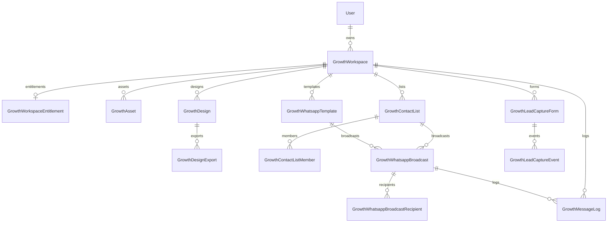

# Phase J0 MVP — Schema diff & pre-`db push` review

**Date:** 2026-06-04  
**Status:** ✅ **Prisma merged in repo** · ⏸ **awaiting Approve J0 MVP db push** — do not run `db push` yet

**Source:** [PHASE-J1-MVP-BLUEPRINT.md](./PHASE-J1-MVP-BLUEPRINT.md) · [PHASE-J0-MVP-OPTIMIZATION.md](./PHASE-J0-MVP-OPTIMIZATION.md)

**Scope:** 13 `growth_*` tables · 9 enums · `User` additive relation only.

---

## Summary

| Metric | Value |
|--------|------:|
| New enums | 9 |
| New models | 13 |
| New MySQL tables (on push) | 13 |
| Modified existing models | 1 (`User` — relation only) |
| Dealer / Broker / Auction / Finance / Insurance / Community / Marketplace | **Unchanged** |

---

## 1. Exact Prisma schema diff

### 1.1 `User` — additive relation only

```diff
 model User {
   ...
   pollVotes         PollVote[]
+  growthWorkspacesOwned GrowthWorkspace[] @relation("GrowthWorkspaceOwner")

   @@index([role])
```

### 1.2 New block appended (end of `schema.prisma`)

**Location:** after `AuctionNotification` (~line 2026+)

- 9 enums: `GrowthBusinessType` … `GrowthLeadCaptureStatus`
- 13 models: `GrowthWorkspace` … `GrowthLeadCaptureEvent`

**Full models:** see `backend/prisma/schema.prisma` lines 2027–end, or [PHASE-J1-MVP-BLUEPRINT.md § A.3](./PHASE-J1-MVP-BLUEPRINT.md).

**Not added (deferred per MVP):**

- `growth_workspace_members`
- `growth_brand_kits`, `growth_asset_folders`
- `growth_content_templates`, `growth_content_template_versions`
- `growth_social_posts`, `growth_social_post_targets`
- `growth_campaigns`, `growth_campaign_channels`, `growth_campaign_schedules`, `growth_campaign_analytics`
- `growth_provider_connections`, `growth_delivery_events`

---

## 2. New enums list (9)

| Enum | Values |
|------|--------|
| `GrowthBusinessType` | `dealer`, `broker`, `dsa`, `insurance_agent`, `workshop`, `parts_seller`, `influencer` |
| `GrowthWorkspaceStatus` | `active`, `suspended`, `archived` |
| `GrowthAssetKind` | `image`, `video`, `logo`, `document` |
| `GrowthDesignFormat` | `facebook_post`, `instagram_post`, `instagram_story`, `linkedin_post`, `banner`, `poster` |
| `GrowthDesignStatus` | `draft`, `ready`, `archived` |
| `GrowthWhatsappTemplateStatus` | `draft`, `pending_approval`, `approved`, `rejected` |
| `GrowthBroadcastStatus` | `draft`, `scheduled`, `sending`, `completed`, `failed`, `cancelled` |
| `GrowthDeliveryStatus` | `queued`, `sent`, `delivered`, `read`, `failed`, `opted_out` |
| `GrowthLeadCaptureStatus` | `new`, `qualified`, `spam`, `archived` |

---

## 3. New models list (13)

| # | Prisma model | MySQL table |
|---|--------------|-------------|
| 1 | `GrowthWorkspace` | `growth_workspaces` |
| 2 | `GrowthWorkspaceEntitlement` | `growth_workspace_entitlements` |
| 3 | `GrowthAsset` | `growth_assets` |
| 4 | `GrowthDesign` | `growth_designs` |
| 5 | `GrowthDesignExport` | `growth_design_exports` |
| 6 | `GrowthWhatsappTemplate` | `growth_whatsapp_templates` |
| 7 | `GrowthContactList` | `growth_contact_lists` |
| 8 | `GrowthContactListMember` | `growth_contact_list_members` |
| 9 | `GrowthWhatsappBroadcast` | `growth_whatsapp_broadcasts` |
| 10 | `GrowthWhatsappBroadcastRecipient` | `growth_whatsapp_broadcast_recipients` |
| 11 | `GrowthMessageLog` | `growth_message_logs` |
| 12 | `GrowthLeadCaptureForm` | `growth_lead_capture_forms` |
| 13 | `GrowthLeadCaptureEvent` | `growth_lead_capture_events` |

---

## 4. Index list

| Table | Indexes |
|-------|---------|
| `growth_workspaces` | `owner_user_id`, `business_type`, `entity_id`, UNIQUE `slug` |
| `growth_workspace_entitlements` | UNIQUE `workspace_id` |
| `growth_assets` | `(workspace_id, kind)`, `(workspace_id, created_at)` |
| `growth_designs` | `(workspace_id, status)`, `(workspace_id, format)` |
| `growth_design_exports` | `(design_id, created_at)` |
| `growth_whatsapp_templates` | UNIQUE `(workspace_id, template_key)`, `(workspace_id, status)` |
| `growth_contact_lists` | `workspace_id` |
| `growth_contact_list_members` | UNIQUE `(list_id, phone)`, `phone` |
| `growth_whatsapp_broadcasts` | `(workspace_id, status)`, `(workspace_id, created_at)`, `schedule_at` |
| `growth_whatsapp_broadcast_recipients` | UNIQUE `(broadcast_id, phone)`, `(broadcast_id, status)` |
| `growth_message_logs` | `(workspace_id, created_at)`, `broadcast_id` |
| `growth_lead_capture_forms` | UNIQUE `(workspace_id, slug)` |
| `growth_lead_capture_events` | `(form_id, created_at)`, `status` |

**Foreign keys created by Prisma on push:** all relations above cascade/restrict per model definitions.

---

## 5. Relationships



| From | To | onDelete |
|------|-----|----------|
| `GrowthWorkspace` | `User` (owner) | Cascade |
| `GrowthWorkspaceEntitlement` | `GrowthWorkspace` | Cascade |
| `GrowthAsset` / `GrowthDesign` / templates / lists / forms | `GrowthWorkspace` | Cascade |
| `GrowthDesignExport` | `GrowthDesign` | Cascade |
| `GrowthContactListMember` | `GrowthContactList` | Cascade |
| `GrowthWhatsappBroadcast` | `template`, `list` | Restrict |
| `GrowthWhatsappBroadcastRecipient` | `GrowthWhatsappBroadcast` | Cascade |
| `GrowthMessageLog` | `GrowthWorkspace` | Cascade |
| `GrowthMessageLog` | `GrowthWhatsappBroadcast` | SetNull |
| `GrowthLeadCaptureEvent` | `GrowthLeadCaptureForm` | Cascade |

**No FK** to `dealers`, `brokers`, `leads`, `community_*`, `broker_whatsapp_*`, `vehicles`.

---

## 6. Affected files

| File | Change |
|------|--------|
| `backend/prisma/schema.prisma` | +9 enums, +13 models, +1 `User` relation |
| `PHASE-J0-MVP-SCHEMA-DIFF.md` | This document (new) |

**Not changed (per rules):**

- `backend/src/**` (no API, no services)
- `frontend/**` (no UI)
- `backend/src/lib/db/table-map.ts` (J1)
- `backend/src/config/feature-flags.ts` (J1)
- Dealer / broker / auction / finance / insurance / community modules

---

## 7. Backup strategy

### 7.1 Before `db push` (required)

1. Ensure MySQL is running (XAMPP: `E:\xampp\mysql_start.bat`).
2. Stop backend on port 3001 if running (avoids EPERM on `prisma generate`).
3. Create timestamped dump:

```powershell
$ts = Get-Date -Format "yyyyMMdd-HHmmss"
$out = "e:\Projects\motorcartcursor\backend\backups\motorcart-pre-j0-mvp-push-$ts.sql"
# Database name: motocart (see DATABASE_URL)
& "E:\xampp\mysql\bin\mysqldump.exe" -u root motocart | Out-File -FilePath $out -Encoding utf8
```

**Correct database name from project:** `motorcart` (see `DATABASE_URL`).

```powershell
$ts = Get-Date -Format "yyyyMMdd-HHmmss"
$out = "E:\Projects\motorcartcursor\backend\backups\motorcart-pre-j0-mvp-push-$ts.sql"
New-Item -ItemType Directory -Force -Path (Split-Path $out) | Out-Null
& "E:\xampp\mysql\bin\mysqldump.exe" -u root motocart | Out-File -FilePath $out -Encoding utf8
Get-Item $out | Select-Object Name, Length, LastWriteTime
```

4. Verify file size > prior backups (~150–200 KB+ for populated DB).

### 7.2 After push

- Optional: second dump `motorcart-post-j0-mvp-push-{ts}.sql` for diff verification.
- Run `npx prisma db push` then `npx prisma generate` (stop backend first on Windows).

### 7.3 Restore procedure

```powershell
# Stop backend; restore from backup (database name: motorcart)
& "E:\xampp\mysql\bin\mysql.exe" -u root motorcart < "E:\Projects\motorcartcursor\backend\backups\motorcart-pre-j0-mvp-push-YYYYMMDD-HHMMSS.sql"
```

---

## 8. Rollback plan

| Level | Action |
|-------|--------|
| **Pre-push** | Revert `schema.prisma` Growth block + `User` line via git |
| **Post-push, no data** | Drop 13 tables (order below); revert Prisma; `db push` |
| **Post-push, with data** | Restore pre-push SQL backup |
| **Application** | No Growth code shipped yet — N/A |

**Drop order (children first):**

1. `growth_lead_capture_events`
2. `growth_lead_capture_forms`
3. `growth_message_logs`
4. `growth_whatsapp_broadcast_recipients`
5. `growth_whatsapp_broadcasts`
6. `growth_contact_list_members`
7. `growth_contact_lists`
8. `growth_whatsapp_templates`
9. `growth_design_exports`
10. `growth_designs`
11. `growth_assets`
12. `growth_workspace_entitlements`
13. `growth_workspaces`

---

## 9. Risk assessment

| Risk | Severity | Likelihood | Mitigation |
|------|----------|------------|------------|
| Accidental cross-domain migration | Low | Low | Only new tables; no ALTER on CRM tables |
| `db push` failure (MySQL down) | Med | Med | Backup first; validate with `prisma validate` ✅ |
| EPERM on `prisma generate` (Windows) | Med | Med | Stop process on port 3001 |
| Enum proliferation in MySQL | Low | Low | 9 enums isolated to Growth |
| Large `canvas_json` rows | Low | Med | App-level size limits in J1 |
| PII in lead/broadcast tables | Med | Future | J1 API + retention policy |
| Confusion with `broker_whatsapp_*` | Med | Low | Separate prefix; no code links in J0 |
| Push scope creep (26 tables) | Low | Low | MVP doc limits to 13 — verified in diff |

**Expected `db push` impact:** CREATE 13 tables + FKs only. **No** `--accept-data-loss` expected on existing tables.

---

## 10. Pre-push checklist

- [x] Prisma schema merged (13 tables + enums)
- [x] `npx prisma validate` (run after merge)
- [x] MySQL backup created — see `PHASE-J0-MVP-APPLIED-RESULTS.md` §2
- [x] Backend stopped (port 3001)
- [x] Operator approved **J0 MVP db push**
- [x] `npx prisma db push`
- [x] `npx prisma generate`
- [x] Document results in `PHASE-J0-MVP-APPLIED-RESULTS.md`

---

## Approval

| Gate | Status |
|------|--------|
| Approve J0 MVP schema implementation | ✅ Prisma in repo |
| **Approve J0 MVP db push** | ✅ Applied — see `PHASE-J0-MVP-APPLIED-RESULTS.md` |

**Next gate:** J1 APIs/UI — operator approval required.
