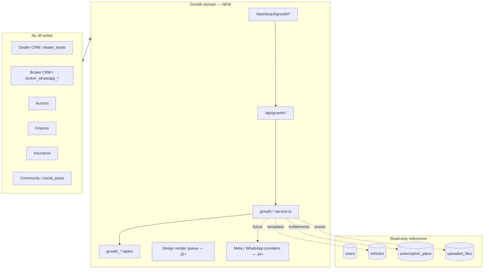
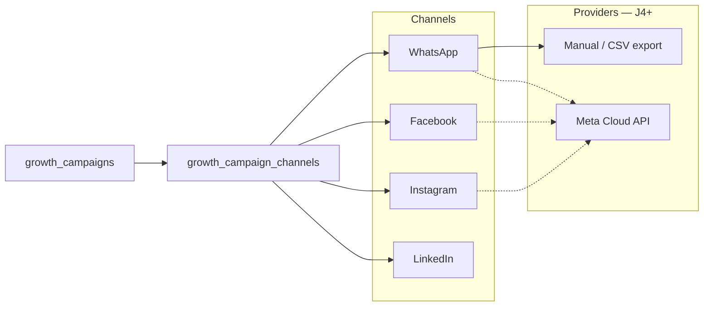

# Phase J0 — Growth CRM Foundation (architecture review)

**Status:** ✅ Architecture approved · Schema proposal in [PHASE-J-SCHEMA-DIFF.md](./PHASE-J-SCHEMA-DIFF.md) · ⏸ no Prisma merge / no `db push` / no implementation

**Vision:** MotorCart as **Canva + Meta Business Suite + HubSpot** for the automotive industry — creative production, multi-channel publishing, and measurable demand generation in one workspace per business.

**Builds on:** Existing `subscription_plans`, `uploaded_files`, `users` / `AppRole`, and vertical workspaces (dealer, broker, parts, service). **Does not** extend Community (Phase I), Dealer CRM, Broker CRM, Auction, Finance, or Insurance code paths in J0.

Reply **Approve J0** to author `PHASE-J-SCHEMA-DIFF.md` + Prisma proposal. Reply **Approve J0 db push** only after schema approval. Reply **Approve J1+** per slice (WhatsApp, Social, etc.).

---

## 1. Architecture

### 1.1 Why a separate Growth domain

Today, marketing capabilities are **fragmented**:

| Location | What exists today | J0 problem |
|----------|-------------------|------------|
| `dealer-crm/**` | `DealerWhatsAppPage`, analytics links | Operational CRM, not campaign OS |
| `broker_*` WhatsApp tables | 1:1 lead/deal messaging | Broker pipeline scope — not broadcast marketing |
| `parts` / `service` dashboards | Marketing sub-routes (mock/heavy UI) | Not unified or cross-vertical |
| `engagement_campaigns` | Customer-ecosystem nudges | Not B2B growth CRM |
| Community (Phase I) | Social feed for discovery | Not paid/owned marketing ops |

Phase J introduces a **Growth bounded context**: `growth_*` tables, `/api/growth/*`, `/dashboard/growth/*`, isolated services. Vertical CRMs remain untouched; Growth may **read** public listing/vehicle data for templates and **emit** leads only through an explicit, flagged bridge (J3+).



### 1.2 Target users → workspace types

Growth is **workspace-scoped** (multi-business). One `users` row may own several workspaces (e.g. dealer showroom + influencer brand).

| Target user | `GrowthBusinessType` | Typical `AppRole` | Workspace label |
|-------------|----------------------|-------------------|-----------------|
| Dealer | `dealer` | `dealer`, `used_car_dealer`, `new_car_dealer`, … | Dealer account |
| Broker | `broker` | `broker` | Broker account |
| DSA | `dsa` | `dsa_agent`, `finance_manager`, … | DSA desk |
| Insurance Agent | `insurance_agent` | TBD / metadata | Agency account |
| Workshop | `workshop` | `service_center`, `service_partner` | Workshop account |
| Parts Seller | `parts_seller` | `parts_seller` | Parts account |
| Influencer | `influencer` | `customer` + metadata | Creator account |

**Rule:** `entity_id` + `entity_type` on workspace are **optional references** for display and template merge fields — **no FK enforcement** to `dealers` / `brokers` / etc. in J0 (avoids CRM coupling).

### 1.3 Module map (A–F)

| Module | J0 scope (foundation) | Canonical tables (proposed) |
|--------|----------------------|----------------------------|
| **A. WhatsApp Marketing** | Template library, lists, broadcast plan, logs, delivery states; provider = `manual` until Meta | `growth_whatsapp_*` |
| **B. Social Media Builder** | Design canvas JSON, channel presets (FB/IG/LinkedIn), story/banner sizes; export image (J2) | `growth_designs`, `growth_social_posts` |
| **C. Content Library** | Vertical templates (vehicle, finance, insurance, service, parts) | `growth_content_templates` |
| **D. Campaign Management** | Parent campaign, schedule, channel links, analytics snapshots, lead capture forms | `growth_campaigns`, `growth_campaign_*` |
| **E. Asset Management** | DAM: images, video refs, logos, brand kits | `growth_assets`, `growth_brand_kits` |
| **F. Multi-business** | Workspace switcher, members, roles | `growth_workspaces`, `growth_workspace_members` |

### 1.4 Layering (implementation phases after J0)

| Layer | Responsibility |
|-------|----------------|
| `lib/growth/guard.ts` | Auth + workspace membership + per-flag 404 |
| `lib/growth/entitlements.ts` | Subscription tier → limits (broadcasts/mo, templates, seats) |
| `lib/growth/map-*.ts` | API DTOs (snake_case) |
| `services/growth-workspace.service.ts` | Workspace CRUD, switcher, members |
| `services/growth-asset.service.ts` | Uploads, brand kits |
| `services/growth-content.service.ts` | Template library |
| `services/growth-design.service.ts` | Social builder / canvas |
| `services/growth-whatsapp.service.ts` | Templates, lists, broadcasts, logs |
| `services/growth-campaign.service.ts` | Campaigns, schedule, analytics |
| `services/growth-lead-capture.service.ts` | Landing links → public lead intake (bridge flag) |
| `app/api/growth/**` | Thin routes |
| `features/growth-crm/**` | New frontend feature folder (not `dealer-crm`) |

### 1.5 Channel & provider model (future-ready)



**J0–J1:** WhatsApp = template + broadcast planning + **manual** send or CSV export; delivery tracking via operator-updated status or webhook stub. **No live Meta OAuth** until `FEATURE_GROWTH_META_API`.

### 1.6 Overlap boundaries (critical)

| Existing system | Growth J boundary |
|-----------------|-------------------|
| `broker_whatsapp_*` | Broker **transactional** CRM only; Growth does not read/write these tables |
| `DealerWhatsAppPage` | Dealer **inbox** UX; unchanged; link-out to Growth optional later |
| `engagement_campaigns` | **B2C** customer ecosystem; not Growth B2B campaigns |
| `social_posts` / Community | Organic community; Growth **paid/owned** assets are separate |
| `leads` / `dealer_leads` | Lead capture writes only via `FEATURE_GROWTH_LEAD_BRIDGE` (off by default) |
| Parts/Service marketing routes | Keep until Growth UI ready; then optional redirect to `/dashboard/growth` |

---

## 2. Database impact

**J0:** documentation only — tables below are **proposed** for `PHASE-J-SCHEMA-DIFF.md` (not applied to `schema.prisma`).

### 2.1 Core workspace & access (F)

| Table | Purpose |
|-------|---------|
| `growth_workspaces` | Business account: type, name, slug, owner, `entity_type`/`entity_id`, brand_kit_id, tier, metadata |
| `growth_workspace_members` | Team: user_id, role (`owner`, `admin`, `editor`, `viewer`) |
| `growth_workspace_entitlements` | Cached limits from subscription (optional denorm) |

### 2.2 Asset management (E)

| Table | Purpose |
|-------|---------|
| `growth_brand_kits` | Colors, fonts, logos refs, guidelines JSON |
| `growth_assets` | workspace_id, kind (`image`, `video`, `logo`), storage path, mime, tags |
| `growth_asset_folders` | Optional folder tree |

Reuse pattern: mirror `uploaded_files` storage (`UPLOAD_DIR` / S3-ready paths) with `growth/` prefix — **new rows only**, do not alter `uploaded_files` schema in J0.

### 2.3 Content library (C)

| Table | Purpose |
|-------|---------|
| `growth_content_templates` | Vertical: `vehicle`, `finance`, `insurance`, `service`, `parts`, `general` |
| `growth_content_template_versions` | Versioned JSON layout + variables schema |
| `growth_template_variables` | Optional normalized var defs (`{{make}}`, `{{emi}}`) |

Platform-owned templates: `workspace_id` NULL. Workspace clones: `workspace_id` set, `source_template_id` set.

### 2.4 Social media builder (B)

| Table | Purpose |
|-------|---------|
| `growth_designs` | Canvas JSON (layers), format (`fb_post`, `ig_post`, `ig_story`, `linkedin_post`, `banner`, `poster`) |
| `growth_design_exports` | Rendered PNG/WebP URLs, dimensions |
| `growth_social_posts` | Draft/scheduled post: design_id, channel, caption, schedule_at, status |
| `growth_social_post_targets` | Per-channel external ids when Meta connected (J4) |

### 2.5 WhatsApp marketing (A)

| Table | Purpose |
|-------|---------|
| `growth_whatsapp_templates` | Library: name, category, body, variables, approval status |
| `growth_contact_lists` | Static/dynamic lists per workspace |
| `growth_contact_list_members` | phone, name, opt_in_at, metadata |
| `growth_whatsapp_broadcasts` | Campaign send unit: template_id, list_id, schedule_at, status |
| `growth_whatsapp_broadcast_recipients` | Per-phone state machine |
| `growth_message_logs` | Unified log (whatsapp + future SMS) |
| `growth_delivery_events` | sent, delivered, read, failed + provider payload |
| `growth_provider_connections` | Meta WABA id, tokens (encrypted), webhook secrets — J4 |

### 2.6 Campaign management (D)

| Table | Purpose |
|-------|---------|
| `growth_campaigns` | Parent: name, goal, status, date range, workspace_id |
| `growth_campaign_channels` | whatsapp \| facebook \| instagram \| linkedin \| offline |
| `growth_campaign_schedule` | Cron-like or one-shot timestamps |
| `growth_campaign_analytics` | Daily: impressions, clicks, leads, spend (manual or API) |
| `growth_lead_capture_forms` | Form schema, thank-you URL |
| `growth_lead_capture_events` | Submissions (PII JSON); bridge to `leads` deferred |

### 2.7 Indexing strategy (summary)

- `(workspace_id, created_at DESC)` on all child tables  
- `(broadcast_id, status)` on recipients  
- `(campaign_id, channel)` on channels  
- `(template_category, is_platform)` on content templates  

### 2.8 What J0 does **not** change

- No edits to `dealers`, `brokers`, `broker_whatsapp_*`, `auctions`, `finance_*`, `insurance_*`, `community_*`, `social_posts`, `dealer_leads`, `crm_tasks`

---

## 3. Prisma impact

**J0:** zero Prisma file changes (review artifact only).

**J1 (after Approve J0):** additive models only — suggested enums:

```prisma
enum GrowthBusinessType {
  dealer
  broker
  dsa
  insurance_agent
  workshop
  parts_seller
  influencer
}

enum GrowthWorkspaceRole {
  owner
  admin
  editor
  viewer
}

enum GrowthAssetKind {
  image
  video
  logo
  document
}

enum GrowthContentCategory {
  vehicle
  finance
  insurance
  service
  parts
  general
}

enum GrowthDesignFormat {
  facebook_post
  instagram_post
  instagram_story
  linkedin_post
  banner
  poster
}

enum GrowthCampaignStatus {
  draft
  scheduled
  active
  paused
  completed
  cancelled
}

enum GrowthBroadcastStatus {
  draft
  scheduled
  sending
  completed
  failed
  cancelled
}

enum GrowthDeliveryStatus {
  queued
  sent
  delivered
  read
  failed
  opted_out
}
```

**User model (J1):** optional relation `growthWorkspaces GrowthWorkspace[]` — no changes to `AppRole` enum required in J0.

**SubscriptionPlan (J1):** no schema change required — extend `features` JSON schema documented in §8.

---

## 4. API design

All routes return **404** when master `FEATURE_GROWTH_V2` or slice flag is off. All mutating routes require workspace membership.

**Header:** `X-Growth-Workspace-Id: <uuid>` (or query `workspace_id` for GET list).

### 4.1 Workspaces (F)

| Method | Path | Flag |
|--------|------|------|
| GET | `/api/growth/workspaces` | `FEATURE_GROWTH_WORKSPACES` |
| POST | `/api/growth/workspaces` | same |
| GET | `/api/growth/workspaces/:id` | same |
| PATCH | `/api/growth/workspaces/:id` | same |
| GET | `/api/growth/workspaces/:id/members` | same |
| POST | `/api/growth/workspaces/:id/members` | same |

### 4.2 Assets & brand kits (E)

| Method | Path | Flag |
|--------|------|------|
| GET/POST | `/api/growth/assets` | `FEATURE_GROWTH_ASSETS` |
| GET/PATCH/DELETE | `/api/growth/assets/:id` | same |
| GET/POST | `/api/growth/brand-kits` | same |
| GET/PATCH | `/api/growth/brand-kits/:id` | same |

Upload: reuse `POST /api/upload` with `metadata.scope=growth` + register via Growth asset API (no upload route changes in J0).

### 4.3 Content library (C)

| Method | Path | Flag |
|--------|------|------|
| GET | `/api/growth/templates?category=vehicle\|finance\|…` | `FEATURE_GROWTH_CONTENT_LIBRARY` |
| GET | `/api/growth/templates/:id` | same |
| POST | `/api/growth/templates/:id/clone` | same (workspace copy) |

### 4.4 Social builder (B)

| Method | Path | Flag |
|--------|------|------|
| GET/POST | `/api/growth/designs` | `FEATURE_GROWTH_SOCIAL_BUILDER` |
| GET/PATCH/DELETE | `/api/growth/designs/:id` | same |
| POST | `/api/growth/designs/:id/export` | same (async render J2) |
| GET/POST | `/api/growth/social-posts` | same |
| PATCH | `/api/growth/social-posts/:id/schedule` | same |

### 4.5 WhatsApp marketing (A)

| Method | Path | Flag |
|--------|------|------|
| GET/POST | `/api/growth/whatsapp/templates` | `FEATURE_GROWTH_WHATSAPP` |
| GET/PATCH/DELETE | `/api/growth/whatsapp/templates/:id` | same |
| GET/POST | `/api/growth/whatsapp/contact-lists` | same |
| POST | `/api/growth/whatsapp/contact-lists/:id/members` | same |
| GET/POST | `/api/growth/whatsapp/broadcasts` | same |
| POST | `/api/growth/whatsapp/broadcasts/:id/schedule` | same |
| POST | `/api/growth/whatsapp/broadcasts/:id/send` | same (manual queue) |
| GET | `/api/growth/whatsapp/message-logs` | same |
| GET | `/api/growth/whatsapp/delivery-events?broadcast_id=` | same |
| POST | `/api/growth/webhooks/meta/whatsapp` | `FEATURE_GROWTH_META_API` (J4, stub in J2) |

### 4.6 Campaigns (D)

| Method | Path | Flag |
|--------|------|------|
| GET/POST | `/api/growth/campaigns` | `FEATURE_GROWTH_CAMPAIGNS` |
| GET/PATCH | `/api/growth/campaigns/:id` | same |
| POST | `/api/growth/campaigns/:id/channels` | same |
| POST | `/api/growth/campaigns/:id/schedule` | same |
| GET | `/api/growth/campaigns/:id/analytics` | same |
| GET/POST | `/api/growth/lead-forms` | same |
| POST | `/api/growth/lead-forms/:id/submit` | public (rate-limited) |
| POST | `/api/growth/lead-forms/:id/bridge` | `FEATURE_GROWTH_LEAD_BRIDGE` (J3, off default) |

### 4.7 Aggregates (hub dashboard)

| Method | Path | Description |
|--------|------|-------------|
| GET | `/api/growth/overview?workspace_id=` | Counts: campaigns active, broadcasts scheduled, assets, recent logs |

---

## 5. Route structure

### 5.1 Backend

```
backend/src/app/api/growth/
├── workspaces/
│   ├── route.ts
│   └── [id]/
│       ├── route.ts
│       └── members/route.ts
├── assets/
├── brand-kits/
├── templates/
├── designs/
├── social-posts/
├── whatsapp/
│   ├── templates/
│   ├── contact-lists/
│   ├── broadcasts/
│   └── message-logs/
├── campaigns/
├── lead-forms/
├── overview/route.ts
└── webhooks/meta/whatsapp/route.ts   # J4
```

### 5.2 Frontend (new feature module only)

```
frontend/src/features/growth-crm/
├── pages/
│   ├── GrowthOverviewPage.tsx
│   ├── GrowthWhatsAppPage.tsx
│   ├── GrowthCampaignsPage.tsx
│   ├── GrowthContentLibraryPage.tsx
│   ├── GrowthDesignStudioPage.tsx      # Canva-like
│   ├── GrowthAssetsPage.tsx
│   └── GrowthWorkspaceSettingsPage.tsx
├── components/
├── services/growth-api.service.ts
├── hooks/
└── config/growth-nav.ts
```

**Router (additive):**

| Path | Page |
|------|------|
| `/dashboard/growth` | Overview |
| `/dashboard/growth/whatsapp` | Templates, lists, broadcasts |
| `/dashboard/growth/campaigns` | Campaign list + detail |
| `/dashboard/growth/campaigns/:id` | Campaign detail |
| `/dashboard/growth/studio` | Social builder |
| `/dashboard/growth/library` | Content templates |
| `/dashboard/growth/assets` | DAM |
| `/dashboard/growth/settings` | Workspace + brand kit |

**Do not modify** existing `/dashboard/dealer/*`, `/dashboard/broker/*`, `/community/*`, finance, insurance, auction routes in J0/J1.

**Role gating:** map `AppRole` → allowed `GrowthBusinessType` for workspace creation (same matrix as §1.2).

---

## 6. Feature flags

Add to `backend/src/config/feature-flags.ts` and `frontend/src/config/feature-flags.ts` — **all default `false`**.

| Backend | Frontend | Scope |
|---------|----------|-------|
| `FEATURE_GROWTH_V2` | `VITE_FEATURE_GROWTH_V2` | Master gate |
| `FEATURE_GROWTH_WORKSPACES` | `VITE_FEATURE_GROWTH_WORKSPACES` | Multi-business (F) |
| `FEATURE_GROWTH_ASSETS` | `VITE_FEATURE_GROWTH_ASSETS` | Assets + brand kits (E) |
| `FEATURE_GROWTH_CONTENT_LIBRARY` | `VITE_FEATURE_GROWTH_CONTENT_LIBRARY` | Templates (C) |
| `FEATURE_GROWTH_SOCIAL_BUILDER` | `VITE_FEATURE_GROWTH_SOCIAL_BUILDER` | Designs + social posts (B) |
| `FEATURE_GROWTH_WHATSAPP` | `VITE_FEATURE_GROWTH_WHATSAPP` | WhatsApp slice (A) |
| `FEATURE_GROWTH_CAMPAIGNS` | `VITE_FEATURE_GROWTH_CAMPAIGNS` | Campaigns + analytics (D) |
| `FEATURE_GROWTH_LEAD_BRIDGE` | `VITE_FEATURE_GROWTH_LEAD_BRIDGE` | Write to marketplace `leads` (off) |
| `FEATURE_GROWTH_META_API` | `VITE_FEATURE_GROWTH_META_API` | Live Meta / WABA (J4) |
| `FEATURE_GROWTH_RENDER_EXPORT` | `VITE_FEATURE_GROWTH_RENDER_EXPORT` | PNG/PDF export queue (J2) |

**Flag-off behavior:** no `/dashboard/growth` nav entries; all `/api/growth/*` → 404; existing dealer/parts/service marketing pages unchanged.

---

## 7. Monetization strategy

Growth CRM is a **subscription SKU** aligned with MotorCart SaaS (dealers already have `dealers.subscription_tier`).

### 7.1 Packaging tiers (illustrative)

| Tier | Audience | Includes |
|------|----------|----------|
| **Growth Lite** | Single-location dealer / workshop | 1 workspace, 20 templates, 500 WA broadcasts/mo, manual send |
| **Growth Pro** | Multi-rooftop / broker | 3 workspaces, brand kit, 5k broadcasts/mo, campaign analytics |
| **Growth Enterprise** | Groups, DSA networks | Unlimited workspaces, team seats, API, Meta connector |
| **Add-on: Meta Connect** | Pro+ | WABA + IG/FB publishing, delivery webhooks |
| **Add-on: Creator** | Influencer | Extra designs, story packs, no WhatsApp |

### 7.2 Usage meters (billable dimensions)

| Meter | Enforcement |
|-------|-------------|
| Workspaces | `growth_workspaces` count vs plan |
| Team seats | `growth_workspace_members` |
| WhatsApp broadcasts / month | `growth_whatsapp_broadcasts` |
| Design exports / month | `growth_design_exports` |
| Storage GB | Sum `growth_assets.size` |
| Meta API calls | Provider usage table (J4) |

### 7.3 Revenue mechanics

- **Seat expansion** — per additional editor on workspace  
- **Broadcast overage** — per 1k messages above quota  
- **Premium templates** — marketplace cut on paid packs (J5)  
- **Verified + Growth bundle** — cross-sell with community business verification (read-only link, no Community code changes in J)  

**J0:** document meters only — no billing integration code.

---

## 8. Subscription model integration

### 8.1 Existing model

`SubscriptionPlan` (`subscription_plans`): `slug`, `price`, `features` JSON array.

`Dealer.subscriptionTier` — string tier on dealer row (vertical-specific).

### 8.2 Proposed `features` JSON contract (Growth slice)

```json
{
  "growth": {
    "enabled": true,
    "max_workspaces": 3,
    "max_team_seats": 10,
    "whatsapp_broadcasts_monthly": 5000,
    "design_exports_monthly": 200,
    "storage_mb": 5120,
    "channels": ["whatsapp", "facebook", "instagram", "linkedin"],
    "meta_api": false,
    "lead_bridge": false,
    "premium_templates": true
  }
}
```

### 8.3 Resolution order

1. Load workspace → `growth_workspaces.subscription_plan_slug` or inherit from owner’s vertical tier  
2. Merge `subscription_plans.features.growth`  
3. Cache on `growth_workspace_entitlements` (refresh on plan change)  
4. `lib/growth/entitlements.ts` checks before broadcast/send/export  

### 8.4 Platform admin

Extend **platform-admin** plan editor (future J1) to edit Growth block in `features` JSON — **no admin UI in J0**.

### 8.5 Trials & grace

- `metadata.trial_ends_at` on workspace  
- Soft limit: warn in UI; hard limit: API 402 `quota_exceeded`  

---

## 9. Rollback plan

| Level | Action |
|-------|--------|
| **J0 review** | No code/DB — discard doc only |
| **Post J1 schema** | Do not enable flags; Growth tables empty |
| **Runtime** | All `FEATURE_GROWTH_*` false → 404 APIs, hide nav |
| **Partial slice** | Disable e.g. `FEATURE_GROWTH_WHATSAPP` only |
| **Code** | Revert Growth branch; CRM/Community/Auction untouched |
| **DB** | Drop `growth_*` tables only via approved down migration; restore backup before J1 push |
| **Provider** | Revoke Meta tokens in `growth_provider_connections`; webhooks go idle |

No rollback impact on `broker_whatsapp_*`, `dealer-crm`, or `community_*` if boundaries are respected.

---

## 10. Risk analysis

| Risk | Severity | Mitigation |
|------|----------|------------|
| Duplicating broker WhatsApp | **High** | Hard ban on `broker_whatsapp_*` access; separate `growth_whatsapp_*` |
| Dealer CRM lead pollution | **High** | `FEATURE_GROWTH_LEAD_BRIDGE` off by default; separate capture table first |
| Scope creep (Meta live day 1) | **High** | J4 flag; manual send + CSV in J1–J2 |
| Canva parity expectation | **Med** | Phase B as studio + templates, not full Canva clone |
| PII / WhatsApp opt-in compliance | **High** | `opt_in_at` on list members; audit logs; TRAI/DPDP notes in ops runbook |
| Token security (Meta) | **High** | Encrypt at rest; workspace-scoped secrets; rotate |
| Fragmented marketing UX | **Med** | Single `/dashboard/growth`; deprecate vertical marketing later with redirects |
| Community cross-post confusion | **Med** | Growth publishes to **ads/owned**; Community stays organic; no `social_posts` writes |
| Subscription drift vs `dealers.subscription_tier` | **Med** | Document mapping table dealer tier → Growth entitlements |
| Storage cost | **Med** | Quotas per tier; asset GC job |
| Render queue failures | **Med** | Retry + fallback download PNG in J2 |
| Insurance/DSA template compliance | **Med** | Disclaimer blocks in template metadata; admin-reviewed packs |

---

## 11. Implementation roadmap (post-approval, not started)

| Phase | Deliverable |
|-------|-------------|
| **J0** ✅ | This architecture review |
| **J0b** | `PHASE-J-SCHEMA-DIFF.md` + Prisma proposal |
| **J1** | `db push` + `growth_*` tables + workspace APIs |
| **J2** | Assets, content library, design studio (export stub) |
| **J3** | WhatsApp templates, lists, broadcasts, logs |
| **J4** | Campaigns, scheduling, analytics, lead forms |
| **J5** | Meta API + social publish connectors |
| **J6** | Monetization enforcement + admin plan editor |

---

## Approval gates

| Gate | Action |
|------|--------|
| **Approve J0** | Accept architecture; proceed to schema diff doc |
| **Approve J0 schema** | Apply Prisma proposal (still no code APIs) |
| **Approve J0 db push** | Push `growth_*` tables to MySQL |
| **Approve J1+** | Per-slice implementation |

**No implementation or `db push` until explicit approval.**
