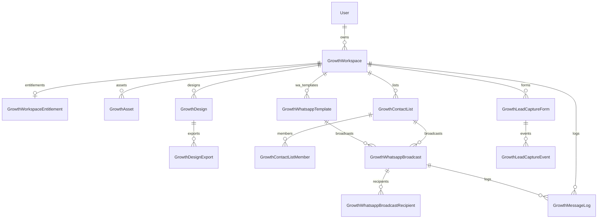
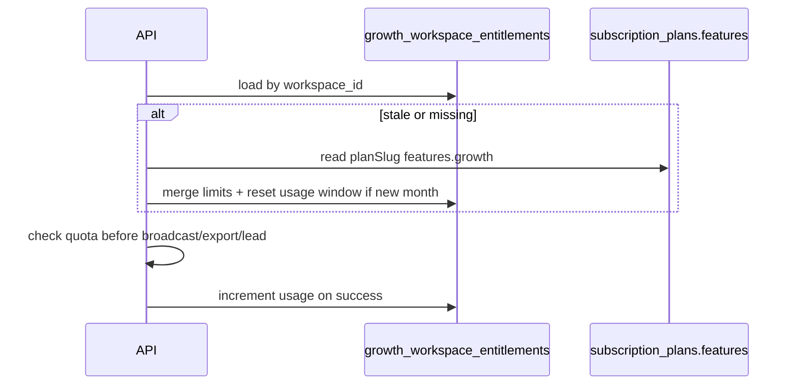
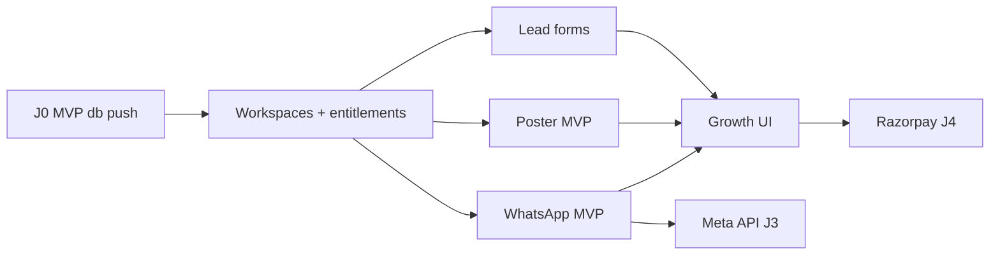

# MotorCart Growth CRM — Phase J0 + J1 MVP Consolidation Blueprint

**Date:** 2026-06-04  
**Status:** 📦 **Implementation package only** — no `schema.prisma` merge · no `db push` · no application code

**Approved inputs:**

- [PHASE-J0-PLAN.md](./PHASE-J0-PLAN.md) — architecture  
- [PHASE-J-SCHEMA-DIFF.md](./PHASE-J-SCHEMA-DIFF.md) — full 26-table target  
- [PHASE-J0-MVP-OPTIMIZATION.md](./PHASE-J0-MVP-OPTIMIZATION.md) — MVP subset  

**Hard boundaries (do not touch):** Dealer CRM · Broker CRM · Auction · Finance · Insurance · Community · Marketplace

**MVP scope:** Smallest revenue-generating Growth CRM — **WhatsApp + Posters + Lead forms**, workspace-scoped, subscription-enforced.

**Table count:** **13 MVP tables** (user consolidation list; prior docs labeled “14” — same set, recount = 13).

---

## Document map

| Part | Section |
|------|---------|
| **A** | MVP database package (Prisma proposal) |
| **B** | MVP API design + routes |
| **C** | Subscription plans (India) |
| **D** | Implementation roadmap J1–J5 |
| **E** | Revenue / MRR model |
| **F** | Safety, flags, rollout |

---

# PART A — MVP database package

> **Not merged into `schema.prisma`.** Copy to Prisma only after **Approve J0 MVP db push**.

## A.1 MVP table inventory (13)

| # | Table | Purpose |
|---|-------|---------|
| 1 | `growth_workspaces` | Tenant / business account |
| 2 | `growth_workspace_entitlements` | Plan limits + usage meters |
| 3 | `growth_assets` | Images, logos, videos (refs) |
| 4 | `growth_designs` | Poster/creative canvas JSON |
| 5 | `growth_design_exports` | Rendered PNG/WebP |
| 6 | `growth_whatsapp_templates` | WA template library |
| 7 | `growth_contact_lists` | Audience lists |
| 8 | `growth_contact_list_members` | Phones + opt-in |
| 9 | `growth_whatsapp_broadcasts` | Broadcast / “campaign” unit |
| 10 | `growth_whatsapp_broadcast_recipients` | Per-recipient status |
| 11 | `growth_message_logs` | Message + delivery log |
| 12 | `growth_lead_capture_forms` | Landing form config |
| 13 | `growth_lead_capture_events` | Submissions |

**Deferred (not in MVP push):** members, brand_kits, folders, content_templates, social_posts, campaigns, analytics, provider_connections, delivery_events.

---

## A.2 Enums (9 — MVP only)

```prisma
enum GrowthBusinessType {
  dealer
  broker
  dsa
  insurance_agent
  workshop
  parts_seller
  influencer
}

enum GrowthWorkspaceStatus {
  active
  suspended
  archived
}

enum GrowthAssetKind {
  image
  video
  logo
  document
}

enum GrowthDesignFormat {
  facebook_post
  instagram_post
  instagram_story
  linkedin_post
  banner
  poster
}

enum GrowthDesignStatus {
  draft
  ready
  archived
}

enum GrowthWhatsappTemplateStatus {
  draft
  pending_approval
  approved
  rejected
}

enum GrowthBroadcastStatus {
  draft
  scheduled
  sending
  completed
  failed
  cancelled
}

enum GrowthDeliveryStatus {
  queued
  sent
  delivered
  read
  failed
  opted_out
}

enum GrowthLeadCaptureStatus {
  new
  qualified
  spam
  archived
}
```

**Note:** `bridged` status deferred until `FEATURE_GROWTH_LEAD_BRIDGE` (J3). `GrowthWorkspaceRole` deferred until team table (J2).

---

## A.3 Prisma models (exact MVP proposal)

### `User` — additive only

```prisma
// On model User — add:
  growthWorkspacesOwned GrowthWorkspace[] @relation("GrowthWorkspaceOwner")
```

```prisma
model GrowthWorkspace {
  id                   String                @id @default(uuid())
  ownerUserId          String                @map("owner_user_id")
  businessType         GrowthBusinessType    @map("business_type")
  name                 String                @db.VarChar(128)
  slug                 String                @unique @db.VarChar(64)
  entityId             String?               @map("entity_id")
  subscriptionPlanSlug String?               @map("subscription_plan_slug") @db.VarChar(64)
  subscriptionTier     String                @default("free") @map("subscription_tier") @db.VarChar(32)
  status               GrowthWorkspaceStatus @default(active)
  metadata             Json                  @default("{}")
  createdAt            DateTime              @default(now()) @map("created_at")
  updatedAt            DateTime              @updatedAt @map("updated_at")

  owner                User                  @relation("GrowthWorkspaceOwner", fields: [ownerUserId], references: [id], onDelete: Cascade)
  entitlements         GrowthWorkspaceEntitlement?
  assets               GrowthAsset[]
  designs              GrowthDesign[]
  whatsappTemplates    GrowthWhatsappTemplate[]
  contactLists         GrowthContactList[]
  broadcasts           GrowthWhatsappBroadcast[]
  messageLogs          GrowthMessageLog[]
  leadForms            GrowthLeadCaptureForm[]

  @@index([ownerUserId])
  @@index([businessType])
  @@index([entityId])
  @@map("growth_workspaces")
}

model GrowthWorkspaceEntitlement {
  id          String    @id @default(uuid())
  workspaceId String    @unique @map("workspace_id")
  planSlug    String    @default("free") @map("plan_slug") @db.VarChar(64)
  limits      Json      @default("{}")
  usage       Json      @default("{}")
  refreshedAt DateTime  @default(now()) @map("refreshed_at")
  trialEndsAt DateTime? @map("trial_ends_at")

  workspace   GrowthWorkspace @relation(fields: [workspaceId], references: [id], onDelete: Cascade)

  @@map("growth_workspace_entitlements")
}

model GrowthAsset {
  id          String          @id @default(uuid())
  workspaceId String          @map("workspace_id")
  kind        GrowthAssetKind
  name        String          @db.VarChar(255)
  storagePath String          @map("storage_path") @db.VarChar(512)
  publicUrl   String          @map("public_url") @db.VarChar(512)
  mimeType    String?         @map("mime_type") @db.VarChar(128)
  sizeBytes   Int?            @map("size_bytes")
  width       Int?
  height      Int?
  tags        Json            @default("[]")
  metadata    Json            @default("{}")
  deletedAt   DateTime?       @map("deleted_at")
  createdAt   DateTime        @default(now()) @map("created_at")
  updatedAt   DateTime        @updatedAt @map("updated_at")

  workspace   GrowthWorkspace @relation(fields: [workspaceId], references: [id], onDelete: Cascade)

  @@index([workspaceId, kind])
  @@index([workspaceId, createdAt])
  @@map("growth_assets")
}

model GrowthDesign {
  id          String             @id @default(uuid())
  workspaceId String             @map("workspace_id")
  name        String             @db.VarChar(128)
  format      GrowthDesignFormat
  status      GrowthDesignStatus @default(draft)
  canvasJson  Json               @map("canvas_json")
  width       Int                @default(1080)
  height      Int                @default(1080)
  metadata    Json               @default("{}")
  createdAt   DateTime           @default(now()) @map("created_at")
  updatedAt   DateTime           @updatedAt @map("updated_at")

  workspace   GrowthWorkspace    @relation(fields: [workspaceId], references: [id], onDelete: Cascade)
  exports     GrowthDesignExport[]

  @@index([workspaceId, status])
  @@index([workspaceId, format])
  @@map("growth_designs")
}

model GrowthDesignExport {
  id        String   @id @default(uuid())
  designId  String   @map("design_id")
  format    String   @default("png") @db.VarChar(8)
  publicUrl String   @map("public_url") @db.VarChar(512)
  width     Int
  height    Int
  sizeBytes Int?     @map("size_bytes")
  createdAt DateTime @default(now()) @map("created_at")

  design    GrowthDesign @relation(fields: [designId], references: [id], onDelete: Cascade)

  @@index([designId, createdAt])
  @@map("growth_design_exports")
}

model GrowthWhatsappTemplate {
  id                 String                       @id @default(uuid())
  workspaceId        String                       @map("workspace_id")
  templateKey        String                       @map("template_key") @db.VarChar(64)
  name               String                       @db.VarChar(128)
  category           String                       @default("marketing") @db.VarChar(32)
  body               String                       @db.Text
  language           String                       @default("en") @db.VarChar(8)
  variablesSchema    Json                         @default("[]") @map("variables_schema")
  providerTemplateId String?                      @map("provider_template_id") @db.VarChar(64)
  status             GrowthWhatsappTemplateStatus @default(draft)
  metadata           Json                         @default("{}")
  createdAt          DateTime                     @default(now()) @map("created_at")
  updatedAt          DateTime                     @updatedAt @map("updated_at")

  workspace          GrowthWorkspace              @relation(fields: [workspaceId], references: [id], onDelete: Cascade)
  broadcasts         GrowthWhatsappBroadcast[]

  @@unique([workspaceId, templateKey])
  @@index([workspaceId, status])
  @@map("growth_whatsapp_templates")
}

model GrowthContactList {
  id          String   @id @default(uuid())
  workspaceId String   @map("workspace_id")
  name        String   @db.VarChar(128)
  description String?  @db.Text
  metadata    Json     @default("{}")
  createdAt   DateTime @default(now()) @map("created_at")
  updatedAt   DateTime @updatedAt @map("updated_at")

  workspace   GrowthWorkspace @relation(fields: [workspaceId], references: [id], onDelete: Cascade)
  members     GrowthContactListMember[]
  broadcasts  GrowthWhatsappBroadcast[]

  @@index([workspaceId])
  @@map("growth_contact_lists")
}

model GrowthContactListMember {
  id        String    @id @default(uuid())
  listId    String    @map("list_id")
  phone     String    @db.VarChar(20)
  fullName  String?   @map("full_name") @db.VarChar(128)
  optInAt   DateTime? @map("opt_in_at")
  optOutAt  DateTime? @map("opt_out_at")
  metadata  Json      @default("{}")
  createdAt DateTime  @default(now()) @map("created_at")

  list      GrowthContactList @relation(fields: [listId], references: [id], onDelete: Cascade)

  @@unique([listId, phone])
  @@index([phone])
  @@map("growth_contact_list_members")
}

model GrowthWhatsappBroadcast {
  id          String                @id @default(uuid())
  workspaceId String                @map("workspace_id")
  templateId  String                @map("template_id")
  listId      String                @map("list_id")
  name        String                @db.VarChar(128)
  status      GrowthBroadcastStatus @default(draft)
  scheduleAt  DateTime?             @map("schedule_at")
  startedAt   DateTime?             @map("started_at")
  completedAt DateTime?             @map("completed_at")
  metadata    Json                  @default("{}")
  createdAt   DateTime              @default(now()) @map("created_at")
  updatedAt   DateTime              @updatedAt @map("updated_at")

  workspace   GrowthWorkspace       @relation(fields: [workspaceId], references: [id], onDelete: Cascade)
  template    GrowthWhatsappTemplate @relation(fields: [templateId], references: [id], onDelete: Restrict)
  list        GrowthContactList     @relation(fields: [listId], references: [id], onDelete: Restrict)
  recipients  GrowthWhatsappBroadcastRecipient[]
  messageLogs GrowthMessageLog[]

  @@index([workspaceId, status])
  @@index([workspaceId, createdAt])
  @@index([scheduleAt])
  @@map("growth_whatsapp_broadcasts")
}

model GrowthWhatsappBroadcastRecipient {
  id          String               @id @default(uuid())
  broadcastId String               @map("broadcast_id")
  phone       String               @db.VarChar(20)
  status      GrowthDeliveryStatus @default(queued)
  lastEventAt DateTime?            @map("last_event_at")
  metadata    Json                 @default("{}")
  createdAt   DateTime             @default(now()) @map("created_at")

  broadcast   GrowthWhatsappBroadcast @relation(fields: [broadcastId], references: [id], onDelete: Cascade)

  @@unique([broadcastId, phone])
  @@index([broadcastId, status])
  @@map("growth_whatsapp_broadcast_recipients")
}

model GrowthMessageLog {
  id          String               @id @default(uuid())
  workspaceId String               @map("workspace_id")
  broadcastId String?              @map("broadcast_id")
  channel     String               @default("whatsapp") @db.VarChar(16)
  direction   String               @db.VarChar(8)
  phone       String?              @db.VarChar(20)
  body        String               @db.Text
  status      GrowthDeliveryStatus @default(queued)
  providerId  String?              @map("provider_id") @db.VarChar(128)
  metadata    Json                 @default("{}")
  createdAt   DateTime             @default(now()) @map("created_at")

  workspace   GrowthWorkspace       @relation(fields: [workspaceId], references: [id], onDelete: Cascade)
  broadcast   GrowthWhatsappBroadcast? @relation(fields: [broadcastId], references: [id], onDelete: SetNull)

  @@index([workspaceId, createdAt])
  @@index([broadcastId])
  @@map("growth_message_logs")
}

model GrowthLeadCaptureForm {
  id           String   @id @default(uuid())
  workspaceId  String   @map("workspace_id")
  name         String   @db.VarChar(128)
  slug         String   @db.VarChar(64)
  fieldsSchema Json     @default("[]") @map("fields_schema")
  thankYouUrl  String?  @map("thank_you_url") @db.VarChar(512)
  isActive     Boolean  @default(true) @map("is_active")
  metadata     Json     @default("{}")
  createdAt    DateTime @default(now()) @map("created_at")
  updatedAt    DateTime @updatedAt @map("updated_at")

  workspace    GrowthWorkspace @relation(fields: [workspaceId], references: [id], onDelete: Cascade)
  events       GrowthLeadCaptureEvent[]

  @@unique([workspaceId, slug])
  @@map("growth_lead_capture_forms")
}

model GrowthLeadCaptureEvent {
  id        String                  @id @default(uuid())
  formId    String                  @map("form_id")
  status    GrowthLeadCaptureStatus @default(new)
  payload   Json                    @default("{}")
  ipHash    String?                 @map("ip_hash") @db.VarChar(64)
  userAgent String?                 @map("user_agent") @db.VarChar(255)
  createdAt DateTime                @default(now()) @map("created_at")

  form      GrowthLeadCaptureForm @relation(fields: [formId], references: [id], onDelete: Cascade)

  @@index([formId, createdAt])
  @@index([status])
  @@map("growth_lead_capture_events")
}
```

---

## A.4 Relationships



**No FK** to `dealers`, `brokers`, `leads`, `community_*`, `broker_whatsapp_*`.

---

## A.5 Index strategy

| Table | Indexes | Query pattern |
|-------|---------|---------------|
| `growth_workspaces` | `owner_user_id`, `business_type`, `slug` UNIQUE | Switcher, routing |
| `growth_workspace_entitlements` | `workspace_id` UNIQUE | Every API request |
| `growth_assets` | `(workspace_id, kind)`, `(workspace_id, created_at)` | Asset library |
| `growth_designs` | `(workspace_id, status)`, `(workspace_id, format)` | Studio list |
| `growth_design_exports` | `(design_id, created_at)` | Export history |
| `growth_whatsapp_templates` | UNIQUE `(workspace_id, template_key)` | Template picker |
| `growth_contact_lists` | `workspace_id` | List CRUD |
| `growth_contact_list_members` | UNIQUE `(list_id, phone)`, `phone` | Dedup, lookup |
| `growth_whatsapp_broadcasts` | `(workspace_id, status)`, `(workspace_id, created_at)`, `schedule_at` | History, scheduler job |
| `growth_whatsapp_broadcast_recipients` | UNIQUE `(broadcast_id, phone)`, `(broadcast_id, status)` | Send pipeline |
| `growth_message_logs` | `(workspace_id, created_at)`, `broadcast_id` | Delivery log UI |
| `growth_lead_capture_forms` | UNIQUE `(workspace_id, slug)` | Public form URL |
| `growth_lead_capture_events` | `(form_id, created_at)`, `status` | Lead inbox |

---

## A.6 Storage strategy

| Layer | Path / field | Content |
|-------|----------------|---------|
| **Blob** | `uploads/growth/{workspace_id}/assets/{asset_id}.{ext}` | Source images, logos, short video |
| **Blob** | `uploads/growth/{workspace_id}/exports/{design_id}/{export_id}.png` | Poster output |
| **DB JSON** | `growth_designs.canvas_json` | Layer tree (text, images, shapes) |
| **DB row** | `growth_assets.storage_path`, `public_url` | Pointer to blob |
| **DB row** | `growth_design_exports.public_url` | Rendered file |

**Upload flow (J1):** `POST /api/upload` with `metadata.scope=growth` → `POST /api/growth/assets` registers row. Does **not** require changing upload route schema in blueprint; implementation registers Growth asset after generic upload.

**Quotas:** Sum `growth_assets.size_bytes` vs `entitlements.limits.storage_mb`.

---

## A.7 Entitlement strategy

### Resolution pipeline



### `limits` JSON (per workspace)

```json
{
  "plan": "professional",
  "storage_mb": 5120,
  "broadcasts_monthly": 2000,
  "design_exports_monthly": 100,
  "lead_events_monthly": 500,
  "max_assets": 500,
  "max_contact_lists": 20,
  "max_templates": 50
}
```

### `usage` JSON (rolling calendar month)

```json
{
  "period": "2026-06",
  "broadcasts_sent": 42,
  "design_exports": 18,
  "lead_events": 97,
  "storage_bytes": 268435456
}
```

### Enforcement points

| Action | Check | Increment |
|--------|-------|-----------|
| Create broadcast / send | `broadcasts_monthly` | `broadcasts_sent` (+ recipient count optional) |
| Export design | `design_exports_monthly` | `design_exports` |
| Public form submit | `lead_events_monthly` | `lead_events` |
| Upload asset | `storage_mb`, `max_assets` | `storage_bytes` |

**HTTP 402** `quota_exceeded` when over limit (implementation J1).

**Free tier:** hard caps; **paid:** soft warn at 80%, block at 100%.

**Catalog source:** extend existing `subscription_plans.features` with `growth` block — **no new billing table in MVP**.

---

# PART B — MVP API design

**Conventions**

- Base: `/api/growth`
- Auth: Bearer JWT (existing)
- Header: `X-Growth-Workspace-Id: {uuid}` on all workspace-scoped routes
- Master flag: `FEATURE_GROWTH_V2` + slice flags (all default **false**)
- Errors: 404 when flag off; 402 quota; 403 not owner

---

## B.1 Feature flags (MVP slices)

| Flag | Modules |
|------|---------|
| `FEATURE_GROWTH_V2` | Master |
| `FEATURE_GROWTH_WORKSPACES` | A |
| `FEATURE_GROWTH_ASSETS` | B |
| `FEATURE_GROWTH_SOCIAL_BUILDER` | C (designs — name retained) |
| `FEATURE_GROWTH_WHATSAPP` | D |
| `FEATURE_GROWTH_LEAD_FORMS` | E |

---

## B.2 A — Workspace management

| Method | Path | Auth | Description |
|--------|------|------|-------------|
| GET | `/api/growth/workspaces` | ✓ | List workspaces for current user |
| POST | `/api/growth/workspaces` | ✓ | Create workspace + entitlements row |
| GET | `/api/growth/workspaces/:id` | ✓ | Get workspace + entitlements summary |
| PATCH | `/api/growth/workspaces/:id` | ✓ | Update name, metadata, plan slug |

**POST body example:**

```json
{
  "name": "Acme Motors Growth",
  "business_type": "dealer",
  "entity_id": "optional-uuid",
  "subscription_plan_slug": "growth_starter"
}
```

**Create side-effect:** insert `growth_workspace_entitlements` with plan defaults.

---

## B.3 B — Asset library

| Method | Path | Description |
|--------|------|-------------|
| GET | `/api/growth/assets?kind=image\|logo\|video` | List (paginated) |
| POST | `/api/growth/assets` | Register asset after upload |
| GET | `/api/growth/assets/:id` | Detail |
| DELETE | `/api/growth/assets/:id` | Soft-delete (`deleted_at`) |

**POST body:**

```json
{
  "name": "Showroom hero",
  "kind": "image",
  "storage_path": "growth/{ws}/assets/{id}.jpg",
  "public_url": "https://...",
  "mime_type": "image/jpeg",
  "size_bytes": 204800
}
```

---

## B.4 C — Poster builder

| Method | Path | Description |
|--------|------|-------------|
| GET | `/api/growth/designs` | List designs |
| POST | `/api/growth/designs` | Create draft |
| GET | `/api/growth/designs/:id` | Get canvas |
| PATCH | `/api/growth/designs/:id` | Update canvas / name / status |
| DELETE | `/api/growth/designs/:id` | Archive |
| POST | `/api/growth/designs/:id/export` | Generate PNG (sync stub J1; queue J2) |
| GET | `/api/growth/designs/:id/exports` | Export history |

**POST design:**

```json
{
  "name": "Diwali offer poster",
  "format": "poster",
  "canvas_json": { "layers": [] },
  "width": 1080,
  "height": 1350
}
```

---

## B.5 D — WhatsApp marketing

### Templates

| Method | Path |
|--------|------|
| GET | `/api/growth/whatsapp/templates` |
| POST | `/api/growth/whatsapp/templates` |
| GET | `/api/growth/whatsapp/templates/:id` |
| PATCH | `/api/growth/whatsapp/templates/:id` |
| DELETE | `/api/growth/whatsapp/templates/:id` |

### Contact lists

| Method | Path |
|--------|------|
| GET | `/api/growth/whatsapp/contact-lists` |
| POST | `/api/growth/whatsapp/contact-lists` |
| GET | `/api/growth/whatsapp/contact-lists/:id` |
| PATCH | `/api/growth/whatsapp/contact-lists/:id` |
| DELETE | `/api/growth/whatsapp/contact-lists/:id` |
| POST | `/api/growth/whatsapp/contact-lists/:id/members` | Bulk add |
| DELETE | `/api/growth/whatsapp/contact-lists/:id/members/:memberId` |

### Broadcasts (UI label: “Campaigns”)

| Method | Path |
|--------|------|
| GET | `/api/growth/whatsapp/broadcasts` | History |
| POST | `/api/growth/whatsapp/broadcasts` | Create draft |
| GET | `/api/growth/whatsapp/broadcasts/:id` | Detail + stats |
| PATCH | `/api/growth/whatsapp/broadcasts/:id` | Update schedule |
| POST | `/api/growth/whatsapp/broadcasts/:id/schedule` | Set `schedule_at` |
| POST | `/api/growth/whatsapp/broadcasts/:id/send` | Manual send (expand recipients + logs) |
| POST | `/api/growth/whatsapp/broadcasts/:id/cancel` | Cancel scheduled |

### Logs

| Method | Path |
|--------|------|
| GET | `/api/growth/whatsapp/message-logs?broadcast_id=` |
| GET | `/api/growth/whatsapp/broadcasts/:id/recipients` |

**J1 send behavior:** No Meta API — mark queued → operator CSV export or manual “mark sent” bulk update on recipients.

---

## B.6 E — Lead forms

| Method | Path | Auth |
|--------|------|------|
| GET | `/api/growth/lead-forms` | ✓ workspace |
| POST | `/api/growth/lead-forms` | ✓ |
| GET | `/api/growth/lead-forms/:id` | ✓ |
| PATCH | `/api/growth/lead-forms/:id` | ✓ |
| GET | `/api/growth/lead-forms/:id/events` | ✓ lead listing |
| GET | `/api/growth/lead-forms/public/:workspaceSlug/:formSlug` | Public meta |
| POST | `/api/growth/lead-forms/public/:workspaceSlug/:formSlug/submit` | **Public** (rate limit) |

**Public submit** increments `lead_events` usage; stores `growth_lead_capture_events` only — **does not** write `leads` / `dealer_leads` in MVP.

---

## B.7 Overview (hub)

| Method | Path |
|--------|------|
| GET | `/api/growth/overview` |

Returns: quotas used, recent broadcasts, recent leads, design count.

---

## B.8 Backend route tree

```
backend/src/app/api/growth/
├── workspaces/
│   ├── route.ts                    GET, POST
│   └── [id]/route.ts               GET, PATCH
├── assets/
│   ├── route.ts                    GET, POST
│   └── [id]/route.ts               GET, DELETE
├── designs/
│   ├── route.ts                    GET, POST
│   └── [id]/
│       ├── route.ts                GET, PATCH, DELETE
│       ├── export/route.ts         POST
│       └── exports/route.ts        GET
├── whatsapp/
│   ├── templates/...
│   ├── contact-lists/...
│   ├── broadcasts/...
│   └── message-logs/route.ts
├── lead-forms/
│   ├── route.ts
│   ├── [id]/route.ts
│   ├── [id]/events/route.ts
│   └── public/[workspaceSlug]/[formSlug]/
│       ├── route.ts                GET
│       └── submit/route.ts         POST
└── overview/route.ts
```

## B.9 Frontend route tree (new module only)

```
frontend/src/features/growth-crm/
├── pages/
│   ├── GrowthOverviewPage.tsx
│   ├── GrowthWorkspaceSettingsPage.tsx
│   ├── GrowthAssetsPage.tsx
│   ├── GrowthStudioPage.tsx
│   ├── GrowthWhatsappPage.tsx
│   ├── GrowthBroadcastDetailPage.tsx
│   └── GrowthLeadsPage.tsx
├── services/growth-api.service.ts
└── config/growth-nav.ts

Router (additive):
  /dashboard/growth
  /dashboard/growth/settings
  /dashboard/growth/assets
  /dashboard/growth/studio
  /dashboard/growth/studio/:id
  /dashboard/growth/whatsapp
  /dashboard/growth/whatsapp/broadcasts/:id
  /dashboard/growth/leads
  /g/:workspaceSlug/:formSlug          public lead form
```

---

# PART C — Subscription model (India automobile market)

**Currency:** INR · **GST:** 18% extra on invoices (shown ex-GST below)  
**Positioning:** Cheaper than HubSpot + Canva Pro + WA tools combined; priced for SMB dealers/workshops.

## C.1 Plan matrix

| Plan | Monthly (INR) | Annual (INR/mo equiv.) | Target segment |
|------|-------------:|------------------------:|----------------|
| **Free** | ₹0 | ₹0 | Trial / micro influencer |
| **Starter** | ₹999 | ₹799 (₹9,588/yr) | Single outlet dealer, small workshop |
| **Professional** | ₹2,999 | ₹2,499 (₹29,988/yr) | Active dealer, broker, DSA |
| **Business** | ₹7,999 | ₹6,666 (₹79,992/yr) | Multi-rooftop, large parts distributor |
| **Enterprise** | Custom (from ₹24,999) | Contract | Groups, OEM agencies, aggregators |

## C.2 Features & limits by plan

| Capability | Free | Starter | Professional | Business | Enterprise |
|------------|------|---------|--------------|----------|------------|
| Workspaces | 1 | 1 | 2 | 5 | Unlimited |
| Team seats | 1 (owner) | 1 | 3 | 10 | Custom |
| **Storage** | 250 MB | 2 GB | 5 GB | 20 GB | Custom |
| **WA broadcasts / mo** | 50 | 500 | 2,000 | 10,000 | Custom |
| Contact lists | 1 | 5 | 20 | 100 | Unlimited |
| WA templates | 3 | 15 | 50 | 200 | Unlimited |
| **Poster exports / mo** | 5 | 30 | 100 | 500 | Unlimited |
| **Lead events / mo** | 20 | 200 | 1,000 | 5,000 | Custom |
| Asset uploads | 20 | 200 | 500 | 2,000 | Custom |
| Brand kit (metadata) | Basic | Basic | Full colors/fonts | Multi-kit (J2) | Custom |
| CSV broadcast export | ✓ | ✓ | ✓ | ✓ | ✓ |
| Meta API (future) | — | — | Add-on | Add-on | Included |
| Lead → CRM bridge | — | — | Add-on | ✓ | ✓ |
| Support | Community | Email | Priority email | Phone | Dedicated CSM |

## C.3 `subscription_plans.features.growth` slug map

| `plan_slug` | Maps to |
|-------------|---------|
| `growth_free` | Free |
| `growth_starter` | Starter |
| `growth_professional` | Professional |
| `growth_business` | Business |
| `growth_enterprise` | Enterprise |

Seed rows in `subscription_plans` at J1 implementation time (not in this blueprint’s db push).

## C.4 India GTM notes

- **Starter ₹999** — impulse band for Tier-2 dealers (vs ₹1,500+ WA tools)  
- **Professional ₹2,999** — anchor vs 1 FTE marketing helper cost  
- **Business ₹7,999** — multi-location parts/dealer groups  
- Bundle with existing MotorCart dealer subscription later (10–15% bundle discount) — **no dealer CRM schema change**; app-level coupon metadata only  

---

# PART D — Implementation roadmap

| Phase | Scope | Effort (eng-weeks) | Risk | Revenue impact | Depends on |
|-------|--------|-------------------:|------|----------------|------------|
| **J1** | MVP db push (13 tables) + workspace + entitlements + flags + overview API shell | 1.5 | Low | Enables billing | Approve MVP db push |
| **J1** | Assets + upload registration | 1 | Low | Medium | J1 db |
| **J1** | Poster studio (canvas save + export stub) | 2 | Med | **High** | Assets |
| **J1** | WA templates, lists, broadcasts, logs (manual send) | 2.5 | Med | **Highest** | J1 db |
| **J1** | Lead forms (public submit + inbox) | 1.5 | Med | **High** | J1 db |
| **J1** | Growth UI `/dashboard/growth` + nav gating | 2 | Low | **High** (sellable) | APIs |
| **J2** | Export render queue (real PNG), delivery_events, CSV import lists | 2 | Med | Medium | J1 |
| **J2** | `growth_workspace_members`, team invites | 1.5 | Med | Pro tier unlock | J1 |
| **J2** | `growth_brand_kits` + content template tables + seeds | 2 | Low | Pro upsell | J1 |
| **J2** | `growth_campaigns` wrapper UI | 1 | Low | Packaging | WA |
| **J3** | Meta WhatsApp Cloud API + webhooks | 3 | **High** | **Very high** | J2, compliance |
| **J3** | Lead bridge → marketplace `leads` (flagged) | 1.5 | **High** | Enterprise | Legal review |
| **J3** | Campaign analytics table + dashboards | 1.5 | Low | Retention | J2 campaigns |
| **J4** | Social scheduler tables + Meta publish | 4 | **High** | Medium | Meta app review |
| **J4** | Razorpay / subscription checkout for Growth plans | 2 | Med | **Critical for MRR** | Plans seeded |
| **J5** | Template marketplace, affiliate, advanced analytics | 4+ | Med | Long-term | J4 |

### Recommended critical path



**Total J1 MVP (sellable):** ~10–12 eng-weeks (1 full-stack + 0.5 backend).

---

# PART E — Revenue model

### E.1 Assumptions

| Assumption | Value |
|------------|-------|
| Paying user | Workspace with `plan_slug` ≠ free |
| Mix at scale | Starter 50% · Professional 35% · Business 15% |
| ARPU blended | 0.5×999 + 0.35×2999 + 0.15×7999 ≈ **₹2,674/mo** |
| Free users | Not counted in MRR (conversion 8–12% later) |
| Churn | 5%/mo (not in MRR snapshot) |
| GST | Excluded from MRR |

### E.2 MRR by paying workspace count

| Paying workspaces | Starter (50%) | Pro (35%) | Business (15%) | **MRR (INR)** | **ARR (INR)** |
|------------------:|--------------:|----------:|---------------:|--------------:|--------------:|
| **100** | 50 × ₹999 | 35 × ₹2,999 | 15 × ₹7,999 | **₹2,67,400** | **₹32.1 L** |
| **500** | 250 | 175 | 75 | **₹13,37,000** | **₹1.60 Cr** |
| **1,000** | 500 | 350 | 150 | **₹26,74,000** | **₹3.21 Cr** |
| **5,000** | 2,500 | 1,750 | 750 | **₹1,33,70,000** | **₹16.0 Cr** |

*Formula: MRR = 499.5×999 + 349.65×2999 + 149.85×7999 per 1000 paying units × (N/1000).*

### E.3 Sensitivity (1,000 paying workspaces)

| Scenario | Mix shift | MRR |
|----------|-----------|-----|
| Conservative | 60% Starter / 30% Pro / 10% Business | **₹22.0 L** |
| Base | 50 / 35 / 15 | **₹26.7 L** |
| Optimistic | 30% Starter / 45% Pro / 25% Business | **₹35.8 L** |

### E.4 Non-subscription revenue (J4+, not in MVP MRR)

- Meta API pass-through + 15% margin on message fees  
- Premium template packs ₹299–₹999 one-time  
- Enterprise setup ₹50k–₹2L  

---

# PART F — Safety review

## F.1 Risks

| Risk | Severity | Mitigation |
|------|----------|------------|
| Cross-write to dealer/broker CRM | **Critical** | Separate `growth_*` services; code review checklist |
| WhatsApp spam / TRAI DPDP | **Critical** | `opt_in_at` required; rate limits; audit logs |
| Public lead form abuse | **High** | CAPTCHA, IP rate limit, honeypot |
| Quota bypass | **High** | Server-side entitlements on every send/export/submit |
| PII in `lead_capture_events.payload` | **High** | Encryption at rest policy; retention job |
| Manual send UX disappointment | **Med** | Clear “export CSV” + Meta roadmap label |
| Canvas export quality | **Med** | J2 render service |
| 13-table push vs 26-table drift | **Low** | Document deferred tables in J2 migration doc |
| Community / Growth confusion | **Med** | Separate routes; no `social_posts` writes |

## F.2 Rollback strategy

| Stage | Action |
|-------|--------|
| Pre-push | Backup `motorcart-pre-j-mvp-push-YYYYMMDD.sql` |
| Flags off | All `/api/growth/*` → 404; hide `/dashboard/growth` nav |
| Code rollback | Revert Growth feature branch only |
| DB rollback | Drop 13 tables in child→parent order (see PHASE-J-SCHEMA-DIFF §8) |
| Billing | Disable Growth plan slugs in admin |

## F.3 Production rollout strategy

| Stage | Audience | Flags |
|-------|----------|-------|
| **0. Local** | Dev | All off default |
| **1. Staging** | Internal QA | `FEATURE_GROWTH_V2` + all slices ON |
| **2. Private beta** | 10 dealer workspaces | Allowlist `metadata.beta_growth=true` on workspace |
| **3. Soft launch** | India Tier-1 dealers | Starter + Pro plans; manual onboarding |
| **4. GA** | All verticals | Marketing site + in-app upsell |

**No** changes to production dealer/broker/community routes during beta.

## F.4 Feature flags (complete MVP set)

| Backend | Frontend | Default |
|---------|----------|---------|
| `FEATURE_GROWTH_V2` | `VITE_FEATURE_GROWTH_V2` | false |
| `FEATURE_GROWTH_WORKSPACES` | `VITE_FEATURE_GROWTH_WORKSPACES` | false |
| `FEATURE_GROWTH_ASSETS` | `VITE_FEATURE_GROWTH_ASSETS` | false |
| `FEATURE_GROWTH_SOCIAL_BUILDER` | `VITE_FEATURE_GROWTH_SOCIAL_BUILDER` | false |
| `FEATURE_GROWTH_WHATSAPP` | `VITE_FEATURE_GROWTH_WHATSAPP` | false |
| `FEATURE_GROWTH_LEAD_FORMS` | `VITE_FEATURE_GROWTH_LEAD_FORMS` | false |

**Not in MVP:** `FEATURE_GROWTH_META_API`, `FEATURE_GROWTH_LEAD_BRIDGE`, `FEATURE_GROWTH_CAMPAIGNS` (use broadcasts UI).

---

## Approval gates (next steps)

| Gate | Delivers |
|------|----------|
| ✅ J0 architecture | Done |
| ✅ J0 schema design | Done |
| ✅ J0 MVP optimization | Done |
| ✅ **This blueprint** | J0+J1 consolidation package |
| ✅ **J0 MVP schema in repo** | See [PHASE-J0-MVP-SCHEMA-DIFF.md](./PHASE-J0-MVP-SCHEMA-DIFF.md) |
| **Approve J0 MVP db push** | MySQL push only (Prisma already merged) |
| **Approve J1 implementation** | Code per Part B + D |

---

## Files in this package (reference only — no code changes in this step)

| Document | Role |
|----------|------|
| [PHASE-J0-PLAN.md](./PHASE-J0-PLAN.md) | Full architecture |
| [PHASE-J-SCHEMA-DIFF.md](./PHASE-J-SCHEMA-DIFF.md) | 26-table target |
| [PHASE-J0-MVP-OPTIMIZATION.md](./PHASE-J0-MVP-OPTIMIZATION.md) | MVP cut |
| **PHASE-J1-MVP-BLUEPRINT.md** | **This file** — implementation package |

**No `schema.prisma` merge · no `db push` · no application code until explicit approval.**
