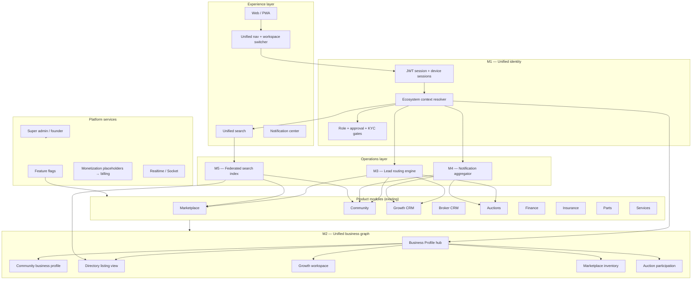
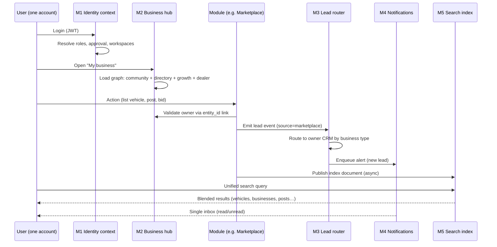
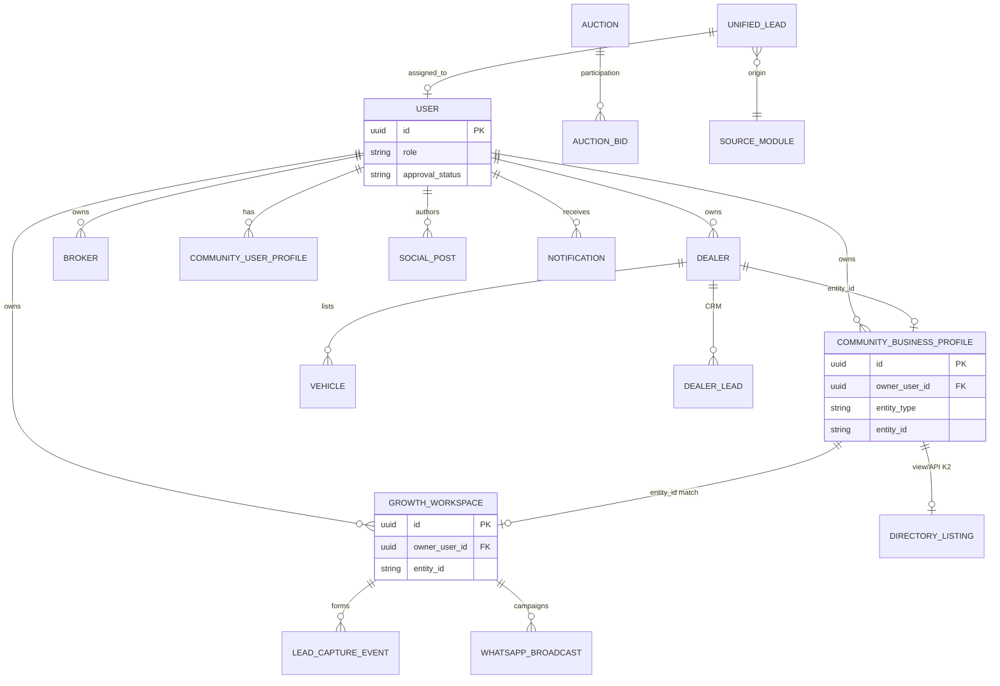
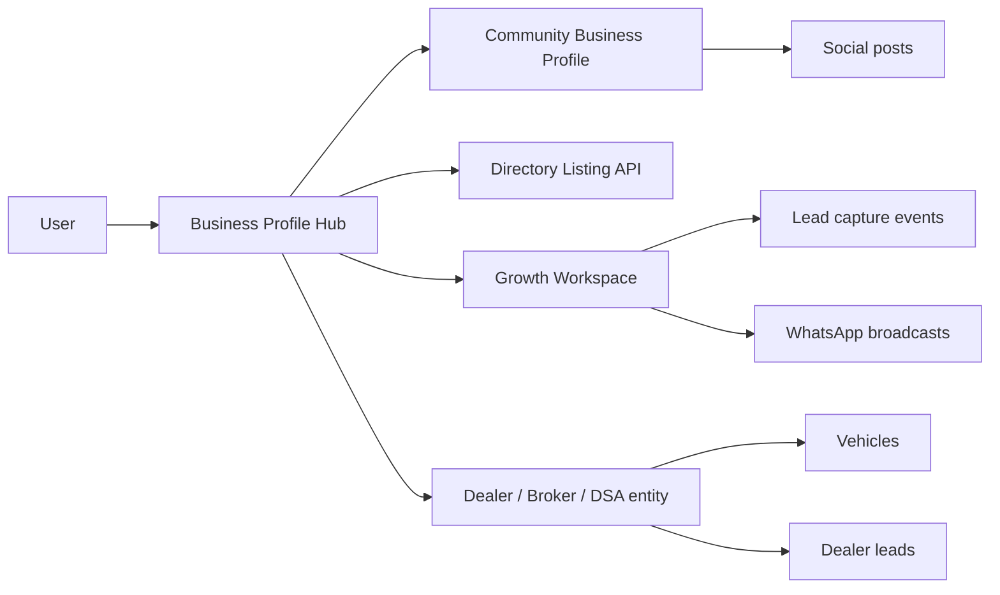
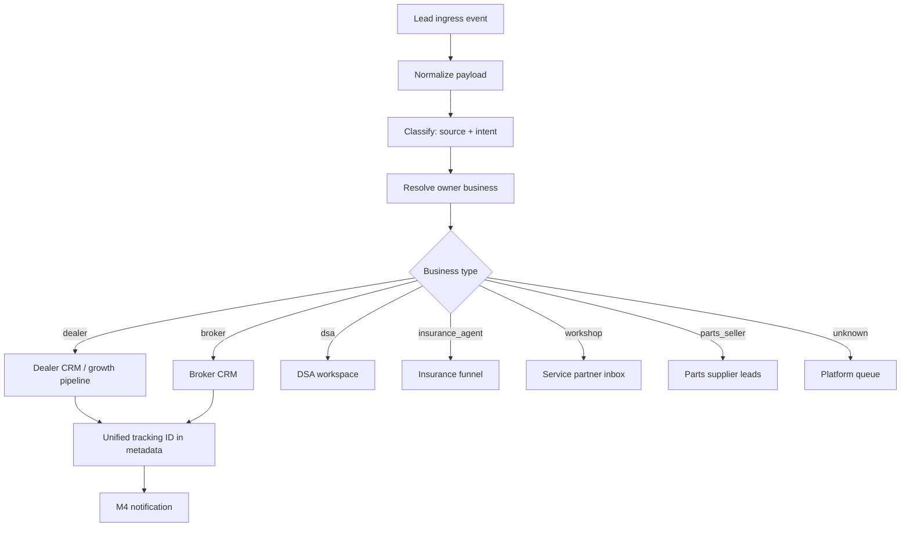
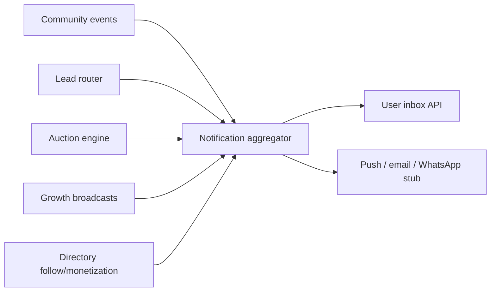
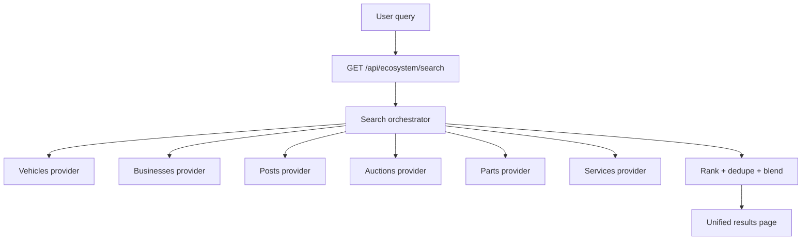
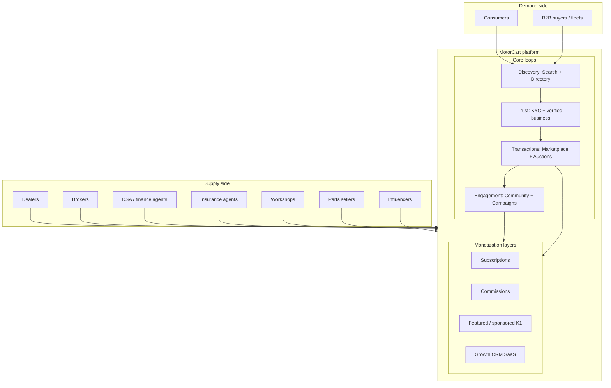

# Phase M1 — Unified MotorCart Ecosystem Architecture & Implementation Plan

**Date:** 2026-06-04  
**Status:** Approved for planning (architecture only)  
**Constraints:** No Prisma changes · No db push · No implementation in this phase

**Builds on:** Marketplace, Auctions, Broker CRM, Community, Business Directory (K2), Growth CRM + Lead Engine (J4), Poster Builder, WhatsApp Foundation (L1), Social Scheduler Foundation (L2), Founder Dashboard (M0), Directory Monetization (K1)

---

## Executive summary

MotorCart today is a **multi-module platform** sharing MySQL and JWT auth, but each vertical (marketplace, community, growth, auctions) owns its own objects and navigation. **M1–M6** define how those modules become **one ecosystem**: one identity, one business graph, one lead router, one notification inbox, one search experience, and one investor story.

This document is the **blueprint only**. Implementation is sequenced in waves behind feature flags, reusing existing tables and link keys (`user_id`, `entity_type` + `entity_id`) wherever possible.

---

## 1. Final architecture diagram



**North-star principle:** The **User** is the root of trust; the **Business Profile** is the root of commercial identity; every module attaches via typed links, not duplicate signups.

---

## 2. Data flow diagram



### 2.1 Canonical identifiers (logical, no schema change in M1 plan)

| Concept | Primary key today | Ecosystem role |
|---------|-------------------|----------------|
| Person | `users.id` | Single sign-on, KYC, roles |
| Business (logical) | `(entity_type, entity_id)` or `community_business_profiles.id` | Hub node in M2 |
| Growth ops | `growth_workspaces.id` | Campaigns, posters, WhatsApp, lead forms |
| Dealer storefront | `dealers.id` | Inventory + dealer CRM |
| Broker desk | `brokers.id` | Broker CRM (separate module, linked by owner) |

**Link rule (already partially implemented in K2/J):**  
`community_business_profiles.entity_id` ↔ `growth_workspaces.entity_id` ↔ `dealers.id` (when `entity_type = dealer`).

---

## 3. Module relationships



| Module | Upstream dependency | Downstream consumers |
|--------|---------------------|----------------------|
| Marketplace | User, Dealer | Leads, Search, Notifications, Directory (dealer discovery) |
| Community | User, Business profile | Directory feed, Search (posts/groups), Notifications |
| Directory (K2) | Community business profiles | Search (businesses), Monetization (K1), Leads |
| Growth CRM | User, Workspace | Lead engine, WhatsApp (L1), Social (L2), Notifications |
| Auctions | User, KYC | Notifications, Search, Leads (registration interest) |
| Broker CRM | User, Broker | Leads (broker-owned), separate workspace |
| Finance / Insurance | User, Applications | Notifications, admin approvals |
| Founder (M0) | Read-only aggregates | Investor narrative, ops KPIs |

---

## M1 — Unified Identity Layer

### 3.1 Problem today

- One `users` row exists, but **session context is module-local**: dealer dashboard, growth workspace header, community persona, auction gate each assume different “active hat.”
- Post-login routing (`workspace-redirect`, role dashboards) sends users to **one silo** unless they know cross-links (e.g. `/dashboard/growth`).

### 3.2 Target design

**Ecosystem Identity Context** (resolved on every authenticated request):

```text
EcosystemContext {
  user_id
  primary_role          // AppRole
  approval_status
  kyc_status
  personas[]            // customer | business_owner | admin
  businesses[]          // { entity_type, entity_id, business_profile_id, slug }
  active_workspace      // { type: dealer|growth|broker|..., id }
  entitlements[]        // feature flags + plan tier
  capabilities[]        // sell_vehicle, post_community, run_campaign, bid_auction, ...
}
```

### 3.3 Dealer journey (example)

| Step | Identity action | Module unlocked |
|------|-----------------|-----------------|
| 1 | Register business (`dealer`) | Pending approval |
| 2 | Admin approves | `active` + dealer record |
| 3 | Auto-provision links (M2) | Community page + directory + growth workspace |
| 4 | User switches hat in nav | Same JWT; `active_workspace` changes |
| 5 | List vehicle | Marketplace uses `dealer.id` from context |
| 6 | Post update | Community uses `owner_user_id` |
| 7 | Launch campaign | Growth uses `growth_workspace.id` |
| 8 | Register for auction | Auction checks KYC + dealer link |

### 3.4 Implementation plan (future, no schema required for v1)

| Wave | Deliverable | Approach |
|------|-------------|----------|
| M1.0 | `GET /api/ecosystem/context` | Compose from existing tables + flags |
| M1.1 | Workspace switcher UI | Writes `active_workspace` to session metadata or client store |
| M1.2 | Unified post-login | `resolve-post-login` → ecosystem home, not single CRM |
| M1.3 | Capability matrix | Map role + approval → capabilities (config-driven) |
| M1.4 | SSO / OAuth merge | Same context resolver on OAuth callback |

**Flag proposal:** `FEATURE_M1_UNIFIED_IDENTITY` (default off)

---

## M2 — Unified Business Layer

### 4.1 Central object: Business Profile Hub

Logical aggregate (API composition, not necessarily one new table in v1):

```text
BusinessProfileHub {
  business_profile_id    // community_business_profiles.id
  owner_user_id
  entity_type            // dealer | broker | dsa | ...
  entity_id              // dealers.id | brokers.id | ...
  community { slug, followers, feed_enabled }
  directory { category, monetization, verified }
  growth { workspace_id, campaigns, lead_forms }
  marketplace { dealer_id, active_listings_count }
  auction { partner_status, entries_count }
  metadata { brand, locations, services }
}
```

### 4.2 Relationship rules



| Link | Current state | M2 target |
|------|---------------|-----------|
| User → Business profile | Exists (`owner_user_id`) | Mandatory on business signup |
| Business → Growth workspace | Partial (`entity_id` match in K2) | Provision on approval job |
| Business → Dealer inventory | `dealers.owner_id` | Surface in hub API |
| Business → Directory | K2 read model | Single slug across surfaces |
| Monetization (K1) | `metadata` on profile | Shown in hub + directory |

### 4.3 Implementation plan

| Wave | Deliverable |
|------|-------------|
| M2.0 | `GET /api/ecosystem/business/:slug` — aggregated hub |
| M2.1 | Onboarding orchestration (approve → create missing links) |
| M2.2 | Admin “business graph” view in super-admin |
| M2.3 | Conflict resolution (duplicate slugs, entity mismatch) |

**Flag:** `FEATURE_M2_UNIFIED_BUSINESS`

---

## M3 — Unified Lead Routing

### 5.1 Lead sources (ingress)

| Source ID | Origin module | Typical trigger |
|-----------|---------------|-----------------|
| `marketplace` | Vehicle listing / dealer contact | Call, form, chat |
| `directory` | Business profile CTA | Contact, WhatsApp click |
| `community` | Post / DM / business page | Inquiry |
| `campaign` | Growth form / broadcast reply | Capture event |
| `auction` | Lot interest / registration | Bid intent, register |
| `broker` | Broker CRM | Existing broker leads (read-only bridge) |

### 5.2 Routing engine (logical)



### 5.3 Ownership & tracking (no new table v1)

**Unified Lead Record (logical):**

```text
{
  id: "<source>:<native_id>",      // e.g. growth:event_uuid
  source: "campaign",
  owner: { user_id, entity_type, entity_id },
  assignee: { user_id | null },
  stage: "new | contacted | …",
  native_refs: { growth_event_id?, dealer_lead_id?, lead_id? },
  attribution: { campaign, utm, listing_id, post_id },
  created_at, updated_at
}
```

| Storage today | M3 bridge strategy |
|---------------|-------------------|
| `growth_lead_capture_events` + `payload._crm` | Canonical for growth/directory/campaign |
| `dealer_leads` / `leads` | Marketplace ingress mirrored via webhook-style internal event |
| Broker leads | Read-only federation; no broker module edits in early waves |
| Auction interest | `metadata` on bid/register + router copy |

### 5.4 Implementation plan

| Wave | Deliverable |
|------|-------------|
| M3.0 | Lead event contract + `POST /api/ecosystem/leads/ingress` (internal) |
| M3.1 | Router rules config (YAML/JSON in platform config) |
| M3.2 | Unified pipeline UI in Growth (federated view) |
| M3.3 | Dealer CRM mirror (event bus only, no dealer file edits until approved) |
| M3.4 | SLA + assignment policies |

**Flag:** `FEATURE_M3_UNIFIED_LEADS`

---

## M4 — Unified Notification Center

### 6.1 Problem today

Notifications are **fragmented**: `notifications`, `platform_notifications`, `auction_notifications`, growth message logs, email stubs.

### 6.2 Target design

```text
UnifiedNotification {
  id
  user_id
  category          // community | lead | auction | campaign | directory | system
  severity          // info | action_required | critical
  title, body, deep_link
  source_module
  source_ref_id
  read_at
  created_at
  metadata
}
```

**Ingestion pattern (aggregator):**



### 6.3 UX

- Single bell icon in global nav
- Filters: All · Leads · Auctions · Community · Campaigns
- Deep links into correct workspace (M1 context switch if needed)

### 6.4 Implementation plan

| Wave | Deliverable |
|------|-------------|
| M4.0 | `GET /api/ecosystem/notifications` — merge existing tables |
| M4.1 | Mark read / archive |
| M4.2 | Realtime channel `user:{id}:notifications` |
| M4.3 | Preference center (per category opt-out) |

**Flag:** `FEATURE_M4_UNIFIED_NOTIFICATIONS`

---

## M5 — Unified Search

### 7.1 Search domains

| Index | Content | Primary table(s) |
|-------|---------|----------------|
| `vehicles` | Cars, bikes, trucks | `vehicles` |
| `businesses` | Directory + community business | `community_business_profiles` |
| `posts` | Feed content | `social_posts` |
| `groups` | Community groups | `community_groups` |
| `auctions` | Lots / events | auction tables |
| `parts` | Catalog SKUs | parts tables |
| `services` | Workshops, bookings | service centers |

### 7.2 Architecture



**Phase 1 (no Elasticsearch required):** parallel SQL queries + in-memory merge (flags per domain).  
**Phase 2:** OpenSearch / Typesense with nightly sync jobs.

### 7.3 Result card types

- `vehicle_card`, `business_card`, `post_card`, `auction_card`, `part_card`, `service_card`
- Each card carries `deep_link` and `entity` for M1 context

### 7.4 Implementation plan

| Wave | Deliverable |
|------|-------------|
| M5.0 | Federated search API (SQL merge) |
| M5.1 | Global search bar in marketing nav |
| M5.2 | Filters + facets by domain |
| M5.3 | External index + analytics |

**Flag:** `FEATURE_M5_UNIFIED_SEARCH`

---

## M6 — Investor Blueprint

### 8.1 Complete ecosystem diagram (investor view)



### 8.2 Revenue streams

| Stream | Model | Timing | Dependency |
|--------|-------|--------|------------|
| **Dealer subscriptions** | Tiered SaaS (listings cap, CRM, analytics) | Mature | M2 hub + dealer CRM |
| **Broker subscriptions** | Seat-based CRM | Mature | Broker module |
| **Growth CRM** | Workspace plans + broadcast quotas | Near-term | L1 WhatsApp live |
| **Directory monetization** | Featured / sponsored / premium (K1) | Near-term | K1 + billing |
| **Auction fees** | Listing + success fee | Medium | Auction KYC gate |
| **Marketplace commission** | % on facilitated sale / lead | Medium | Escrow / agreements |
| **Finance / insurance referrals** | CPA per disbursed lead | Long | Partner banks |
| **Parts & services** | Take rate on GMV | Long | Checkout maturity |
| **Ads & brand** | Homepage, category takeovers | Medium | Traffic (M5 search) |

### 8.3 Subscription streams (packaging)

| Tier | Audience | Includes |
|------|----------|----------|
| Free | Small dealer | Limited listings, directory listing, community page |
| Pro | Active dealer | CRM leads, growth workspace, posters |
| Enterprise | Groups / OEM | Multi-location, API, auction partner, SLA |
| Broker Pro | Brokers | Pipeline, commissions, WhatsApp |
| Growth Add-on | Any business | Campaigns, L1 sends, L2 social |

### 8.4 Commission streams

| Transaction type | Typical take | Notes |
|------------------|--------------|-------|
| Vehicle sale facilitation | 0.5–2% or flat lead fee | Legal framework per state |
| Auction success | 1–3% buyer/seller side | Dispute + KYC policy |
| Finance referral | Fixed CPA ₹X–Y | Bank contracts |
| Insurance policy | % of premium | IRDAI compliance |
| Parts order | 8–15% marketplace | Logistics partner |

### 8.5 Growth opportunities

1. **Unified onboarding** (M1+M2) → higher activation vs siloed signups  
2. **Lead router** (M3) → more monetizable conversations per visitor  
3. **Search** (M5) → SEO + intent capture across verticals  
4. **WhatsApp + social** (L1+L2) → retention and campaign ROI for supply side  
5. **Directory K1** → land-and-expand for non-dealer businesses (workshops, DSA)  
6. **Auction cross-sell** → dealer inventory liquidation channel  
7. **Data asset** (anonymized) → pricing indices, regional demand (future)

### 8.6 Risks

| Risk | Impact | Mitigation |
|------|--------|------------|
| Module silos persist | Poor UX, duplicate data | M1–M2 program governance; ecosystem APIs |
| Lead duplication | Owner confusion | M3 canonical ID + dedupe rules |
| Compliance (finance/insurance) | Legal exposure | Keep referrals separate; clear disclosures |
| Auction fraud / shill bidding | Trust loss | Existing fraud admin + KYC gate |
| WhatsApp policy violations | Account ban | L1 template approval + opt-in |
| Scope creep on Prisma | Delivery delay | Metadata bridges until revenue proven |
| Broker/dealer module coupling | Regression | Flag-gated waves; no touch without approval |

### 8.7 Breakeven model (illustrative)

**Assumptions (replace with real ops data):**

| Variable | Year 1 placeholder |
|----------|-------------------|
| Paying dealers | 200 @ ₹2,999/mo avg |
| Growth workspaces | 150 @ ₹999/mo |
| Directory premium | 50 @ ₹1,499/mo |
| Auction + commission | ₹15L/mo blended |
| Team + infra burn | ₹18L/mo |

```text
MRR_subscriptions ≈ (200 × 2999) + (150 × 999) + (50 × 1499) ≈ ₹8.9L
MRR_transactions  ≈ ₹15L
MRR_total         ≈ ₹24L / month

Annual run-rate   ≈ ₹2.9 Cr

If burn = ₹18L/mo → breakeven when MRR_total ≥ burn
→ requires ~2× subscription scale OR ~1.2× commission lift vs above
→ realistic breakeven window: 18–30 months post unified launch (M1–M5 live)
```

Sensitivity: each +100 Pro dealers ≈ +₹3L MRR. Founder dashboard (M0) should track these KPIs when billing connects.

### 8.8 Investor positioning

**One-liner:**  
MotorCart is the **operating system for automotive commerce in India** — discovery, trust, transactions, and engagement in one account for every participant.

**Differentiation:**

- Not just classifieds (marketplace + auctions)  
- Not just social (community + directory)  
- Not just MarTech (growth CRM + WhatsApp + posters)  
- **Unified business graph** lowers CAC for supply and increases lead yield per visitor  

**Comparable narrative arcs:** vertical Shopify + LinkedIn + HubSpot for auto — with India-specific finance/insurance/partnership layers.

**Ask framing (example):** Seed/extension to complete M1–M5, activate monetization (K1+billing), and scale supply acquisition in 3 pilot cities.

---

## 9. Implementation roadmap (planning only)

| Phase | Scope | Depends on | Est. effort |
|-------|-------|------------|-------------|
| **M1** | Identity context API + switcher | Auth middleware | 2–3 sprints |
| **M2** | Business hub API + provisioning | M1, K2, J | 2–3 sprints |
| **M3** | Lead ingress + router + federated UI | M2, J4 | 3–4 sprints |
| **M4** | Notification aggregator + inbox UI | M1, M3 | 2 sprints |
| **M5** | Federated search v1 | M2, K2 | 2–3 sprints |
| **M6** | Investor metrics in M0 + billing | K1, subscriptions | Ongoing |

**Governance:** Each wave ships behind flags; smoke tests mirror K1/L1 pattern (off → 404).

**Explicit exclusions (per program rules):** No Prisma/db push in M1 planning phase; no broker/dealer/auction/community/marketplace file edits until a dedicated implementation approval names the wave.

---

## 10. Founder recommendations

1. **Prioritize M1 + M2 before M5** — identity and business graph unlock every other ROI story; search without correct ownership frustrates users.  
2. **Treat M3 as the revenue lever** — unified lead routing directly connects traffic to monetized CRM workflows (Growth + dealer).  
3. **Ship M4 early as “feel unified”** — even a read-only merge of existing notification tables improves perception before full realtime.  
4. **Keep broker and dealer CRM boundaries** — federate via events; avoid merging codebases without a dedicated refactor approval.  
5. **Activate K1 + billing before promising investor ARR** — M0 placeholders are honest; wire subscription counts when Razorpay/Stripe lands.  
6. **Pilot one city with one vertical** — e.g. Pune dealers: full loop signup → list → community → campaign → lead in inbox.  
7. **Document link hygiene** — every new feature must declare `entity_type` + `entity_id` or be rejected in architecture review.  
8. **Investor deck = this doc’s M6 diagrams** — use founder dashboard metrics as live appendix once flags on.

---

## 11. Deliverables checklist

| Deliverable | Section |
|-------------|---------|
| Final architecture diagram | §1 |
| Data flow diagram | §2 |
| Module relationships | §3 + per-module tables |
| M1 Unified Identity | §3 (M1) |
| M2 Unified Business | §4 |
| M3 Unified Lead Routing | §5 |
| M4 Unified Notifications | §6 |
| M5 Unified Search | §7 |
| M6 Investor blueprint | §8 |
| Revenue model | §8.2–8.4 |
| Investor narrative | §8.8 |
| Founder recommendations | §10 |
| Implementation plan (no code) | §9 |

---

## 12. Approval record

| Item | Value |
|------|-------|
| Phase | M1 Unified Ecosystem Architecture |
| Implementation in this PR/doc | **None** |
| Schema changes | **None** |
| Next gate | Per-wave implementation approval (M1.0, M2.0, …) |

**Status:** Ready for stakeholder review. No code or schema changes included.
