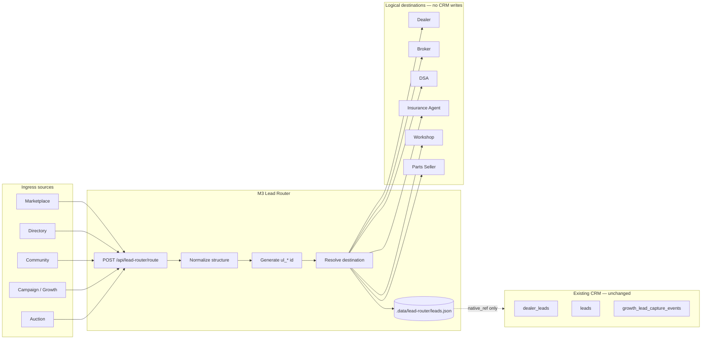

# Phase M3.0 — Unified Lead Router — Applied Results

**Date:** 2026-06-04  
**Approval:** M3.0 Unified Lead Router  
**References:** [PHASE-M1-UNIFIED-ECOSYSTEM-PLAN.md](./PHASE-M1-UNIFIED-ECOSYSTEM-PLAN.md), [PHASE-M1.0-M2.0-APPLIED-RESULTS.md](./PHASE-M1.0-M2.0-APPLIED-RESULTS.md)

---

## 1. Summary

| Rule | Status |
|------|--------|
| No Prisma / db push | ✅ |
| No breaking changes | ✅ |
| No Dealer / Broker / Auction / Finance / Insurance CRM edits | ✅ |
| Does not move existing leads | ✅ |
| Routing layer only | ✅ |
| Feature flag default OFF → 404 | ✅ |

**Storage:** Routed leads persist in `backend/.data/lead-router/leads.json` (gitignored). Existing CRM tables are **read-only counted** in overview only.

---

## 2. APIs added

| Method | Path | Auth | Flag |
|--------|------|------|------|
| GET | `/api/lead-router/overview` | Platform admin | `FEATURE_M3_LEAD_ROUTER` |
| GET | `/api/lead-router/history` | Platform admin | same |
| POST | `/api/lead-router/route` | Any authenticated JWT | same |

### POST body (ingress)

```json
{
  "source": "marketplace",
  "contact": { "name": "...", "phone": "...", "email": "..." },
  "intent": "vehicle_inquiry",
  "ownership": {
    "owner_user_id": "uuid",
    "entity_type": "dealer",
    "entity_id": "uuid",
    "business_profile_id": "uuid"
  },
  "native_ref": { "source_module": "marketplace", "native_id": "existing-lead-id" },
  "attribution": { "listing_id": "..." },
  "destination": "dealer"
}
```

### Unified lead record

| Field | Description |
|-------|-------------|
| `id` | `ul_{uuid}` |
| `source` | `marketplace` \| `directory` \| `community` \| `campaign` \| `auction` |
| `destination` | `dealer` \| `broker` \| `dsa` \| `insurance_agent` \| `workshop` \| `parts_seller` |
| `status` | `new` → `routed` (extensible: `delivered`, `failed`) |
| `ownership` | Owner user + entity + business profile |
| `native_ref` | Pointer only — **does not move** native CRM rows |
| `history` | Status timeline |

Destination defaults from `entity_type` via `ENTITY_TYPE_TO_DESTINATION` map.

---

## 3. Lead flow diagram



---

## 4. Frontend

| Route | Page | Mode |
|-------|------|------|
| `/dashboard/super-admin/lead-router` | `LeadRouterPage` | Read-only overview + history |

Flag: `VITE_FEATURE_M3_LEAD_ROUTER`

---

## 5. Files added

### Backend

- `src/lib/lead-router/types.ts`
- `src/lib/lead-router/constants.ts`
- `src/lib/lead-router/guard.ts`
- `src/lib/lead-router/store.ts`
- `src/services/lead-router.service.ts`
- `src/app/api/lead-router/overview/route.ts`
- `src/app/api/lead-router/history/route.ts`
- `src/app/api/lead-router/route/route.ts`
- `scripts/smoke-m3-lead-router.ts`

### Frontend

- `src/integrations/api/lead-router.ts`
- `src/features/platform-admin/pages/LeadRouterPage.tsx`

---

## 6. Files modified

- `backend/src/config/feature-flags.ts`
- `backend/.env.example`
- `.gitignore` (`backend/.data/`)
- `frontend/src/config/feature-flags.ts`
- `frontend/.env.example`
- `frontend/src/router/index.tsx`
- `frontend/src/router/lazy-pages.tsx`
- `frontend/src/features/platform-admin/config/admin-erp-nav.ts`

---

## 7. Feature flags

```env
# Backend
FEATURE_M3_LEAD_ROUTER=false

# Frontend
VITE_FEATURE_M3_LEAD_ROUTER=false
```

---

## 8. Smoke tests

```bash
cd backend
npx tsx scripts/smoke-m3-lead-router.ts
```

**Flags OFF:**

| Request | Expected |
|---------|----------|
| GET `/api/lead-router/overview` | 404 |
| GET `/api/lead-router/history` | 404 |
| POST `/api/lead-router/route` | 404 |
| GET `/api/health` | 200 |

**Flags ON:** overview/history need platform admin JWT; POST needs any valid JWT.

---

## 9. Rollback plan

1. Set `FEATURE_M3_LEAD_ROUTER` and `VITE_FEATURE_M3_LEAD_ROUTER` to `false`.
2. Restart API and frontend.
3. Endpoints return 404; optional delete `backend/.data/lead-router/` to clear routed test data.
4. No database migration to revert.

---

## 10. Next steps (not in M3.0)

- Module webhooks calling `POST /route` from marketplace/directory/community ingress
- M4 notification on `routed` status
- Optional MySQL table when schema approval granted (migrate from JSON store)

**Status:** Ready for review.
