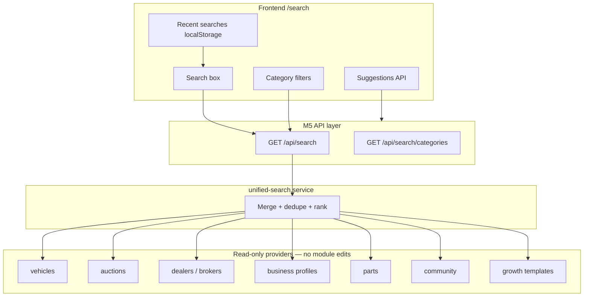
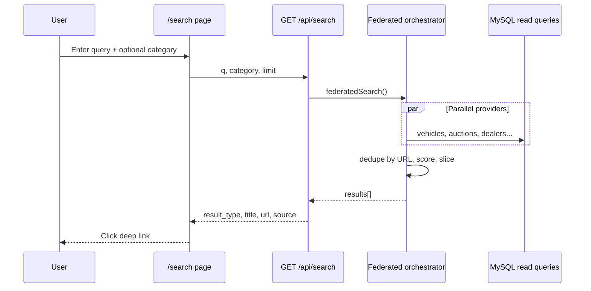

# Phase M5.0 — Unified Search Platform — Applied Results

**Date:** 2026-06-04  
**Approval:** M5.0 Federated Unified Search  
**References:** [PHASE-M1-UNIFIED-ECOSYSTEM-PLAN.md](./PHASE-M1-UNIFIED-ECOSYSTEM-PLAN.md)

---

## 1. Summary

| Rule | Status |
|------|--------|
| No Prisma / db push | ✅ |
| No breaking changes | ✅ (`/search` legacy UI when flag off) |
| No Dealer / Broker / Auction / Finance / Insurance module edits | ✅ |
| Federated read-only providers | ✅ |
| Feature flag default OFF → 404 | ✅ |

---

## 2. APIs added

| Method | Path | Auth | Flag |
|--------|------|------|------|
| GET | `/api/search` | Public | `FEATURE_M5_UNIFIED_SEARCH` |
| GET | `/api/search/suggestions` | Public | same |
| GET | `/api/search/categories` | Public | same |

**Query params (`/api/search`):** `q`, `category`, `limit`, `offset`

**Result shape:**

```json
{
  "result_type": "used_car",
  "title": "...",
  "description": "...",
  "url": "/vehicles/...",
  "source": "marketplace",
  "score": 3
}
```

---

## 3. Search domains (providers)

| Domain | `result_type` | Source table / module |
|--------|---------------|------------------------|
| Vehicles | `vehicle`, `new_car`, `used_car`, `bike` | `vehicles` |
| Auctions | `auction` | `auctions` |
| Dealers | `dealer` | `dealers` |
| Brokers | `broker` | `brokers` |
| DSA | `dsa` | `community_business_profiles` |
| Insurance agents | `insurance_agent` | same |
| Workshops | `workshop` | same |
| Parts sellers | `parts_seller` | profiles + `parts` catalog |
| Community posts | `community_post` | `social_posts` |
| Community groups | `community_group` | `community_groups` |
| Business pages | `business_page` | profiles → `/business/:slug` |
| Directory listings | `directory_listing` | profiles → `/directory/:cat/:slug` |
| Growth templates | `growth_template` | `growth_whatsapp_templates` |

---

## 4. Search architecture



---

## 5. Search flow diagram



---

## 6. Frontend

| Route | Behavior |
|-------|----------|
| `/search` | `UnifiedSearchPage` when M5 flag **on** |
| `/search` | Legacy `SearchResultsPage` (vehicles + mock parts) when flag **off** |

**Features:** Global search box, category filters, live suggestions, recent searches (localStorage), federated results list.

Flag: `VITE_FEATURE_M5_UNIFIED_SEARCH`

---

## 7. Files added

### Backend

- `src/lib/unified-search/types.ts`
- `src/lib/unified-search/categories.ts`
- `src/lib/unified-search/guard.ts`
- `src/lib/unified-search/scoring.ts`
- `src/lib/unified-search/providers.ts`
- `src/services/unified-search.service.ts`
- `src/app/api/search/route.ts`
- `src/app/api/search/suggestions/route.ts`
- `src/app/api/search/categories/route.ts`
- `scripts/smoke-m5-search.ts`

### Frontend

- `src/integrations/api/unified-search.ts`
- `src/features/unified-search/pages/UnifiedSearchPage.tsx`

---

## 8. Files modified

- `backend/src/config/feature-flags.ts`
- `backend/.env.example`
- `frontend/src/config/feature-flags.ts`
- `frontend/.env.example`
- `frontend/src/features/search/pages/SearchResultsPage.tsx`

---

## 9. Smoke tests

```bash
cd backend
npx tsx scripts/smoke-m5-search.ts
```

**Flags OFF:** `/api/search*`` → **404**; `/api/health` → **200**.

---

## 10. Rollback plan

1. Set `FEATURE_M5_UNIFIED_SEARCH` and `VITE_FEATURE_M5_UNIFIED_SEARCH` to `false`.
2. Restart servers — APIs 404; `/search` reverts to legacy marketplace search UI.
3. No database rollback.

---

**Status:** Ready for review.
