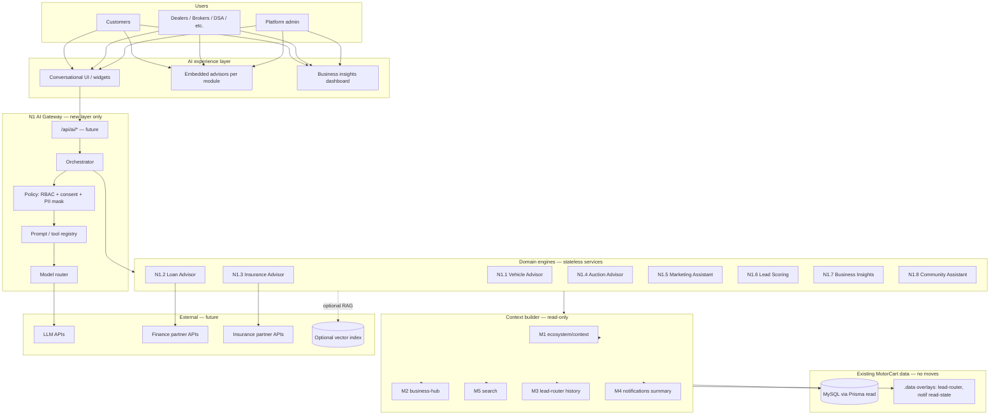
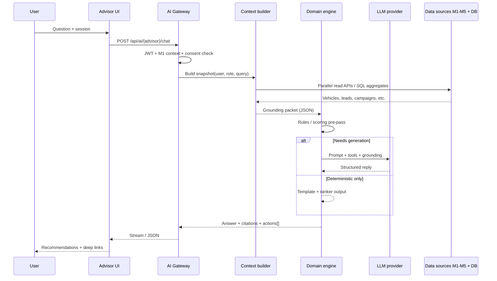
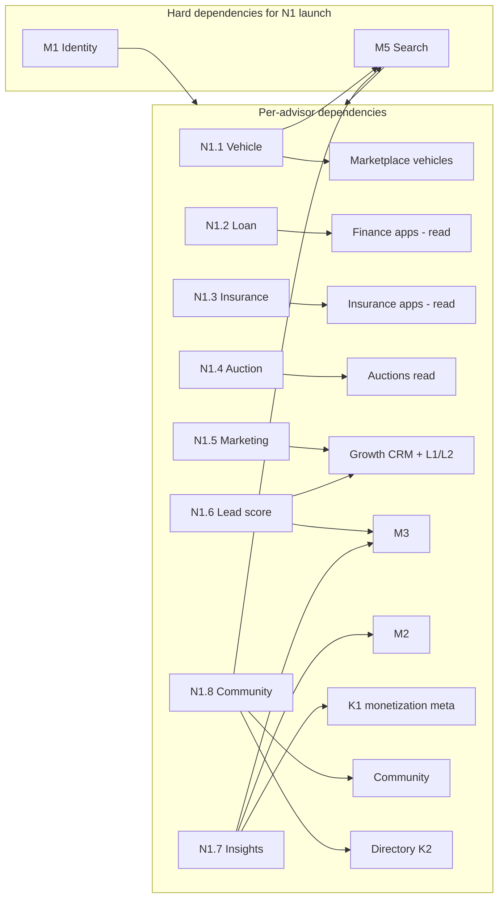
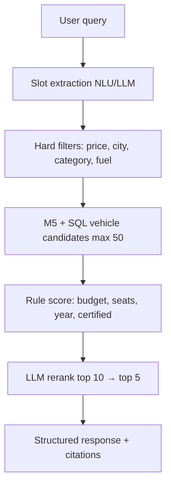
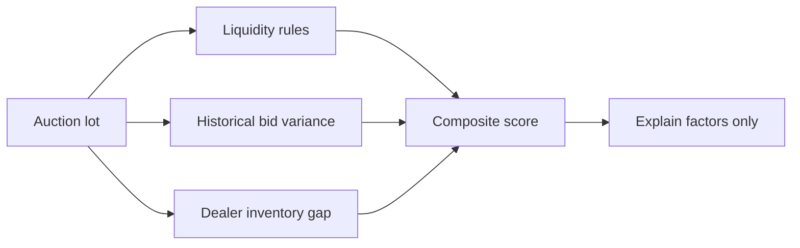
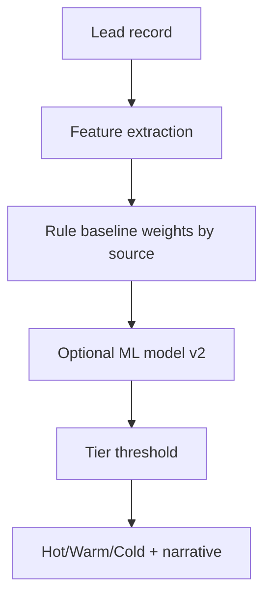
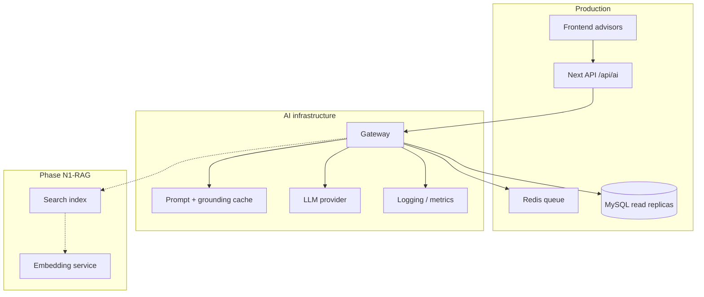

# Phase N1 — MotorCart AI Ecosystem Architecture

**Date:** 2026-06-04  
**Status:** Approved for architecture (planning only)  
**Constraints:** No code · No Prisma changes · No db push · No source-module edits in this phase

**Builds on:** Marketplace, Auctions, Community, Directory (K2), Broker CRM, Growth CRM (J–L), Lead Engine (J4), M1 Identity, M2 Business Hub, M3 Lead Router, M4 Notifications, M5 Unified Search

---

## Executive summary

MotorCart’s **data and workflow layer (M1–M5)** is in place. **N1** defines a single **AI control plane** that sits above existing modules: advisors and assistants **read** federated context via APIs and table-backed providers, **never** mutating Dealer/Broker/Auction/Finance/Insurance CRM code paths in early waves.

All eight capabilities (N1.1–N1.8) share:

- **AI Gateway** — auth, rate limits, PII redaction, prompt registry, model routing  
- **Context Builder** — M1 ecosystem context + M2 business hub + M5 search + module-specific snapshots  
- **Recommendation / scoring engines** — rules + ML/LLM hybrid, versioned outputs  
- **Feature flags** — per advisor, default OFF  

**N2** covers investor narrative: AI revenue, subscriptions, infrastructure cost bands, phased roadmap, and risks.

---

## 1. AI architecture (platform view)



**Design principles**

| Principle | Implication |
|-----------|-------------|
| Read-only first | Advisors query snapshots; writes go through existing module APIs only when explicitly approved later |
| No CRM surgery | N1.4/N1.6 consume auction/lead **exports**, not Broker/Dealer CRM file changes |
| Grounded answers | Every LLM response cites `data_sources[]` + `confidence`; fallback to rules when data missing |
| India-first | Budgets in INR, fuel/EV policy copy, regional lender placeholders |
| Flag-gated | `FEATURE_N1_*` per advisor; 404 when off (same pattern as M1–M5) |

---

## 2. Data flow (request lifecycle)



**Grounding packet (logical schema — no new DB table in N1)**

```json
{
  "user_id": "uuid",
  "role": "customer",
  "workspace": { "active_business": "..." },
  "query": "best family car under 15 lakh",
  "sources_used": [
    { "module": "marketplace", "ref": "vehicles", "count": 42 },
    { "module": "search", "ref": "M5 federated", "count": 12 }
  ],
  "facts": [],
  "policy": { "disclaimer": "Not financial advice", "locale": "en-IN" }
}
```

---

## 3. Module dependencies



| N1 module | Must have (read) | Must not modify in N1 |
|-----------|------------------|------------------------|
| N1.1 | `vehicles`, M5 search, optional `wishlists` | Dealer CRM |
| N1.2 | `finance_applications`, user KYC metadata | Finance module routes |
| N1.3 | `insurance_applications`, policy metadata | Insurance module routes |
| N1.4 | `auctions`, `auction_bids`, `dealer_auction_entries`, vehicle link | Auction engine, Broker CRM |
| N1.5 | Growth workspaces, designs, templates, posters (J2–J3), L1 stubs | Broker WhatsApp |
| N1.6 | M3 router store + `growth_lead_capture_events._crm` | Dealer/Broker lead tables write |
| N1.7 | M2 hub counts, M3 aggregates, Growth analytics, M0-style counts | Billing execution |
| N1.8 | `social_posts`, `community_groups`, `community_business_profiles`, M5 | Community write APIs |

---

## N1.1 — AI Vehicle Advisor (customer)

### Purpose

Help buyers choose vehicles with **explainable**, inventory-grounded suggestions.

### Example queries

- Which car should I buy?  
- Best car under ₹X budget?  
- EV vs petrol for my usage?  
- Family car for 5 members in Bangalore?

### Inputs

| Input | Source |
|-------|--------|
| Natural language question | UI |
| Budget min/max, city, fuel preference | Chat slots or form |
| Body type, seats, new/used | Optional filters |
| M1 customer profile | `users`, `customer_vehicles` (if any) |
| Browsing signals | Wishlist, recent M5 search queries (client + server log overlay) |

### Outputs

| Output | Description |
|--------|-------------|
| `recommendations[]` | Ranked vehicles: title, price, why_fit, pros/cons |
| `comparison` | Side-by-side 2–3 options |
| `budget_fit` | % of budget, TCO note (fuel/EV stub) |
| `deep_links[]` | `/vehicles/{category}/{slug}` |
| `disclaimer` | Non-binding; verify on dealer page |
| `confidence` | high / medium / low |

### Recommendation engine (logical)



**Rule examples (deterministic layer):**

- Penalize if `price > budget_max`  
- Boost `is_certified`, newer `year`, matching `fuel_type`  
- EV vs petrol: policy table (city congestion, annual km) — config JSON, not schema  

### Data sources

- `vehicles` (available/reserved, not deleted)  
- M5 federated search (`result_type` vehicle / new_car / used_car / bike)  
- Optional: `vehicle_specs` for feature answers  

**Future:** price history index, insurer IDV — external feeds.

---

## N1.2 — AI Loan Advisor (customer)

### Purpose

Guide loan eligibility, EMI estimates, and lender **shortlists** using future partner integrations.

### Example queries

- How much loan can I get?  
- EMI for ₹8L over 5 years?  
- Best lender for self-employed?

### Inputs

| Input | Source |
|-------|--------|
| Income, employment type, existing EMIs | User-declared (session) |
| Vehicle price / LTV | Linked listing or manual |
| Credit band | Self-reported or future bureau API |
| City, tenure | Form |
| `finance_applications` history | Read-only user rows |

### Outputs

| Output | Description |
|--------|-------------|
| `eligible_range` | Min–max amount (illustrative until partner API) |
| `emi_scenarios[]` | Rate bands (config), tenure options |
| `lender_shortlist[]` | Partner metadata (name, USP, deep link) |
| `documents_checklist` | Static + role-based |
| `apply_deep_link` | `/finance/apply` with prefill token (future) |
| `disclaimer` | Not an offer; subject to bank approval |

### Recommendation engine

1. **EMI calculator** — deterministic `P, r, n`  
2. **FOIR / LTV rules** — config thresholds per lender tier  
3. **LLM explainer** — narrative only on computed numbers  
4. **Partner ranker** — when `FINAPI` returns real eligibility, override rules  

### Data sources

- `finance_applications`, `users.kyc_data` (read)  
- Marketplace vehicle price (optional link)  
- **Future:** bank NBFC APIs, CIBIL proxy, MotorCart finance admin status  

**No Finance module code changes in N1 architecture phase.**

---

## N1.3 — AI Insurance Advisor (customer)

### Purpose

Policy comparison framing, renewal reminders logic, and claim **guidance** (not legal advice).

### Example queries

- Best policy for new car?  
- Renewal vs port?  
- How to file cashless claim?

### Inputs

| Input | Source |
|-------|--------|
| Vehicle age, IDV, NCB, claim history | User + `insurance_applications` |
| Policy type (comprehensive / TP) | Form |
| City, usage | Profile |

### Outputs

| Output | Description |
|--------|-------------|
| `policy_recommendations[]` | Tiered options (illustrative partners) |
| `renewal_compare` | Side-by-side if renewal date known |
| `claim_steps[]` | Checklist by claim type |
| `premium_band_estimate` | Rule-based range until INSAPI |
| `deep_links` | `/insurance/quote`, `/insurance/compare` |

### Recommendation engine

- Rules by vehicle age, mandatory TP, add-on eligibility  
- LLM for plain-language steps with fixed template guardrails  
- Future: insurer quote API → replace illustrative bands  

### Data sources

- `insurance_applications`, user metadata  
- Vehicle link from listing  
- **Future:** insurer partner quotes (IRDAI-compliant disclosures)  

---

## N1.4 — AI Auction Advisor (dealer)

### Purpose

Help dealers decide **which auctions to join**, risk awareness, resale estimate bands, and bid guidance.

### Example queries

- Which auction should I join this week?  
- Risk score for Lot #X?  
- Expected resale value?  
- Max bid suggestion?

### Inputs

| Input | Source |
|-------|--------|
| Dealer profile | M2 hub, `dealers`, inventory mix |
| Active auctions | `auctions`, category, timing, current bid |
| Historical bids | `auction_bids`, `dealer_auction_entries` (read) |
| Linked vehicle | `vehicles` / auction metadata |
| Region demand | Rule config + future market index |

### Outputs

| Output | Description |
|--------|-------------|
| `auction_shortlist[]` | Ranked lots with fit score |
| `risk_score` | 0–100 + factors (title, km, category) |
| `resale_estimate` | Low / mid / high INR band |
| `bid_recommendation` | Suggested max bid, increment strategy |
| `deep_links` | `/auctions/{status}/{slug}` |
| `disclaimer` | Not bidding advice; dealer owns P&L |

### Recommendation engine



**Strict boundary:** Read auction tables only; **no** changes to auction bid RPCs or Dealer CRM.

### Data sources

- `auctions`, `auction_bids`, `dealer_auction_entries`  
- Dealer’s `vehicles` for stock context  
- M1 dealer workspace context  

---

## N1.5 — AI Marketing Assistant (business)

### Purpose

Generate marketing assets for **Dealers, Brokers, DSA, Insurance agents, Workshops, Parts sellers** using **Growth CRM** (posters, WhatsApp, social L2).

### Capabilities

| Asset | Output channel |
|-------|----------------|
| WhatsApp copy | L1 template draft → human approve |
| Posters | J3 design brief → existing canvas export |
| Ads / captions / hashtags | L2 social scheduler draft metadata |
| Campaign ideas | Growth workspace notes (metadata overlay) |

### Inputs

| Input | Source |
|-------|--------|
| Business hub | M2 (`entity_type`, name, city, services) |
| Inventory highlight | Vehicles or parts count / featured listing |
| Brand tone | workspace metadata: `brand_voice` |
| Offer / festival | User prompt |
| Past performance | Growth broadcast stats, lead analytics (J4) |

### Outputs

| Output | Description |
|--------|-------------|
| `whatsapp_messages[]` | Template-shaped, variable placeholders |
| `poster_brief` | Headline, subcopy, CTA, image hints for J3 |
| `social_posts[]` | Per-channel caption + hashtags |
| `ad_variants[]` | Short / long copy |
| `suggested_schedule` | L2 schedule stubs (no auto-post in N1) |

### Recommendation engine

- LLM generation with **locked templates** (compliance, no misleading claims)  
- RAG: business profile + top 3 listings  
- Human-in-the-loop: all sends via existing Growth approve flows (L1 template approval)  

### Data sources

- M2 business hub, `growth_workspaces`, `growth_designs`, `growth_whatsapp_templates`  
- Directory monetization flags (K1) for “featured” messaging  
- **Does not** touch Broker CRM WhatsApp  

---

## N1.6 — AI Lead Scoring

### Purpose

Score lead quality **Hot / Warm / Cold** for routing and prioritization without moving native CRM leads.

### Inputs

| Input | Source |
|-------|--------|
| Source | M3: marketplace, directory, community, campaign, auction |
| Activity | M3 history, Growth `_crm` activities, follow-up dates |
| Engagement | WhatsApp delivered/read (Growth logs), directory follow |
| Conversion history | Won/lost stages in `growth_lead_capture_events._crm` |
| Firmographics | Business type, city, verified badge |

### Outputs

| Output | Description |
|--------|-------------|
| `score` | 0–100 |
| `tier` | `hot` \| `warm` \| `cold` |
| `reasons[]` | Explainable factors |
| `suggested_action` | Call now, nurture, archive |
| `unified_lead_id` | M3 `ul_*` reference |

### Recommendation engine



**Example rule weights (config):**

| Signal | Points |
|--------|--------|
| Source = campaign + form complete | +25 |
| Follow-up overdue | −15 |
| Stage = qualified | +20 |
| Phone + email present | +10 |
| Auction + KYC verified | +15 |

**Storage (future implementation options, no schema in N1 doc):**

- Overlay in M3 router metadata or `growth_lead_capture_events.payload._ai_score`  
- No writes to `dealer_leads` / `broker_leads` without explicit approval  

### Data sources

- M3 lead router store + ingress contract  
- Growth lead pipeline (J4)  
- Read-only counts from dealer/broker tables for historical context (optional)  

---

## N1.7 — AI Business Insights (owners)

### Purpose

Executive-style insights for business owners: campaigns, sources, growth and revenue **suggestions** (not transactions).

### Example surfaces

- “Best campaign last 90 days”  
- “Top lead source”  
- “Suggest next WhatsApp blast”  
- “Revenue uplift ideas” (K1 + subscription placeholders)

### Inputs

| Input | Source |
|-------|--------|
| M2 hub aggregates | vehicles, auctions, followers |
| M3 routed leads by source/destination | |
| Growth analytics (J4) | stage, campaign, form |
| M4 notification volume | engagement proxy |
| K1 monetization metadata | featured/sponsored eligibility |
| M0-style platform counts | read-only founder metrics pattern |

### Outputs

| Output | Description |
|--------|-------------|
| `insights[]` | Title, metric, trend, recommendation |
| `charts_metadata` | Series for UI (no new warehouse required v1) |
| `actions[]` | Deep links: Growth, Directory, Business hub |
| `revenue_suggestions` | Placeholder until billing — align with K1/M0 |

### Recommendation engine

- SQL aggregates + week-over-week deltas  
- LLM summarization **only** on numeric facts (anti-hallucination prompt)  
- Benchmarks vs anonymized platform percentiles (future)  

### Data sources

- M2, M3, Growth CRM, M4, directory profiles  
- No Dealer CRM dashboard code changes  

---

## N1.8 — AI Community Assistant (customer + discovery)

### Purpose

Discover **groups, businesses, vehicles, influencers** via conversational search.

### Example queries

- Groups for EV owners in Pune  
- Trusted workshops near me  
- Influencers to follow for SUVs  
- Similar to business X  

### Inputs

| Input | Source |
|-------|--------|
| Query + city | Chat |
| M1 profile / follows | `community_follows` |
| Interests | metadata |

### Outputs

| Output | Description |
|--------|-------------|
| `recommendations[]` | type: group / business / vehicle / influencer |
| `why` | One-line reason |
| `deep_links` | `/community/groups/{slug}`, `/business/{slug}`, `/vehicles/...` |

### Recommendation engine

- **Primary:** M5 federated search with `category` filters  
- **Rerank:** follow graph, verified badge, follower_count  
- LLM: natural language wrapper only  

### Data sources

- M5 search providers (community_post, community_group, business_page, directory_listing, vehicle)  
- `community_business_profiles` where `entity_type = influencer`  

---

## 4. Infrastructure requirements

### 4.1 Application layer (new — future)

| Component | Role |
|-----------|------|
| AI Gateway service | Auth, quotas, logging, routing |
| Prompt registry | Versioned YAML/JSON per advisor |
| Tool executor | Safe calls: M5 search, M2 hub, read-only SQL templates |
| Response validator | JSON schema, disclaimer injection |
| Audit log | Prompt hash, sources, no raw PII in logs (overlay) |

### 4.2 External services

| Service | Use |
|---------|-----|
| LLM API | OpenAI / Azure OpenAI / Anthropic — abstracted |
| Optional vector DB | Typesense / OpenSearch / pgvector — Phase N1-R2 for RAG |
| Queue | Redis/Bull — async poster generation, batch scoring |
| Object storage | Existing uploads for generated assets |
| Secrets manager | API keys server-side only (never Vite client) |

### 4.3 Sizing bands (illustrative monthly, India deployment)

| Scale | MAU | LLM cost band | Infra notes |
|-------|-----|---------------|-------------|
| Pilot | 5k | ₹15k–40k | Shared gateway, cache prompts |
| Growth | 50k | ₹1.5L–4L | Rate limits per role, batch scoring |
| Scale | 500k | ₹15L+ | Dedicated vector index, model tiering |

**Cost controls:** cache grounding packets, small models for scoring, large models only for chat; per-user daily caps.

### 4.4 Security & compliance

- PII masking before LLM (phone, email, PAN in KYC)  
- RBI/IRDAI disclaimers on loan/insurance advisors  
- Auction/dealer: no automated bidding — suggestions only  
- Data residency preference: Azure India / local LLM when available  
- Human review for published marketing (Growth L1 pattern)  

---

## N2 — Investor blueprint (AI)

### 2.1 AI revenue opportunities

| Stream | Model | Buyer |
|--------|-------|-------|
| **AI Pro add-on** | +₹499–1,999/mo per business workspace | Dealers, workshops, brokers |
| **AI Credits** | Pay-per-generation (poster, WhatsApp pack) | All business types |
| **Customer advisors** | Freemium → premium “unlimited chats” | Buyers |
| **Auction AI** | Per-dealer tier on auction participation | Dealers |
| **Lead scoring API** | Bundled in Growth Pro | DSA, insurance, parts |
| **White-label AI** | OEM / aggregator licensing | Enterprise |
| **Partner lead fees** | Loan/insurance AI → apply conversion | Banks, insurers |

### 2.2 AI subscription plans (packaging)

| Tier | Includes |
|------|----------|
| **Free** | 5 vehicle advisor chats/mo; basic EMI calculator |
| **Buyer Plus** | Unlimited N1.1–N1.3 advisors |
| **Growth AI** | N1.5 marketing + N1.7 insights (requires Growth workspace) |
| **Dealer AI** | N1.4 auction + N1.6 lead scoring + inventory insights |
| **Enterprise** | Custom prompts, SLA, API access, dedicated index |

Aligns with existing K1 directory monetization and M0 revenue placeholders.

### 2.3 AI roadmap (development phases)

| Phase | Scope | Depends on | Est. |
|-------|-------|------------|------|
| **N1.0** | AI Gateway + flags + audit | M1 | 2 sprints |
| **N1.1a** | Vehicle Advisor MVP (rules + M5) | N1.0, M5 | 2 sprints |
| **N1.2a** | Loan Advisor (EMI + disclaimers) | N1.0 | 1–2 sprints |
| **N1.3a** | Insurance Advisor (templates) | N1.0 | 1–2 sprints |
| **N1.5a** | Marketing Assistant → Growth drafts | N1.0, Growth J3 | 2–3 sprints |
| **N1.6a** | Lead scoring overlay on M3 | N1.0, M3 | 2 sprints |
| **N1.7a** | Business insights cards | N1.0, M2, M3 | 2 sprints |
| **N1.8a** | Community Assistant (M5-backed) | N1.0, M5 | 1 sprint |
| **N1.4a** | Auction Advisor | N1.0, auctions read | 2 sprints |
| **N1-RAG** | Vector index + doc ingestion | Infra | 3 sprints |
| **N1-PARTNERS** | Live finance/insurance APIs | Partner contracts | Ongoing |

**No Prisma/db push until explicit data-model approval for `ai_sessions` / `ai_generations` tables.**

### 2.4 AI infrastructure diagram



### 2.5 Cost estimates (founder planning)

| Item | Year 1 pilot | Year 2 growth |
|------|--------------|---------------|
| LLM API | ₹3–6 L | ₹20–50 L |
| Vector / search | ₹0 (use M5) → ₹5 L | ₹10–20 L |
| Engineering (AI squad) | 2 FTE × 12 mo | 4 FTE |
| Compliance review | ₹2 L one-time | Annual |

**Unit economics target:** AI add-on ARPU ₹800/mo × 2,000 businesses = ₹1.6 Cr ARR incremental (illustrative).

---

## 5. Risks

| Risk | Severity | Mitigation |
|------|----------|------------|
| Hallucinated vehicle/loan facts | High | Rules-first; cite listings; low temperature |
| Regulatory (loan/insurance advice) | High | Disclaimers, no guaranteed rates, partner-only offers |
| PII in LLM prompts | High | Gateway redaction; DPA with provider |
| Cost overrun on LLM | Med | Quotas, caching, tiered models |
| Dealer distrust of auction bids | Med | Suggestions only; no auto-bid |
| CRM scope creep | High | Governance: no Dealer/Broker file edits without approval |
| Broker CRM confusion with Growth AI | Med | Clear product boundaries in UX |
| Stale inventory in answers | Med | TTL on grounding; “as of” timestamps |

---

## 6. Founder recommendations

1. **Ship N1.0 Gateway + N1.1 Vehicle Advisor first** — visible customer value, uses M5, lowest regulatory risk.  
2. **Keep loan/insurance advisors illustrative until partner APIs** — avoid promising rates in AI copy.  
3. **Bundle N1.5 + N1.7 into Growth Pro** — clearest monetization path for supply side.  
4. **Use M3 for N1.6 scoring** — single lead truth for routed leads; do not fork Dealer CRM yet.  
5. **Never client-side LLM keys** — all generation server-side (audit noted in enterprise doc).  
6. **Invest in prompt registry + eval set** — 50 golden queries per advisor before GA.  
7. **Pilot with 20 dealers + 500 buyers** in one city before national AI marketing.  
8. **M0 founder dashboard** — add AI usage + cost metrics when N1.0 ships (future wave).  

---

## 7. Feature flags (proposed — not implemented)

```env
FEATURE_N1_AI_GATEWAY=false
FEATURE_N1_VEHICLE_ADVISOR=false
FEATURE_N1_LOAN_ADVISOR=false
FEATURE_N1_INSURANCE_ADVISOR=false
FEATURE_N1_AUCTION_ADVISOR=false
FEATURE_N1_MARKETING_ASSISTANT=false
FEATURE_N1_LEAD_SCORING=false
FEATURE_N1_BUSINESS_INSIGHTS=false
FEATURE_N1_COMMUNITY_ASSISTANT=false
```

---

## 8. Deliverables checklist

| # | Deliverable | Section |
|---|-------------|---------|
| 1 | AI architecture | §1 |
| 2 | Data flow | §2 |
| 3 | Module dependencies | §3 |
| 4 | Infrastructure requirements | §4 |
| 5 | Revenue opportunities | N2 §2.1 |
| 6 | Development phases | N2 §2.3 |
| 7 | Risks | §5 |
| 8 | Founder recommendations | §6 |
| — | N1.1–N1.8 detail | §N1.1–N1.8 |
| — | Investor blueprint | N2 |

---

## 9. Approval record

| Item | Value |
|------|-------|
| Phase | N1 MotorCart AI Ecosystem Architecture |
| Implementation | **None in this document** |
| Schema changes | **None** |
| Next gate | Per-advisor implementation approval (N1.0, N1.1a, …) |

**Status:** Ready for stakeholder review.
