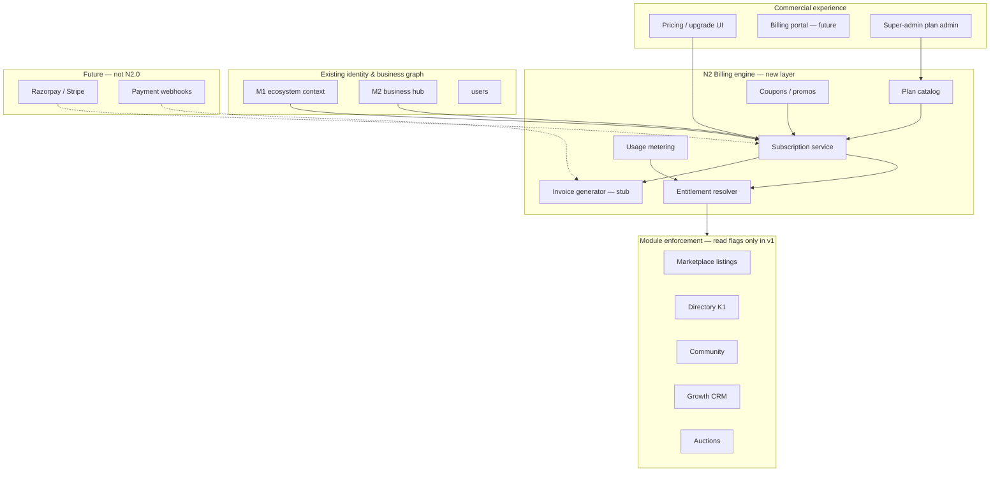
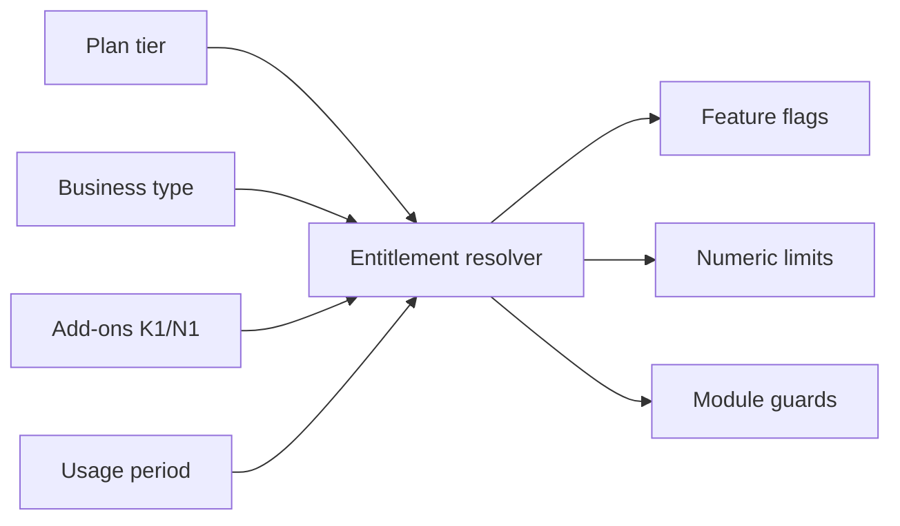
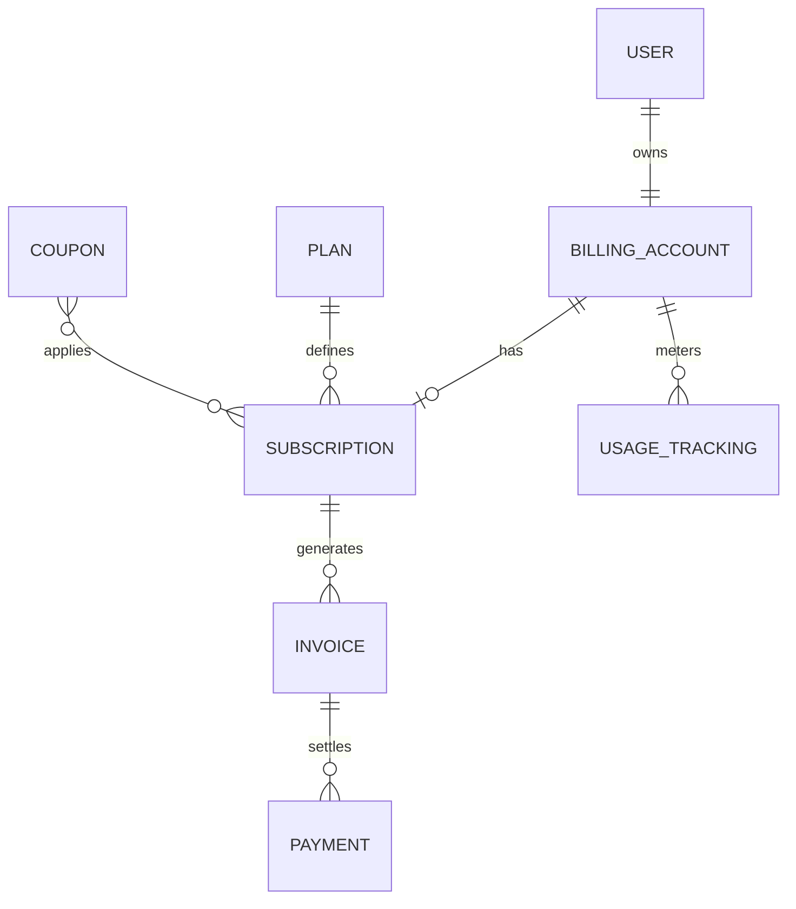
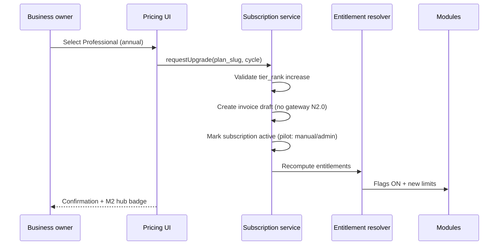
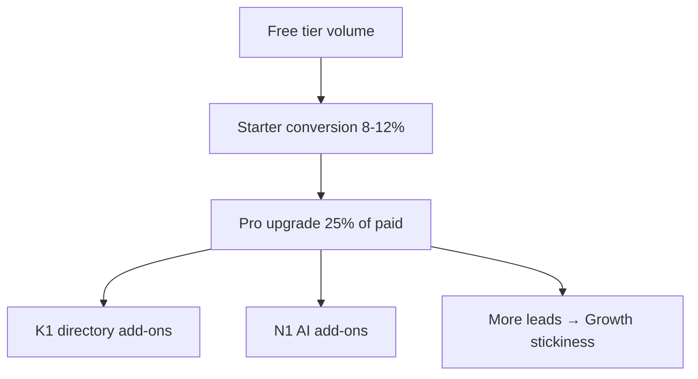

# Phase N2.0 — Billing Engine Foundation (Architecture & Planning)

**Date:** 2026-06-04  
**Status:** Approved for planning (architecture only)  
**Constraints:** No code · No Prisma changes · No db push · No payment gateway in this phase

**Builds on:** M1–M5 ecosystem, Growth CRM entitlements (J0), `subscription_plans` catalog, K1 directory monetization placeholders, M0 founder metrics, N1 AI roadmap (optional add-ons)

---

## Executive summary

MotorCart already has **fragmented billing signals**: `dealers.subscription_tier`, `growth_workspaces.subscription_tier` + `growth_workspace_entitlements` (JSON limits/usage), and a read-only `subscription_plans` product catalog. **N2.0** defines a **unified billing domain** that binds **one subscription** per business (via M2 Business Hub / `entity_type` + `entity_id`) to **entitlements across Marketplace, Directory, Community, Growth CRM, and Auctions**.

This document is **planning only**. Tables below are **proposals** for a future migration wave—not applied now.

---

## 1. Billing architecture



**Core concepts**

| Concept | Definition |
|---------|------------|
| **Billing account** | Commercial owner: `user_id` + optional `business_entity` (`entity_type`, `entity_id`) |
| **Plan** | Product SKU (Free → Enterprise) with list price and base entitlements |
| **Subscription** | Active contract: plan, cycle, status, period boundaries |
| **Entitlement** | Effective limits + feature flags resolved for enforcement |
| **Usage record** | Metered consumption per period (leads, broadcasts, listings, storage) |
| **Invoice / Payment** | Financial artifacts (stub until gateway) |

**Resolution order (entitlements)**

1. Platform-wide plan defaults  
2. Business-type profile overlay (dealer vs broker vs DSA, etc.)  
3. Subscription plan tier  
4. Add-ons (K1 directory placement, N1 AI pack — future SKUs)  
5. Promotional coupon  
6. Hard caps (Enterprise custom JSON)

---

## 2. Subscription architecture

### 2.1 Plan tiers

| Tier | Slug | Target segment | Positioning |
|------|------|----------------|-------------|
| **Free** | `free` | Trial / micro sellers | Discover MotorCart ecosystem |
| **Starter** | `starter` | Single-location SMB | List + basic Growth |
| **Professional** | `professional` | Active dealers / brokers | CRM + campaigns + directory |
| **Business** | `business` | Multi-user teams | Higher limits + auctions |
| **Enterprise** | `enterprise` | Groups / OEM / chains | Custom limits + SLA |

### 2.2 Module inclusion matrix (base entitlements)

Legend: ✓ included · ◐ limited · — not included · ⊕ add-on SKU

| Capability | Free | Starter | Professional | Business | Enterprise |
|------------|------|---------|--------------|----------|------------|
| **Marketplace** listings | ◐ 3 | ◐ 15 | ✓ 50 | ✓ 150 | Custom |
| **Directory** profile | ✓ basic | ✓ | ✓ verified path | ✓ | ✓ |
| **Directory** featured (K1) | — | — | ⊕ | ⊕ | ✓ neg. |
| **Community** business page | ✓ | ✓ | ✓ | ✓ | ✓ |
| **Community** posts / mo | ◐ 10 | ◐ 30 | ✓ 100 | ✓ 500 | Custom |
| **Growth CRM** workspace | ◐ 1 | ✓ 1 | ✓ 1 | ✓ 3 | Custom |
| **Growth** WhatsApp broadcasts / mo | ◐ 20 | ◐ 100 | ✓ 500 | ✓ 2000 | Custom |
| **Growth** lead events / mo | ◐ 50 | ◐ 200 | ✓ 1000 | ✓ 5000 | Custom |
| **Growth** storage | ◐ 256 MB | ◐ 512 MB | ✓ 2 GB | ✓ 10 GB | Custom |
| **Growth** poster exports / mo | ◐ 5 | ◐ 25 | ✓ 100 | ✓ 500 | Custom |
| **Auctions** entries / mo | — | — | ◐ 5 | ✓ 25 | Custom |
| **M3** lead router | ◐ | ✓ | ✓ | ✓ | ✓ |
| **M5** search presence | ✓ | ✓ | ✓ | ✓ | ✓ |
| **N1 AI** packs (future) | — | ⊕ | ⊕ | ⊕ | ✓ bundle |

### 2.3 Billing cycle

| Cycle | Code | Discount vs monthly |
|-------|------|---------------------|
| Monthly | `monthly` | — |
| Annual | `annual` | 15–20% (configurable per plan) |

**Subscription states:** `trialing` · `active` · `past_due` · `paused` · `cancelled` · `expired`

---

## 3. Entitlement model

### 3.1 Entitlement dimensions



### 3.2 Limit keys (canonical)

| Key | Module | Enforced at (future) |
|-----|--------|----------------------|
| `marketplace.active_listings` | Marketplace | Vehicle create API |
| `marketplace.featured_listings` | Marketplace | Listing metadata |
| `directory.profile_tier` | Directory | K1 metadata / hub |
| `directory.featured_slots` | Directory | K1 admin |
| `community.posts_monthly` | Community | Post create |
| `community.business_page` | Community | Profile (bool) |
| `growth.workspaces` | Growth | Workspace create |
| `growth.broadcasts_monthly` | Growth | L1 send / mock |
| `growth.lead_events_monthly` | Growth | Lead capture |
| `growth.storage_mb` | Growth | Asset upload |
| `growth.design_exports_monthly` | Growth | Poster export |
| `growth.campaigns_active` | Growth | Active broadcasts + forms |
| `auctions.entries_monthly` | Auctions | Dealer auction entry |
| `lead_router.ingress_monthly` | M3 | POST /route |
| `platform.team_seats` | Cross | Dealer members / invites |

**Feature flags (boolean entitlements)** — map to existing `FEATURE_*` pattern:

- `entitlement.marketplace.publish`  
- `entitlement.directory.monetization_k1`  
- `entitlement.growth.whatsapp`  
- `entitlement.growth.social_scheduler`  
- `entitlement.auctions.participate`  
- `entitlement.ai.marketing` (N1 future)

### 3.3 Usage metering

Align with **Growth pattern** (`growth_workspace_entitlements.usage` JSON + monthly `period`):

| Meter | Source event |
|-------|----------------|
| `listings_created` | Vehicle insert |
| `broadcasts_sent` | Growth broadcast complete |
| `lead_events` | `growth_lead_capture_events` |
| `storage_bytes` | Asset upload sum |
| `auction_entries` | `dealer_auction_entries` |
| `lead_router_routed` | M3 store append |

**Unified usage_tracking** (proposed table) aggregates per `billing_account_id` + `period` (YYYY-MM).

### 3.4 Business-type overlays

Same plan tier, different **default emphasis**:

| Business type | Listing weight | Growth weight | Auction weight |
|---------------|----------------|---------------|----------------|
| **Dealer** | High | Medium | High |
| **Broker** | Low | High | Low |
| **DSA** | — | High (leads) | — |
| **Insurance agent** | — | High | — |
| **Workshop** | Low | Medium | — |
| **Parts seller** | Parts catalog* | Medium | — |
| **Influencer** | — | High (content) | — |

\* Parts limits use `parts` module when billing extends beyond five core modules.

Resolver: `effective_limit = floor(plan_limit * business_type_multiplier)` for selected keys.

---

## 4. Business types

Billing account links to M2 hub:

```text
billing_account {
  owner_user_id
  entity_type: dealer | broker | dsa | insurance_agent | workshop | parts_seller | influencer
  entity_id
  business_profile_id  // community_business_profiles.id
}
```

| Type | Primary monetization driver |
|------|----------------------------|
| Dealer | Listings + auctions + Growth campaigns |
| Broker | Leads + Growth WhatsApp |
| DSA | Lead volume + finance bridge (future) |
| Insurance agent | Leads + campaigns |
| Workshop | Directory + local leads |
| Parts seller | Catalog + directory |
| Influencer | Community + Growth content |

---

## 5. Billing domain — proposed tables (design only)

> **Not implemented.** Future migration extends/replaces scattered `subscription_tier` columns.

### 5.1 `plans` (extends concept of `subscription_plans`)

| Column | Type | Notes |
|--------|------|-------|
| id | UUID PK | |
| slug | VARCHAR unique | free, starter, professional, business, enterprise |
| name | VARCHAR | Display |
| tier_rank | INT | 0–4 for upgrade path |
| price_monthly_inr | DECIMAL | List price |
| price_annual_inr | DECIMAL | Precomputed annual |
| billing_cycle_default | ENUM | monthly |
| module_entitlements | JSON | Base limits + flags |
| business_type_overrides | JSON | Per `entity_type` patches |
| is_active | BOOL | |
| metadata | JSON | Marketing copy, Razorpay plan id placeholder |
| created_at | TIMESTAMPTZ | |

### 5.2 `subscriptions`

| Column | Type | Notes |
|--------|------|-------|
| id | UUID PK | |
| billing_account_id | UUID FK | Logical owner |
| plan_id | UUID FK → plans | Current plan |
| status | ENUM | active, trialing, … |
| billing_cycle | ENUM | monthly, annual |
| current_period_start | TIMESTAMPTZ | |
| current_period_end | TIMESTAMPTZ | |
| cancel_at_period_end | BOOL | |
| trial_ends_at | TIMESTAMPTZ | nullable |
| gateway_customer_id | VARCHAR | nullable, future |
| gateway_subscription_id | VARCHAR | nullable, future |
| metadata | JSON | Upgrade history, sales rep |
| created_at / updated_at | TIMESTAMPTZ | |

**Uniqueness:** one `active` subscription per `billing_account_id` (app-enforced).

### 5.3 `usage_tracking`

| Column | Type | Notes |
|--------|------|-------|
| id | UUID PK | |
| billing_account_id | UUID FK | |
| period | VARCHAR(7) | YYYY-MM |
| meter_key | VARCHAR | e.g. growth.broadcasts_monthly |
| used | INT | |
| limit_snapshot | INT | Resolved limit at period start |
| metadata | JSON | Breakdown by workspace |
| updated_at | TIMESTAMPTZ | |

**Unique:** `(billing_account_id, period, meter_key)`

### 5.4 `invoices`

| Column | Type | Notes |
|--------|------|-------|
| id | UUID PK | |
| subscription_id | UUID FK | |
| invoice_number | VARCHAR unique | MC-2026-000001 |
| status | ENUM | draft, open, paid, void |
| currency | CHAR(3) | INR |
| subtotal_inr | DECIMAL | |
| tax_inr | DECIMAL | GST placeholder |
| total_inr | DECIMAL | |
| period_start / period_end | TIMESTAMPTZ | |
| line_items | JSON | Plan + add-ons |
| due_at | TIMESTAMPTZ | |
| paid_at | TIMESTAMPTZ | nullable |
| metadata | JSON | |
| created_at | TIMESTAMPTZ | |

### 5.5 `payments`

| Column | Type | Notes |
|--------|------|-------|
| id | UUID PK | |
| invoice_id | UUID FK | |
| amount_inr | DECIMAL | |
| status | ENUM | pending, succeeded, failed, refunded |
| gateway | VARCHAR | razorpay, stripe, manual |
| gateway_payment_id | VARCHAR | nullable |
| paid_at | TIMESTAMPTZ | |
| metadata | JSON | |
| created_at | TIMESTAMPTZ | |

### 5.6 `coupons`

| Column | Type | Notes |
|--------|------|-------|
| id | UUID PK | |
| code | VARCHAR unique | LAUNCH20 |
| discount_type | ENUM | percent, fixed_inr |
| discount_value | DECIMAL | |
| valid_from / valid_until | TIMESTAMPTZ | |
| max_redemptions | INT | |
| applicable_plan_slugs | JSON | array |
| metadata | JSON | |
| created_at | TIMESTAMPTZ | |

### 5.7 Entity relationship (proposed)



---

## 6. Upgrade logic

### 6.1 Tier ladder


| Transition | Rules |
|------------|-------|
| **Free → Starter** | Immediate; payment stub marks `trialing` 14d optional; entitlements upgrade on `active` |
| **Starter → Professional** | Prorated credit (future); immediate limit bump; usage meters preserved |
| **Professional → Business** | Requires payment method (future); unlock auctions + team seats |
| **Business → Enterprise** | Sales-led; custom `plans.module_entitlements`; manual invoice |
| **Downgrade** | Effective at **period end**; warn if usage > new limits |
| **Cancel** | `cancel_at_period_end`; revert to Free or read-only mode |

### 6.2 Upgrade flow (logical)



### 6.3 Mapping from today (migration concept)

| Today | N2 target |
|-------|-----------|
| `dealers.subscription_tier` | `subscriptions` + `plans.slug` |
| `growth_workspaces.subscription_tier` | Same billing_account or child workspace meter |
| `growth_workspace_entitlements` | Becomes view/cache of `usage_tracking` + resolver |
| `subscription_plans` table | Seed into `plans` |

**No migration in N2.0 planning phase.**

---

## 7. Revenue model

### 7.1 Indicative pricing (INR, India market)

| Plan | Monthly | Annual (≈16% off) | Primary buyer |
|------|---------|-------------------|---------------|
| **Free** | ₹0 | ₹0 | All types — acquisition |
| **Starter** | ₹999 | ₹9,990 | Workshop, micro dealer |
| **Professional** | ₹2,999 | ₹29,990 | Dealer, broker, DSA |
| **Business** | ₹7,999 | ₹79,990 | Multi-rooftop dealer |
| **Enterprise** | ₹25,000+ | Custom | OEM / aggregator |

**Add-ons (recurring or one-time, future)**

| Add-on | Price hint |
|--------|------------|
| Directory featured (city) | ₹1,499/mo |
| Directory sponsored (state) | ₹4,999/mo |
| AI Marketing pack (N1.5) | ₹999/mo |
| Extra 1,000 leads | ₹499/mo |

### 7.2 Revenue projections (illustrative)

**Assumptions Year 1 (post-billing GA):**

| Metric | Value |
|--------|-------|
| Paying businesses | 1,200 |
| Mix: Starter 40%, Pro 45%, Business 12%, Enterprise 3% | |
| Blended ARPU monthly | ~₹2,400 |
| Add-on attach rate | 15% @ ₹800 avg |

```text
MRR_subscriptions ≈ 1,200 × ₹2,400 = ₹28.8 L
MRR_add_ons     ≈ 180 × ₹800   = ₹1.4 L
MRR_total       ≈ ₹30.2 L / month

ARR_run_rate    ≈ ₹3.6 Cr

Year 2 (scale): 4,000 paying × ₹2,800 ARPU ≈ ₹11.2 Cr MRR → ~₹134 Cr ARR run-rate
```

**Sensitivity:** +500 Professional dealers at ₹2,999 → +₹15 L MRR.

### 7.3 Revenue flywheel with ecosystem



---

## 8. Prisma impact (future — not applied in N2.0)

| Area | Impact |
|------|--------|
| **New models** | `BillingAccount`, `Plan` (or extend `SubscriptionPlan`), `Subscription`, `UsageTracking`, `Invoice`, `Payment`, `Coupon` |
| **Existing** | Deprecate duplicate tier strings on `dealers` / `growth_workspaces` → FK or sync job |
| **Growth** | `growth_workspace_entitlements` remains cache; sync from resolver |
| **M1/M2** | Expose `subscription` + `entitlements` on ecosystem context API |
| **M0** | Wire `paid_subscriptions`, MRR from `subscriptions` + `payments` |
| **Indexes** | `(billing_account_id, status)`, `(period, meter_key)` |
| **RLS / admin** | Platform admin CRUD on plans; business owner read own subscription |

**Estimated migration:** 1 Prisma migration file + seed plans + backfill script (separate approved wave).

---

## 9. Rollback plan (when implementation exists)

| Stage | Rollback |
|-------|----------|
| **Planning only (now)** | No action — document only |
| **After schema migration** | Feature flag `FEATURE_N2_BILLING` OFF; fall back to `subscription_tier` columns |
| **After resolver live** | Dual-read: legacy tier if N2 off |
| **After gateway** | Disable webhooks; manual invoices; subscriptions stay `active` |

**No db push in this approval.**

---

## 10. Founder recommendations

1. **Unify on `billing_account` + M2 hub** — one subscription per business profile, not per user duplicate.  
2. **Keep Growth JSON entitlements as runtime cache** — avoid big-bang rewrite of J0 quota code.  
3. **Ship catalog + resolver + admin override before Razorpay** — validate limits in production with manual “mark paid”.  
4. **Gate auctions on Business+** — clear upgrade trigger for dealers.  
5. **Bundle K1 add-ons as SKUs** — don’t hard-code featured into Pro without pricing clarity.  
6. **Publish simple public pricing page** — match five tiers exactly.  
7. **M0 dashboard** — first paid metric: active subscriptions by plan slug (after N2.1).  
8. **Enterprise** — never self-serve checkout; CRM + custom `plans` row.  

---

## 11. Development phases (implementation — future gates)

| Phase | Deliverable | Prisma? | Gateway? |
|-------|-------------|---------|----------|
| **N2.0** | This architecture doc | No | No |
| **N2.1** | `plans` seed + entitlement resolver API | Yes | No |
| **N2.2** | Usage sync from Growth + marketplace | Yes | No |
| **N2.3** | Upgrade UI + invoice drafts | Yes | No |
| **N2.4** | Razorpay subscriptions + webhooks | Yes | Yes |
| **N2.5** | K1/N1 add-on SKUs + coupons | Yes | Yes |

---

## 12. Deliverables checklist

| # | Deliverable | Section |
|---|-------------|---------|
| 1 | Billing architecture | §1 |
| 2 | Subscription architecture | §2 |
| 3 | Entitlement model | §3 |
| 4 | Revenue projections | §7 |
| 5 | Prisma impact | §8 |
| 6 | Rollback plan | §9 |
| 7 | Founder recommendations | §10 |
| — | Proposed tables | §5 |
| — | Upgrade logic | §6 |
| — | Business types | §4 |

---

## 13. Approval record

| Item | Value |
|------|-------|
| Phase | N2.0 Billing Engine Foundation |
| Code / schema in this PR | **None** |
| Payment gateway | **Deferred** to N2.4 |

**Status:** Ready for stakeholder review.
