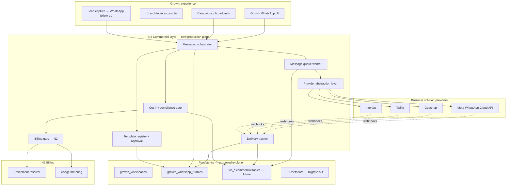
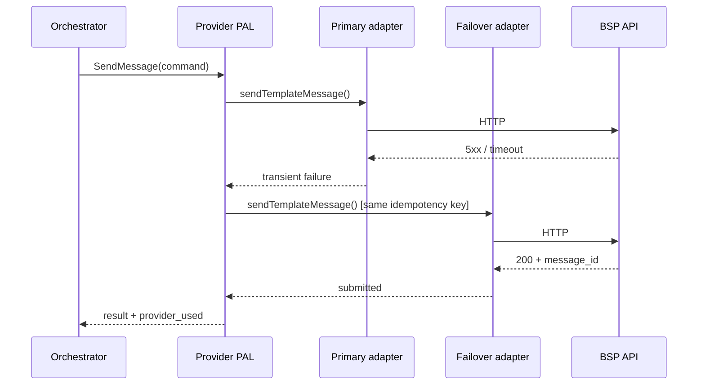
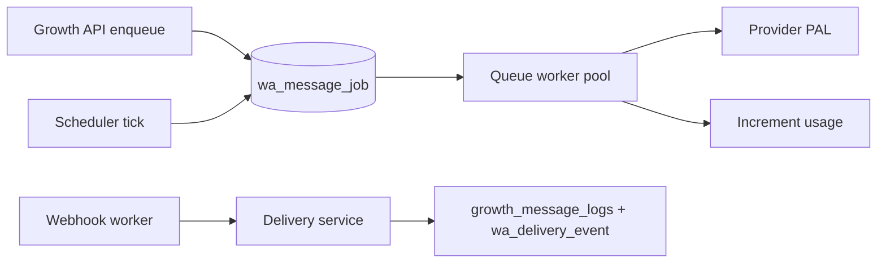
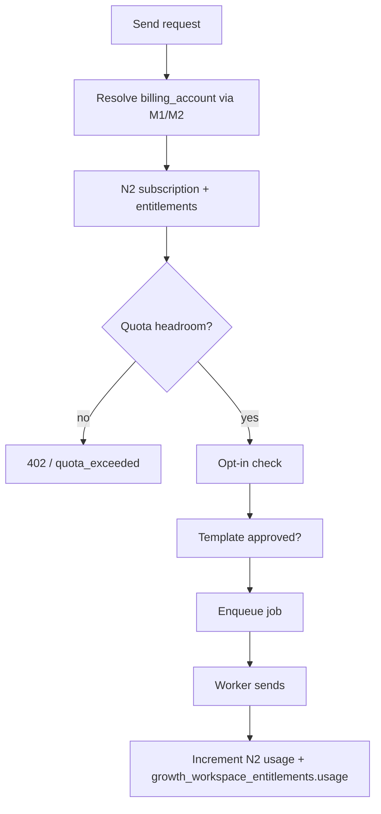
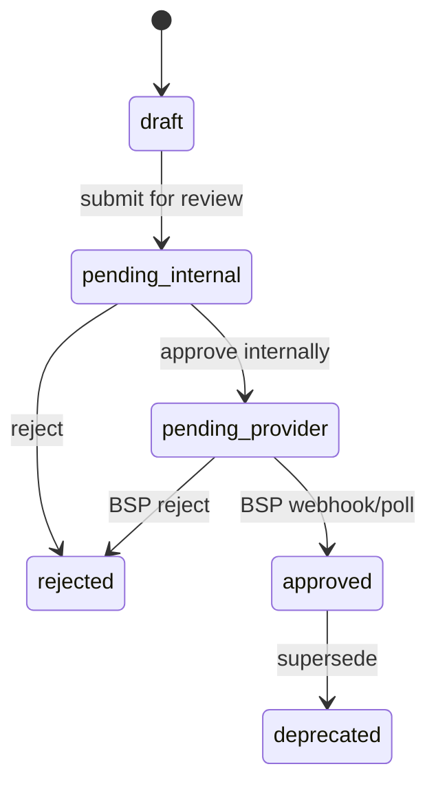

# Phase N3.0 — Real WhatsApp Commercial Layer (Architecture)

**Date:** 2026-06-04  
**Status:** Approved for architecture (planning only)  
**Constraints:** No code · No Prisma changes · No db push · No provider credentials · No live HTTP to BSPs in this phase

**Builds on:** L1 WhatsApp provider stubs (Growth), Growth CRM tables (`growth_whatsapp_*`, `growth_message_logs`), N2.0/N2.1 billing (plans, entitlements, usage meters), M1 identity, M2 business hub, M3 lead router, M4 notifications

**Does not modify:** Dealer CRM, Broker CRM, Auction, Finance, or Insurance modules (WhatsApp commercial layer is Growth-scoped + platform services only)

---

## Executive summary

MotorCart already has **Growth WhatsApp UX**, **broadcast/template/contact-list tables**, and **L1 adapter stubs** (`meta_cloud`, `gupshup`, `twilio`, `mock`) with queue/opt-in/delivery held in **workspace metadata**. **N3.0** defines the **production commercial layer**: a provider-agnostic messaging plane with **failover**, **durable queues**, **template governance**, **delivery webhooks**, **opt-in compliance**, and **N2 billing enforcement**—without implementing it in this phase.

**Interakt** joins Meta Cloud, Gupshup, and Twilio as a first-class BSP. Dealer “click-to-WhatsApp” CTAs remain lightweight deep links; **N3** owns **API-driven business messaging** inside Growth CRM.

---

## 1. Architecture

### 1.1 Platform view



### 1.2 Design principles

| Principle | Implication |
|-----------|-------------|
| **Additive** | Extend L1 adapters; do not break existing Growth APIs when flag OFF |
| **Workspace-scoped** | Every send is tied to `growth_workspace_id` + `billing_account_id` (via M1/M2) |
| **Provider-agnostic** | Orchestrator speaks one internal message contract; adapters translate |
| **Fail closed on compliance** | No send without opt-in + template approval + quota headroom |
| **Observable** | Every message has internal ID, provider external ID, status timeline |
| **Secrets outside repo** | Credentials in env/KMS per workspace or platform vault—never committed |

### 1.3 Boundaries

| In scope (N3+) | Out of scope (N3.0 doc only) |
|----------------|------------------------------|
| Growth campaigns, templates, contact lists | Dealer CRM inbox rewrite |
| Platform admin BSP credentials (future) | Broker CRM WhatsApp |
| Webhook ingress for delivery | Consumer P2P WhatsApp client |
| N2 quota enforcement on send | Razorpay / invoice for message packs (N2.4+) |

### 1.4 Relationship to L1

| L1 today (stub) | N3 target |
|-----------------|-----------|
| `WhatsappProviderAdapter.send()` — no HTTP | Real HTTP + webhook parsers per BSP |
| Queue in `metadata.whatsapp_architecture` | Durable queue (Redis/DB) with retry |
| Template approval in metadata | DB workflow + provider sync jobs |
| `live_api_enabled: false` | Per-environment flag + per-workspace enablement |

---

## 2. Provider model

### 2.1 Provider registry

| Provider ID | Display name | Primary market | Notes |
|-------------|--------------|----------------|-------|
| `meta_cloud` | Meta WhatsApp Cloud API | Global / India WABA | Direct Graph API; template namespace per WABA |
| `gupshup` | Gupshup | India | Enterprise BSP; template sync API |
| `twilio` | Twilio | Global | Content API + WhatsApp sender |
| `interakt` | Interakt | India SMB | Popular India BSP; template + campaign APIs |
| `mock` | Mock (dev) | Local | Retained for CI/smoke; never in production |

### 2.2 Adapter contract (extends L1)

Each adapter implements:

| Capability | Required | Notes |
|------------|----------|-------|
| `sendTemplateMessage` | Yes | HSM / template with variables |
| `sendSessionMessage` | Optional | Within 24h customer care window |
| `submitTemplateForApproval` | Yes | Push draft → provider |
| `fetchTemplateStatus` | Yes | Poll or webhook-driven |
| `parseDeliveryWebhook` | Yes | Normalize to internal status enum |
| `healthCheck` | Yes | Credential + WABA/sender validation |

**Internal status enum** (unchanged from L1): `queued` → `submitted` → `sent` → `delivered` → `read` | `failed`

### 2.3 Workspace provider configuration

```text
wa_provider_config {
  id
  workspace_id
  provider_id              // meta_cloud | gupshup | twilio | interakt
  priority                 // 1 = primary, 2 = secondary (failover)
  is_enabled
  credentials_ref          // vault key, not plaintext
  sender_phone             // E.164
  waba_id / app_id         // provider-specific
  webhook_secret_ref
  rate_limit_per_second    // optional cap
  metadata                 // JSON — template namespace, region
  created_at / updated_at
}
```

**Multi-provider per workspace:** One **primary** + optional **secondary** for failover only (not parallel duplicate sends).

### 2.4 Provider abstraction layer (PAL)



**Switch provider (admin/workspace):** Update `active_provider` + priority list; in-flight queue items complete on original provider unless policy allows migration (default: no migration mid-flight).

**Failover rules:**

| Condition | Action |
|-----------|--------|
| HTTP 5xx, timeout, rate limit | Retry primary (exponential backoff) then failover |
| HTTP 4xx template/phone invalid | No failover; mark `failed`, surface to user |
| Primary disabled in config | Route new sends to secondary only |
| Both unhealthy | Queue holds; alert ops |

**Idempotency:** `idempotency_key = hash(workspace_id, campaign_id, phone, template_version)` prevents double charge on failover retry.

### 2.5 Capability matrix (planning)

| Feature | Meta | Gupshup | Twilio | Interakt |
|---------|------|---------|--------|----------|
| Marketing templates | Yes | Yes | Yes | Yes |
| Utility templates | Yes | Yes | Yes | Yes |
| Media headers | Yes | Yes | Yes | Yes |
| Read receipts | Yes | Yes | Partial | Yes |
| Template approval webhook | Yes | Yes | Yes | Yes |
| India DLT (future) | Via BSP | Yes | Via BSP | Yes |

---

## 3. Queue model

### 3.1 Queue types

| Queue | Purpose | Scheduler |
|-------|---------|-----------|
| **Transactional** | OTP, booking confirm (future) | Immediate, high priority |
| **Campaign** | Broadcast recipients | `schedule_at` on `growth_whatsapp_broadcasts` |
| **Retry** | Failed transient sends | Backoff worker |
| **Webhook ingest** | Delivery status updates | Async consumer |

### 3.2 Message job schema (proposed)

```text
wa_message_job {
  id
  workspace_id
  billing_account_id       // denormalized for metering
  broadcast_id             // nullable
  broadcast_recipient_id   // nullable
  contact_phone            // E.164 normalized
  template_id              // FK growth_whatsapp_templates
  template_snapshot        // JSON — body + variables at enqueue time
  provider_id              // intended provider
  provider_used            // actual after send/failover
  idempotency_key
  status                   // queued | processing | submitted | ...
  attempt_count
  max_attempts             // default 5
  scheduled_at
  locked_at                // worker lease
  last_error
  metadata
  created_at / updated_at
}
```

### 3.3 Worker architecture



| Concern | Design |
|---------|--------|
| **Bulk broadcasts** | Fan-out: broadcast → N jobs; batch dequeue (e.g. 50/sec per workspace, configurable) |
| **Scheduled messages** | `scheduled_at <= now()` claim jobs |
| **Retry logic** | Attempt 1–3 primary; 4–5 failover; terminal `failed` + DLQ table |
| **Backpressure** | Per-workspace concurrency; global platform cap |
| **L1 migration** | One-time drain `metadata.whatsapp_architecture.queue` → `wa_message_job` |

### 3.4 Integration with existing Growth tables

| Existing table | N3 role |
|----------------|---------|
| `growth_whatsapp_broadcasts` | Campaign header; status `draft → scheduled → sending → completed` |
| `growth_whatsapp_broadcast_recipients` | Per-phone outcome; links to `wa_message_job` |
| `growth_message_logs` | Audit trail; append-only events |
| `growth_whatsapp_templates` | Source of truth for template body; sync to provider |

---

## 4. Billing model (N2 integration)

### 4.1 Entitlement keys (align N2.0 catalog)

| Meter key | N2 plan field | Enforced at |
|-----------|---------------|-------------|
| `growth.broadcasts_monthly` | Already in plans | Campaign send / job enqueue |
| `growth.lead_events_monthly` | Already in plans | Lead → WhatsApp automation (future) |
| **New (N3)** `whatsapp.messages_monthly` | Add to plan resolver | Each successful `submitted` job |
| **New (N3)** `whatsapp.recipients_per_broadcast` | Tier cap | Broadcast create |
| **New (N3)** `whatsapp.templates_active` | Tier cap | Template create |

### 4.2 Billing gate flow



| Event | Billing action |
|-------|----------------|
| Job `submitted` to BSP | +1 `whatsapp.messages_monthly` |
| Job `failed` (4xx) | No increment |
| Job `failed` after failover success | +1 only once (idempotency) |
| Broadcast cancelled before send | No increment |

### 4.3 Storage alignment

| Layer | Usage write |
|-------|-------------|
| **N2.1** | `backend/.data/billing/usage-tracking.json` + resolver |
| **Growth J0** | `growth_workspace_entitlements.usage` JSON |
| **N3** | Dual-write during transition; single source = N2 usage service |

**Dashboard:** `/dashboard/billing` shows WhatsApp meters when `FEATURE_BILLING_V2` + `FEATURE_WHATSAPP_COMMERCIAL` on.

### 4.4 Commercial packaging (founder-facing)

| Add-on SKU (future) | Contents |
|---------------------|----------|
| WhatsApp Starter Pack | +5k messages/mo |
| WhatsApp Pro Pack | +25k + priority queue |
| Interakt / Meta pass-through | Cost-plus line item on invoice (N2.4+) |

---

## 5. Compliance model

### 5.1 Opt-in management

```text
wa_contact_consent {
  id
  workspace_id
  phone                     // E.164 unique per workspace
  status                    // opted_in | opted_out | pending
  source                    // form | import | api | manual
  evidence                  // JSON — IP, form_id, timestamp, text shown
  opted_in_at
  opted_out_at
  revoked_reason
  created_at / updated_at
}
```

**Rules:**

| Rule | Enforcement |
|------|-------------|
| Marketing template → must have `opted_in` | Orchestrator blocks enqueue |
| Import CSV → `pending` until double opt-in (configurable) | Queue holds |
| Opt-out keyword (STOP) | Webhook → `opted_out`; cancel pending jobs for phone |
| Sync with `growth_contact_list_members.opt_in_at/opt_out_at` | Bi-directional sync job |

### 5.2 Template management

**Categories (WhatsApp policy):** `marketing` · `utility` · `authentication` (map to `growth_whatsapp_templates.category`)

**Approval workflow:**



| Stage | Actor | Storage |
|-------|-------|---------|
| Draft | Workspace user | `growth_whatsapp_templates.status = draft` |
| Internal review | Workspace admin / platform (optional) | `metadata.internal_review` |
| Provider sync | Background job | `provider_template_id`, `wa_template_provider_sync` |
| Approved | BSP | Send allowed |

**Languages:** `language` column (ISO 639-1); one provider template per language variant; variables schema validated before submit.

### 5.3 Compliance workflow (India-focused)

| Requirement | N3 approach |
|-------------|-------------|
| TRAI / DLT (when applicable) | Store entity ID + template ID in metadata; block send if missing (feature flag) |
| Meta opt-in proof | Persist `evidence` on consent record |
| Data retention | Message body retention policy (90d default, configurable Enterprise) |
| PII in logs | Hash phone in admin logs; full phone only in encrypted store |

### 5.4 Delivery tracking

```text
wa_delivery_event {
  id
  message_job_id
  growth_message_log_id   // optional link
  provider_id
  external_message_id
  status                  // sent | delivered | read | failed
  provider_payload        // JSON raw webhook
  occurred_at
}
```

**Webhook ingress:** `POST /api/webhooks/whatsapp/:provider` (signed) → normalize → update job + `growth_whatsapp_broadcast_recipients.status` + append `growth_message_logs`.

**UI states:** Sent ✓ · Delivered ✓✓ · Read (blue) · Failed (retry CTA)

---

## 6. Growth CRM integration

### 6.1 Templates

| Flow | Integration |
|------|-------------|
| Create template in Growth UI | `growth_whatsapp_templates` |
| Submit for approval | N3 template service → PAL → BSP |
| Use in broadcast | Existing `templateId` FK on broadcast |
| AI assist (N1 future) | Suggest copy; human approves before provider submit |

### 6.2 Campaigns

| Flow | Integration |
|------|-------------|
| Select list + template | Unchanged Growth UX |
| Schedule | `schedule_at` → queue worker |
| Send now | Enqueue all recipients as `wa_message_job` |
| Analytics | Aggregate delivery events + M0 founder metric `campaigns` |

### 6.3 Leads

| Flow | Integration |
|------|-------------|
| Lead capture event | `growth_lead_capture_events` |
| Automation (N3.2+) | Rule: new lead + opt-in → utility template welcome |
| M3 lead router | Read-only attribution in message metadata (`lead_id`, `source`) |
| M4 notifications | Alert workspace owner on campaign complete / high failure rate |

### 6.4 API surface (future — not N3.0)

Evolve under `/api/growth/whatsapp/*` + new `/api/commercial/whatsapp/*` if cross-module needed. Keep L1 paths; add `FEATURE_WHATSAPP_COMMERCIAL` flag default OFF.

---

## 7. Proposed data model (design only — no migration in N3.0)

| Table | Purpose |
|-------|---------|
| `wa_provider_config` | Per-workspace BSP credentials refs |
| `wa_message_job` | Durable queue |
| `wa_delivery_event` | Webhook timeline |
| `wa_contact_consent` | Compliance source of truth |
| `wa_template_provider_sync` | Provider-side template IDs + status |
| `wa_dlq` | Dead-letter jobs |

**Retain:** All existing `growth_whatsapp_*` tables; add FKs from jobs to broadcasts/recipients.

---

## 8. Rollout strategy

### 8.1 Phased waves

| Wave | Scope | Flag | Exit criteria |
|------|-------|------|---------------|
| **N3.0** | Architecture (this doc) | — | Stakeholder sign-off |
| **N3.1** | Meta adapter live + webhooks (pilot workspaces) | `FEATURE_WHATSAPP_COMMERCIAL` | 99% delivery webhook latency &lt; 30s |
| **N3.2** | Gupshup + Interakt adapters | same | 3 BSPs in prod |
| **N3.3** | Durable queue + retry + DLQ | `FEATURE_WHATSAPP_QUEUE_V2` | L1 metadata queue drained |
| **N3.4** | Twilio + failover PAL | `FEATURE_WHATSAPP_FAILOVER` | Failover drill passed |
| **N3.5** | N2 billing enforcement on send | `FEATURE_BILLING_V2` + meters | Quota blocks verified in staging |
| **N3.6** | DLT / advanced compliance | `FEATURE_WHATSAPP_DLT_IN` | India production checklist |

### 8.2 Environment progression

```text
local (mock) → staging (sandbox WABA) → pilot (5 dealers) → GA (flag default OFF → gradual ON)
```

### 8.3 Operational readiness

| Item | Owner |
|------|-------|
| BSP sandbox accounts | DevOps + founder |
| Webhook public URL + TLS | Infra |
| Secret rotation runbook | Security |
| Rate limit tuning | Growth + SRE |
| Support playbooks (failed templates) | CS |

### 8.4 Rollback

1. Set `FEATURE_WHATSAPP_COMMERCIAL=false` → orchestrator returns 404; Growth UI shows stub mode (L1).
2. Stop queue workers; jobs remain in DB for replay.
3. No rollback of sent messages; opt-in/consent records retained for legal hold.

---

## 9. Risks

| Risk | Likelihood | Impact | Mitigation |
|------|------------|--------|------------|
| BSP template rejection delays campaigns | High | Medium | Internal review step; pre-flight validation |
| Webhook loss → stale delivery state | Medium | High | Reconciliation poll job; idempotent event IDs |
| Failover duplicate messages | Low | High | Idempotency keys; BSP-side dedup where supported |
| Quota bypass via API bug | Medium | High | Enforce at orchestrator only; audit log |
| India DLT non-compliance | Medium | Critical | Feature flag block; legal review before N3.6 |
| Credential leak | Low | Critical | Vault refs only; rotate; no `.env` in repo |
| Workspace metadata queue vs DB queue split | High | Medium | N3.3 migration with dual-write window |
| Cost overrun (Meta per-message) | Medium | High | N2 hard caps; alerts at 80% usage |
| Interakt API drift vs Meta | Medium | Low | Adapter version pinning; contract tests |
| Founder expectation of “free WhatsApp” | High | Medium | Clear pricing on billing page + in UI |

---

## 10. Founder recommendation

### 10.1 Strategic positioning

WhatsApp is **India’s default B2C channel** for dealers, brokers, and DSAs. MotorCart should **not** build a generic chat app—it should own **campaign + lead + compliance + billing** as an **integrated Growth primitive**, upselling via N2 tiers and message packs.

### 10.2 Recommended BSP order

1. **Meta Cloud API** — Direct, best long-term margin and control; requires WABA onboarding effort.  
2. **Interakt** — Fast India SMB GTM, familiar to dealers; good for pilot revenue.  
3. **Gupshup** — Enterprise dealers already on Gupshup; adapter reduces switching cost.  
4. **Twilio** — International / dev familiarity; secondary failover.

### 10.3 Investment priority (next 90 days post-approval)

| Priority | Investment | ROI |
|----------|------------|-----|
| P0 | N3.1 Meta pilot + webhooks | Prove delivery tracking & campaigns |
| P0 | N3.5 billing enforcement | Monetize sends; align with N2.1 dashboard |
| P1 | N3.3 durable queue | Production reliability |
| P1 | Opt-in + template workflow hardening | Legal safety |
| P2 | Interakt + Gupshup | Market coverage |
| P2 | Failover PAL | Uptime story for Enterprise tier |
| P3 | DLT automation | Scale in India without manual ops |

### 10.4 Revenue narrative (M0 / investor)

- Attach **WhatsApp message meters** to Professional+ plans (already stubbed in N2 catalog as `growth.broadcasts_monthly`).  
- Report **messages sent**, **delivery rate**, and **campaign ROI** on founder dashboard (extend M0, read-only).  
- **Do not** enable live BSP in production until N3.1 + billing gate pass staging checklist.

### 10.5 Explicit non-goals for N3.0

- No code, schema, or credentials in this phase.  
- No change to Dealer/Broker/Auction/Finance/Insurance CRM code paths.  
- No promise of multi-channel (SMS/email) in N3—keep WhatsApp focused.

---

## 11. Feature flags (planned)

| Flag | Default | Scope |
|------|---------|-------|
| `FEATURE_WHATSAPP_COMMERCIAL` | OFF | Live BSP send + webhooks |
| `FEATURE_WHATSAPP_QUEUE_V2` | OFF | Durable DB/Redis queue |
| `FEATURE_WHATSAPP_FAILOVER` | OFF | Secondary provider routing |
| `FEATURE_WHATSAPP_DLT_IN` | OFF | India DLT enforcement |
| `FEATURE_GROWTH_WHATSAPP_PROVIDERS` | OFF | L1 console (existing) |
| `FEATURE_BILLING_V2` | OFF | Quota gate (N2.1) |

---

## 12. References

| Document / code | Relevance |
|-----------------|-----------|
| `PHASE-K1-L1-L2-M0-APPLIED-RESULTS.md` | L1 stub scope |
| `PHASE-N2.0-BILLING-FOUNDATION-PLAN.md` | Entitlement keys |
| `PHASE-N2.1-APPLIED-RESULTS.md` | Billing MVP APIs |
| `backend/src/lib/growth/whatsapp/` | L1 adapters + types |
| `growth_whatsapp_*` Prisma models | Existing campaign schema |

---

**Approval record:** N3.0 architecture approved for planning — implementation gated on N3.1+ waves and separate db migration approval.
