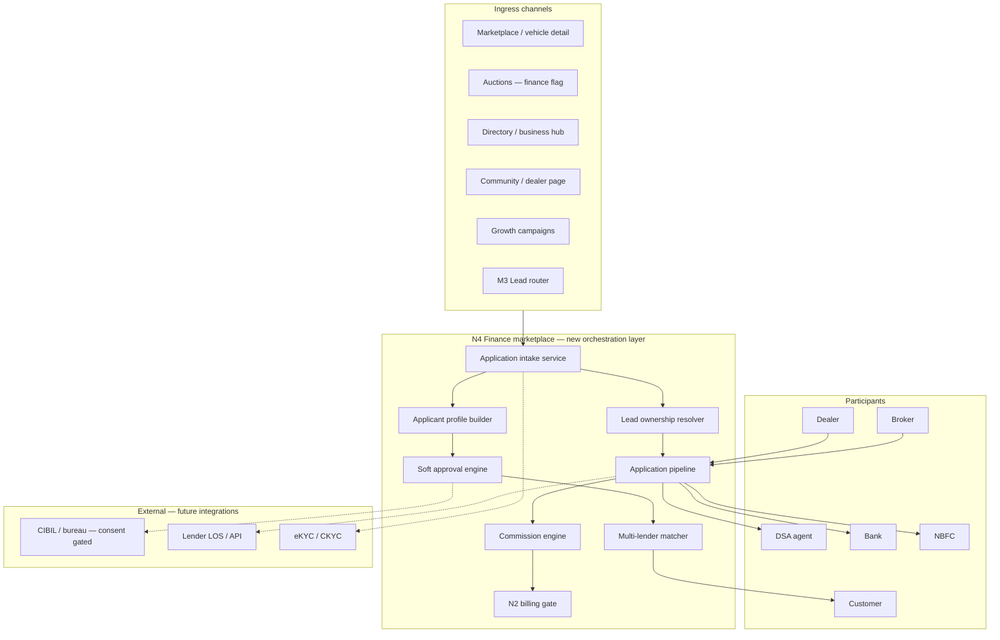
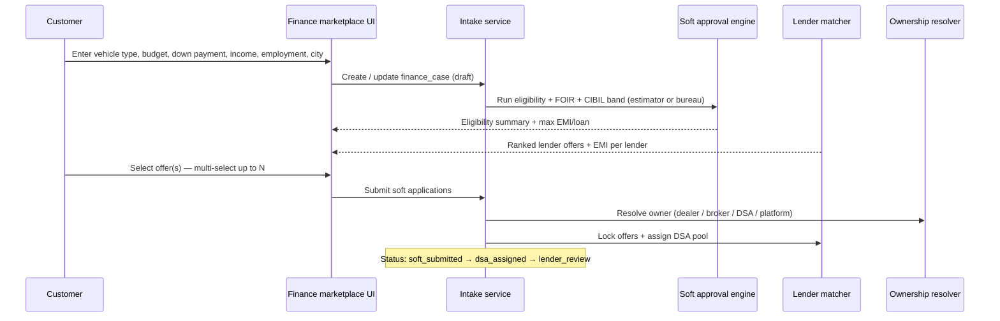
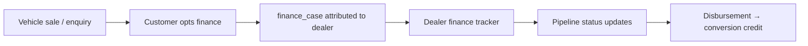
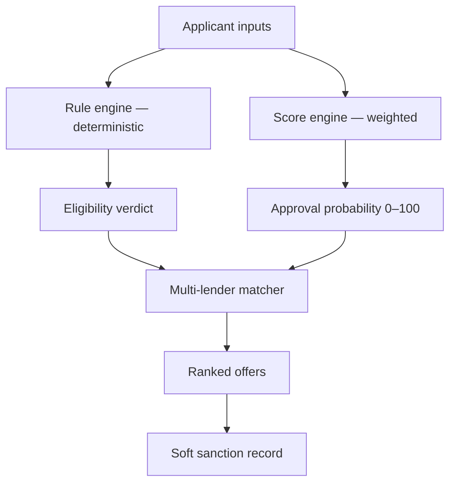
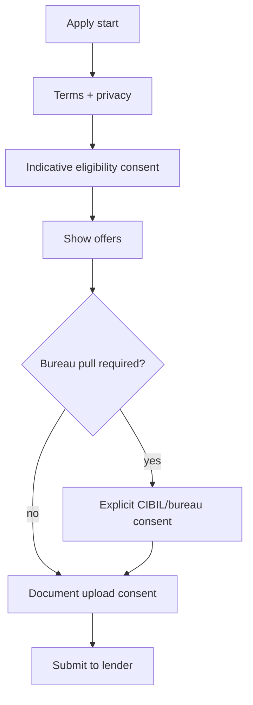

# Phase N4.0 — India's Automotive Finance Marketplace (Architecture)

**Date:** 2026-06-04  
**Status:** Approved for architecture (planning only)  
**Constraints:** No code · No Prisma changes · No db push · No schema changes in this phase

**Builds on:** Marketplace, Auctions, Community, Directory, Growth CRM, M1 unified identity, M2 business hub, M3 lead router, M4 notifications, M5 search, N2.0/N2.1 billing, N3.0 WhatsApp commercial layer

**References existing (read-only alignment):** `banks`, `finance_applications`, `finance_leads`, `finance_commissions`, `finance_verifications`, `finance_status_history`, `dsa_agents`, frontend eligibility/EMI/lender UX (`/finance/*`), admin finance status APIs

**Does not implement or alter:** Any runtime finance module code, Dealer/Broker/Auction/Insurance CRM paths, or live lender/Bureau APIs in this phase

---

## Executive summary

MotorCart already exposes a **consumer finance hub** (compare lenders, EMI, apply), **DSA/lender dashboards**, and **fragmented application records**. **N4.0** defines a unified **India automotive finance marketplace**: one customer journey from vehicle intent → **soft eligibility** → **multi-lender offers** → **owned application** → **DSA/lender fulfillment** → **commission settlement**—with explicit **lead ownership**, **RBI-aware compliance**, and **N2 monetization**.

This document is **architecture only**. Proposed tables and APIs are **future waves** (N4.1+), gated by separate migration approval—same pattern as N2.0 and N3.0.

---

## 1. Architecture

### 1.1 Platform view



### 1.2 Design principles

| Principle | Implication |
|-----------|-------------|
| **Marketplace, not LOS** | MotorCart orchestrates matching and status; lenders retain credit decision |
| **Soft first** | Pre-approval / soft sanction before hard pull and formal application |
| **Single customer truth** | One `finance_case` per customer journey; many `lender_offers` and optional `lender_submissions` |
| **Ownership is explicit** | Every case has `primary_owner_type` + attribution chain (dealer, broker, DSA, platform) |
| **Additive to M3** | M3 routes ingress; N4 owns finance pipeline—native CRM rows not moved |
| **India-first** | Vehicle types (2W/4W/CV), city tiers, salaried/self-employed, PSU + private bank + NBFC mix |

### 1.3 Module boundaries

| Module | N4 relationship |
|--------|-----------------|
| **Marketplace** | Vehicle price → loan amount; `finance_interest` on listings; CTA to `/finance/apply` |
| **Dealer CRM** | Read-only handoff: finance-ready customer card + status webhook (no CRM rewrite) |
| **Broker CRM** | Referral attribution; co-broke deals (no broker CRM rewrite) |
| **Auctions** | Post-bid finance intent flag → N4 intake |
| **Insurance** | Separate product line; cross-sell link only |
| **Growth / N3** | WhatsApp utility templates for doc reminders (future) |
| **N2 Billing** | Subscription tier + per-lead / per-disbursement metering |

---

## 2. Data flow

### 2.1 Customer journey (canonical)



### 2.2 Customer inputs → system outputs

| Customer input | Used for | System output |
|----------------|----------|---------------|
| **Vehicle type** | LTV caps, lender product filter (2W/4W/CV/new/used) | Eligible product class |
| **Budget** (ex-showroom / on-road) | Loan amount = budget − down payment | Principal estimate |
| **Down payment** | LTV %, risk band | Adjusted EMI range |
| **Income** (monthly gross) | FOIR, max EMI | `max_emi`, `max_loan` |
| **Employment** (salaried / self-employed / business) | Income multiplier, doc set | Lender filter + doc checklist |
| **City** | Geo tier, state lending rules, DSA territory | Lender availability + DSA routing |

| System output | Description |
|---------------|-------------|
| **Eligibility** | Pass/fail + reasons (income, FOIR, CIBIL band, amount) |
| **EMI** | Per-lender EMI at indicative rate (not final sanction) |
| **Lenders** | Filtered `banks` + NBFC catalog |
| **Offers** | Ranked `LoanOffer`: rate band, EMI, soft approval probability, rank |

*Aligns with existing frontend* `checkEligibility`, `lender-mapper`, EMI utils—N4 centralizes on server-side engine with audit trail.

### 2.3 Dealer flow



| Capability | Description |
|------------|-------------|
| **Finance-ready customers** | Cases where `attribution.dealer_id` matches dealer |
| **Progress tracking** | Read-only pipeline: soft → docs → submitted → approved → disbursed |
| **Conversion lift** | Alerts on stalled docs; optional N3 WhatsApp nudges (utility templates) |
| **No Dealer CRM edit** | New read API `/api/finance/dealer/cases` (future flag); existing `DealerFinancePage` consumes aggregate |

### 2.4 DSA flow

| Step | Action |
|------|--------|
| 1 | Receive **assigned** cases from round-robin / territory / skill rules |
| 2 | Contact customer; collect KYC/income proofs |
| 3 | **Update application status** (processing, docs pending, submitted to lender) |
| 4 | Coordinate lender LOS or manual upload |
| 5 | On **disbursement**, trigger commission accrual |

*Existing concept:* `assign_dsa_to_application` (Supabase migration); N4 formalizes assignment policy + SLA metrics.

### 2.5 Lender flow (Bank / NBFC)

| Step | Action |
|------|--------|
| 1 | Receive application package (subset fields + documents) |
| 2 | Run internal credit policy → **decision** |
| 3 | Update status: approved / rejected / conditionally approved |
| 4 | Disbursement confirmation → platform commission event |
| 5 | **Performance** dashboard: approval rate, TAT, pull-through |

*Existing roles:* `bank_nbfc`, `finance_manager`; RLS patterns in `00004_finance_marketplace.sql` (lender read by `bank_slug` metadata).

### 2.6 Broker flow

Brokers are **referral / co-sell** participants—not primary LOS operators.

| Model | Ownership |
|-------|-----------|
| Broker refers buyer to dealer listing | `primary_owner`: dealer; broker gets **referral fee** attribution |
| Broker-led finance desk | `primary_owner`: broker; DSA assigned under broker channel |
| Marketplace organic | `primary_owner`: platform; DSA pool |

---

## 3. Participants

### 3.1 Participant matrix

| Participant | Role | Primary UI (existing / planned) | Data scope |
|-------------|------|----------------------------------|------------|
| **Customer** | Apply, upload docs, track status | `/finance`, `/finance/apply`, `/profile` loans | Own cases |
| **Dealer** | Attribution, track conversion | `/dashboard/dealer` finance panel (read) | Attributed cases |
| **Broker** | Referral, optional desk | Broker workspace + finance bridge (future) | Referred cases |
| **DSA** | Fulfillment, status updates | `/dashboard/dsa` | Assigned cases |
| **Bank** | Credit decision | `/dashboard/finance` lender | Bank-filtered apps |
| **NBFC** | Same as bank | Same | NBFC product rules |
| **Platform admin** | Lender catalog, approvals, disputes | `/dashboard/super-admin/finance-approvals` | All |

### 3.2 Actor registration & KYC (platform)

| Actor | Registration gate |
|-------|-------------------|
| DSA | `dsa_agents` + license metadata; N2 tier for lead volume |
| Lender | `banks` row + `bank_integration_configs`; manual onboarding |
| Dealer/Broker | Existing business onboarding (M2 / community business profile) |

---

## 4. Soft approval engine

### 4.1 Engine components



| Stage | Name | Customer-facing | Legal / credit note |
|-------|------|-----------------|---------------------|
| 1 | **Eligibility check** | “You may qualify up to ₹X” | Indicative only; not an offer |
| 2 | **Soft match** | Show lenders + EMI bands | Based on published rate cards + rules |
| 3 | **Soft sanction / pre-approval** | “Pre-approved subject to verification” | Internal score + lender rules; **not** final sanction |
| 4 | **Hard application** | Formal apply to selected lender(s) | Bureau pull with consent; lender decision |

### 4.2 Multi-lender matching

| Input | Matcher behavior |
|-------|------------------|
| `banks` catalog | Filter `is_active`, vehicle type, `max_loan_amount`, city |
| `min_cibil` / customer CIBIL band | Exclude or downgrade |
| `ranking_score` | Order offers |
| FOIR | `max_emi = income × multiplier − existing_emi` |
| LTV | `loan_amount ≤ vehicle_value × ltv_cap` |
| Employment type | Prefer salaried-friendly vs NBFC-heavy for self-employed |

**Output:** Up to **5 primary offers** + **3 alternate NBFC** on thin file (configurable).

### 4.3 Rule packs (versioned)

```text
finance_rule_pack {
  id
  version
  vehicle_type
  city_tier
  rules_json          // FOIR caps, min income, LTV by segment
  effective_from
  is_active
}
```

| Rule category | Example |
|---------------|---------|
| Income | Min ₹25k salaried; ₹30k self-employed |
| FOIR | 50% salaried; 45% self-employed; 40% business |
| CIBIL | &lt;650 → NBFC-only path |
| LTV | New car 85%; used 70–75% by age |
| Loan cap | Per lender `max_loan_amount` |

### 4.4 Soft sanction record (proposed)

```text
finance_soft_sanction {
  id
  finance_case_id
  lender_id
  indicative_rate
  indicative_emi
  approval_probability
  expires_at              // e.g. 30 days
  status                  // active | expired | superseded
  disclaimer_version
  created_at
}
```

**Disclaimer (UX):** “Indicative offer. Final terms subject to lender verification and CIBIL check.”

---

## 5. Lead ownership

### 5.1 Ownership model

```text
finance_case {
  id
  customer_user_id
  primary_owner_type      // customer | dealer | broker | dsa | platform | lender
  primary_owner_id        // entity UUID or user UUID
  attribution_chain       // JSON ordered list of touchpoints
  source_channel          // marketplace | auction | directory | campaign | organic
  m3_unified_lead_id      // optional pointer to M3 ul_* record
  native_refs             // [{ module, id }] — no CRM row moves
  status
  created_at
}
```

### 5.2 Attribution chain (example)

```json
[
  { "type": "dealer", "id": "dealer-uuid", "at": "2026-06-01T10:00:00Z", "event": "listing_view" },
  { "type": "broker", "id": "broker-uuid", "at": "2026-06-01T11:00:00Z", "event": "referral_link" },
  { "type": "platform", "id": "motorcart", "at": "2026-06-02T09:00:00Z", "event": "finance_apply" }
]
```

### 5.3 Resolution rules (priority)

| Priority | Rule |
|----------|------|
| 1 | **Explicit referral code** at apply → locked owner (dealer/broker/DSA) |
| 2 | **Last paid touch** within 30-day window (configurable) |
| 3 | **Vehicle listing owner** if apply from listing &lt; 7 days |
| 4 | **M3 routed lead** `ownership` block if `destination=dsa` |
| 5 | **Platform** organic default |

### 5.4 Ownership vs operational assignee

| Concept | Holder |
|---------|--------|
| **Commercial owner** | Who earns commission (dealer/broker/DSA/platform) |
| **Operational assignee** | DSA agent fulfilling the case (may differ under platform-owned cases) |
| **Lender** | Selected `bank_id` per submission—not “owner” of customer relationship |

### 5.5 M3 lead router integration

| M3 field | N4 use |
|----------|--------|
| `destination: dsa` | Pre-route finance intent to DSA pool |
| `ownership.business_profile_id` | Link to M2 hub for dealer/broker context |
| `native_ref` | Pointer to `finance_case.id` after creation—**no move** of `finance_leads` row |

---

## 6. Application pipeline

### 6.1 Status machine (extends `FinanceStatus`)

| Status | Owner action | Visible to customer |
|--------|--------------|---------------------|
| `draft` | Customer editing | Yes |
| `soft_eligible` | System | Yes — offers shown |
| `soft_submitted` | Customer selected lenders | Yes |
| `dsa_assigned` | System / admin | Yes |
| `docs_pending` | DSA | Yes |
| `submitted` | DSA → lender | Yes |
| `processing` | Lender | Yes |
| `approved` | Lender | Yes |
| `rejected` | Lender | Yes |
| `disbursed` | Lender confirmation | Yes |
| `withdrawn` | Customer | Yes |

*Maps to existing enum* (`draft`, `submitted`, `processing`, `approved`, `rejected`, `disbursed`) with **additive** intermediate states in metadata until migration.

### 6.2 Multi-lender submissions

One `finance_case` → many `finance_lender_submission` rows (proposed):

```text
finance_lender_submission {
  finance_case_id
  bank_id
  status
  external_los_id
  soft_sanction_id
  submitted_at
  decided_at
}
```

Customer may apply to **1–3 lenders** simultaneously; first `disbursed` wins; others auto-`withdrawn`.

---

## 7. Revenue model

### 7.1 Revenue streams

| Stream | Payer | Trigger | Typical India market range (indicative) |
|--------|-------|---------|----------------------------------------|
| **Lead fee** | Lender or DSA | Qualified soft submit (`soft_submitted` + docs started) | ₹150–₹800 per lead |
| **Approval commission** | Lender | Status → `approved` | 0.3%–0.8% of loan amount |
| **Disbursement commission** | Lender | Status → `disbursed` | 0.5%–2.0% of disbursed amount (product-dependent) |
| **Subscription** | Dealer / DSA / Broker | N2 plan tier | Bundled finance leads/month |
| **Featured lender** | Bank/NBFC | Placement on compare page | Monthly slot fee (K1-style) |
| **Broker referral fee** | Dealer or platform | Disbursement on broker-attributed case | Fixed or % split |

### 7.2 Commission ledger (align existing)

`finance_commissions` → extend metadata:

```json
{
  "finance_case_id": "...",
  "event": "disbursement",
  "beneficiary_type": "dsa",
  "beneficiary_id": "...",
  "gross_amount_inr": 12500,
  "platform_fee_inr": 2500,
  "net_amount_inr": 10000
}
```

### 7.3 N2 billing integration

| Entitlement key | Plan enforcement |
|-----------------|------------------|
| `finance.leads_monthly` | Dealer/DSA ingress |
| `finance.soft_checks_monthly` | Customer eligibility API |
| `finance.multi_lender_submits` | Max parallel submissions per case |
| `entitlement.finance.marketplace` | Boolean — access compare/apply |

Meter at: soft submit (+1 lead), disbursement (+1 conversion for reporting).

### 7.4 Revenue waterfall (disbursement)

```text
Lender pays platform (disbursement commission)
  → Platform fee retained
  → DSA payout (per contract)
  → Dealer/broker referral (if attributed)
  → GST on platform services (future N2.4 invoicing)
```

---

## 8. Compliance model

### 8.1 RBI & regulatory considerations (India)

| Topic | N4 approach |
|-------|-------------|
| **Not a NBFC** | MotorCart is marketplace/technology platform; lenders are regulated entities |
| **No assured sanction** | Soft offers labeled indicative; hard decision by lender only |
| **Fair practices** | Clear APR/EMI disclosure; lender name on each offer |
| **KYC/AML** | Customer consent before doc upload; DSA/lender as RE per their license |
| **Credit bureau** | Hard pull only after explicit consent checkbox + purpose code |
| **Data localization** | PII and bureau responses stored in India region (deployment policy) |
| **Grievance** | Platform grievance officer + lender escalation path in UI |
| **DSA conduct** | Platform code of conduct; license number on profile |

### 8.2 Consent flow



| Consent type | Stored fields |
|--------------|---------------|
| Platform ToS | `consent_platform_at`, version |
| Marketing | Optional WhatsApp/SMS (N3 opt-in link) |
| Bureau pull | `consent_bureau_at`, purpose, bureau_name |
| Lender share | Per-lender checkbox at submit |

### 8.3 Data handling

| Data class | Storage | Retention | Access |
|------------|---------|-----------|--------|
| Applicant PII | Encrypted DB; `applicant_metadata` | Case life + 7y tax | Customer, assigned DSA, lender, admin |
| Documents | `finance-documents` bucket (existing pattern) | Per lender agreement | Role-scoped RLS |
| Bureau report | Separate encrypted store; no frontend display of full report | 6 months unless law requires more | Lender + admin audit |
| Audit | `finance_status_history` + immutable event log | 7 years | Admin |

### 8.4 Security controls

- Field-level encryption for PAN, Aadhaar mask
- No bureau credentials in frontend
- Lender API keys in vault (`bank_integration_configs`)
- Rate limits on eligibility API (anti-scraping)
- DPDP Act alignment: access/export/delete request workflow (customer profile)

---

## 9. Proposed data model (design only — not in N4.0)

| Entity | Purpose |
|--------|---------|
| `finance_case` | Canonical case per customer journey |
| `finance_applicant_profile` | Normalized inputs (vehicle, income, city) |
| `finance_soft_sanction` | Indicative lender offers |
| `finance_lender_submission` | Per-lender pipeline |
| `finance_rule_pack` | Versioned eligibility rules |
| `finance_consent` | Consent artifacts |
| `finance_attribution_event` | Touchpoint log |
| `finance_commission_event` | Payout accrual |

**Retain & migrate from:** `finance_applications`, `finance_leads`, `banks`, `dsa_agents`, `finance_commissions`, `finance_status_history`.

---

## 10. API surface (planned — feature-flagged)

| Method | Path | Audience |
|--------|------|----------|
| POST | `/api/finance/marketplace/intake` | Customer |
| POST | `/api/finance/marketplace/eligibility` | Customer |
| GET | `/api/finance/marketplace/offers/:caseId` | Customer |
| POST | `/api/finance/marketplace/submit` | Customer |
| GET | `/api/finance/dealer/cases` | Dealer |
| GET/PATCH | `/api/finance/dsa/cases` | DSA |
| GET/PATCH | `/api/finance/lender/submissions` | Bank/NBFC |
| GET | `/api/finance/admin/overview` | Platform admin |

Flag: `FEATURE_FINANCE_MARKETPLACE_V2` (default OFF).

---

## 11. Rollout plan

### 11.1 Phased waves

| Wave | Scope | Exit criteria |
|------|-------|---------------|
| **N4.0** | Architecture (this doc) | Sign-off |
| **N4.1** | Server-side soft engine + offers API; customer UI wired | Parity with client-side eligibility |
| **N4.2** | `finance_case` + ownership + M3 bridge | Attribution disputes &lt;5% |
| **N4.3** | DSA desk + assignment policies | SLA dashboard live |
| **N4.4** | Lender portal submissions + status sync | 2 pilot lenders |
| **N4.5** | Commission ledger + N2 metering | First accrual in staging |
| **N4.6** | Bureau consent + hard pull (one bureau) | Legal review complete |
| **N4.7** | Dealer read tracker + conversion alerts | 10 pilot dealers |

### 11.2 Environment progression

`mock lenders → staging (pilot NBFC) → single bank API → multi-lender GA`

### 11.3 Rollback

- Flag OFF → existing `/finance` client-side flows unchanged
- Cases in new tables remain for audit; no auto-delete

---

## 12. Risks

| Risk | Likelihood | Impact | Mitigation |
|------|------------|--------|------------|
| Regulatory misclassification as lender | Low | Critical | Legal opinion; disclaimers; lender-of-record clear |
| Misleading “pre-approved” UX | Medium | High | Soft vs hard labeling; compliance review |
| Attribution disputes (dealer vs broker) | High | Medium | Immutable attribution chain + admin override audit |
| Bureau pull without consent | Low | Critical | Hard gate; consent store |
| Lender API unreliability | High | Medium | Manual fallback status; DSA upload |
| Data breach (PAN/docs) | Low | Critical | Encryption, RLS, pentest |
| Fragmented schema (`applications` vs `leads`) | High | Medium | N4.2 migration plan; dual-write window |
| NBFC-only thin file rejection rate | Medium | Medium | Alternate NBFC path in matcher |
| Commission fraud (fake disbursement) | Low | High | Lender confirmation webhook + reconciliation |
| Scope creep into Insurance | Medium | Low | Strict module boundary |

---

## 13. Founder recommendation

### 13.1 Strategic positioning

Position MotorCart as **India’s auto commerce + finance graph**: customers discover vehicles on marketplace/auctions, then **compare and soft-apply** in one session—dealers and DSAs close the loop, lenders pay for **qualified, attributed** volume.

### 13.2 Go-to-market sequence

1. **NBFC-first** — Faster integration, used-car friendly, proves commission model.  
2. **Top 3 private banks** — Brand trust for marketing; featured placement revenue.  
3. **Dealer bundle** — Finance-ready leads as Professional+ plan differentiator (N2).  
4. **DSA network** — City-tier partners; round-robin → performance-based routing.

### 13.3 Investment priority (post N4.0 approval)

| Priority | Build | Why |
|----------|-------|-----|
| P0 | N4.1 soft engine + offers (server) | Core marketplace promise |
| P0 | N4.2 ownership + M3 link | Monetizable attribution |
| P1 | N4.3 DSA desk | Fulfillment capacity |
| P1 | N4.5 commissions + N2 meters | Revenue proof for investors |
| P2 | N4.4 lender portal | Scale decisions |
| P2 | N4.7 dealer tracker | Dealer retention |
| P3 | N4.6 bureau integration | Conversion lift; legal heavy |

### 13.4 Investor metrics (extend M0 founder dashboard)

- Finance cases started / soft-eligible rate  
- Offers per case; lender submission rate  
- Approval & disbursement rate by lender tier  
- Revenue: lead fees + commission (accrued vs paid)  
- Attribution mix: dealer / broker / platform  

### 13.5 Explicit non-goals (N4.0)

- No implementation, schema migration, or lender credentials in this phase  
- No rewrite of Dealer/Broker/Auction/Insurance CRM  
- No balance-sheet lending by MotorCart  

---

## 14. Feature flags (planned)

| Flag | Default | Scope |
|------|---------|-------|
| `FEATURE_FINANCE_MARKETPLACE_V2` | OFF | N4 orchestration APIs |
| `FEATURE_FINANCE_SOFT_ENGINE` | OFF | Server eligibility + offers |
| `FEATURE_FINANCE_OWNERSHIP` | OFF | Attribution resolver |
| `FEATURE_FINANCE_COMMISSIONS` | OFF | Payout accrual |
| `FEATURE_BILLING_V2` | OFF | Finance lead metering (N2.1) |

---

## 15. References

| Asset | Location |
|-------|----------|
| Lender catalog + seeds | `00004_finance_marketplace.sql` |
| Finance enterprise | `00013_finance_enterprise.sql` |
| Prisma models | `Bank`, `FinanceApplication`, `FinanceLead`, `DsaAgent`, … |
| Customer UX | `frontend/src/features/finance/` |
| Admin finance | `backend/src/app/api/admin/finance/` |
| Lead router | `PHASE-M3.0-APPLIED-RESULTS.md` |
| Billing | `PHASE-N2.0-BILLING-FOUNDATION-PLAN.md`, `PHASE-N2.1-APPLIED-RESULTS.md` |

---

**Approval record:** N4.0 Finance Marketplace architecture approved for planning — implementation gated on N4.1+ and separate schema migration approval.
