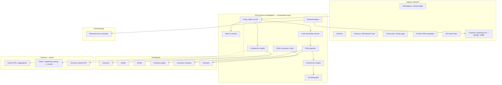
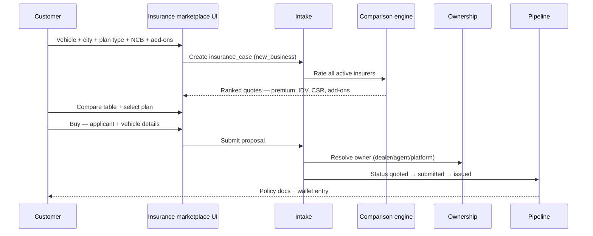
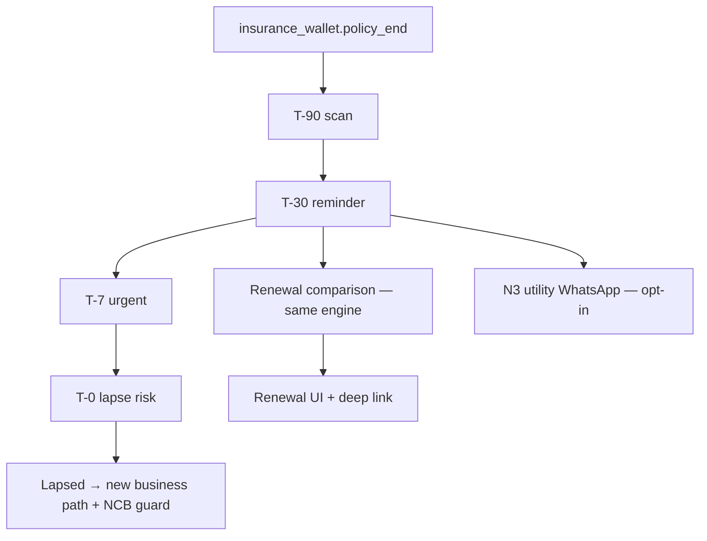
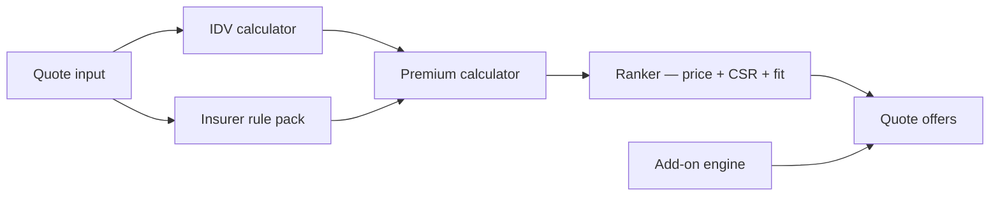
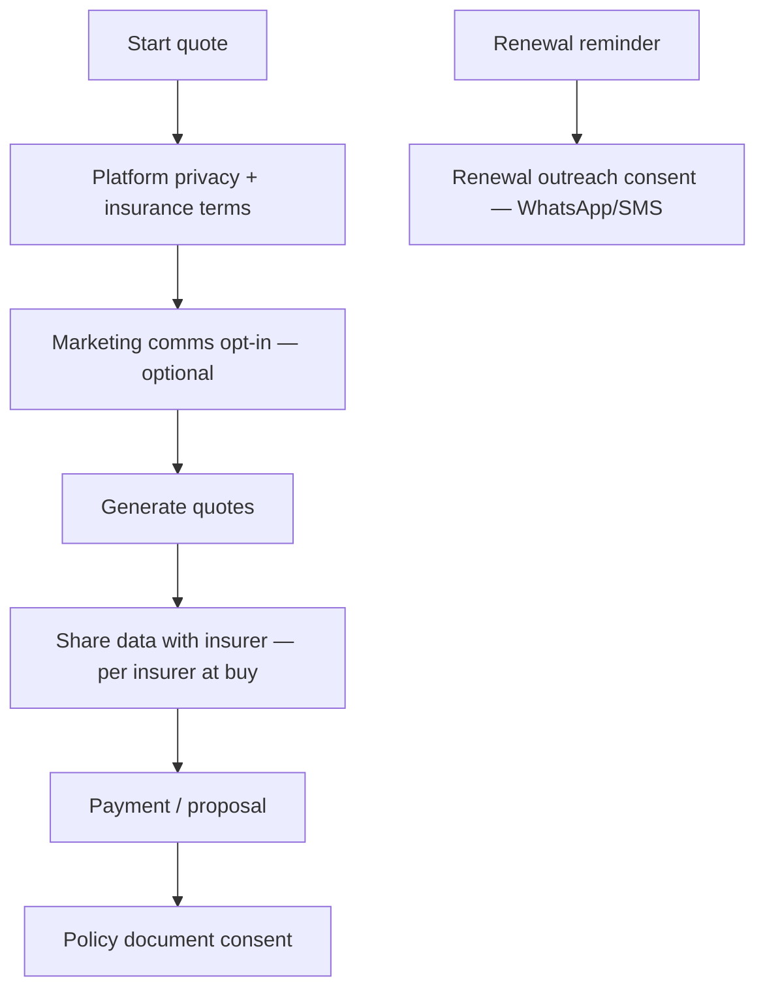

# Phase N5.0 — India's Automotive Insurance Marketplace (Architecture)

**Date:** 2026-06-04  
**Status:** Approved for architecture (planning only)  
**Constraints:** No code · No Prisma changes · No db push · No schema changes in this phase

**Builds on:** Marketplace, Auctions, Community, Directory, Growth CRM, M1 unified identity, M2 business hub, M3 lead router, M4 notifications, M5 search, N2.0/N2.1 billing, N3.0 WhatsApp commercial layer, N4.0 finance marketplace architecture

**References existing (read-only alignment):** `insurance_partners`, `insurance_quotes`, `insurance_applications`, `insurance_wallet`, `scheduled_reminders`, `customer_preferences.notify_insurance`, frontend `/insurance/*` (compare, quote, apply), customer ecosystem insurance wallet & claims UI, `00025_insurance_enterprise.sql`

**Does not implement or alter:** Any runtime insurance module code, Dealer/Broker/Auction/Finance CRM paths, or live insurer API integrations in this phase

---

## Executive summary

MotorCart already offers **motor insurance compare/quote/apply**, **partner catalog seeds**, **customer insurance wallet**, and **reminder hooks**. **N5.0** defines a unified **India automotive insurance marketplace**: compare and buy **new** policies, **renew** expiring cover, manage **add-ons**, and route **claim assistance**—with a **multi-insurer comparison engine**, **renewal automation** (including N3 WhatsApp), explicit **lead ownership**, **IRDAI-aware compliance**, and **N2 monetization**.

Architecture only. Proposed entities and APIs are **N5.1+**, gated by separate migration approval—same pattern as N4.0.

---

## 1. Architecture

### 1.1 Platform view



### 1.2 Design principles

| Principle | Implication |
|-----------|-------------|
| **Marketplace, not insurer** | MotorCart distributes; **insurance companies** underwrite and issue policies |
| **Motor-only scope** | Private car, bike, CV extensions later; no health/life in N5 |
| **Quote ≠ policy** | Compare/quote is indicative until insurer acceptance and payment |
| **Renewal is first-class** | Wallet + `policy_end` drives proactive retention revenue |
| **Claims = assistance** | Platform facilitates FNOL and partner handoff—not claims adjudication |
| **Additive to M3/N4** | M3 routes `insurance_agent`; N4 cross-sell at finance disbursement only |
| **India-first** | IDV/NCB/TP-OD split, IRDAI product categories, regional premium factors |

### 1.3 Module boundaries

| Module | N5 relationship |
|--------|-----------------|
| **Marketplace** | Listing `insurance_interest`; post-purchase insurance CTA |
| **Dealer CRM** | Read-only renewal pipeline + referral attribution (no CRM rewrite) |
| **Broker CRM** | Referral on broker-led vehicle deals |
| **Finance (N4)** | Optional bundle prompt after loan approval—not merged pipelines |
| **Customer ecosystem** | `insurance_wallet`, reminders, claims panel → canonical policy store |
| **Growth / N3** | Utility WhatsApp for renewal, doc upload, claim status (opt-in) |
| **N2 Billing** | Policy/renewal lead meters + agent subscription tiers |

---

## 2. Data flow

### 2.1 Customer journey (new business)



### 2.2 Customer capabilities

| Capability | Flow | Primary output |
|------------|------|----------------|
| **Compare policies** | Quote input → comparison engine | Ranked `InsuranceQuoteOffer` per insurer |
| **Buy new insurance** | Select offer → application → payment (future) | `issued` policy + wallet |
| **Renew policies** | Wallet `policy_end` or manual reg no → renewal engine | Renewal quotes + one-click renew path |
| **View add-ons** | Addon catalog filtered by vehicle/plan | Premium delta per addon |
| **Claim assistance** | FNOL intake → insurer/surveyor routing | Claim case ID + status tracker |

*Aligns with existing* `/insurance`, `/insurance/compare`, `/insurance/quote`, `/insurance/apply`, `insurance-premium.ts`, `INSURANCE_ADDONS`.

### 2.3 Customer inputs → comparison outputs

| Input | Used for |
|-------|----------|
| Vehicle type (car/bike) | TP fixed, OD rates, addon eligibility |
| Make / model / year | IDV depreciation, parts cost band |
| Registration city | Zone factor, RTO rules |
| Fuel type | Minor premium adjustment |
| Plan type (TP / OD / comprehensive / zero dep) | Product filter |
| NCB % (0–50) | Discount on OD component |
| Selected add-ons | Line-item premium load |
| Ex-showroom / IDV | Sum insured |

| Output | Description |
|--------|-------------|
| **Premium** | Annual + monthly indicative premium |
| **IDV** | Declared value after age depreciation |
| **Insurer list** | Active `insurance_partners` passing rules |
| **Add-on breakdown** | Per-addon cost in `premium_breakdown` |
| **Claim support score** | CSR + garage network flag (metadata) |

### 2.4 Renewal flow



| Renewal engine job | Action |
|--------------------|--------|
| **Eligibility scan** | Policies ending in 90/30/7/0 days |
| **Quote refresh** | Re-run comparison with prior NCB + claims history flag (customer-declared) |
| **Follow-up automation** | M4 notification + N3 template + email (future) |
| **Agent assignment** | High-value renewals → insurance agent pool |
| **Dealer visibility** | Dealer-attributed policies show in dealer renewal dashboard |

*Existing hooks:* `scheduled_reminders`, `CustomerPreference.notify_insurance`, customer wallet panel.

### 2.5 Dealer flow

| Capability | Mechanism |
|------------|-----------|
| **Offer insurance** | Embed compare CTA on vehicle detail / handover checklist |
| **Track renewals** | Read API: policies with `attribution.dealer_id` |
| **Referral revenue** | Commission on `issued` / `renewed` where dealer is commercial owner |

Dealer does **not** issue policies; dealer is **distribution + retention** partner.

### 2.6 Insurance agent flow

| Step | Action |
|------|--------|
| 1 | Receive leads from M3 (`destination: insurance_agent`) or N5 assignment |
| 2 | **Manage quotes** — assist customer, override nothing on insurer tariff |
| 3 | Submit proposal to insurer portal or aggregator API |
| 4 | **Track renewals** in book-of-business view |
| 5 | **Commissions** accrue on issue/renewal per contract |

*Community role:* `insurance_agent` in `CommunityPersona` / business profiles links M2 hub to agent desk.

### 2.7 Insurance company flow

| Step | Action |
|------|--------|
| 1 | **Share plans** — product catalog sync (OD/TP bundles, addons) |
| 2 | **Receive proposals** — submitted applications assigned to partner |
| 3 | Underwrite → **decision** (`under_review` → `issued` / `rejected`) |
| 4 | **Track conversions** — quote-to-bind ratio, premium volume |

*Existing:* `insurance_partners` seed (HDFC ERGO, ICICI Lombard, Bajaj Allianz, Tata AIG, Digit, ACKO).

### 2.8 Broker flow

Brokers refer vehicle buyers; **attribution** mirrors N4:

- Broker referral link → `primary_owner: broker` on `insurance_case`
- Commission split: broker referral fee + agent fulfillment fee

### 2.9 Surveyor flow (claims)

| Step | Action |
|------|--------|
| 1 | Customer files FNOL via claim assistance |
| 2 | Insurer accepts → assigns surveyor (insurer-owned) |
| 3 | Platform records **surveyor visit status** (read-only/sync) |
| 4 | Customer sees milestones: filed → survey scheduled → assessed → settled |

MotorCart is **not** the surveyor employer; surveyor is **insurer ecosystem** participant with portal read/update on assigned claims only.

---

## 3. Comparison engine

### 3.1 Engine architecture



| Component | Responsibility |
|-----------|----------------|
| **IDV calculator** | Age-based depreciation off ex-showroom (`estimateIdv` logic) |
| **Premium calculator** | TP fixed + OD% × IDV − NCB + addons + insurer multiplier |
| **Insurer rule pack** | Per-partner: allowed plans, city blocks, min/max IDV |
| **Add-on engine** | `INSURANCE_ADDONS` catalog; filter by `vehicleTypes` |
| **Ranker** | `rank_score` = f(premium, claim_settlement_ratio, plan fit, featured) |

### 3.2 Multi-insurer comparison

| Dimension | Comparison UI |
|-----------|---------------|
| **Premium** | Annual + monthly |
| **Coverage** | Plan type label + IDV |
| **Add-ons** | Side-by-side optional covers (zero dep, engine protect, RSA, etc.) |
| **Claim support** | CSR % + highlight bullets |
| **Insurer trust** | Partner logo, IRDAI insurer name |

**Server-side authority (N5.1):** Move `buildQuoteOffers` from client to API for consistent pricing and audit.

### 3.3 Claim support (comparison dimension)

Not a premium line item—a **weighted score** for ranking:

| Signal | Source |
|--------|--------|
| Claim settlement ratio | `insurance_partners.claim_settlement_ratio` |
| Cashless garages (city) | Partner metadata |
| Turnaround SLA | Partner metadata / future API |
| Customer reviews | Community signals (future) |

---

## 4. Renewal engine

### 4.1 Components

| Component | Description |
|-----------|-------------|
| **Policy registry** | Canonical policies: wallet + issued applications |
| **Renewal scheduler** | Cron/worker: `dueAt` reminders |
| **NCB protector** | Warn if lapse breaks NCB; prompt before `policy_end` |
| **Re-quote job** | Regenerate offers 30 days before expiry |
| **WhatsApp reminders** | N3 utility templates (renewal due, docs pending)—opt-in only |
| **Agent queue** | High premium or lapsed policies → agent callback |

### 4.2 Automation timeline (default)

| Day relative to expiry | Channel |
|------------------------|---------|
| T-90 | In-app insight (customer ecosystem) |
| T-30 | Push/email + optional WhatsApp |
| T-7 | Urgent banner + agent task |
| T+1 (lapsed) | Lapse recovery campaign; new business compare |

### 4.3 Integration points

| System | Use |
|--------|-----|
| **M4 notifications** | Unified notification center entries |
| **N3 WhatsApp** | Template: `insurance_renewal_due`, `insurance_doc_reminder` |
| **N2 billing** | Meter `insurance.renewal_reminders_sent` on paid tiers |
| **Dealer dashboard** | Renewal list for attributed customers only |

---

## 5. Lead ownership

### 5.1 Ownership model

```text
insurance_case {
  id
  customer_user_id
  case_type                 // new_business | renewal | claim_assistance
  primary_owner_type        // customer | dealer | broker | insurance_agent | platform | insurer
  primary_owner_id
  attribution_chain         // JSON touchpoints
  source_channel
  m3_unified_lead_id        // optional ul_*
  vehicle_id                // optional garage link
  status
  created_at
}
```

### 5.2 Resolution rules (priority)

| Priority | Rule |
|----------|------|
| 1 | Referral code / dealer QR at quote | Lock dealer or agent |
| 2 | Vehicle listing seller (dealer) within 14 days | Dealer owner |
| 3 | M3 route with `destination: insurance_agent` | Agent owner |
| 4 | Broker referral link | Broker owner |
| 5 | Organic / platform | Platform; assign agent round-robin |

### 5.3 Owner vs fulfillers

| Role | Relationship |
|------|----------------|
| **Commercial owner** | Earns referral/renewal commission |
| **Insurance agent** | Operational fulfillers on platform-owned leads |
| **Insurer** | Underwriter; not customer owner |
| **Customer** | Self-serve path; owner = customer for organic bind |

### 5.4 M3 lead router

| M3 field | N5 use |
|----------|--------|
| `destination: insurance_agent` | Create `insurance_case` with agent ownership |
| `ownership.business_profile_id` | Agent/dealer context from M2 |
| `native_ref` | Pointer to case—**no move** of legacy rows |

---

## 6. Policy pipeline & claims

### 6.1 Status machine (extends `insurance_app_status`)

| Status | Meaning |
|--------|---------|
| `draft` | Customer building quote |
| `quoted` | Offers generated |
| `submitted` | Proposal to insurer |
| `under_review` | Insurer underwriting |
| `issued` | Policy active — write to wallet |
| `rejected` | Declined |
| `expired` | Quote/proposal TTL |

**Renewal cases** add: `renewal_quoted`, `renewal_bound`, `lapsed`.

### 6.2 Claim assistance (FNOL)

```text
insurance_claim_case {
  id
  insurance_case_id         // optional link to policy
  user_id
  policy_number
  incident_at
  incident_city
  damage_type
  status                    // filed | insurer_ack | survey_scheduled | assessed | settled | closed
  surveyor_id               // nullable
  insurer_claim_ref
  metadata
}
```

Platform provides: intake form, document upload, status timeline, helpline—not settlement authority.

---

## 7. Revenue model

### 7.1 Revenue streams

| Stream | Payer | Trigger | Indicative India range |
|--------|-------|---------|------------------------|
| **Policy commission (new)** | Insurer | `issued` — first year | 15%–25% OD premium; TP lower |
| **Renewal commission** | Insurer | `renewal_bound` | 10%–20% (year 2+); higher retention margin |
| **Lead fee** | Insurer or agent | Qualified `submitted` proposal | ₹50–₹300 per motor lead |
| **Subscription** | Dealer / agent | N2 tier | Bundled policies or renewal slots/month |
| **Featured insurer** | Insurance company | Compare page placement | Monthly slot (K1-style) |
| **Claim assistance fee** | Optional B2B | FNOL routed to partner | Per FNOL or SaaS to insurer |

### 7.2 Commission waterfall

```text
Insurer pays gross commission
  → Platform retain (%)
  → Insurance agent payout (if fulfilled)
  → Dealer/broker referral (if attributed)
  → GST on platform services (N2.4 future)
```

### 7.3 N2 billing integration

| Entitlement key | Enforcement |
|-----------------|-------------|
| `insurance.quotes_monthly` | Compare API calls |
| `insurance.leads_monthly` | Submitted proposals |
| `insurance.renewal_campaigns` | Active renewal automations |
| `entitlement.insurance.marketplace` | Access compare/buy |

Meter at: quote generation (+1), submit (+1 lead), renewal reminder batch (per 100 contacts on upper tiers).

### 7.4 Differentiation vs N4 finance

| Dimension | N4 Finance | N5 Insurance |
|-----------|------------|--------------|
| Regulator | RBI (lending) | IRDAI (insurance distribution) |
| Revenue timing | Disbursement-heavy | Issue + annual renewal |
| Retention engine | N/A | **Renewal engine** core |

---

## 8. Compliance model

### 8.1 IRDAI considerations (India)

| Topic | N5 approach |
|-------|-------------|
| **Distribution license** | MotorCart operates as **corporate agent / web aggregator** per applicable IRDAI category—legal entity must hold or partner with licensed entity |
| **Insurer of record** | Policy issued only by licensed insurer; platform displays IRDAI insurer name |
| **Product advice** | Informational comparison; no personalized advice without licensed agent where required |
| **Point of sale** | POSP/agent rules for field agents; platform tracks agent license in profile |
| **Renewal solicitation** | Consent for outbound WhatsApp/SMS; opt-out honored |
| **Claims** | No representation that platform settles claims—assistance only |

### 8.2 Consent flow



| Consent | Storage |
|---------|---------|
| Platform ToS | `consent_platform_at` |
| Insurer data share | Per `partner_id` at submit |
| Renewal outreach | `notify_insurance` + WhatsApp opt-in (N3) |
| Vahan/registration lookup | Explicit if integrated |

### 8.3 Data handling

| Data class | Storage | Access |
|------------|---------|--------|
| Vehicle / applicant PII | Encrypted DB | Customer, assigned agent, insurer, admin |
| Policy PDF | Secure object storage | Customer + issuer |
| Premium calculation inputs | Quote row | Customer + audit |
| Claim photos | Claim bucket, RLS | Customer, insurer, surveyor (assigned) |
| PAN / Aadhaar (if collected) | Minimal collection; mask in UI | Regulated retention |

**DPDP:** Export/delete via customer profile; separate insurer data processors named in privacy policy.

---

## 9. Proposed data model (design only — not in N5.0)

| Entity | Purpose |
|--------|---------|
| `insurance_case` | Canonical journey (new / renewal / claim) |
| `insurance_proposal` | Submitted bind attempt per insurer |
| `insurance_policy` | Issued policy (sync to wallet) |
| `insurance_renewal_run` | Scheduler batch per policy |
| `insurance_commission_event` | Accrual rows |
| `insurance_claim_case` | FNOL + surveyor tracking |
| `insurance_rule_pack` | Versioned rating rules |
| `insurance_consent` | Consent artifacts |

**Migrate from:** `insurance_quotes`, `insurance_applications`, `insurance_wallet`, `insurance_partners`.

---

## 10. API surface (planned — feature-flagged)

| Method | Path | Audience |
|--------|------|----------|
| POST | `/api/insurance/marketplace/quote` | Customer |
| GET | `/api/insurance/marketplace/compare/:caseId` | Customer |
| POST | `/api/insurance/marketplace/proposal` | Customer |
| GET | `/api/insurance/marketplace/renewals` | Customer |
| POST | `/api/insurance/marketplace/renewal/bind` | Customer |
| POST | `/api/insurance/marketplace/claims/fnol` | Customer |
| GET | `/api/insurance/dealer/renewals` | Dealer |
| GET/PATCH | `/api/insurance/agent/cases` | Insurance agent |
| GET/PATCH | `/api/insurance/insurer/proposals` | Insurer portal |
| GET | `/api/insurance/admin/overview` | Platform admin |

Flag: `FEATURE_INSURANCE_MARKETPLACE_V2` (default OFF).

---

## 11. Rollout plan

### 11.1 Phased waves

| Wave | Scope | Exit criteria |
|------|-------|---------------|
| **N5.0** | Architecture (this doc) | Sign-off |
| **N5.1** | Server-side comparison engine + quote API | Parity with client premium calc |
| **N5.2** | `insurance_case` + ownership + M3 bridge | Attribution stable |
| **N5.3** | Renewal engine + wallet sync | T-30 reminders live in staging |
| **N5.4** | Agent desk + proposal pipeline | 10 agents onboarded |
| **N5.5** | Insurer proposal API (1 aggregator) | First `issued` policy |
| **N5.6** | N3 renewal WhatsApp + M4 notifications | Opt-in conversion measured |
| **N5.7** | Claim assistance FNOL | Insurer pilot |
| **N5.8** | Commission ledger + N2 metering | Revenue in founder dashboard |
| **N5.9** | Dealer renewal dashboard | 20 pilot dealers |

### 11.2 Environment progression

`client-side mock premiums → server rules → sandbox insurer → single insurer bind → multi-insurer GA`

### 11.3 Rollback

- Flag OFF → existing `/insurance` UX unchanged
- Renewal jobs disabled; wallet read-only
- No auto-lapse of in-flight proposals

---

## 12. Risks

| Risk | Likelihood | Impact | Mitigation |
|------|------------|--------|------------|
| IRDAI licensing gap | Medium | Critical | Licensed partner or own license before paid distribution |
| Indicative quote mismatch at bind | High | Medium | Disclaimer + server-side rules; refresh at payment |
| Renewal spam (WhatsApp) | Medium | High | Opt-in, frequency caps, N3 utility-only templates |
| Attribution disputes (dealer vs agent) | High | Medium | Immutable chain + admin audit |
| Insurer API instability | High | Medium | Manual proposal fallback for agents |
| NCB lapse customer harm | Medium | Medium | Early T-30/T-7 warnings |
| Claim assistance liability perception | Medium | High | Clear copy: facilitator not adjuster |
| Schema drift (Prisma vs Supabase insurance) | High | Medium | N5.2 unified migration plan |
| Finance/insurance bundle regulatory blur | Low | Medium | Separate cases; separate consents (N4 boundary) |
| Surveyor data access scope | Medium | Medium | Insurer-scoped RLS only |

---

## 13. Founder recommendation

### 13.1 Strategic positioning

Insurance is **high-frequency retention** (annual renewal) vs one-time vehicle sale. MotorCart should own the **garage → wallet → renewal loop** in the customer ownership OS, making the marketplace the **default place to compare motor cover** at purchase and every year after.

### 13.2 Go-to-market sequence

1. **Digit / ACKO digital-first** — API-friendly, modern UX alignment.  
2. **Traditional insurers** (HDFC ERGO, ICICI Lombard, Bajaj) — trust for conservative buyers.  
3. **Dealer bundle** — Insurance at delivery on Professional+ (N2).  
4. **Agent network** — City-tier POSP agents for assisted sales.  
5. **Renewal engine** — Primary margin driver in year 2+.

### 13.3 Investment priority (post N5.0 approval)

| Priority | Build | Why |
|----------|-------|-----|
| P0 | N5.1 server comparison + N5.2 ownership | Core marketplace promise |
| P0 | N5.3 renewal engine | Retention revenue |
| P1 | N5.6 WhatsApp renewal (N3) | India channel fit |
| P1 | N5.8 commissions + N2 meters | Monetization proof |
| P2 | N5.5 insurer bind API | Scale issuance |
| P2 | N5.9 dealer renewals | Dealer lock-in |
| P3 | N5.7 claims FNOL | Differentiation; insurer partnerships |

### 13.4 Investor metrics (extend M0)

- Quotes / binds / renewal rate  
- Premium GWP facilitated (indicative → confirmed)  
- Commission accrual by channel (dealer / agent / platform)  
- Renewal reminder → bind conversion  
- Claim FNOL volume (assistance funnel)  

### 13.5 Synergy with N4

At finance **disbursement**, surface **insurance bundle** CTA (separate consent)—incremental GWP without merging pipelines.

### 13.6 Explicit non-goals (N5.0)

- No implementation, schema migration, or insurer credentials  
- No Dealer/Broker/Auction/Finance CRM rewrites  
- No health/life/travel insurance in N5 scope  

---

## 14. Feature flags (planned)

| Flag | Default | Scope |
|------|---------|-------|
| `FEATURE_INSURANCE_MARKETPLACE_V2` | OFF | N5 orchestration |
| `FEATURE_INSURANCE_COMPARE_SERVER` | OFF | Server comparison engine |
| `FEATURE_INSURANCE_RENEWAL_ENGINE` | OFF | Scheduler + reminders |
| `FEATURE_INSURANCE_OWNERSHIP` | OFF | Attribution resolver |
| `FEATURE_INSURANCE_CLAIMS_FNOL` | OFF | Claim assistance |
| `FEATURE_BILLING_V2` | OFF | Insurance meters (N2.1) |

---

## 15. References

| Asset | Location |
|-------|----------|
| Insurance enterprise SQL | `00025_insurance_enterprise.sql` |
| Prisma models | `InsurancePartner`, `InsuranceQuote`, `InsuranceApplication`, `InsuranceWallet` |
| Customer UX | `frontend/src/features/insurance/` |
| Customer wallet | `frontend/src/features/customer-ecosystem/` |
| Premium engine (client) | `frontend/src/features/insurance/lib/insurance-premium.ts` |
| Lead router | `PHASE-M3.0-APPLIED-RESULTS.md` |
| Finance boundary | `PHASE-N4.0-FINANCE-MARKETPLACE-PLAN.md` |
| WhatsApp renewal | `PHASE-N3.0-WHATSAPP-COMMERCIAL-LAYER-PLAN.md` |
| Billing | `PHASE-N2.0-BILLING-FOUNDATION-PLAN.md`, `PHASE-N2.1-APPLIED-RESULTS.md` |

---

**Approval record:** N5.0 Insurance Marketplace architecture approved for planning — implementation gated on N5.1+ and separate schema migration approval.
