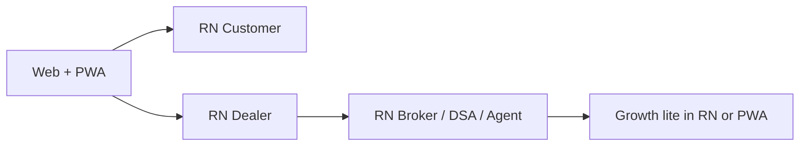
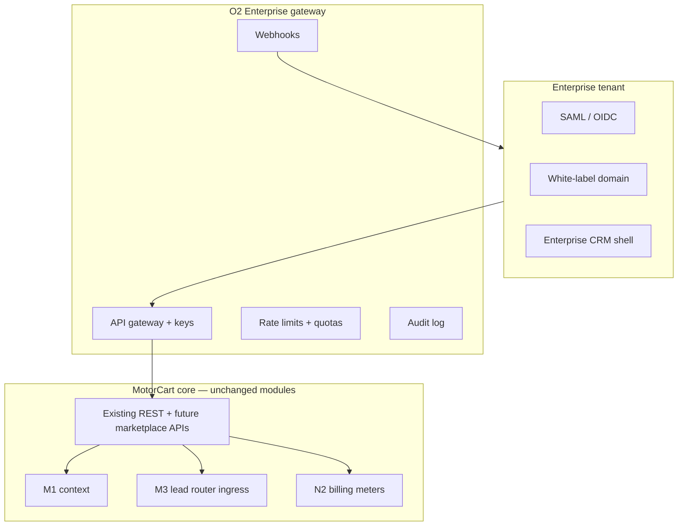

# Phase O1 + O2 + P1 — Strategic Expansion Blueprint & Board Report

**Date:** 2026-06-04  
**Status:** Approved for planning (architecture & strategy only)  
**Constraints:** No code · No Prisma changes · No db push · No implementation in this phase

**Builds on:** Marketplace, Auctions, Community, Directory, Broker CRM, Growth CRM (J–L), Billing MVP (N2.1), WhatsApp (N3.0), Finance (N4.0), Insurance (N5.0), M1–M5 ecosystem, N1 AI, platform admin / founder (M0)

---

# Part A — O1 Mobile App Strategy

## A.1 Executive recommendation

| Option | Verdict | Rationale |
|--------|---------|-----------|
| **PWA (enhanced)** | **Phase 0 — now** | Same React/Vite stack; installable; push (where supported); lowest cost; covers all roles via responsive workspaces |
| **React Native (Expo)** | **Phase 1–2 — primary native** | Shares TypeScript, API clients, auth patterns with web; one team; App Store / Play presence for Customer + Dealer |
| **Flutter** | **Not recommended (default)** | Second language/Dart stack; only if a dedicated mobile team is hired and web parity is deprioritized |

**Strategic sequence:** **PWA hardening → React Native for high-ROI apps → native modules only where needed** (camera VIN scan, offline inventory photos).



## A.2 App portfolio by persona

### A.2.1 Customer app

| Layer | Features |
|-------|----------|
| **Discovery** | M5 search, buy/sell hubs, auctions browse, directory |
| **Ownership OS** | Garage, insurance wallet, finance loans, service history, reminders (M4) |
| **Transact** | Wishlist, compare, enquiry, finance soft-check (N4), insurance compare (N5) |
| **Engage** | Community feed (read/post lite), notifications |
| **Offline** | Cached garage + last-viewed vehicles; queue enquiry drafts |

**Priority:** PWA + RN Phase 1.

### A.2.2 Dealer app

| Layer | Features |
|-------|----------|
| **Inventory** | Listings CRUD, photos (camera), bulk status |
| **Leads** | Inbox, call/WhatsApp deep links, finance-ready flag (read N4) |
| **Conversion** | Auction entries, storefront share, renewal insurance list (N5 read) |
| **Insights** | Daily KPIs, M0-style snapshot (read API) |
| **Offline** | Draft listings + photo upload queue; sync when online |

**Priority:** RN Phase 1 (field sales floor usage).

### A.2.3 Broker app

| Layer | Features |
|-------|----------|
| **Pipeline** | Contacts, leads, deals (Broker CRM — flag-gated) |
| **Bridge** | Vehicle assign, marketplace leads |
| **Finance/insurance** | Referral attribution view (N4/N5 read) |

**Priority:** RN Phase 2 or responsive PWA.

### A.2.4 DSA app

| Layer | Features |
|-------|----------|
| **Desk** | Application queue, status updates, doc checklist |
| **Commissions** | Ledger read (future N4.5) |

**Priority:** PWA first; RN Phase 2 if DSA network scales.

### A.2.5 Insurance agent app

| Layer | Features |
|-------|----------|
| **Book** | Cases, renewals (N5), quote assist |
| **Claims** | FNOL status read |

**Priority:** PWA / RN Phase 2.

### A.2.6 Growth CRM user app

| Layer | Features |
|-------|----------|
| **Campaigns** | WhatsApp broadcast status (N3 read) |
| **Leads** | Pipeline, lead capture QR |
| **Assets** | Poster preview; share sheets |
| **Social** | Scheduler read (L2) |

**Priority:** **PWA-first** (marketing users on desktop + mobile browser); RN optional for share-sheet UX.

## A.3 Shared mobile architecture

```text
mobile/
├── apps/
│   ├── customer/          # Expo RN
│   └── dealer/            # Expo RN
├── packages/
│   ├── api-client/        # Shared with web integrations/api
│   ├── auth/              # JWT refresh, secure storage
│   ├── ui-tokens/         # Brand, spacing (not full web components)
│   └── offline-queue/     # MMKV + retry sync
└── pwa/                   # Vite PWA plugin on existing frontend
```

| Concern | Pattern |
|---------|---------|
| **Auth** | Same JWT as web; refresh token in Keychain/Keystore |
| **API** | `https://api.motorcart.in` + version header `X-Client: mobile/customer/1.0` |
| **Realtime** | Socket.io subset (auctions, notifications) |
| **Feature flags** | Remote config JSON; match `FEATURE_*` / `VITE_*` |
| **Deep links** | `motorcart://vehicle/{id}`, `motorcart://dashboard/dealer` |

## A.4 Offline support model

| Persona | Offline scope | Sync strategy |
|---------|---------------|---------------|
| Customer | Garage, wishlist, draft enquiry | Background sync on reconnect |
| Dealer | Listing drafts, images | Upload queue with exponential backoff |
| DSA/Agent | Case notes (local) | Conflict: server wins on status |
| Growth | — | Online-first (campaigns require network) |

**Not offline:** Payments, bureau pull, insurer bind, live auction bidding (read-only cache OK).

## A.5 Mobile rollout plan

| Wave | Deliverable | Timeline (indicative) |
|------|-------------|------------------------|
| O1.0 | PWA: manifest, service worker, push hook | Q1 |
| O1.1 | Customer PWA polish + install prompts | Q1 |
| O1.2 | Expo Customer MVP (browse, garage, notify) | Q2 |
| O1.3 | Expo Dealer MVP (inventory, leads) | Q2–Q3 |
| O1.4 | Broker/DSA PWA + optional RN | Q3 |
| O1.5 | Growth PWA + share extensions | Q3 |
| O1.6 | App Store optimization + reviews | Q4 |

## A.6 Mobile risks

- Two codebases if Flutter added — **avoid unless staffed**
- App Store rejection for finance/insurance claims — compliance copy review
- Offline sync conflicts on inventory — dealer-edited fields need versioning

---

# Part B — O2 Enterprise Platform

## B.1 Enterprise participants

| Segment | Primary need | MotorCart offer |
|---------|--------------|-----------------|
| **OEMs** | Lead gen, dealer network visibility | White-label discovery + lead API |
| **Large dealer groups** | Multi-rooftop CRM, unified inventory | Enterprise CRM + SSO + rollup analytics |
| **Banks / NBFCs** | Qualified finance leads | N4 lender API + SLA dashboard |
| **Insurance companies** | Policy volume, renewals | N5 insurer API + renewal feed |
| **Fleet operators** | Bulk insurance + service | Fleet module (future) + API |
| **Auction houses** | Buyer/seller liquidity | Auction enterprise API (read F-enterprise) |

## B.2 Enterprise architecture



## B.3 White-label strategy

| Tier | Branding | Domain | Data |
|------|----------|--------|------|
| **Co-branded** | Logo + colors on shared app | `partner.motorcart.in` | Shared tenant_id tag |
| **Full white-label** | Custom theme + email templates | `loans.partner.com` CNAME | Isolated `enterprise_org_id` |
| **Embedded** | iframe / SDK widgets | Partner site | JWT exchange (partner SSO) |

**Modules white-labelable (phased):** Finance compare widget, insurance compare, directory listing, dealer storefront — **not** full auction exchange initially.

## B.4 Enterprise CRM

| Capability | Description |
|------------|-------------|
| **Org hierarchy** | OEM → region → rooftop → team |
| **Rollup dashboard** | Leads, listings, GWP facilitated, disbursements |
| **Policy engine** | Which workspaces child dealers may use |
| **Bulk provisioning** | SCIM or CSV user import |
| **Approval chains** | Central marketing / pricing governance |

Sits **above** existing dealer/broker workspaces — read via APIs, no rewrite of single-dealer CRM in v1.

## B.5 API licensing model

| Product | Auth | Limits |
|---------|------|--------|
| **Lead ingress API** | API key + HMAC | Leads/day per contract |
| **Inventory syndication** | OAuth client credentials | Listings/month |
| **Finance pre-qual API** | mTLS optional | Soft checks/month |
| **Insurance quote API** | API key | Quotes/day |
| **Webhook subscriptions** | Signed payloads | Events: lead.routed, policy.issued, etc. |

**Versioning:** `/api/v1/enterprise/...` — stable 12-month deprecation policy.

## B.6 Data access model

| Class | Enterprise access |
|-------|-------------------|
| **Aggregate** | Counts, conversion rates, regional funnels — default |
| **Pseudonymized leads** | Hashed phone + attributes — standard contract |
| **PII** | Opt-in only; DPA + purpose limitation |
| **Raw bureau/insurer** | Never via enterprise API |
| **Export** | Scheduled CSV to SFTP; audit logged |

**Tenant isolation:** Row-level `enterprise_org_id`; cross-tenant queries forbidden at gateway.

## B.7 Enterprise revenue

| Stream | Model |
|--------|-------|
| **Platform fee** | Annual contract ₹25L–₹2Cr+ by seat/rooftop |
| **API overage** | Per lead / per quote above bundle |
| **White-label setup** | One-time implementation fee |
| **Revenue share** | % of finance disbursement / insurance GWP facilitated |
| **Premium SLA** | 99.9% + dedicated support |

Aligns with N2 **Enterprise** plan tier + custom JSON entitlements.

## B.8 Enterprise rollout

| Wave | Scope |
|------|-------|
| O2.0 | Architecture (this doc) |
| O2.1 | API gateway + keys + audit |
| O2.2 | Webhooks + lead ingress |
| O2.3 | Co-branded finance/insurance widgets |
| O2.4 | SSO + org hierarchy |
| O2.5 | Full white-label pilot (1 NBFC or dealer group) |

---

# Part C — P1 Investor Blueprint

## C.1 Executive summary

**MotorCart** is building **India’s unified automobile commerce and ownership operating system**: one platform where consumers discover and own vehicles, and businesses (dealers, brokers, DSAs, insurers, lenders) acquire, convert, and retain customers through **marketplace, auctions, community, directory, growth CRM, finance, and insurance**—with a **unified identity, lead router, billing, and AI layer** designed for scale.

Unlike single-purpose classifieds or point fintech apps, MotorCart **connects the full vehicle lifecycle** with **B2B SaaS + transaction monetization**, targeting **enterprise and mobile** expansion (O1/O2) after architecture completion through N5.

## C.2 Problem statement

| Stakeholder | Pain |
|-------------|------|
| **Customers** | Fragmented apps for buy, finance, insurance, service; no single garage and renewal view |
| **Dealers** | Leads scattered across portals; weak finance/insurance attach; poor retention |
| **Brokers / DSAs** | No trusted national pipeline; attribution disputes |
| **Lenders / insurers** | Costly lead acquisition; low digital integration with dealer floor |
| **OEMs / groups** | No unified data across rooftops and campaigns |

India’s **~4M+ annual used-car transactions** and **~4Cr+ registered vehicles** create massive digital spend, but tools remain **siloed** (listings vs loans vs policies vs workshops).

## C.3 Solution statement

MotorCart provides:

1. **Consumer super-app (web → mobile):** Search (M5), buy/sell, auctions, ownership OS.  
2. **Business workspaces:** Dealer, broker, growth, DSA, lender, insurer—each gated by RBAC.  
3. **Unified graph (M1/M2):** One business profile across directory, community, growth.  
4. **Lead router (M3):** Attributed ingress without CRM fragmentation.  
5. **Monetization (N2+):** Subscriptions + usage + commissions on finance (N4) and insurance (N5).  
6. **Engagement (N3):** WhatsApp commercial layer for campaigns and renewals.  
7. **Intelligence (N1):** AI advisors atop federated context—flags-first, non-invasive.  
8. **Enterprise (O2):** APIs and white-label for banks, groups, OEMs.

## C.4 Market size (indicative planning assumptions)

> **Note:** Figures are **order-of-magnitude** for investor narrative; validate with third-party reports (IBEF, CRISIL, industry bodies) before external materials.

| Layer | Definition | Indicative size (India) |
|-------|------------|-------------------------|
| **TAM** | Digital spend across auto listings, dealer SaaS, auto loans facilitation, motor insurance distribution, parts/service marketplaces | **₹80,000–120,000 Cr** (~$10–15B) annually |
| **SAM** | Addressable via unified B2B2C platform (dealers, brokers, lenders, insurers, digital-first consumers in top 100 cities) | **₹8,000–15,000 Cr** (~$1–1.8B) |
| **SOM (Year 5)** | Realistic share with strong execution (0.5–1.5% of SAM revenue capture) | **₹40–150 Cr** platform revenue |

**Growth drivers:** Used-car formalization, embedded finance/insurance, WhatsApp-first India, dealer digitization post-COVID, OEM D2C pressure.

## C.5 Competitive comparison

| Dimension | CarDekho | Cars24 | BikeWale | ACKO | OTO Capital | GoMechanic | Samil (auctions) | **MotorCart** |
|-----------|----------|--------|----------|------|-------------|------------|------------------|---------------|
| **Core wedge** | Content + listings + leads | C2B/B2C used + infra | 2W content/listings | Digital insurer | Auto loans | Workshop network | Auctions | **Full ecosystem OS** |
| **Marketplace** | Strong | Strong (used) | 2W strong | Weak | Weak | Weak | Auction-only | **Multi-category + auctions** |
| **Dealer SaaS** | Leads/tools | Internal | Limited | — | — | — | B2B auction | **Dealer + broker CRM** |
| **Finance** | Partners | In-house | Limited | — | **Core** | — | — | **N4 marketplace** |
| **Insurance** | Partners | — | — | **Core** | — | — | — | **N5 + renewal engine** |
| **Community** | Forums/content | — | — | — | — | — | — | **Community + directory** |
| **Growth CRM** | — | — | — | — | — | — | — | **Growth + WhatsApp N3** |
| **Unified identity** | Partial | App-only | Partial | App | App | App | B2B | **M1–M5 explicit** |
| **Auctions** | — | — | — | — | — | — | **Core** | **Integrated** |
| **Enterprise API** | Ad/API | — | — | B2B | Lender | B2B workshops | B2B | **O2 planned** |

## C.6 Why MotorCart wins

1. **Lifecycle coverage** — Buy, finance, insure, service, renew, resell in one graph.  
2. **B2B multiplicity** — Revenue from **both sides** (SaaS + transactions), not ads-only.  
3. **Architecture readiness** — M1–M5, N1–N5 **documented**; feature-flag rollout reduces rewrite risk.  
4. **India channel fit** — WhatsApp (N3), renewal-led insurance (N5), DSA/dealer attribution (N4).  
5. **Enterprise optionality** — Banks and dealer groups can **embed** without building (O2).  
6. **AI as layer** — N1 increases conversion without owning regulated decisions.

## C.7 Revenue streams (consolidated)

| Stream | Type | Phase |
|--------|------|-------|
| Dealer/broker **subscriptions** (N2 tiers) | Recurring | Live MVP mock → gateway |
| **Directory** featured/sponsored (K1) | Recurring + placement | Partial |
| **Growth** WhatsApp + campaigns (N3) | Usage + tier | Architecture |
| **Finance** lead + disbursement commission (N4) | Transaction | Architecture |
| **Insurance** policy + renewal commission (N5) | Transaction | Architecture |
| **Auctions** listing/success fees (F) | Transaction | Module exists |
| **Lead fees** (M3 ingress) | Transaction | Router MVP |
| **Enterprise** API + white-label (O2) | Contract | Architecture |
| **AI** premium advisors (N1) | Add-on SKU | Architecture |

## C.8 Year 1–5 revenue model (illustrative)

**Assumptions:** Gradual flag rollout; India focus; blended ARPU rises with finance/insurance attach.

| Year | Paying dealers/businesses | Avg SaaS ARPU/mo | Transaction revenue | Enterprise | **Total revenue (₹ Cr)** |
|------|---------------------------|------------------|---------------------|------------|--------------------------|
| Y1 | 200 | ₹3,000 | ₹0.5 Cr | ₹0 | **₹1–2** |
| Y2 | 800 | ₹5,000 | ₹3 Cr | ₹0.5 Cr | **₹8–12** |
| Y3 | 2,500 | ₹7,000 | ₹15 Cr | ₹3 Cr | **₹35–45** |
| Y4 | 6,000 | ₹9,000 | ₹40 Cr | ₹10 Cr | **₹90–110** |
| Y5 | 12,000 | ₹11,000 | ₹90 Cr | ₹25 Cr | **₹180–220** |

*Transaction revenue = finance + insurance commissions, lead fees, auction fees, overage.*

## C.9 Breakeven model (illustrative)

| Item | Assumption |
|------|------------|
| **Fixed burn (Y1)** | Team 15–25 FTE, cloud, sales — **₹6–10 Cr/year** |
| **Gross margin** | 70–80% on SaaS; 40–60% on commissions (pass-through costs) |
| **Breakeven** | **Month 30–42** if Y2 ARR trajectory hits ₹8+ Cr and CAC payback &lt; 12 months on dealer SaaS |

Sensitivity: **+6 months** if finance/insurance live APIs slip; **−6 months** if one enterprise NBFC/insurer deal closes in O2.

## C.10 Team structure (target)

| Function | Y1 | Y3 | Y5 |
|----------|----|----|-----|
| Engineering (web, API, mobile) | 8 | 18 | 35 |
| Product / design | 2 | 5 | 8 |
| Sales (dealer, enterprise) | 3 | 12 | 25 |
| Ops / support / compliance | 2 | 6 | 12 |
| Data / AI | 1 | 4 | 8 |
| Leadership / G&A | 3 | 5 | 8 |

## C.11 Technology scaling plan

| Layer | Y1–2 | Y3–5 |
|-------|------|------|
| **App** | Vite SPA + PWA; RN Customer/Dealer | RN portfolio; edge CDN |
| **API** | Next.js monolith + Prisma MySQL | Service extract: billing, leads, notifications |
| **Data** | MySQL primary; read replicas | Partitioning hot tables; analytics warehouse |
| **Search** | M5 federated API | OpenSearch/Elastic index |
| **Queue** | File/Redis for N3 jobs | Managed queue (SQS/BullMQ) |
| **Realtime** | Socket.io | Channel sharding |
| **Observability** | Logs + health | APM, SLOs, enterprise audit |
| **Security** | JWT, RLS patterns | SOC2 path, mTLS enterprise |

## C.12 Funding roadmap

| Round | Timing | Use | Target (illustrative) |
|-------|--------|-----|------------------------|
| **Pre-seed / angel** | Complete / ongoing | Architecture, MVP flags, pilot dealers | ₹2–5 Cr |
| **Seed** | Post N2.4 + N4.1 pilot | Payments, finance soft engine, 50 dealers | ₹15–25 Cr |
| **Series A** | Post revenue ₹8+ Cr ARR run-rate | Mobile, insurance renewal, enterprise pilot | ₹60–100 Cr |
| **Series B** | Post enterprise + multi-city | Scale sales, AI, national lender deals | ₹200+ Cr |

## C.13 Investor risks

| Risk | Mitigation narrative |
|------|----------------------|
| Execution breadth (too many modules) | Feature flags; wave gating (documented) |
| Regulated finance/insurance | Licensed partners; architecture separates marketplace from underwriting |
| Incumbent portals | Differentiate on OS + B2B stack, not listings-only |
| CAC in dealer SaaS | Finance/insurance attach increases LTV |
| Tech debt / mock paths | PROJECT-AUDIT awareness; dedicated hardening sprints |
| Mobile late vs ACKO/Cars24 | PWA now; RN Q2 |
| No live revenue proof yet | N2.1 + first paid pilots = seed milestone |

## C.14 Founder recommendations (P1)

1. **Pick two monetization wedges for 12 months:** (a) **Dealer SaaS + Growth/WhatsApp**, (b) **Insurance renewal engine** — not simultaneous full N4 lender APIs.  
2. **Close one enterprise design partner** (NBFC or dealer group) to validate O2 before building full white-label.  
3. **Ship PWA + dealer RN** before Flutter or second native stack.  
4. **Turn on billing + one payment gateway** (N2.4) before fundraising Series A narrative.  
5. **Publish traction metrics** on M0 founder dashboard with real GMV/GWP when available.  
6. **Hire compliance counsel** for IRDAI/RBI positioning before scaling finance/insurance UI claims.

---

# Part D — MotorCart Board-Level Strategic Report

## D.1 Product maturity score

| Dimension | Score (0–100) | Notes |
|-----------|---------------|-------|
| Architecture & blueprint | **88** | M1–M5, N1–N5, O1–O2 documented |
| Core marketplace / CRM UX | **72** | Broad surfaces; some mock/RPC fallbacks |
| Ecosystem integration (live) | **58** | M1–M5 implemented behind flags |
| Monetization (production) | **32** | N2.1 mock; no live payments |
| Finance / insurance (production) | **28** | Architecture only; client-side insurance calc |
| Mobile | **25** | Responsive web; no native store apps |
| Enterprise | **20** | O2 architecture only |
| **Weighted product maturity** | **62 / 100** | **“Architecture-rich, production-mid”** |

## D.2 Investor readiness score

| Dimension | Score (0–100) |
|-----------|---------------|
| Story & differentiation | **78** |
| Market narrative (TAM/SAM) | **70** (needs external validation) |
| Live metrics / ARR proof | **25** |
| Team / governance clarity | **55** (assumed lean) |
| Regulatory plan | **50** |
| Cap table / data room | *Not assessed* |
| **Investor readiness** | **56 / 100** | **“Seed-ready narrative; Series A needs revenue”** |

## D.3 Revenue readiness score

| Dimension | Score (0–100) |
|-----------|---------------|
| Plan catalog & billing MVP | **45** |
| Payment gateway | **0** |
| Commission engines (N4/N5) | **10** (design) |
| Enterprise contracts | **5** |
| Paid pilot customers | *Unknown — assume low* |
| **Revenue readiness** | **38 / 100** | **“Monetization designed, not scaled”** |

## D.4 Biggest strengths

1. **Comprehensive architecture** — Rare breadth (marketplace + auctions + growth + finance + insurance + ecosystem) with explicit flags and phase docs.  
2. **Unified ecosystem layer (M1–M5)** — Identity, hub, lead router, notifications, search—credible moat story.  
3. **India-specific monetization paths** — WhatsApp, renewal insurance, DSA/dealer attribution.  
4. **Single modern stack** — React + TS + Prisma API; mobile can extend without rewrite.  
5. **Enterprise and AI optionality** — Upside narrative for investors without blocking MVP.

## D.5 Biggest weaknesses

1. **Revenue not yet proven** — Mock billing; finance/insurance marketplaces are plans.  
2. **Feature-flag surface area** — Many capabilities OFF; integration risk remains.  
3. **Partial backend maturity** — Audit notes RPC stubs, mock fallbacks, join limitations.  
4. **No native mobile presence** — Competes with app-first incumbents for consumer habit.  
5. **Regulatory/compliance depth** — IRDAI/RBI frameworks documented but not operationalized.  
6. **Scope concentration risk** — Parallel modules can dilute GTM focus.

## D.6 Immediate priorities (next 90 days)

| Priority | Action |
|----------|--------|
| 1 | **N2.4** — Payment gateway + real subscriptions (Razorpay) |
| 2 | **Enable M1 + M2 + M3** in staging for pilot dealers — prove lead attribution |
| 3 | **N5.1 + N5.3** — Server insurance compare + renewal reminders (high LTV) |
| 4 | **O1.0** — PWA install + push foundation |
| 5 | **First 10 paying dealers** — Manual sales; validate ARPU |
| 6 | **N3.1** — Meta WhatsApp pilot for one growth workspace |
| 7 | **Hardening sprint** — Reduce mock paths per PROJECT-AUDIT top items |

## D.7 What should be built next

| Build | Rationale |
|-------|-----------|
| Payments + billing enforcement | Unblocks all revenue story |
| Insurance renewal engine (N5.3) | Recurring commission; customer retention |
| Server-side finance soft engine (N4.1) | Dealer conversion; lender partnerships |
| PWA + Dealer React Native (O1.1–O1.3) | Mobile credibility |
| M3 + Growth WhatsApp in production | Daily use for dealers |
| Founder dashboard real metrics | Investor meetings |

## D.8 What should wait

| Wait | Rationale |
|------|-----------|
| Full N4 lender LOS integrations | After one NBFC pilot API |
| Flutter mobile stack | Unless dedicated mobile team hired |
| Full O2 white-label | After one enterprise LOI |
| N1 AI broad rollout | After gateway + compliance; start with N1.5 marketing only |
| Fleet OEM module | Enterprise Phase 2 |
| International expansion | India depth first |
| Big-bang db migrations | Wave-by-wave with approval gates |

## D.9 Board summary statement

MotorCart has completed a **credible end-to-end architecture** for India’s automotive digital ecosystem—positioning it as a **platform play**, not a single-vertical clone. **Product maturity (~62)** reflects strong design and partial implementation; **investor readiness (~56)** and **revenue readiness (~38)** require **live monetization, pilot traction, and mobile presence** before Series A.

**Recommended board mandate:** *“Focus, monetize, prove”* — two transaction wedges (insurance renewal + dealer SaaS/Growth), one enterprise LOI, payments live, 90-day paid dealer cohort—while keeping auction/broker/community expansion flag-gated.

---

## References

| Document |
|----------|
| `PHASE-M1-UNIFIED-ECOSYSTEM-PLAN.md` |
| `PHASE-M1.0-M2.0-APPLIED-RESULTS.md` · `PHASE-M3.0` · `PHASE-M4.0` · `PHASE-M5.0-APPLIED-RESULTS.md` |
| `PHASE-N1-AI-ECOSYSTEM-PLAN.md` |
| `PHASE-N2.0-BILLING-FOUNDATION-PLAN.md` · `PHASE-N2.1-APPLIED-RESULTS.md` |
| `PHASE-N3.0-WHATSAPP-COMMERCIAL-LAYER-PLAN.md` |
| `PHASE-N4.0-FINANCE-MARKETPLACE-PLAN.md` |
| `PHASE-N5.0-INSURANCE-MARKETPLACE-PLAN.md` |
| `PROJECT-AUDIT.md` |

---

**Approval record:** O1 Mobile Strategy, O2 Enterprise Platform, and P1 Investor Blueprint approved for planning — implementation and external fundraising materials require separate approval and metric validation.
